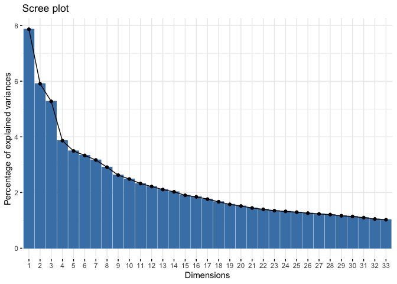

Data analysis
================
Yan Wang
13/12/2021

-   [1 Load the dataset](#load-the-dataset)
-   [2 Processing](#processing)
    -   [2.1 Let’s add an indicator for the repeated measures of
        controllability
        score](#lets-add-an-indicator-for-the-repeated-measures-of-controllability-score)
    -   [2.2 Merge the linguistic feature and sociodemographic datasets
        to get data set
        DfNew](#merge-the-linguistic-feature-and-sociodemographic-datasets-to-get-data-set-dfnew)
    -   [2.3 DfNew description](#dfnew-description)
-   [3 Descriptive stats of the controllability score changes @ baseline
    and 8
    wks](#descriptive-stats-of-the-controllability-score-changes--baseline-and-8-wks)
    -   [3.1 Baseline controllability descriptive stats and
        distribution - normality
        assumed](#baseline-controllability-descriptive-stats-and-distribution---normality-assumed)
    -   [3.2 8 week descriptive stats and controllability distribution -
        normality
        violated](#8-week-descriptive-stats-and-controllability-distribution---normality-violated)
-   [4 Sample descriptive stats](#sample-descriptive-stats)
-   [5 Preliminary bivariate
    correlations](#preliminary-bivariate-correlations)
-   [6 Model building](#model-building)
    -   [6.1 Individual linguistic features as potential fixed effects
        in model
        building](#individual-linguistic-features-as-potential-fixed-effects-in-model-building)
    -   [6.2 PCA on linguistic features - Screeplot &
        Eigenvalues](#pca-on-linguistic-features---screeplot--eigenvalues)
    -   [6.3 PCs as potential fixed effects with iterative backward
        elimination technique in model
        building](#pcs-as-potential-fixed-effects-with-iterative-backward-elimination-technique-in-model-building)
    -   [6.4 Variable loadings on significant components 15, 17, 18 and
        marginal significant components 1, 25,
        29](#variable-loadings-on-significant-components-15-17-18-and-marginal-significant-components-1-25-29)
    -   [6.5 Final model and
        visualization](#final-model-and-visualization)
    -   [6.6 Final model diagnostic
        plots](#final-model-diagnostic-plots)
    -   [6.7 95% Confidence interval of
        coefficients](#95-confidence-interval-of-coefficients)

# 1 Load the dataset

Data sets of the extracted linguistic features and sociodemographic
factors.

``` r
Df<-read.csv("~/Desktop/ResultsDf8BL.csv")
Metadata<-read_excel("~/Desktop/DS4Ling-2021/old repository/private/DS4Lingdataset/Metadata of participants.xlsx")
Df$controlNN[is.na(Df$controlNN)]=0
Df$controlVB[is.na(Df$controlVB)]=0
Df[is.na(Df)]
```

    character(0)

``` r
Df$controlNN<-Df$controlNN/Df$WC*100
Df$controlVB<-Df$controlVB/Df$WC*100
names(Df)
```

      [1] "CaseNum"         "ID"              "GOGID"           "Time"           
      [5] "SymptomSequence" "SymptomName"     "Controllability" "FeelingCause"   
      [9] "Effect"          "Strategy"        "WC"              "symptom"        
     [13] "effort"          "impact"          "positive.adj"    "negative.adj"   
     [17] "controlled"      "uncontrolled"    "controlNN"       "controlVB"      
     [21] "Analytic"        "Clout"           "Authentic"       "Tone"           
     [25] "WPS"             "Sixltr"          "Dic"             "function."      
     [29] "pronoun"         "ppron"           "i"               "we"             
     [33] "you"             "shehe"           "they"            "ipron"          
     [37] "article"         "prep"            "auxverb"         "adverb"         
     [41] "conj"            "negate"          "verb"            "adj"            
     [45] "compare"         "interrog"        "number"          "quant"          
     [49] "affect"          "posemo"          "negemo"          "anx"            
     [53] "anger"           "sad"             "social"          "family"         
     [57] "friend"          "female"          "male"            "cogproc"        
     [61] "insight"         "cause"           "discrep"         "tentat"         
     [65] "certain"         "differ"          "percept"         "see"            
     [69] "hear"            "feel"            "bio"             "body"           
     [73] "health"          "sexual"          "ingest"          "drives"         
     [77] "affiliation"     "achieve"         "power"           "reward"         
     [81] "risk"            "focuspast"       "focuspresent"    "focusfuture"    
     [85] "relativ"         "motion"          "space"           "time"           
     [89] "work"            "leisure"         "home"            "money"          
     [93] "relig"           "death"           "informal"        "swear"          
     [97] "netspeak"        "assent"          "nonflu"          "filler"         
    [101] "AllPunc"         "Period"          "Comma"           "Colon"          
    [105] "SemiC"           "QMark"           "Exclam"          "Dash"           
    [109] "Quote"           "Apostro"         "Parenth"         "OtherP"         

``` r
Df<- Df %>% dplyr::select(2, 4:7,11:112)
```

# 2 Processing

## 2.1 Let’s add an indicator for the repeated measures of controllability score

when the score was measured at baseline, the indicator is 0 and when the
score was measured at 8 wks, the indicator is 1.

``` r
Df$Time<-ifelse(Df$Time=="Baseline (week 0)", 0, 1)
```

## 2.2 Merge the linguistic feature and sociodemographic datasets to get data set DfNew

``` r
names(Metadata)
```

     [1] "ID"                                          
     [2] "USERID"                                      
     [3] "Employment"                                  
     [4] "CASENUM"                                     
     [5] "#modules"                                    
     [6] "WC"                                          
     [7] "MWC"                                         
     [8] "Marriage"                                    
     [9] "race"                                        
    [10] "ethinicity (latio)"                          
    [11] "Age"                                         
    [12] "Formaleducationyears"                        
    [13] "AnxietySTA"                                  
    [14] "socialsupport"                               
    [15] "Optimismscalescore"                          
    [16] "Comorbidityindex"                            
    [17] "baselineweight"                              
    [18] "total_chemo_coursecancerstage"               
    [19] "CESDdepression"                              
    [20] "QOL_overall"                                 
    [21] "treatmentchoiceon_chemotherapy1yes2No3Uknown"
    [22] "HCPcomm"                                     
    [23] "Selfmagementbarriers"                        

``` r
Metadata<- Metadata[, c(1, 3, 8:12)]
DfNew<-left_join(Df, Metadata, by="ID") %>% select(1 , 108:113, everything())
head(DfNew[2:113], 2)
```

      Employment      Marriage  race ethinicity (latio) Age Formaleducationyears
    1        Yes Never married White                 No  56                   12
    2        Yes Never married White                 No  56                   12
      Time SymptomSequence        SymptomName Controllability  WC symptom effort
    1    0              S1 Abdominal Bloating             2.2 154    3.25      0
    2    1              S1 Abdominal Bloating             3.0 154    3.25      0
      impact positive.adj negative.adj controlled uncontrolled controlNN controlVB
    1      0            0          1.3          0            0         0         0
    2      0            0          1.3          0            0         0         0
      Analytic Clout Authentic Tone   WPS Sixltr   Dic function. pronoun ppron
    1     16.8  3.98     89.63 2.61 17.11   7.79 96.75     62.34   21.43 11.69
    2     16.8  3.98     89.63 2.61 17.11   7.79 96.75     62.34   21.43 11.69
          i we you shehe they ipron article  prep auxverb adverb conj negate  verb
    1 11.69  0   0     0    0  9.74    6.49 11.04   14.29   5.84 7.14   3.25 24.03
    2 11.69  0   0     0    0  9.74    6.49 11.04   14.29   5.84 7.14   3.25 24.03
       adj compare interrog number quant affect posemo negemo anx anger sad social
    1 5.84    5.19      1.3      0  5.84    2.6      0    2.6 1.3     0 1.3    1.3
    2 5.84    5.19      1.3      0  5.84    2.6      0    2.6 1.3     0 1.3    1.3
      family friend female male cogproc insight cause discrep tentat certain differ
    1      0      0      0    0   19.48     3.9   2.6    3.25   7.14     1.3    3.9
    2      0      0      0    0   19.48     3.9   2.6    3.25   7.14     1.3    3.9
      percept see hear feel  bio body health sexual ingest drives affiliation
    1    4.55   0    0 4.55 4.55 0.65   1.95   0.65    2.6    3.9        0.65
    2    4.55   0    0 4.55 4.55 0.65   1.95   0.65    2.6    3.9        0.65
      achieve power reward risk focuspast focuspresent focusfuture relativ motion
    1     2.6  0.65    1.3 0.65       2.6        23.38           0   12.34   1.95
    2     2.6  0.65    1.3 0.65       2.6        23.38           0   12.34   1.95
      space time work leisure home money relig death informal swear netspeak assent
    1  4.55 5.84 0.65    0.65    0  0.65     0     0        0     0        0      0
    2  4.55 5.84 0.65    0.65    0  0.65     0     0        0     0        0      0
      nonflu filler AllPunc Period Comma Colon SemiC QMark Exclam Dash Quote
    1      0      0   16.23   5.84  5.19     0     0     0      0    0     0
    2      0      0   16.23   5.84  5.19     0     0     0      0    0     0
      Apostro Parenth OtherP
    1    4.55       0   0.65
    2    4.55       0   0.65

## 2.3 DfNew description

“ID”- Participant ID

“Controllability” - Symptom controllability score changes at baseline
and 8 weeks

“WC” - Total word count

“Employment” - Employed vs unemployed

“Marriage” - Currently married, divorced, Living with
partner/significant other, never married, separated, widowed

“race” - American Indian, bi/Multi-racial Black or African American,
White, other, unknown

“ethinicity” - Latino, not latino, Don not know

“Age” - Age in years

“Formaleducationyears” - Years of formal education

“SymptomNo”- Symptom number participant worked on (i.e., S1, S2, S3)

“Symptom” - Target symptom participant works on (e.g., pain, nausea)

The rest of the variables are the percentage of that specific word or
punctuation category of the total word count in the posts. For example,
variable “symptom” is the percentage of symptom word category (e.g.,
drowsy, lose hair) of the total word count. The scale is from 0-100.

# 3 Descriptive stats of the controllability score changes @ baseline and 8 wks

## 3.1 Baseline controllability descriptive stats and distribution - normality assumed

``` r
Df<- DfNew %>% na.omit()
Df1<-Df %>% filter(Time==0)
ggplot(Df1)+
  geom_boxplot(aes(Controllability))+
  theme_bw()+
  theme(legend.position="none")+xlab("Baseline controllability score")
library(pastecs)
```


    Attaching package: 'pastecs'

    The following objects are masked from 'package:dplyr':

        first, last

``` r
stat.desc(Df1$Controllability)
```

         nbr.val     nbr.null       nbr.na          min          max        range 
    349.00000000   1.00000000   0.00000000   0.00000000   4.00000000   4.00000000 
             sum       median         mean      SE.mean CI.mean.0.95          var 
    777.10000000   2.20000000   2.22664756   0.03957983   0.07784577   0.54673040 
         std.dev     coef.var 
      0.73941220   0.33207419 

``` r
quantile(Df1$Controllability, 0.75)-quantile(Df1$Controllability, 0.25)
```

    75% 
      1 

``` r
table(Df1$Controllability)
```


      0 0.2 0.4 0.6 0.8   1 1.2 1.4 1.6 1.8   2 2.2 2.4 2.5 2.6 2.8   3 3.2 3.4 3.6 
      1   2   4   6   5   7   8  17  28  28  45  33  36   3  31  33  25  15   9   6 
    3.8   4 
      4   3 

<!-- -->

``` r
shapiro.test(Df1$Controllability)
```


        Shapiro-Wilk normality test

    data:  Df1$Controllability
    W = 0.98664, p-value = 0.002631

``` r
ggplot(Df1)+ 
  geom_histogram(binwidth=0.05, color="blue",aes(x= Controllability, y=..density.., fill=..count..))+ 
  stat_function(fun=dnorm,color="blue",
                args=list(mean=mean(Df1$Controllability),sd=sd(Df1$Controllability)))+xlab("Baseline controllability score ")
```

<!-- -->

``` r
qq<-data.frame(c(Df1,qqnorm(Df1$Controllability)))
ggplot(qq,aes(x=x,y=y,legend.position="none"))+
  geom_point()+
  geom_smooth(method="lm")+
  labs(title="Q-Q Normal Plot",x="Theoretic",y="Observed")+
  theme_bw()
```

    `geom_smooth()` using formula 'y ~ x'


## 3.2 8 week descriptive stats and controllability distribution - normality violated

``` r
Df2<-Df %>% filter(Time==1)
ggplot(Df)+
  geom_boxplot(aes(Df$Controllability))+
  theme_bw()+
  theme(legend.position="none")+xlab("Controllability score at 8 weeks")
shapiro.test(Df$Controllability)
```


        Shapiro-Wilk normality test

    data:  Df$Controllability
    W = 0.98135, p-value = 2.394e-07

``` r
stat.desc(Df$Controllability)
```

         nbr.val     nbr.null       nbr.na          min          max        range 
    6.480000e+02 3.000000e+00 0.000000e+00 0.000000e+00 4.000000e+00 4.000000e+00 
             sum       median         mean      SE.mean CI.mean.0.95          var 
    1.517100e+03 2.400000e+00 2.341204e+00 2.887123e-02 5.669262e-02 5.401389e-01 
         std.dev     coef.var 
    7.349414e-01 3.139160e-01 

``` r
quantile(Df$Controllability, 0.75)-quantile(Df$Controllability, 0.25)
```

    75% 
      1 

``` r
table(Df$Controllability)
```


      0 0.2 0.4 0.6 0.8   1 1.2 1.4 1.6 1.8   2 2.2 2.4 2.5 2.6 2.8   3 3.2 3.4 3.6 
      3   2   6   8   6  10  10  25  47  44  85  59  62   3  59  55  76  43  15  14 
    3.8   4 
      6  10 

<!-- -->

``` r
shapiro.test(Df$Controllability)
```


        Shapiro-Wilk normality test

    data:  Df$Controllability
    W = 0.98135, p-value = 2.394e-07

``` r
ggplot(Df2)+ 
  geom_histogram(binwidth=0.05, color="blue",aes(x= Controllability, y=..density.., fill=..count..))+ 
  stat_function(fun=dnorm,color="blue",
                args=list(mean=mean(Df2$Controllability),sd=sd(Df2$Controllability)))+xlab("Controllability score at 8 weeks")
```

<!-- -->

``` r
qq<-data.frame(c(Df,qqnorm(Df$Controllability)))
ggplot(qq,aes(x=x,y=y,legend.position="none"))+
  geom_point()+
  geom_smooth(method="lm")+
  labs(title="Q-Q Normal Plot",x="Theoretic",y="Observed")+
  theme_bw()
```

    `geom_smooth()` using formula 'y ~ x'


# 4 Sample descriptive stats

Sample size (157 participants) is bigger than the sample size I used in
mixed effect model (112 participants and 314 posts).

Participants are predominantly married or Living with
partner/significant other(75.16%), white (93%), non-hispanic (96.18%),
unemployed (59.24%). The mean of age is 58.18 (SD = 9.72). The average
of formal years of education is 14.4 (SD=2.72)

``` r
names(Metadata)
```

    [1] "ID"                   "Employment"           "Marriage"            
    [4] "race"                 "ethinicity (latio)"   "Age"                 
    [7] "Formaleducationyears"

``` r
Metadata<-na.omit(Metadata)
stat.desc(Metadata$Age)
```

         nbr.val     nbr.null       nbr.na          min          max        range 
     157.0000000    0.0000000    0.0000000   25.0000000   81.0000000   56.0000000 
             sum       median         mean      SE.mean CI.mean.0.95          var 
    9135.0000000   58.0000000   58.1847134    0.7757145    1.5322591   94.4720725 
         std.dev     coef.var 
       9.7196745    0.1670486 

``` r
quantile(Metadata$Age, 0.75,na.rm = TRUE)-quantile(Metadata$Age, 0.25, na.rm = TRUE)
```

    75% 
     12 

``` r
ggplot(Metadata)+ 
  geom_histogram(binwidth=0.1, color="blue",aes(x=Age, y=..density.., fill=..count..))+ 
  stat_function(fun=dnorm,color="blue",
                args=list(mean=mean(Metadata$Age),sd=sd(Metadata$Age)))
shapiro.test(Metadata$Age)
```


        Shapiro-Wilk normality test

    data:  Metadata$Age
    W = 0.98115, p-value = 0.0305

<!-- -->

``` r
stat.desc(Metadata$Formaleducationyears)
```

         nbr.val     nbr.null       nbr.na          min          max        range 
     157.0000000    0.0000000    0.0000000   10.0000000   22.0000000   12.0000000 
             sum       median         mean      SE.mean CI.mean.0.95          var 
    2261.0000000   14.0000000   14.4012739    0.2172272    0.4290861    7.4084599 
         std.dev     coef.var 
       2.7218486    0.1890005 

``` r
quantile(Metadata$Formaleducationyears, 0.75,na.rm = TRUE)-quantile(Metadata$Formaleducationyears, 0.25, na.rm = TRUE)
```

    75% 
      4 

``` r
ggplot(Metadata)+ 
  geom_histogram(binwidth=0.5, color="blue",aes(x=Formaleducationyears, y=..density.., fill=..count..))+ 
  stat_function(fun=dnorm,color="blue",
                args=list(mean=mean(Metadata$Formaleducationyears),sd=sd(Metadata$Formaleducationyears)))
shapiro.test(Metadata$Formaleducationyears)
```


        Shapiro-Wilk normality test

    data:  Metadata$Formaleducationyears
    W = 0.87253, p-value = 2.529e-10

<!-- -->

``` r
table(Metadata$Marriage) %>% addmargins()
```


                        Currently married                              Divorced 
                                      106                                    13 
    Living with partner/significant other                         Never married 
                                       12                                     7 
                                Separated                               Widowed 
                                        6                                    13 
                                      Sum 
                                      157 

``` r
table(Metadata$race)%>% addmargins()
```


              American Indian           Bi/Multi-racial Black or African American 
                            1                         2                         4 
                        Other                   unknown                     White 
                            1                         3                       146 
                          Sum 
                          157 

``` r
table(Metadata$`ethinicity (latio)`)%>% addmargins()
```


    Do not know          MV          No         Yes         Sum 
              2           1         151           3         157 

``` r
table(Metadata$Employment)%>% addmargins() 
```


    Never employed             No            Yes            Sum 
                 1             92             64            157 

``` r
#since there is only one individual chose never employed, I will code it as No
Metadata$Employment[Metadata$Employment=="Never employed"]<-"No"
```

# 5 Preliminary bivariate correlations

Pearson correlations between the dependent variable and potential
predictors

``` r
# there is no variation in "Quote" variable, so let's delete it
Df2<-Df2[, -110]
library(Hmisc)
```

    Loading required package: lattice

    Loading required package: survival

    Loading required package: Formula


    Attaching package: 'Hmisc'

    The following objects are masked from 'package:dplyr':

        src, summarize

    The following objects are masked from 'package:base':

        format.pval, units

``` r
library(corrgram)
```


    Attaching package: 'corrgram'

    The following object is masked from 'package:lattice':

        panel.fill

``` r
res <- cor(Df2[11:112])
round(res, 2)[,1]
```

    Controllability              WC         symptom          effort          impact 
               1.00            0.18            0.17           -0.01            0.05 
       positive.adj    negative.adj      controlled    uncontrolled       controlNN 
              -0.04           -0.04            0.17           -0.08            0.14 
          controlVB        Analytic           Clout       Authentic            Tone 
               0.02            0.09            0.10           -0.02           -0.03 
                WPS          Sixltr             Dic       function.         pronoun 
               0.05            0.10           -0.02           -0.03           -0.07 
              ppron               i              we             you           shehe 
              -0.02           -0.03           -0.05            0.05            0.02 
               they           ipron         article            prep         auxverb 
               0.02           -0.09            0.05            0.09           -0.02 
             adverb            conj          negate            verb             adj 
              -0.06            0.04           -0.10            0.00            0.08 
            compare        interrog          number           quant          affect 
               0.09           -0.01            0.05           -0.02            0.04 
             posemo          negemo             anx           anger             sad 
               0.02            0.02            0.19           -0.08           -0.02 
             social          family          friend          female            male 
               0.07            0.01           -0.02           -0.02            0.02 
            cogproc         insight           cause         discrep          tentat 
              -0.04            0.04           -0.03            0.10            0.00 
            certain          differ         percept             see            hear 
              -0.08           -0.05           -0.08           -0.03            0.08 
               feel             bio            body          health          sexual 
              -0.12           -0.03           -0.22            0.03            0.00 
             ingest          drives     affiliation         achieve           power 
               0.11            0.06            0.01           -0.03            0.04 
             reward            risk       focuspast    focuspresent     focusfuture 
               0.07            0.04            0.04           -0.14            0.06 
            relativ          motion           space            time            work 
               0.03           -0.05            0.04            0.03            0.02 
            leisure            home           money           relig           death 
              -0.01           -0.07           -0.14            0.08            0.01 
           informal           swear        netspeak          assent          nonflu 
               0.13            0.04           -0.01            0.02            0.19 
             filler         AllPunc          Period           Comma           Colon 
               0.03            0.03           -0.03           -0.02           -0.04 
              SemiC           QMark          Exclam            Dash         Apostro 
               0.07            0.07            0.03            0.06            0.04 
            Parenth          OtherP 
               0.02            0.04 

``` r
corrgram(Df2 %>% select (Controllability, WC, symptom, controlled, controlNN,anx,feel, body, ingest, focuspresent, money, informal, nonflu, negate, discrep, certain, Analytic, Sixltr, prep), order=FALSE, lower.panel=panel.shade,
  upper.panel=panel.pie, text.panel=panel.txt,
  main="IVs and DV correlation")
```

<!-- -->

# 6 Model building

The analysis is exploratory in nature and I used full purpose-oriented
predictor selection. Random effect: use participant ID Covariate:social
demographic factors, e.g., marriage status, age, education, employment,
race, ethnicity because patients were predominantly non-Hispanic white),
and symptom selected (pain, fatigue)

## 6.1 Individual linguistic features as potential fixed effects in model building

``` r
#install.packages("lmerTest")
library(lmerTest)
```


    Attaching package: 'lmerTest'

    The following object is masked from 'package:lme4':

        lmer

    The following object is masked from 'package:stats':

        step

``` r
library(car)
```

    Loading required package: carData


    Attaching package: 'car'

    The following object is masked from 'package:dplyr':

        recode

``` r
# since there is little variation in race and enthnicity, so I wont include them. 
mod1<-lmer(Controllability ~ Time +SymptomName+ Marriage+Age+ Formaleducationyears+Employment+(1|ID), Df)
summary(mod1)
```

    Linear mixed model fit by REML. t-tests use Satterthwaite's method [
    lmerModLmerTest]
    Formula: 
    Controllability ~ Time + SymptomName + Marriage + Age + Formaleducationyears +  
        Employment + (1 | ID)
       Data: Df

    REML criterion at convergence: 1227.2

    Scaled residuals: 
        Min      1Q  Median      3Q     Max 
    -3.1444 -0.5215  0.0435  0.5609  2.6063 

    Random effects:
     Groups   Name        Variance Std.Dev.
     ID       (Intercept) 0.1535   0.3918  
     Residual             0.2808   0.5299  
    Number of obs: 648, groups:  ID, 137

    Fixed effects:
                                                    Estimate Std. Error         df
    (Intercept)                                    1.894e+00  5.507e-01  1.072e+02
    Time                                           2.347e-01  4.269e-02  5.053e+02
    SymptomNameAnxiety                             5.577e-01  1.606e-01  6.025e+02
    SymptomNameConstipation                        6.410e-01  1.348e-01  5.725e+02
    SymptomNameDepression                          5.675e-01  1.965e-01  5.830e+02
    SymptomNameDiarrhea                            1.305e-01  1.893e-01  6.100e+02
    SymptomNameDizziness                          -5.378e-02  2.302e-01  5.861e+02
    SymptomNameDrowsiness                          8.627e-02  2.511e-01  6.075e+02
    SymptomNameFatigue                            -9.325e-03  1.276e-01  5.904e+02
    SymptomNameHair Loss                          -5.282e-01  3.011e-01  6.020e+02
    SymptomNameHeadaches                          -3.601e-02  3.423e-01  6.089e+02
    SymptomNameHot Flashes                        -1.932e-01  1.915e-01  5.874e+02
    SymptomNameLack of Appetite                    1.038e-01  2.374e-01  6.082e+02
    SymptomNameLymphedema                          2.238e-01  2.723e-01  5.912e+02
    SymptomNameMemory Problems                     3.768e-02  1.882e-01  5.979e+02
    SymptomNameMood Swings                         1.377e-01  1.960e-01  5.918e+02
    SymptomNameMouth Sores                         6.140e-01  2.087e-01  5.808e+02
    SymptomNameNausea                              5.698e-01  1.752e-01  5.819e+02
    SymptomNamePain                                2.397e-01  1.561e-01  5.979e+02
    SymptomNamePalmar Plantar Erythema (PPE)      -2.280e-01  3.237e-01  5.698e+02
    SymptomNamePeripheral Neuropathy              -2.737e-01  1.390e-01  5.900e+02
    SymptomNameSexuality Concerns                  1.735e-02  2.314e-01  5.789e+02
    SymptomNameShortness of Breath                 3.520e-01  2.200e-01  5.915e+02
    SymptomNameSkin Rash                           5.352e-01  2.499e-01  6.072e+02
    SymptomNameSleep Disturbances                  1.756e-01  1.453e-01  5.992e+02
    SymptomNameUrinary Problems                   -1.399e-01  2.049e-01  5.911e+02
    SymptomNameVomiting                            3.553e-01  3.324e-01  5.902e+02
    SymptomNameWeight Gain                         5.968e-01  1.515e-01  5.810e+02
    SymptomNameWeight Loss                         4.659e-01  4.553e-01  5.941e+02
    MarriageDivorced                               3.546e-01  1.509e-01  1.204e+02
    MarriageLiving with partner/significant other  1.552e-01  1.576e-01  1.279e+02
    MarriageNever married                         -2.228e-01  1.972e-01  1.011e+02
    MarriageSeparated                             -1.134e-01  2.008e-01  1.078e+02
    MarriageWidowed                                2.137e-01  1.844e-01  1.305e+02
    Age                                           -9.811e-04  4.574e-03  1.162e+02
    Formaleducationyears                           2.812e-02  1.511e-02  1.136e+02
    EmploymentNo                                  -2.160e-01  4.599e-01  9.952e+01
    EmploymentYes                                 -2.443e-01  4.599e-01  9.901e+01
                                                  t value Pr(>|t|)    
    (Intercept)                                     3.439 0.000833 ***
    Time                                            5.496 6.17e-08 ***
    SymptomNameAnxiety                              3.472 0.000553 ***
    SymptomNameConstipation                         4.755 2.51e-06 ***
    SymptomNameDepression                           2.889 0.004013 ** 
    SymptomNameDiarrhea                             0.689 0.490881    
    SymptomNameDizziness                           -0.234 0.815369    
    SymptomNameDrowsiness                           0.344 0.731335    
    SymptomNameFatigue                             -0.073 0.941784    
    SymptomNameHair Loss                           -1.754 0.079942 .  
    SymptomNameHeadaches                           -0.105 0.916248    
    SymptomNameHot Flashes                         -1.009 0.313409    
    SymptomNameLack of Appetite                     0.437 0.662156    
    SymptomNameLymphedema                           0.822 0.411369    
    SymptomNameMemory Problems                      0.200 0.841364    
    SymptomNameMood Swings                          0.703 0.482429    
    SymptomNameMouth Sores                          2.941 0.003400 ** 
    SymptomNameNausea                               3.251 0.001216 ** 
    SymptomNamePain                                 1.536 0.125170    
    SymptomNamePalmar Plantar Erythema (PPE)       -0.704 0.481479    
    SymptomNamePeripheral Neuropathy               -1.969 0.049467 *  
    SymptomNameSexuality Concerns                   0.075 0.940238    
    SymptomNameShortness of Breath                  1.600 0.110094    
    SymptomNameSkin Rash                            2.142 0.032572 *  
    SymptomNameSleep Disturbances                   1.208 0.227493    
    SymptomNameUrinary Problems                    -0.683 0.494876    
    SymptomNameVomiting                             1.069 0.285568    
    SymptomNameWeight Gain                          3.939 9.16e-05 ***
    SymptomNameWeight Loss                          1.023 0.306638    
    MarriageDivorced                                2.350 0.020413 *  
    MarriageLiving with partner/significant other   0.985 0.326544    
    MarriageNever married                          -1.130 0.261123    
    MarriageSeparated                              -0.565 0.573484    
    MarriageWidowed                                 1.159 0.248573    
    Age                                            -0.215 0.830510    
    Formaleducationyears                            1.861 0.065347 .  
    EmploymentNo                                   -0.470 0.639566    
    EmploymentYes                                  -0.531 0.596468    
    ---
    Signif. codes:  0 '***' 0.001 '**' 0.01 '*' 0.05 '.' 0.1 ' ' 1


    Correlation matrix not shown by default, as p = 38 > 12.
    Use print(x, correlation=TRUE)  or
        vcov(x)        if you need it

``` r
# we will keep age, formal years of education, marriage status as covariates. Age is never a significant predictor, but it is an important patient characteristic. 
mod2<-lmer(Controllability ~ Time +SymptomName+Marriage+ Age+ Formaleducationyears+(1|ID), Df)
summary(mod2)
```

    Linear mixed model fit by REML. t-tests use Satterthwaite's method [
    lmerModLmerTest]
    Formula: 
    Controllability ~ Time + SymptomName + Marriage + Age + Formaleducationyears +  
        (1 | ID)
       Data: Df

    REML criterion at convergence: 1224.8

    Scaled residuals: 
         Min       1Q   Median       3Q      Max 
    -3.14122 -0.52413  0.04942  0.56163  2.61530 

    Random effects:
     Groups   Name        Variance Std.Dev.
     ID       (Intercept) 0.1503   0.3877  
     Residual             0.2809   0.5300  
    Number of obs: 648, groups:  ID, 137

    Fixed effects:
                                                    Estimate Std. Error         df
    (Intercept)                                    1.670e+00  3.628e-01  1.451e+02
    Time                                           2.349e-01  4.269e-02  5.056e+02
    SymptomNameAnxiety                             5.548e-01  1.597e-01  6.072e+02
    SymptomNameConstipation                        6.399e-01  1.345e-01  5.756e+02
    SymptomNameDepression                          5.660e-01  1.954e-01  5.896e+02
    SymptomNameDiarrhea                            1.301e-01  1.881e-01  6.119e+02
    SymptomNameDizziness                          -5.438e-02  2.295e-01  5.906e+02
    SymptomNameDrowsiness                          8.164e-02  2.505e-01  6.097e+02
    SymptomNameFatigue                            -1.315e-02  1.267e-01  5.977e+02
    SymptomNameHair Loss                          -5.349e-01  3.005e-01  6.044e+02
    SymptomNameHeadaches                          -3.963e-02  3.415e-01  6.111e+02
    SymptomNameHot Flashes                        -1.948e-01  1.906e-01  5.923e+02
    SymptomNameLack of Appetite                    1.032e-01  2.365e-01  6.094e+02
    SymptomNameLymphedema                          2.182e-01  2.717e-01  5.941e+02
    SymptomNameMemory Problems                     3.404e-02  1.875e-01  6.017e+02
    SymptomNameMood Swings                         1.335e-01  1.952e-01  5.961e+02
    SymptomNameMouth Sores                         6.104e-01  2.081e-01  5.847e+02
    SymptomNameNausea                              5.743e-01  1.749e-01  5.844e+02
    SymptomNamePain                                2.362e-01  1.552e-01  6.030e+02
    SymptomNamePalmar Plantar Erythema (PPE)      -2.346e-01  3.233e-01  5.723e+02
    SymptomNamePeripheral Neuropathy              -2.783e-01  1.382e-01  5.965e+02
    SymptomNameSexuality Concerns                  1.182e-02  2.309e-01  5.819e+02
    SymptomNameShortness of Breath                 3.456e-01  2.195e-01  5.943e+02
    SymptomNameSkin Rash                           5.296e-01  2.493e-01  6.094e+02
    SymptomNameSleep Disturbances                  1.709e-01  1.444e-01  6.043e+02
    SymptomNameUrinary Problems                   -1.458e-01  2.044e-01  5.940e+02
    SymptomNameVomiting                            3.528e-01  3.319e-01  5.926e+02
    SymptomNameWeight Gain                         5.907e-01  1.510e-01  5.853e+02
    SymptomNameWeight Loss                         4.705e-01  4.545e-01  5.968e+02
    MarriageDivorced                               3.524e-01  1.498e-01  1.223e+02
    MarriageLiving with partner/significant other  1.536e-01  1.562e-01  1.300e+02
    MarriageNever married                         -2.303e-01  1.952e-01  1.025e+02
    MarriageSeparated                             -1.093e-01  1.982e-01  1.095e+02
    MarriageWidowed                                2.068e-01  1.826e-01  1.327e+02
    Age                                           -7.083e-04  4.373e-03  1.168e+02
    Formaleducationyears                           2.717e-02  1.492e-02  1.150e+02
                                                  t value Pr(>|t|)    
    (Intercept)                                     4.603 9.03e-06 ***
    Time                                            5.502 5.98e-08 ***
    SymptomNameAnxiety                              3.475 0.000547 ***
    SymptomNameConstipation                         4.757 2.49e-06 ***
    SymptomNameDepression                           2.897 0.003911 ** 
    SymptomNameDiarrhea                             0.692 0.489428    
    SymptomNameDizziness                           -0.237 0.812777    
    SymptomNameDrowsiness                           0.326 0.744646    
    SymptomNameFatigue                             -0.104 0.917389    
    SymptomNameHair Loss                           -1.780 0.075535 .  
    SymptomNameHeadaches                           -0.116 0.907660    
    SymptomNameHot Flashes                         -1.022 0.307311    
    SymptomNameLack of Appetite                     0.436 0.662772    
    SymptomNameLymphedema                           0.803 0.422073    
    SymptomNameMemory Problems                      0.182 0.855969    
    SymptomNameMood Swings                          0.684 0.494463    
    SymptomNameMouth Sores                          2.933 0.003489 ** 
    SymptomNameNausea                               3.283 0.001088 ** 
    SymptomNamePain                                 1.521 0.128659    
    SymptomNamePalmar Plantar Erythema (PPE)       -0.726 0.468315    
    SymptomNamePeripheral Neuropathy               -2.013 0.044538 *  
    SymptomNameSexuality Concerns                   0.051 0.959203    
    SymptomNameShortness of Breath                  1.575 0.115863    
    SymptomNameSkin Rash                            2.124 0.034051 *  
    SymptomNameSleep Disturbances                   1.183 0.237112    
    SymptomNameUrinary Problems                    -0.713 0.475928    
    SymptomNameVomiting                             1.063 0.288218    
    SymptomNameWeight Gain                          3.913 0.000102 ***
    SymptomNameWeight Loss                          1.035 0.300975    
    MarriageDivorced                                2.353 0.020222 *  
    MarriageLiving with partner/significant other   0.984 0.327074    
    MarriageNever married                          -1.180 0.240870    
    MarriageSeparated                              -0.552 0.582268    
    MarriageWidowed                                 1.133 0.259456    
    Age                                            -0.162 0.871623    
    Formaleducationyears                            1.821 0.071179 .  
    ---
    Signif. codes:  0 '***' 0.001 '**' 0.01 '*' 0.05 '.' 0.1 ' ' 1


    Correlation matrix not shown by default, as p = 36 > 12.
    Use print(x, correlation=TRUE)  or
        vcov(x)        if you need it

``` r
anova(mod1, mod2)
```

    refitting model(s) with ML (instead of REML)

    Data: Df
    Models:
    mod2: Controllability ~ Time + SymptomName + Marriage + Age + Formaleducationyears + (1 | ID)
    mod1: Controllability ~ Time + SymptomName + Marriage + Age + Formaleducationyears + Employment + (1 | ID)
         npar    AIC    BIC  logLik deviance  Chisq Df Pr(>Chisq)
    mod2   38 1221.5 1391.5 -572.74   1145.5                     
    mod1   40 1225.1 1404.0 -572.54   1145.1 0.4008  2     0.8184

``` r
car::vif(mod2)
```

                             GVIF Df GVIF^(1/(2*Df))
    Time                 1.001795  1        1.000897
    SymptomName          1.251514 27        1.004163
    Marriage             1.339910  5        1.029693
    Age                  1.150486  1        1.072607
    Formaleducationyears 1.056396  1        1.027811

However, after controlling for the covairates and adjusting for baseline
score, no linguistic features is significant in predicting perceived
symptom controllability at 8 weeks. Therefore, I used PCA on all the
linguistic features to yield potential underlying constructs.

## 6.2 PCA on linguistic features - Screeplot & Eigenvalues

I will use 33 components bcz the eigenvalue &gt;1, explaining 75.85% of
the variance

``` r
modDf<-Df %>% select (12:109, 111:113)
#install.packages("factoextra")
library(factoextra)
```

    Welcome! Want to learn more? See two factoextra-related books at https://goo.gl/ve3WBa

``` r
pca<-prcomp(modDf, scale=TRUE, center = TRUE)
fviz_eig(pca, ncp = 33)
#Eigenvalues
eig.val<-get_eigenvalue(pca)
eig.val %>% filter(eigenvalue >1)
```

           eigenvalue variance.percent cumulative.variance.percent
    Dim.1    7.945497         7.866829                    7.866829
    Dim.2    5.966830         5.907752                   13.774581
    Dim.3    5.327798         5.275047                   19.049628
    Dim.4    3.901669         3.863039                   22.912667
    Dim.5    3.529395         3.494451                   26.407118
    Dim.6    3.366739         3.333405                   29.740523
    Dim.7    3.200686         3.168996                   32.909519
    Dim.8    2.939651         2.910546                   35.820065
    Dim.9    2.651621         2.625368                   38.445432
    Dim.10   2.510399         2.485544                   40.930976
    Dim.11   2.345776         2.322551                   43.253527
    Dim.12   2.237483         2.215329                   45.468856
    Dim.13   2.128146         2.107075                   47.575931
    Dim.14   2.046125         2.025866                   49.601798
    Dim.15   1.918964         1.899964                   51.501762
    Dim.16   1.864832         1.846368                   53.348130
    Dim.17   1.780761         1.763130                   55.111260
    Dim.18   1.684929         1.668247                   56.779507
    Dim.19   1.590612         1.574864                   58.354370
    Dim.20   1.529731         1.514585                   59.868955
    Dim.21   1.459715         1.445263                   61.314218
    Dim.22   1.410927         1.396957                   62.711175
    Dim.23   1.361683         1.348201                   64.059376
    Dim.24   1.335822         1.322596                   65.381971
    Dim.25   1.307847         1.294898                   66.676870
    Dim.26   1.271834         1.259241                   67.936111
    Dim.27   1.244446         1.232125                   69.168236
    Dim.28   1.219711         1.207635                   70.375871
    Dim.29   1.176558         1.164908                   71.540779
    Dim.30   1.151343         1.139943                   72.680723
    Dim.31   1.109013         1.098033                   73.778755
    Dim.32   1.058801         1.048318                   74.827074
    Dim.33   1.034125         1.023886                   75.850960

``` r
ind.coord<-pca$x
ind.coord1<- as.data.frame(ind.coord[,1:33])
modDf1<-cbind(Df, ind.coord1)
```

<!-- -->

## 6.3 PCs as potential fixed effects with iterative backward elimination technique in model building

Model with ID as random effects and PC1-PC33 as fixed effects. I used
iterative backward elimination and chose final model based on AIC

``` r
mod0<-lmer(Controllability ~ Time +SymptomName+Marriage+ Age+ Formaleducationyears+(1|ID), modDf1)
summary(mod0)
```

    Linear mixed model fit by REML. t-tests use Satterthwaite's method [
    lmerModLmerTest]
    Formula: 
    Controllability ~ Time + SymptomName + Marriage + Age + Formaleducationyears +  
        (1 | ID)
       Data: modDf1

    REML criterion at convergence: 1224.8

    Scaled residuals: 
         Min       1Q   Median       3Q      Max 
    -3.14122 -0.52413  0.04942  0.56163  2.61530 

    Random effects:
     Groups   Name        Variance Std.Dev.
     ID       (Intercept) 0.1503   0.3877  
     Residual             0.2809   0.5300  
    Number of obs: 648, groups:  ID, 137

    Fixed effects:
                                                    Estimate Std. Error         df
    (Intercept)                                    1.670e+00  3.628e-01  1.451e+02
    Time                                           2.349e-01  4.269e-02  5.056e+02
    SymptomNameAnxiety                             5.548e-01  1.597e-01  6.072e+02
    SymptomNameConstipation                        6.399e-01  1.345e-01  5.756e+02
    SymptomNameDepression                          5.660e-01  1.954e-01  5.896e+02
    SymptomNameDiarrhea                            1.301e-01  1.881e-01  6.119e+02
    SymptomNameDizziness                          -5.438e-02  2.295e-01  5.906e+02
    SymptomNameDrowsiness                          8.164e-02  2.505e-01  6.097e+02
    SymptomNameFatigue                            -1.315e-02  1.267e-01  5.977e+02
    SymptomNameHair Loss                          -5.349e-01  3.005e-01  6.044e+02
    SymptomNameHeadaches                          -3.963e-02  3.415e-01  6.111e+02
    SymptomNameHot Flashes                        -1.948e-01  1.906e-01  5.923e+02
    SymptomNameLack of Appetite                    1.032e-01  2.365e-01  6.094e+02
    SymptomNameLymphedema                          2.182e-01  2.717e-01  5.941e+02
    SymptomNameMemory Problems                     3.404e-02  1.875e-01  6.017e+02
    SymptomNameMood Swings                         1.335e-01  1.952e-01  5.961e+02
    SymptomNameMouth Sores                         6.104e-01  2.081e-01  5.847e+02
    SymptomNameNausea                              5.743e-01  1.749e-01  5.844e+02
    SymptomNamePain                                2.362e-01  1.552e-01  6.030e+02
    SymptomNamePalmar Plantar Erythema (PPE)      -2.346e-01  3.233e-01  5.723e+02
    SymptomNamePeripheral Neuropathy              -2.783e-01  1.382e-01  5.965e+02
    SymptomNameSexuality Concerns                  1.182e-02  2.309e-01  5.819e+02
    SymptomNameShortness of Breath                 3.456e-01  2.195e-01  5.943e+02
    SymptomNameSkin Rash                           5.296e-01  2.493e-01  6.094e+02
    SymptomNameSleep Disturbances                  1.709e-01  1.444e-01  6.043e+02
    SymptomNameUrinary Problems                   -1.458e-01  2.044e-01  5.940e+02
    SymptomNameVomiting                            3.528e-01  3.319e-01  5.926e+02
    SymptomNameWeight Gain                         5.907e-01  1.510e-01  5.853e+02
    SymptomNameWeight Loss                         4.705e-01  4.545e-01  5.968e+02
    MarriageDivorced                               3.524e-01  1.498e-01  1.223e+02
    MarriageLiving with partner/significant other  1.536e-01  1.562e-01  1.300e+02
    MarriageNever married                         -2.303e-01  1.952e-01  1.025e+02
    MarriageSeparated                             -1.093e-01  1.982e-01  1.095e+02
    MarriageWidowed                                2.068e-01  1.826e-01  1.327e+02
    Age                                           -7.083e-04  4.373e-03  1.168e+02
    Formaleducationyears                           2.717e-02  1.492e-02  1.150e+02
                                                  t value Pr(>|t|)    
    (Intercept)                                     4.603 9.03e-06 ***
    Time                                            5.502 5.98e-08 ***
    SymptomNameAnxiety                              3.475 0.000547 ***
    SymptomNameConstipation                         4.757 2.49e-06 ***
    SymptomNameDepression                           2.897 0.003911 ** 
    SymptomNameDiarrhea                             0.692 0.489428    
    SymptomNameDizziness                           -0.237 0.812777    
    SymptomNameDrowsiness                           0.326 0.744646    
    SymptomNameFatigue                             -0.104 0.917389    
    SymptomNameHair Loss                           -1.780 0.075535 .  
    SymptomNameHeadaches                           -0.116 0.907660    
    SymptomNameHot Flashes                         -1.022 0.307311    
    SymptomNameLack of Appetite                     0.436 0.662772    
    SymptomNameLymphedema                           0.803 0.422073    
    SymptomNameMemory Problems                      0.182 0.855969    
    SymptomNameMood Swings                          0.684 0.494463    
    SymptomNameMouth Sores                          2.933 0.003489 ** 
    SymptomNameNausea                               3.283 0.001088 ** 
    SymptomNamePain                                 1.521 0.128659    
    SymptomNamePalmar Plantar Erythema (PPE)       -0.726 0.468315    
    SymptomNamePeripheral Neuropathy               -2.013 0.044538 *  
    SymptomNameSexuality Concerns                   0.051 0.959203    
    SymptomNameShortness of Breath                  1.575 0.115863    
    SymptomNameSkin Rash                            2.124 0.034051 *  
    SymptomNameSleep Disturbances                   1.183 0.237112    
    SymptomNameUrinary Problems                    -0.713 0.475928    
    SymptomNameVomiting                             1.063 0.288218    
    SymptomNameWeight Gain                          3.913 0.000102 ***
    SymptomNameWeight Loss                          1.035 0.300975    
    MarriageDivorced                                2.353 0.020222 *  
    MarriageLiving with partner/significant other   0.984 0.327074    
    MarriageNever married                          -1.180 0.240870    
    MarriageSeparated                              -0.552 0.582268    
    MarriageWidowed                                 1.133 0.259456    
    Age                                            -0.162 0.871623    
    Formaleducationyears                            1.821 0.071179 .  
    ---
    Signif. codes:  0 '***' 0.001 '**' 0.01 '*' 0.05 '.' 0.1 ' ' 1


    Correlation matrix not shown by default, as p = 36 > 12.
    Use print(x, correlation=TRUE)  or
        vcov(x)        if you need it

``` r
mod1<- lmer(Controllability ~ Time +SymptomName+Marriage+ Age+ Formaleducationyears+PC1+PC2+PC3+PC4+PC5+PC6+PC7+PC8+PC9+PC10+PC11+PC12+PC13+PC14+PC15+PC16+PC17+PC18+PC19+PC20+PC21+PC22+PC23+PC24+PC25+PC26+PC27+PC28+PC29+PC30+PC31+PC32+PC33+(1|ID), modDf1)
summary(mod1) 
```

    Linear mixed model fit by REML. t-tests use Satterthwaite's method [
    lmerModLmerTest]
    Formula: 
    Controllability ~ Time + SymptomName + Marriage + Age + Formaleducationyears +  
        PC1 + PC2 + PC3 + PC4 + PC5 + PC6 + PC7 + PC8 + PC9 + PC10 +  
        PC11 + PC12 + PC13 + PC14 + PC15 + PC16 + PC17 + PC18 + PC19 +  
        PC20 + PC21 + PC22 + PC23 + PC24 + PC25 + PC26 + PC27 + PC28 +  
        PC29 + PC30 + PC31 + PC32 + PC33 + (1 | ID)
       Data: modDf1

    REML criterion at convergence: 1372

    Scaled residuals: 
         Min       1Q   Median       3Q      Max 
    -2.99586 -0.51258  0.03331  0.58374  2.60571 

    Random effects:
     Groups   Name        Variance Std.Dev.
     ID       (Intercept) 0.1359   0.3686  
     Residual             0.2769   0.5262  
    Number of obs: 648, groups:  ID, 137

    Fixed effects:
                                                    Estimate Std. Error         df
    (Intercept)                                    1.897e+00  3.775e-01  1.501e+02
    Time                                           2.297e-01  4.241e-02  4.756e+02
    SymptomNameAnxiety                             4.305e-01  1.966e-01  5.689e+02
    SymptomNameConstipation                        4.104e-01  1.465e-01  5.585e+02
    SymptomNameDepression                          6.314e-01  2.347e-01  5.680e+02
    SymptomNameDiarrhea                           -6.863e-02  2.222e-01  5.580e+02
    SymptomNameDizziness                          -1.103e-01  2.398e-01  5.643e+02
    SymptomNameDrowsiness                         -2.120e-01  2.667e-01  5.767e+02
    SymptomNameFatigue                            -2.267e-01  1.521e-01  5.782e+02
    SymptomNameHair Loss                          -6.901e-01  3.189e-01  5.786e+02
    SymptomNameHeadaches                          -7.218e-02  3.521e-01  5.789e+02
    SymptomNameHot Flashes                        -3.344e-01  2.139e-01  5.780e+02
    SymptomNameLack of Appetite                   -5.381e-02  2.682e-01  5.706e+02
    SymptomNameLymphedema                          2.332e-01  2.910e-01  5.722e+02
    SymptomNameMemory Problems                     2.901e-02  2.187e-01  5.726e+02
    SymptomNameMood Swings                         1.330e-01  2.422e-01  5.774e+02
    SymptomNameMouth Sores                         5.217e-01  2.295e-01  5.774e+02
    SymptomNameNausea                              3.200e-01  2.011e-01  5.706e+02
    SymptomNamePain                                9.565e-02  1.780e-01  5.764e+02
    SymptomNamePalmar Plantar Erythema (PPE)       4.355e-03  3.495e-01  5.645e+02
    SymptomNamePeripheral Neuropathy              -2.874e-01  1.501e-01  5.759e+02
    SymptomNameSexuality Concerns                  1.841e-01  3.410e-01  5.788e+02
    SymptomNameShortness of Breath                 3.244e-01  2.344e-01  5.769e+02
    SymptomNameSkin Rash                           5.683e-01  2.666e-01  5.743e+02
    SymptomNameSleep Disturbances                 -7.660e-02  1.671e-01  5.790e+02
    SymptomNameUrinary Problems                   -1.931e-01  2.136e-01  5.742e+02
    SymptomNameVomiting                           -1.045e-01  3.624e-01  5.764e+02
    SymptomNameWeight Gain                         4.399e-01  1.673e-01  5.749e+02
    SymptomNameWeight Loss                         4.562e-01  4.661e-01  5.755e+02
    MarriageDivorced                               4.441e-01  1.501e-01  1.220e+02
    MarriageLiving with partner/significant other  1.694e-01  1.564e-01  1.284e+02
    MarriageNever married                         -1.687e-01  1.931e-01  9.992e+01
    MarriageSeparated                             -1.159e-01  1.974e-01  1.091e+02
    MarriageWidowed                                1.109e-01  1.840e-01  1.394e+02
    Age                                           -7.731e-04  4.516e-03  1.222e+02
    Formaleducationyears                           2.108e-02  1.560e-02  1.268e+02
    PC1                                            2.782e-02  1.307e-02  5.346e+02
    PC2                                            1.455e-02  1.459e-02  5.179e+02
    PC3                                            1.180e-02  1.351e-02  5.243e+02
    PC4                                           -1.817e-02  1.507e-02  5.521e+02
    PC5                                            8.960e-03  1.684e-02  5.189e+02
    PC6                                            4.851e-03  1.697e-02  4.495e+02
    PC7                                           -2.451e-03  1.862e-02  5.680e+02
    PC8                                            2.300e-02  1.768e-02  5.709e+02
    PC9                                           -2.021e-02  1.711e-02  5.776e+02
    PC10                                          -9.998e-03  2.038e-02  5.230e+02
    PC11                                           2.372e-03  1.901e-02  5.436e+02
    PC12                                          -4.606e-02  2.133e-02  5.532e+02
    PC13                                           2.363e-02  2.034e-02  5.553e+02
    PC14                                          -4.519e-03  1.928e-02  5.402e+02
    PC15                                           4.089e-02  2.061e-02  5.633e+02
    PC16                                          -2.469e-02  2.160e-02  5.410e+02
    PC17                                           4.420e-02  2.258e-02  5.454e+02
    PC18                                           4.186e-02  2.176e-02  5.684e+02
    PC19                                           7.394e-03  2.374e-02  5.764e+02
    PC20                                          -3.850e-02  2.517e-02  5.555e+02
    PC21                                           2.186e-03  2.405e-02  5.710e+02
    PC22                                           1.434e-02  2.375e-02  5.691e+02
    PC23                                           2.831e-02  2.432e-02  5.655e+02
    PC24                                          -3.953e-02  2.363e-02  5.765e+02
    PC25                                          -5.744e-02  2.469e-02  5.702e+02
    PC26                                           3.882e-02  2.720e-02  5.698e+02
    PC27                                          -3.468e-02  2.375e-02  5.701e+02
    PC28                                          -2.913e-02  2.462e-02  5.749e+02
    PC29                                           5.432e-02  2.601e-02  5.684e+02
    PC30                                          -1.961e-02  2.619e-02  5.729e+02
    PC31                                          -1.361e-02  2.763e-02  5.405e+02
    PC32                                          -1.476e-02  2.552e-02  5.710e+02
    PC33                                           2.222e-03  2.652e-02  5.746e+02
                                                  t value Pr(>|t|)    
    (Intercept)                                     5.024 1.42e-06 ***
    Time                                            5.416 9.69e-08 ***
    SymptomNameAnxiety                              2.190  0.02890 *  
    SymptomNameConstipation                         2.801  0.00527 ** 
    SymptomNameDepression                           2.691  0.00734 ** 
    SymptomNameDiarrhea                            -0.309  0.75751    
    SymptomNameDizziness                           -0.460  0.64580    
    SymptomNameDrowsiness                          -0.795  0.42698    
    SymptomNameFatigue                             -1.491  0.13658    
    SymptomNameHair Loss                           -2.164  0.03086 *  
    SymptomNameHeadaches                           -0.205  0.83764    
    SymptomNameHot Flashes                         -1.563  0.11850    
    SymptomNameLack of Appetite                    -0.201  0.84103    
    SymptomNameLymphedema                           0.801  0.42320    
    SymptomNameMemory Problems                      0.133  0.89450    
    SymptomNameMood Swings                          0.549  0.58315    
    SymptomNameMouth Sores                          2.273  0.02338 *  
    SymptomNameNausea                               1.591  0.11215    
    SymptomNamePain                                 0.537  0.59132    
    SymptomNamePalmar Plantar Erythema (PPE)        0.012  0.99006    
    SymptomNamePeripheral Neuropathy               -1.915  0.05598 .  
    SymptomNameSexuality Concerns                   0.540  0.58937    
    SymptomNameShortness of Breath                  1.384  0.16698    
    SymptomNameSkin Rash                            2.131  0.03348 *  
    SymptomNameSleep Disturbances                  -0.458  0.64684    
    SymptomNameUrinary Problems                    -0.904  0.36631    
    SymptomNameVomiting                            -0.288  0.77321    
    SymptomNameWeight Gain                          2.630  0.00877 ** 
    SymptomNameWeight Loss                          0.979  0.32817    
    MarriageDivorced                                2.958  0.00372 ** 
    MarriageLiving with partner/significant other   1.083  0.28069    
    MarriageNever married                          -0.874  0.38439    
    MarriageSeparated                              -0.587  0.55846    
    MarriageWidowed                                 0.602  0.54789    
    Age                                            -0.171  0.86435    
    Formaleducationyears                            1.351  0.17908    
    PC1                                             2.128  0.03376 *  
    PC2                                             0.997  0.31918    
    PC3                                             0.873  0.38280    
    PC4                                            -1.205  0.22858    
    PC5                                             0.532  0.59493    
    PC6                                             0.286  0.77512    
    PC7                                            -0.132  0.89528    
    PC8                                             1.301  0.19379    
    PC9                                            -1.182  0.23784    
    PC10                                           -0.491  0.62386    
    PC11                                            0.125  0.90075    
    PC12                                           -2.159  0.03127 *  
    PC13                                            1.161  0.24594    
    PC14                                           -0.234  0.81480    
    PC15                                            1.983  0.04780 *  
    PC16                                           -1.143  0.25342    
    PC17                                            1.958  0.05077 .  
    PC18                                            1.923  0.05493 .  
    PC19                                            0.311  0.75557    
    PC20                                           -1.530  0.12665    
    PC21                                            0.091  0.92762    
    PC22                                            0.604  0.54616    
    PC23                                            1.164  0.24476    
    PC24                                           -1.673  0.09490 .  
    PC25                                           -2.326  0.02037 *  
    PC26                                            1.427  0.15409    
    PC27                                           -1.460  0.14474    
    PC28                                           -1.183  0.23726    
    PC29                                            2.089  0.03718 *  
    PC30                                           -0.749  0.45428    
    PC31                                           -0.493  0.62248    
    PC32                                           -0.578  0.56317    
    PC33                                            0.084  0.93327    
    ---
    Signif. codes:  0 '***' 0.001 '**' 0.01 '*' 0.05 '.' 0.1 ' ' 1


    Correlation matrix not shown by default, as p = 69 > 12.
    Use print(x, correlation=TRUE)  or
        vcov(x)        if you need it

``` r
car::vif(mod1)
```

                                GVIF Df GVIF^(1/(2*Df))
    Time                    1.004334  1        1.002165
    SymptomName          2895.758611 27        1.159062
    Marriage                1.938105  5        1.068409
    Age                     1.323473  1        1.150423
    Formaleducationyears    1.246341  1        1.116396
    PC1                     1.894142  1        1.376278
    PC2                     1.898032  1        1.377691
    PC3                     1.500675  1        1.225020
    PC4                     1.384988  1        1.176855
    PC5                     1.539347  1        1.240704
    PC6                     1.482074  1        1.217405
    PC7                     1.712098  1        1.308472
    PC8                     1.434404  1        1.197666
    PC9                     1.327462  1        1.152155
    PC10                    1.518248  1        1.232172
    PC11                    1.308863  1        1.144055
    PC12                    1.633500  1        1.278084
    PC13                    1.413271  1        1.188811
    PC14                    1.217198  1        1.103267
    PC15                    1.309405  1        1.144292
    PC16                    1.323924  1        1.150619
    PC17                    1.468099  1        1.211652
    PC18                    1.298678  1        1.139596
    PC19                    1.482269  1        1.217485
    PC20                    1.500045  1        1.224763
    PC21                    1.439396  1        1.199748
    PC22                    1.293720  1        1.137418
    PC23                    1.309482  1        1.144326
    PC24                    1.278326  1        1.130631
    PC25                    1.348419  1        1.161214
    PC26                    1.485501  1        1.218811
    PC27                    1.150895  1        1.072798
    PC28                    1.248502  1        1.117364
    PC29                    1.321818  1        1.149703
    PC30                    1.306421  1        1.142988
    PC31                    1.263154  1        1.123901
    PC32                    1.166143  1        1.079881
    PC33                    1.175855  1        1.084368

I used iterative backward elimination and chose the model with the
lowest AIC principal 15, 17, 18, 1, 25, 29 were included in the final
mod.

``` r
modfinal<- lmer(Controllability ~ Time +SymptomName+Marriage+ Age+ Formaleducationyears+PC1+PC15+PC25+PC29+PC17+PC18+(1|ID), modDf1)
summary(modfinal) 
```

    Linear mixed model fit by REML. t-tests use Satterthwaite's method [
    lmerModLmerTest]
    Formula: 
    Controllability ~ Time + SymptomName + Marriage + Age + Formaleducationyears +  
        PC1 + PC15 + PC25 + PC29 + PC17 + PC18 + (1 | ID)
       Data: modDf1

    REML criterion at convergence: 1237.5

    Scaled residuals: 
         Min       1Q   Median       3Q      Max 
    -3.09712 -0.51804  0.02656  0.55799  2.59865 

    Random effects:
     Groups   Name        Variance Std.Dev.
     ID       (Intercept) 0.1342   0.3663  
     Residual             0.2768   0.5261  
    Number of obs: 648, groups:  ID, 137

    Fixed effects:
                                                    Estimate Std. Error         df
    (Intercept)                                     1.860092   0.354040 149.584559
    Time                                            0.233847   0.042351 502.822896
    SymptomNameAnxiety                              0.514745   0.164145 605.986754
    SymptomNameConstipation                         0.549489   0.135315 577.591368
    SymptomNameDepression                           0.710341   0.201418 586.685516
    SymptomNameDiarrhea                             0.076385   0.189185 605.172784
    SymptomNameDizziness                           -0.038502   0.227876 588.894966
    SymptomNameDrowsiness                          -0.011839   0.248901 605.121041
    SymptomNameFatigue                             -0.048072   0.125806 599.048975
    SymptomNameHair Loss                           -0.587676   0.297284 602.353535
    SymptomNameHeadaches                           -0.127925   0.340508 605.463882
    SymptomNameHot Flashes                         -0.289748   0.191909 592.110719
    SymptomNameLack of Appetite                     0.106614   0.235641 600.940094
    SymptomNameLymphedema                           0.274909   0.272633 593.253274
    SymptomNameMemory Problems                      0.055381   0.193696 605.812502
    SymptomNameMood Swings                          0.172965   0.201007 588.514110
    SymptomNameMouth Sores                          0.599731   0.212242 599.735114
    SymptomNameNausea                               0.555067   0.175200 586.091171
    SymptomNamePain                                 0.172149   0.156284 602.637284
    SymptomNamePalmar Plantar Erythema (PPE)       -0.109319   0.323372 576.087644
    SymptomNamePeripheral Neuropathy               -0.336168   0.138745 596.764319
    SymptomNameSexuality Concerns                  -0.007920   0.248570 595.427184
    SymptomNameShortness of Breath                  0.344839   0.217539 594.135590
    SymptomNameSkin Rash                            0.482224   0.250039 604.616472
    SymptomNameSleep Disturbances                   0.066003   0.146003 605.687089
    SymptomNameUrinary Problems                    -0.153579   0.204030 595.322917
    SymptomNameVomiting                             0.187813   0.330621 591.187099
    SymptomNameWeight Gain                          0.577328   0.151934 594.167203
    SymptomNameWeight Loss                          0.569966   0.451066 598.112321
    MarriageDivorced                                0.380739   0.144150 121.970146
    MarriageLiving with partner/significant other   0.194558   0.150843 129.857737
    MarriageNever married                          -0.200509   0.188091 103.230807
    MarriageSeparated                              -0.092726   0.190447 109.263634
    MarriageWidowed                                 0.107765   0.177306 137.970652
    Age                                            -0.001585   0.004251 119.583396
    Formaleducationyears                            0.020166   0.014411 116.911485
    PC1                                             0.022679   0.011751 577.684944
    PC15                                            0.041184   0.019982 605.107602
    PC25                                           -0.039486   0.023420 605.918247
    PC29                                            0.044345   0.024948 605.423873
    PC17                                            0.049682   0.021746 590.532140
    PC18                                            0.044117   0.020936 605.970581
                                                  t value Pr(>|t|)    
    (Intercept)                                     5.254 5.04e-07 ***
    Time                                            5.522 5.39e-08 ***
    SymptomNameAnxiety                              3.136 0.001796 ** 
    SymptomNameConstipation                         4.061 5.56e-05 ***
    SymptomNameDepression                           3.527 0.000454 ***
    SymptomNameDiarrhea                             0.404 0.686531    
    SymptomNameDizziness                           -0.169 0.865886    
    SymptomNameDrowsiness                          -0.048 0.962077    
    SymptomNameFatigue                             -0.382 0.702511    
    SymptomNameHair Loss                           -1.977 0.048517 *  
    SymptomNameHeadaches                           -0.376 0.707279    
    SymptomNameHot Flashes                         -1.510 0.131623    
    SymptomNameLack of Appetite                     0.452 0.651112    
    SymptomNameLymphedema                           1.008 0.313698    
    SymptomNameMemory Problems                      0.286 0.775040    
    SymptomNameMood Swings                          0.860 0.389869    
    SymptomNameMouth Sores                          2.826 0.004875 ** 
    SymptomNameNausea                               3.168 0.001614 ** 
    SymptomNamePain                                 1.102 0.271114    
    SymptomNamePalmar Plantar Erythema (PPE)       -0.338 0.735442    
    SymptomNamePeripheral Neuropathy               -2.423 0.015693 *  
    SymptomNameSexuality Concerns                  -0.032 0.974593    
    SymptomNameShortness of Breath                  1.585 0.113458    
    SymptomNameSkin Rash                            1.929 0.054248 .  
    SymptomNameSleep Disturbances                   0.452 0.651385    
    SymptomNameUrinary Problems                    -0.753 0.451911    
    SymptomNameVomiting                             0.568 0.570209    
    SymptomNameWeight Gain                          3.800 0.000160 ***
    SymptomNameWeight Loss                          1.264 0.206866    
    MarriageDivorced                                2.641 0.009341 ** 
    MarriageLiving with partner/significant other   1.290 0.199411    
    MarriageNever married                          -1.066 0.288901    
    MarriageSeparated                              -0.487 0.627316    
    MarriageWidowed                                 0.608 0.544326    
    Age                                            -0.373 0.709929    
    Formaleducationyears                            1.399 0.164339    
    PC1                                             1.930 0.054103 .  
    PC15                                            2.061 0.039730 *  
    PC25                                           -1.686 0.092310 .  
    PC29                                            1.777 0.075991 .  
    PC17                                            2.285 0.022690 *  
    PC18                                            2.107 0.035506 *  
    ---
    Signif. codes:  0 '***' 0.001 '**' 0.01 '*' 0.05 '.' 0.1 ' ' 1


    Correlation matrix not shown by default, as p = 42 > 12.
    Use print(x, correlation=TRUE)  or
        vcov(x)        if you need it

``` r
anova(mod1, modfinal)
```

    refitting model(s) with ML (instead of REML)

    Data: modDf1
    Models:
    modfinal: Controllability ~ Time + SymptomName + Marriage + Age + Formaleducationyears + PC1 + PC15 + PC25 + PC29 + PC17 + PC18 + (1 | ID)
    mod1: Controllability ~ Time + SymptomName + Marriage + Age + Formaleducationyears + PC1 + PC2 + PC3 + PC4 + PC5 + PC6 + PC7 + PC8 + PC9 + PC10 + PC11 + PC12 + PC13 + PC14 + PC15 + PC16 + PC17 + PC18 + PC19 + PC20 + PC21 + PC22 + PC23 + PC24 + PC25 + PC26 + PC27 + PC28 + PC29 + PC30 + PC31 + PC32 + PC33 + (1 | ID)
             npar    AIC    BIC  logLik deviance  Chisq Df Pr(>Chisq)
    modfinal   44 1208.4 1405.3 -560.22   1120.4                     
    mod1       71 1234.2 1551.8 -546.08   1092.2 28.283 27     0.3965

``` r
car::vif(modfinal)
```

                             GVIF Df GVIF^(1/(2*Df))
    Time                 1.002234  1        1.001116
    SymptomName          5.227666 27        1.031103
    Marriage             1.424282  5        1.036000
    Age                  1.183126  1        1.087716
    Formaleducationyears 1.072605  1        1.035667
    PC1                  1.535272  1        1.239061
    PC15                 1.232838  1        1.110333
    PC25                 1.214950  1        1.102248
    PC29                 1.218888  1        1.104033
    PC17                 1.364763  1        1.168231
    PC18                 1.204181  1        1.097352

## 6.4 Variable loadings on significant components 15, 17, 18 and marginal significant components 1, 25, 29

``` r
# component 1 is reflect and analyze symptom representations and management (+)
p1<-sort(pca$rotation[,1], decreasing = TRUE) %>% as.data.frame()
p1<-cbind(wordCategory = rownames(p1), p1)
rownames(p1) <- 1:nrow(p1)
names(p1)[2]<-"loadings"
ggplot(p1 %>% filter(loadings>0.12))+geom_col(aes(x=wordCategory, y=loadings))+ labs(y="Percent Contribution to PC", x="Word Category") + ggtitle("PC1:Analyze symptom and management")
```

<!-- -->

``` r
# component 15 is social support (+)
P15<-sort(pca$rotation[,15], decreasing = TRUE) %>% as.data.frame()
P15<-cbind(wordCategory = rownames(P15), P15)
rownames(P15) <- 1:nrow(P15)
names(P15)[2]<-"loadings"
ggplot(P15 %>% filter(loadings>0.15))+geom_col(aes(x=wordCategory, y=loadings))+labs(y="Percent Contribution to PC", x="Word Category") + ggtitle("PC15:Social support")
```

<!-- -->

``` r
# component 17 is discuss sexual relationship with partner and sexual concerns (+) -----
# pronoun reveal the subject of attention- we - self-reference   
p17<-sort(pca$rotation[,17], decreasing = TRUE) %>% as.data.frame()
p17<-cbind(wordCategory = rownames(p17), p17)
rownames(p17) <- 1:nrow(p17)
names(p17)[2]<-"loadings"
ggplot(p17 %>% filter(loadings>0.14))+geom_col(aes(x=wordCategory, y=loadings))+labs(y="Percent Contribution to PC", x="Word Category") + ggtitle("PC17:Discuss sexual relationship with partner and sexual concerns")
```

<!-- -->

``` r
# component 18 is to attempt creating narratives of symptom and its management (+) ------
p18<-sort(pca$rotation[,18], decreasing = TRUE) %>% as.data.frame()
p18<-cbind(wordCategory = rownames(p18), p18)
rownames(p18) <- 1:nrow(p18)
names(p18)[2]<-"loadings"
ggplot(p18 %>% filter(loadings>0.13))+geom_col(aes(x=wordCategory, y=loadings))+labs(y="Percent Contribution to PC", x="Word Category") + ggtitle("PC18:Attempt to create narratives of symptom and management")
```

<!-- -->

``` r
# component 25 Informal online writing(-)
# speech samples high on the informality factor tended to be personal conversations or informal writing samples. It is personal and more casual. online writing 
p25<-sort(pca$rotation[,25], decreasing = TRUE) %>% as.data.frame()
p25<-cbind(wordCategory = rownames(p25), p25)
rownames(p25) <- 1:nrow(p25)
names(p25)[2]<-"loadings"
ggplot(p25 %>% filter(loadings>0.16))+geom_col(aes(x=wordCategory, y=loadings))+labs(y="Percent Contribution to PC", x="Word Category") + ggtitle("PC25:Informal online writing")
```

<!-- -->

``` r
# component 29 (+) is using strategies to manage symptoms----
p29<-sort(pca$rotation[,29], decreasing = TRUE) %>% as.data.frame()
p29<-cbind(wordCategory = rownames(p29), p29)
rownames(p29) <- 1:nrow(p29)
names(p29)[2]<-"loadings"
ggplot(p29 %>% filter(loadings>0.14))+geom_col(aes(x=wordCategory, y=loadings))+labs(y="Percent Contribution to PC", x="Word Category") + ggtitle("PC29:Using strategies to manage symptoms")
```

<!-- -->

## 6.5 Final model and visualization

``` r
names(modDf1)[c(7, 10, 114, 128, 130, 131, 138,142)]<-c("Years.of.formal.education", "Symptom", "Analyze.symptom.and.management","Discuss.sexual.relationship.and.concerns", "Social.support", "Attempt.to.create.narratives.of.symptom.and.management", "Informal.online.writing", "Using.symptom.management.strategies")
modfinal<-lmer(Controllability ~ Analyze.symptom.and.management+
               Discuss.sexual.relationship.and.concerns+
                 Social.support +
              Attempt.to.create.narratives.of.symptom.and.management+
                 Informal.online.writing + Using.symptom.management.strategies+ Age+
                 Years.of.formal.education+ Marriage+Time +Symptom+ (1|ID), modDf1)
summary(modfinal)
```

    Linear mixed model fit by REML. t-tests use Satterthwaite's method [
    lmerModLmerTest]
    Formula: 
    Controllability ~ Analyze.symptom.and.management + Discuss.sexual.relationship.and.concerns +  
        Social.support + Attempt.to.create.narratives.of.symptom.and.management +  
        Informal.online.writing + Using.symptom.management.strategies +  
        Age + Years.of.formal.education + Marriage + Time + Symptom +      (1 | ID)
       Data: modDf1

    REML criterion at convergence: 1237.5

    Scaled residuals: 
         Min       1Q   Median       3Q      Max 
    -3.09712 -0.51804  0.02656  0.55799  2.59865 

    Random effects:
     Groups   Name        Variance Std.Dev.
     ID       (Intercept) 0.1342   0.3663  
     Residual             0.2768   0.5261  
    Number of obs: 648, groups:  ID, 137

    Fixed effects:
                                                             Estimate Std. Error
    (Intercept)                                              1.860092   0.354040
    Analyze.symptom.and.management                           0.022679   0.011751
    Discuss.sexual.relationship.and.concerns                 0.041184   0.019982
    Social.support                                           0.049682   0.021746
    Attempt.to.create.narratives.of.symptom.and.management   0.044117   0.020936
    Informal.online.writing                                 -0.039486   0.023420
    Using.symptom.management.strategies                      0.044345   0.024948
    Age                                                     -0.001585   0.004251
    Years.of.formal.education                                0.020166   0.014411
    MarriageDivorced                                         0.380739   0.144150
    MarriageLiving with partner/significant other            0.194558   0.150843
    MarriageNever married                                   -0.200509   0.188091
    MarriageSeparated                                       -0.092726   0.190447
    MarriageWidowed                                          0.107765   0.177306
    Time                                                     0.233847   0.042351
    SymptomAnxiety                                           0.514745   0.164145
    SymptomConstipation                                      0.549489   0.135315
    SymptomDepression                                        0.710341   0.201418
    SymptomDiarrhea                                          0.076385   0.189185
    SymptomDizziness                                        -0.038502   0.227876
    SymptomDrowsiness                                       -0.011839   0.248901
    SymptomFatigue                                          -0.048072   0.125806
    SymptomHair Loss                                        -0.587676   0.297284
    SymptomHeadaches                                        -0.127925   0.340508
    SymptomHot Flashes                                      -0.289748   0.191909
    SymptomLack of Appetite                                  0.106614   0.235641
    SymptomLymphedema                                        0.274909   0.272633
    SymptomMemory Problems                                   0.055381   0.193696
    SymptomMood Swings                                       0.172965   0.201007
    SymptomMouth Sores                                       0.599731   0.212242
    SymptomNausea                                            0.555067   0.175200
    SymptomPain                                              0.172149   0.156284
    SymptomPalmar Plantar Erythema (PPE)                    -0.109319   0.323372
    SymptomPeripheral Neuropathy                            -0.336168   0.138745
    SymptomSexuality Concerns                               -0.007920   0.248570
    SymptomShortness of Breath                               0.344839   0.217539
    SymptomSkin Rash                                         0.482224   0.250039
    SymptomSleep Disturbances                                0.066003   0.146003
    SymptomUrinary Problems                                 -0.153579   0.204030
    SymptomVomiting                                          0.187813   0.330621
    SymptomWeight Gain                                       0.577328   0.151934
    SymptomWeight Loss                                       0.569966   0.451066
                                                                   df t value
    (Intercept)                                            149.584574   5.254
    Analyze.symptom.and.management                         577.684944   1.930
    Discuss.sexual.relationship.and.concerns               605.107602   2.061
    Social.support                                         590.532140   2.285
    Attempt.to.create.narratives.of.symptom.and.management 605.970581   2.107
    Informal.online.writing                                605.918247  -1.686
    Using.symptom.management.strategies                    605.423873   1.777
    Age                                                    119.583401  -0.373
    Years.of.formal.education                              116.911489   1.399
    MarriageDivorced                                       121.970146   2.641
    MarriageLiving with partner/significant other          129.857737   1.290
    MarriageNever married                                  103.230807  -1.066
    MarriageSeparated                                      109.263634  -0.487
    MarriageWidowed                                        137.970652   0.608
    Time                                                   502.822896   5.522
    SymptomAnxiety                                         605.986754   3.136
    SymptomConstipation                                    577.591366   4.061
    SymptomDepression                                      586.685516   3.527
    SymptomDiarrhea                                        605.172784   0.404
    SymptomDizziness                                       588.894965  -0.169
    SymptomDrowsiness                                      605.121041  -0.048
    SymptomFatigue                                         599.048974  -0.382
    SymptomHair Loss                                       602.353535  -1.977
    SymptomHeadaches                                       605.463882  -0.376
    SymptomHot Flashes                                     592.110718  -1.510
    SymptomLack of Appetite                                600.940094   0.452
    SymptomLymphedema                                      593.253274   1.008
    SymptomMemory Problems                                 605.812502   0.286
    SymptomMood Swings                                     588.514109   0.860
    SymptomMouth Sores                                     599.735114   2.826
    SymptomNausea                                          586.091170   3.168
    SymptomPain                                            602.637283   1.102
    SymptomPalmar Plantar Erythema (PPE)                   576.087644  -0.338
    SymptomPeripheral Neuropathy                           596.764318  -2.423
    SymptomSexuality Concerns                              595.427184  -0.032
    SymptomShortness of Breath                             594.135590   1.585
    SymptomSkin Rash                                       604.616472   1.929
    SymptomSleep Disturbances                              605.687089   0.452
    SymptomUrinary Problems                                595.322917  -0.753
    SymptomVomiting                                        591.187098   0.568
    SymptomWeight Gain                                     594.167202   3.800
    SymptomWeight Loss                                     598.112321   1.264
                                                           Pr(>|t|)    
    (Intercept)                                            5.04e-07 ***
    Analyze.symptom.and.management                         0.054103 .  
    Discuss.sexual.relationship.and.concerns               0.039730 *  
    Social.support                                         0.022690 *  
    Attempt.to.create.narratives.of.symptom.and.management 0.035506 *  
    Informal.online.writing                                0.092310 .  
    Using.symptom.management.strategies                    0.075991 .  
    Age                                                    0.709929    
    Years.of.formal.education                              0.164339    
    MarriageDivorced                                       0.009341 ** 
    MarriageLiving with partner/significant other          0.199411    
    MarriageNever married                                  0.288901    
    MarriageSeparated                                      0.627316    
    MarriageWidowed                                        0.544326    
    Time                                                   5.39e-08 ***
    SymptomAnxiety                                         0.001796 ** 
    SymptomConstipation                                    5.56e-05 ***
    SymptomDepression                                      0.000454 ***
    SymptomDiarrhea                                        0.686531    
    SymptomDizziness                                       0.865886    
    SymptomDrowsiness                                      0.962077    
    SymptomFatigue                                         0.702511    
    SymptomHair Loss                                       0.048517 *  
    SymptomHeadaches                                       0.707279    
    SymptomHot Flashes                                     0.131623    
    SymptomLack of Appetite                                0.651112    
    SymptomLymphedema                                      0.313698    
    SymptomMemory Problems                                 0.775040    
    SymptomMood Swings                                     0.389869    
    SymptomMouth Sores                                     0.004875 ** 
    SymptomNausea                                          0.001614 ** 
    SymptomPain                                            0.271114    
    SymptomPalmar Plantar Erythema (PPE)                   0.735442    
    SymptomPeripheral Neuropathy                           0.015693 *  
    SymptomSexuality Concerns                              0.974593    
    SymptomShortness of Breath                             0.113458    
    SymptomSkin Rash                                       0.054248 .  
    SymptomSleep Disturbances                              0.651385    
    SymptomUrinary Problems                                0.451911    
    SymptomVomiting                                        0.570209    
    SymptomWeight Gain                                     0.000160 ***
    SymptomWeight Loss                                     0.206866    
    ---
    Signif. codes:  0 '***' 0.001 '**' 0.01 '*' 0.05 '.' 0.1 ' ' 1


    Correlation matrix not shown by default, as p = 42 > 12.
    Use print(x, correlation=TRUE)  or
        vcov(x)        if you need it

``` r
vif(modfinal)
```

                                                               GVIF Df
    Analyze.symptom.and.management                         1.535272  1
    Discuss.sexual.relationship.and.concerns               1.232838  1
    Social.support                                         1.364763  1
    Attempt.to.create.narratives.of.symptom.and.management 1.204181  1
    Informal.online.writing                                1.214950  1
    Using.symptom.management.strategies                    1.218888  1
    Age                                                    1.183126  1
    Years.of.formal.education                              1.072605  1
    Marriage                                               1.424282  5
    Time                                                   1.002234  1
    Symptom                                                5.227666 27
                                                           GVIF^(1/(2*Df))
    Analyze.symptom.and.management                                1.239061
    Discuss.sexual.relationship.and.concerns                      1.110333
    Social.support                                                1.168231
    Attempt.to.create.narratives.of.symptom.and.management        1.097352
    Informal.online.writing                                       1.102248
    Using.symptom.management.strategies                           1.104033
    Age                                                           1.087716
    Years.of.formal.education                                     1.035667
    Marriage                                                      1.036000
    Time                                                          1.001116
    Symptom                                                       1.031103

``` r
library(sjPlot)
```

    #refugeeswelcome

``` r
library(webshot)
sjPlot::plot_model(modfinal, show.values=TRUE, show.p=TRUE,title="Effect of linguistic features on controllability", fig.height=50, fig.width=20, digits = 2, dot.size = 0.8, value.size = 2.5)
sjPlot::tab_model(modfinal, file = "modelplot.html")
```

<table style="border-collapse:collapse; border:none;">
<tr>
<th style="border-top: double; text-align:center; font-style:normal; font-weight:bold; padding:0.2cm;  text-align:left; ">
 
</th>
<th colspan="3" style="border-top: double; text-align:center; font-style:normal; font-weight:bold; padding:0.2cm; ">
Controllability
</th>
</tr>
<tr>
<td style=" text-align:center; border-bottom:1px solid; font-style:italic; font-weight:normal;  text-align:left; ">
Predictors
</td>
<td style=" text-align:center; border-bottom:1px solid; font-style:italic; font-weight:normal;  ">
Estimates
</td>
<td style=" text-align:center; border-bottom:1px solid; font-style:italic; font-weight:normal;  ">
CI
</td>
<td style=" text-align:center; border-bottom:1px solid; font-style:italic; font-weight:normal;  ">
p
</td>
</tr>
<tr>
<td style=" padding:0.2cm; text-align:left; vertical-align:top; text-align:left; ">
(Intercept)
</td>
<td style=" padding:0.2cm; text-align:left; vertical-align:top; text-align:center;  ">
1.86
</td>
<td style=" padding:0.2cm; text-align:left; vertical-align:top; text-align:center;  ">
1.16 – 2.56
</td>
<td style=" padding:0.2cm; text-align:left; vertical-align:top; text-align:center;  ">
<strong>&lt;0.001</strong>
</td>
</tr>
<tr>
<td style=" padding:0.2cm; text-align:left; vertical-align:top; text-align:left; ">
Analyze symptom and<br>management
</td>
<td style=" padding:0.2cm; text-align:left; vertical-align:top; text-align:center;  ">
0.02
</td>
<td style=" padding:0.2cm; text-align:left; vertical-align:top; text-align:center;  ">
-0.00 – 0.05
</td>
<td style=" padding:0.2cm; text-align:left; vertical-align:top; text-align:center;  ">
0.054
</td>
</tr>
<tr>
<td style=" padding:0.2cm; text-align:left; vertical-align:top; text-align:left; ">
Discuss sexual<br>relationship and concerns
</td>
<td style=" padding:0.2cm; text-align:left; vertical-align:top; text-align:center;  ">
0.04
</td>
<td style=" padding:0.2cm; text-align:left; vertical-align:top; text-align:center;  ">
0.00 – 0.08
</td>
<td style=" padding:0.2cm; text-align:left; vertical-align:top; text-align:center;  ">
<strong>0.040</strong>
</td>
</tr>
<tr>
<td style=" padding:0.2cm; text-align:left; vertical-align:top; text-align:left; ">
Social support
</td>
<td style=" padding:0.2cm; text-align:left; vertical-align:top; text-align:center;  ">
0.05
</td>
<td style=" padding:0.2cm; text-align:left; vertical-align:top; text-align:center;  ">
0.01 – 0.09
</td>
<td style=" padding:0.2cm; text-align:left; vertical-align:top; text-align:center;  ">
<strong>0.023</strong>
</td>
</tr>
<tr>
<td style=" padding:0.2cm; text-align:left; vertical-align:top; text-align:left; ">
Attempt to create<br>narratives of symptom and<br>management
</td>
<td style=" padding:0.2cm; text-align:left; vertical-align:top; text-align:center;  ">
0.04
</td>
<td style=" padding:0.2cm; text-align:left; vertical-align:top; text-align:center;  ">
0.00 – 0.09
</td>
<td style=" padding:0.2cm; text-align:left; vertical-align:top; text-align:center;  ">
<strong>0.036</strong>
</td>
</tr>
<tr>
<td style=" padding:0.2cm; text-align:left; vertical-align:top; text-align:left; ">
Informal online writing
</td>
<td style=" padding:0.2cm; text-align:left; vertical-align:top; text-align:center;  ">
-0.04
</td>
<td style=" padding:0.2cm; text-align:left; vertical-align:top; text-align:center;  ">
-0.09 – 0.01
</td>
<td style=" padding:0.2cm; text-align:left; vertical-align:top; text-align:center;  ">
0.092
</td>
</tr>
<tr>
<td style=" padding:0.2cm; text-align:left; vertical-align:top; text-align:left; ">
Using symptom management<br>strategies
</td>
<td style=" padding:0.2cm; text-align:left; vertical-align:top; text-align:center;  ">
0.04
</td>
<td style=" padding:0.2cm; text-align:left; vertical-align:top; text-align:center;  ">
-0.00 – 0.09
</td>
<td style=" padding:0.2cm; text-align:left; vertical-align:top; text-align:center;  ">
0.076
</td>
</tr>
<tr>
<td style=" padding:0.2cm; text-align:left; vertical-align:top; text-align:left; ">
Age
</td>
<td style=" padding:0.2cm; text-align:left; vertical-align:top; text-align:center;  ">
-0.00
</td>
<td style=" padding:0.2cm; text-align:left; vertical-align:top; text-align:center;  ">
-0.01 – 0.01
</td>
<td style=" padding:0.2cm; text-align:left; vertical-align:top; text-align:center;  ">
0.709
</td>
</tr>
<tr>
<td style=" padding:0.2cm; text-align:left; vertical-align:top; text-align:left; ">
Years of formal education
</td>
<td style=" padding:0.2cm; text-align:left; vertical-align:top; text-align:center;  ">
0.02
</td>
<td style=" padding:0.2cm; text-align:left; vertical-align:top; text-align:center;  ">
-0.01 – 0.05
</td>
<td style=" padding:0.2cm; text-align:left; vertical-align:top; text-align:center;  ">
0.162
</td>
</tr>
<tr>
<td style=" padding:0.2cm; text-align:left; vertical-align:top; text-align:left; ">
Marriage \[Divorced\]
</td>
<td style=" padding:0.2cm; text-align:left; vertical-align:top; text-align:center;  ">
0.38
</td>
<td style=" padding:0.2cm; text-align:left; vertical-align:top; text-align:center;  ">
0.10 – 0.66
</td>
<td style=" padding:0.2cm; text-align:left; vertical-align:top; text-align:center;  ">
<strong>0.008</strong>
</td>
</tr>
<tr>
<td style=" padding:0.2cm; text-align:left; vertical-align:top; text-align:left; ">
Marriage \[Living with<br>partner/significant<br>other\]
</td>
<td style=" padding:0.2cm; text-align:left; vertical-align:top; text-align:center;  ">
0.19
</td>
<td style=" padding:0.2cm; text-align:left; vertical-align:top; text-align:center;  ">
-0.10 – 0.49
</td>
<td style=" padding:0.2cm; text-align:left; vertical-align:top; text-align:center;  ">
0.198
</td>
</tr>
<tr>
<td style=" padding:0.2cm; text-align:left; vertical-align:top; text-align:left; ">
Marriage \[Never married\]
</td>
<td style=" padding:0.2cm; text-align:left; vertical-align:top; text-align:center;  ">
-0.20
</td>
<td style=" padding:0.2cm; text-align:left; vertical-align:top; text-align:center;  ">
-0.57 – 0.17
</td>
<td style=" padding:0.2cm; text-align:left; vertical-align:top; text-align:center;  ">
0.287
</td>
</tr>
<tr>
<td style=" padding:0.2cm; text-align:left; vertical-align:top; text-align:left; ">
Marriage \[Separated\]
</td>
<td style=" padding:0.2cm; text-align:left; vertical-align:top; text-align:center;  ">
-0.09
</td>
<td style=" padding:0.2cm; text-align:left; vertical-align:top; text-align:center;  ">
-0.47 – 0.28
</td>
<td style=" padding:0.2cm; text-align:left; vertical-align:top; text-align:center;  ">
0.627
</td>
</tr>
<tr>
<td style=" padding:0.2cm; text-align:left; vertical-align:top; text-align:left; ">
Marriage \[Widowed\]
</td>
<td style=" padding:0.2cm; text-align:left; vertical-align:top; text-align:center;  ">
0.11
</td>
<td style=" padding:0.2cm; text-align:left; vertical-align:top; text-align:center;  ">
-0.24 – 0.46
</td>
<td style=" padding:0.2cm; text-align:left; vertical-align:top; text-align:center;  ">
0.544
</td>
</tr>
<tr>
<td style=" padding:0.2cm; text-align:left; vertical-align:top; text-align:left; ">
Time
</td>
<td style=" padding:0.2cm; text-align:left; vertical-align:top; text-align:center;  ">
0.23
</td>
<td style=" padding:0.2cm; text-align:left; vertical-align:top; text-align:center;  ">
0.15 – 0.32
</td>
<td style=" padding:0.2cm; text-align:left; vertical-align:top; text-align:center;  ">
<strong>&lt;0.001</strong>
</td>
</tr>
<tr>
<td style=" padding:0.2cm; text-align:left; vertical-align:top; text-align:left; ">
Symptom \[Anxiety\]
</td>
<td style=" padding:0.2cm; text-align:left; vertical-align:top; text-align:center;  ">
0.51
</td>
<td style=" padding:0.2cm; text-align:left; vertical-align:top; text-align:center;  ">
0.19 – 0.84
</td>
<td style=" padding:0.2cm; text-align:left; vertical-align:top; text-align:center;  ">
<strong>0.002</strong>
</td>
</tr>
<tr>
<td style=" padding:0.2cm; text-align:left; vertical-align:top; text-align:left; ">
Symptom \[Constipation\]
</td>
<td style=" padding:0.2cm; text-align:left; vertical-align:top; text-align:center;  ">
0.55
</td>
<td style=" padding:0.2cm; text-align:left; vertical-align:top; text-align:center;  ">
0.28 – 0.82
</td>
<td style=" padding:0.2cm; text-align:left; vertical-align:top; text-align:center;  ">
<strong>&lt;0.001</strong>
</td>
</tr>
<tr>
<td style=" padding:0.2cm; text-align:left; vertical-align:top; text-align:left; ">
Symptom \[Depression\]
</td>
<td style=" padding:0.2cm; text-align:left; vertical-align:top; text-align:center;  ">
0.71
</td>
<td style=" padding:0.2cm; text-align:left; vertical-align:top; text-align:center;  ">
0.31 – 1.11
</td>
<td style=" padding:0.2cm; text-align:left; vertical-align:top; text-align:center;  ">
<strong>&lt;0.001</strong>
</td>
</tr>
<tr>
<td style=" padding:0.2cm; text-align:left; vertical-align:top; text-align:left; ">
Symptom \[Diarrhea\]
</td>
<td style=" padding:0.2cm; text-align:left; vertical-align:top; text-align:center;  ">
0.08
</td>
<td style=" padding:0.2cm; text-align:left; vertical-align:top; text-align:center;  ">
-0.30 – 0.45
</td>
<td style=" padding:0.2cm; text-align:left; vertical-align:top; text-align:center;  ">
0.687
</td>
</tr>
<tr>
<td style=" padding:0.2cm; text-align:left; vertical-align:top; text-align:left; ">
Symptom \[Dizziness\]
</td>
<td style=" padding:0.2cm; text-align:left; vertical-align:top; text-align:center;  ">
-0.04
</td>
<td style=" padding:0.2cm; text-align:left; vertical-align:top; text-align:center;  ">
-0.49 – 0.41
</td>
<td style=" padding:0.2cm; text-align:left; vertical-align:top; text-align:center;  ">
0.866
</td>
</tr>
<tr>
<td style=" padding:0.2cm; text-align:left; vertical-align:top; text-align:left; ">
Symptom \[Drowsiness\]
</td>
<td style=" padding:0.2cm; text-align:left; vertical-align:top; text-align:center;  ">
-0.01
</td>
<td style=" padding:0.2cm; text-align:left; vertical-align:top; text-align:center;  ">
-0.50 – 0.48
</td>
<td style=" padding:0.2cm; text-align:left; vertical-align:top; text-align:center;  ">
0.962
</td>
</tr>
<tr>
<td style=" padding:0.2cm; text-align:left; vertical-align:top; text-align:left; ">
Symptom \[Fatigue\]
</td>
<td style=" padding:0.2cm; text-align:left; vertical-align:top; text-align:center;  ">
-0.05
</td>
<td style=" padding:0.2cm; text-align:left; vertical-align:top; text-align:center;  ">
-0.30 – 0.20
</td>
<td style=" padding:0.2cm; text-align:left; vertical-align:top; text-align:center;  ">
0.703
</td>
</tr>
<tr>
<td style=" padding:0.2cm; text-align:left; vertical-align:top; text-align:left; ">
Symptom \[Hair Loss\]
</td>
<td style=" padding:0.2cm; text-align:left; vertical-align:top; text-align:center;  ">
-0.59
</td>
<td style=" padding:0.2cm; text-align:left; vertical-align:top; text-align:center;  ">
-1.17 – -0.00
</td>
<td style=" padding:0.2cm; text-align:left; vertical-align:top; text-align:center;  ">
<strong>0.049</strong>
</td>
</tr>
<tr>
<td style=" padding:0.2cm; text-align:left; vertical-align:top; text-align:left; ">
Symptom \[Headaches\]
</td>
<td style=" padding:0.2cm; text-align:left; vertical-align:top; text-align:center;  ">
-0.13
</td>
<td style=" padding:0.2cm; text-align:left; vertical-align:top; text-align:center;  ">
-0.80 – 0.54
</td>
<td style=" padding:0.2cm; text-align:left; vertical-align:top; text-align:center;  ">
0.707
</td>
</tr>
<tr>
<td style=" padding:0.2cm; text-align:left; vertical-align:top; text-align:left; ">
Symptom \[Hot Flashes\]
</td>
<td style=" padding:0.2cm; text-align:left; vertical-align:top; text-align:center;  ">
-0.29
</td>
<td style=" padding:0.2cm; text-align:left; vertical-align:top; text-align:center;  ">
-0.67 – 0.09
</td>
<td style=" padding:0.2cm; text-align:left; vertical-align:top; text-align:center;  ">
0.132
</td>
</tr>
<tr>
<td style=" padding:0.2cm; text-align:left; vertical-align:top; text-align:left; ">
Symptom \[Lack of<br>Appetite\]
</td>
<td style=" padding:0.2cm; text-align:left; vertical-align:top; text-align:center;  ">
0.11
</td>
<td style=" padding:0.2cm; text-align:left; vertical-align:top; text-align:center;  ">
-0.36 – 0.57
</td>
<td style=" padding:0.2cm; text-align:left; vertical-align:top; text-align:center;  ">
0.651
</td>
</tr>
<tr>
<td style=" padding:0.2cm; text-align:left; vertical-align:top; text-align:left; ">
Symptom \[Lymphedema\]
</td>
<td style=" padding:0.2cm; text-align:left; vertical-align:top; text-align:center;  ">
0.27
</td>
<td style=" padding:0.2cm; text-align:left; vertical-align:top; text-align:center;  ">
-0.26 – 0.81
</td>
<td style=" padding:0.2cm; text-align:left; vertical-align:top; text-align:center;  ">
0.314
</td>
</tr>
<tr>
<td style=" padding:0.2cm; text-align:left; vertical-align:top; text-align:left; ">
Symptom \[Memory Problems\]
</td>
<td style=" padding:0.2cm; text-align:left; vertical-align:top; text-align:center;  ">
0.06
</td>
<td style=" padding:0.2cm; text-align:left; vertical-align:top; text-align:center;  ">
-0.33 – 0.44
</td>
<td style=" padding:0.2cm; text-align:left; vertical-align:top; text-align:center;  ">
0.775
</td>
</tr>
<tr>
<td style=" padding:0.2cm; text-align:left; vertical-align:top; text-align:left; ">
Symptom \[Mood Swings\]
</td>
<td style=" padding:0.2cm; text-align:left; vertical-align:top; text-align:center;  ">
0.17
</td>
<td style=" padding:0.2cm; text-align:left; vertical-align:top; text-align:center;  ">
-0.22 – 0.57
</td>
<td style=" padding:0.2cm; text-align:left; vertical-align:top; text-align:center;  ">
0.390
</td>
</tr>
<tr>
<td style=" padding:0.2cm; text-align:left; vertical-align:top; text-align:left; ">
Symptom \[Mouth Sores\]
</td>
<td style=" padding:0.2cm; text-align:left; vertical-align:top; text-align:center;  ">
0.60
</td>
<td style=" padding:0.2cm; text-align:left; vertical-align:top; text-align:center;  ">
0.18 – 1.02
</td>
<td style=" padding:0.2cm; text-align:left; vertical-align:top; text-align:center;  ">
<strong>0.005</strong>
</td>
</tr>
<tr>
<td style=" padding:0.2cm; text-align:left; vertical-align:top; text-align:left; ">
Symptom \[Nausea\]
</td>
<td style=" padding:0.2cm; text-align:left; vertical-align:top; text-align:center;  ">
0.56
</td>
<td style=" padding:0.2cm; text-align:left; vertical-align:top; text-align:center;  ">
0.21 – 0.90
</td>
<td style=" padding:0.2cm; text-align:left; vertical-align:top; text-align:center;  ">
<strong>0.002</strong>
</td>
</tr>
<tr>
<td style=" padding:0.2cm; text-align:left; vertical-align:top; text-align:left; ">
Symptom \[Pain\]
</td>
<td style=" padding:0.2cm; text-align:left; vertical-align:top; text-align:center;  ">
0.17
</td>
<td style=" padding:0.2cm; text-align:left; vertical-align:top; text-align:center;  ">
-0.13 – 0.48
</td>
<td style=" padding:0.2cm; text-align:left; vertical-align:top; text-align:center;  ">
0.271
</td>
</tr>
<tr>
<td style=" padding:0.2cm; text-align:left; vertical-align:top; text-align:left; ">
Symptom \[Palmar Plantar<br>Erythema (PPE)\]
</td>
<td style=" padding:0.2cm; text-align:left; vertical-align:top; text-align:center;  ">
-0.11
</td>
<td style=" padding:0.2cm; text-align:left; vertical-align:top; text-align:center;  ">
-0.74 – 0.53
</td>
<td style=" padding:0.2cm; text-align:left; vertical-align:top; text-align:center;  ">
0.735
</td>
</tr>
<tr>
<td style=" padding:0.2cm; text-align:left; vertical-align:top; text-align:left; ">
Symptom \[Peripheral<br>Neuropathy\]
</td>
<td style=" padding:0.2cm; text-align:left; vertical-align:top; text-align:center;  ">
-0.34
</td>
<td style=" padding:0.2cm; text-align:left; vertical-align:top; text-align:center;  ">
-0.61 – -0.06
</td>
<td style=" padding:0.2cm; text-align:left; vertical-align:top; text-align:center;  ">
<strong>0.016</strong>
</td>
</tr>
<tr>
<td style=" padding:0.2cm; text-align:left; vertical-align:top; text-align:left; ">
Symptom \[Sexuality<br>Concerns\]
</td>
<td style=" padding:0.2cm; text-align:left; vertical-align:top; text-align:center;  ">
-0.01
</td>
<td style=" padding:0.2cm; text-align:left; vertical-align:top; text-align:center;  ">
-0.50 – 0.48
</td>
<td style=" padding:0.2cm; text-align:left; vertical-align:top; text-align:center;  ">
0.975
</td>
</tr>
<tr>
<td style=" padding:0.2cm; text-align:left; vertical-align:top; text-align:left; ">
Symptom \[Shortness of<br>Breath\]
</td>
<td style=" padding:0.2cm; text-align:left; vertical-align:top; text-align:center;  ">
0.34
</td>
<td style=" padding:0.2cm; text-align:left; vertical-align:top; text-align:center;  ">
-0.08 – 0.77
</td>
<td style=" padding:0.2cm; text-align:left; vertical-align:top; text-align:center;  ">
0.113
</td>
</tr>
<tr>
<td style=" padding:0.2cm; text-align:left; vertical-align:top; text-align:left; ">
Symptom \[Skin Rash\]
</td>
<td style=" padding:0.2cm; text-align:left; vertical-align:top; text-align:center;  ">
0.48
</td>
<td style=" padding:0.2cm; text-align:left; vertical-align:top; text-align:center;  ">
-0.01 – 0.97
</td>
<td style=" padding:0.2cm; text-align:left; vertical-align:top; text-align:center;  ">
0.054
</td>
</tr>
<tr>
<td style=" padding:0.2cm; text-align:left; vertical-align:top; text-align:left; ">
Symptom \[Sleep<br>Disturbances\]
</td>
<td style=" padding:0.2cm; text-align:left; vertical-align:top; text-align:center;  ">
0.07
</td>
<td style=" padding:0.2cm; text-align:left; vertical-align:top; text-align:center;  ">
-0.22 – 0.35
</td>
<td style=" padding:0.2cm; text-align:left; vertical-align:top; text-align:center;  ">
0.651
</td>
</tr>
<tr>
<td style=" padding:0.2cm; text-align:left; vertical-align:top; text-align:left; ">
Symptom \[Urinary<br>Problems\]
</td>
<td style=" padding:0.2cm; text-align:left; vertical-align:top; text-align:center;  ">
-0.15
</td>
<td style=" padding:0.2cm; text-align:left; vertical-align:top; text-align:center;  ">
-0.55 – 0.25
</td>
<td style=" padding:0.2cm; text-align:left; vertical-align:top; text-align:center;  ">
0.452
</td>
</tr>
<tr>
<td style=" padding:0.2cm; text-align:left; vertical-align:top; text-align:left; ">
Symptom \[Vomiting\]
</td>
<td style=" padding:0.2cm; text-align:left; vertical-align:top; text-align:center;  ">
0.19
</td>
<td style=" padding:0.2cm; text-align:left; vertical-align:top; text-align:center;  ">
-0.46 – 0.84
</td>
<td style=" padding:0.2cm; text-align:left; vertical-align:top; text-align:center;  ">
0.570
</td>
</tr>
<tr>
<td style=" padding:0.2cm; text-align:left; vertical-align:top; text-align:left; ">
Symptom \[Weight Gain\]
</td>
<td style=" padding:0.2cm; text-align:left; vertical-align:top; text-align:center;  ">
0.58
</td>
<td style=" padding:0.2cm; text-align:left; vertical-align:top; text-align:center;  ">
0.28 – 0.88
</td>
<td style=" padding:0.2cm; text-align:left; vertical-align:top; text-align:center;  ">
<strong>&lt;0.001</strong>
</td>
</tr>
<tr>
<td style=" padding:0.2cm; text-align:left; vertical-align:top; text-align:left; ">
Symptom \[Weight Loss\]
</td>
<td style=" padding:0.2cm; text-align:left; vertical-align:top; text-align:center;  ">
0.57
</td>
<td style=" padding:0.2cm; text-align:left; vertical-align:top; text-align:center;  ">
-0.32 – 1.46
</td>
<td style=" padding:0.2cm; text-align:left; vertical-align:top; text-align:center;  ">
0.207
</td>
</tr>
<tr>
<td colspan="4" style="font-weight:bold; text-align:left; padding-top:.8em;">
Random Effects
</td>
</tr>
<tr>
<td style=" padding:0.2cm; text-align:left; vertical-align:top; text-align:left; padding-top:0.1cm; padding-bottom:0.1cm;">
σ<sup>2</sup>
</td>
<td style=" padding:0.2cm; text-align:left; vertical-align:top; padding-top:0.1cm; padding-bottom:0.1cm; text-align:left;" colspan="3">
0.28
</td>
</tr>
<tr>
<td style=" padding:0.2cm; text-align:left; vertical-align:top; text-align:left; padding-top:0.1cm; padding-bottom:0.1cm;">
τ<sub>00</sub> <sub>ID</sub>
</td>
<td style=" padding:0.2cm; text-align:left; vertical-align:top; padding-top:0.1cm; padding-bottom:0.1cm; text-align:left;" colspan="3">
0.13
</td>
<tr>
<td style=" padding:0.2cm; text-align:left; vertical-align:top; text-align:left; padding-top:0.1cm; padding-bottom:0.1cm;">
ICC
</td>
<td style=" padding:0.2cm; text-align:left; vertical-align:top; padding-top:0.1cm; padding-bottom:0.1cm; text-align:left;" colspan="3">
0.33
</td>
<tr>
<td style=" padding:0.2cm; text-align:left; vertical-align:top; text-align:left; padding-top:0.1cm; padding-bottom:0.1cm;">
N <sub>ID</sub>
</td>
<td style=" padding:0.2cm; text-align:left; vertical-align:top; padding-top:0.1cm; padding-bottom:0.1cm; text-align:left;" colspan="3">
137
</td>
<tr>
<td style=" padding:0.2cm; text-align:left; vertical-align:top; text-align:left; padding-top:0.1cm; padding-bottom:0.1cm; border-top:1px solid;">
Observations
</td>
<td style=" padding:0.2cm; text-align:left; vertical-align:top; padding-top:0.1cm; padding-bottom:0.1cm; text-align:left; border-top:1px solid;" colspan="3">
648
</td>
</tr>
<tr>
<td style=" padding:0.2cm; text-align:left; vertical-align:top; text-align:left; padding-top:0.1cm; padding-bottom:0.1cm;">
Marginal R<sup>2</sup> / Conditional R<sup>2</sup>
</td>
<td style=" padding:0.2cm; text-align:left; vertical-align:top; padding-top:0.1cm; padding-bottom:0.1cm; text-align:left;" colspan="3">
0.263 / 0.504
</td>
</tr>
</table>

<!-- -->

## 6.6 Final model diagnostic plots

``` r
#homogeniety
plot(modfinal)
#normality assumed
qqnorm(resid(modfinal))

modDf2 <- na.omit(modDf1)
# Linearity of the predictors are assumed
ggplot(data.frame(x1=modDf2$Analyze.symptom.and.management,pearson=residuals(modfinal,type="pearson")),
      aes(x=x1,y=pearson)) +
    geom_point() +
    theme_bw()+xlab("Analyze symptom representations and management")

ggplot(data.frame(x2=modDf2$Discuss.sexual.relationship.and.concerns,pearson=residuals(modfinal,type="pearson")),
      aes(x=x2,y=pearson)) +
    geom_point() +
    theme_bw()+xlab("Discuss sexual relationship and concerns")

ggplot(data.frame(x2=modDf2$Social.support,pearson=residuals(modfinal,type="pearson")),
      aes(x=x2,y=pearson)) +
    geom_point() +
    theme_bw()+xlab("Social support")

ggplot(data.frame(x2=modDf2$Attempt.to.create.narratives.of.symptom.and.management,pearson=residuals(modfinal,type="pearson")),
      aes(x=x2,y=pearson)) +
    geom_point() +
    theme_bw()+xlab("Attempt to create narratives of symptom experience and management")

ggplot(data.frame(x2=modDf2$Informal.online.writing,pearson=residuals(modfinal,type="pearson")),
      aes(x=x2,y=pearson)) +
    geom_point() +
    theme_bw()+xlab("Informal online writing")


ggplot(data.frame(x2=modDf2$Using.symptom.management.strategies,pearson=residuals(modfinal,type="pearson")),
      aes(x=x2,y=pearson)) +
    geom_point() +
    theme_bw()+xlab("Using symptom management strategies")
```


## 6.7 95% Confidence interval of coefficients

``` r
# Coeffiencient with 95% CI band
effects_p1 <- effects::effect(term= "Analyze.symptom.and.management", mod= modfinal)
x_p1<-as.data.frame(effects_p1)
p1_plot <- ggplot() + 
  geom_point(data=modDf1, aes(x=Analyze.symptom.and.management, y=Controllability))+
  geom_point(data=x_p1, aes(x=Analyze.symptom.and.management, y=fit ), color="blue")+
  geom_line(data=x_p1, aes(x= Analyze.symptom.and.management, y=fit), color="blue") +
  geom_ribbon(data=x_p1, aes(x=Analyze.symptom.and.management, ymin=lower, ymax=upper), alpha= 0.3, fill="blue") + labs(x="Analyze symptom and management", y="controllability")
p1_plot
```

<!-- -->

``` r
effects_p15 <- effects::effect(term= "Discuss.sexual.relationship.and.concerns", mod= modfinal)
x_p15<-as.data.frame(effects_p15)
p15_plot <- ggplot() + 
  geom_point(data=modDf1, aes(x=Discuss.sexual.relationship.and.concerns, y=Controllability))+
  geom_point(data=x_p15, aes(x=Discuss.sexual.relationship.and.concerns, y=fit ), color="blue") +
  geom_line(data=x_p15, aes(x= Discuss.sexual.relationship.and.concerns, y=fit), color="blue") +
  geom_ribbon(data=x_p15, aes(x=Discuss.sexual.relationship.and.concerns, ymin=lower, ymax=upper), alpha= 0.3, fill="blue") + labs(x="Discuss sexual relationship and concerns", y="controllability")
p15_plot
```

<!-- -->

``` r
effects_P17 <- effects::effect(term= "Social.support", mod= modfinal)
x_P17<-as.data.frame(effects_P17)
P17_plot <- ggplot() + 
  geom_point(data=modDf1, aes(x=Social.support, y=Controllability))+
  geom_point(data=x_P17, aes(x=Social.support, y=fit ), color="blue") +
  geom_line(data=x_P17, aes(x= Social.support, y=fit), color="blue") +
  geom_ribbon(data=x_P17, aes(x=Social.support, ymin=lower, ymax=upper), alpha= 0.3, fill="blue") + labs(x="Social support", y="controllability")
P17_plot
```

<!-- -->

``` r
effects_p18 <- effects::effect(term= "Attempt.to.create.narratives.of.symptom.and.management", mod= modfinal)
x_p18<-as.data.frame(effects_p18)
p18_plot <- ggplot() + 
  geom_point(data=modDf1, aes(x=Attempt.to.create.narratives.of.symptom.and.management, y=Controllability))+
  geom_point(data=x_p18, aes(x=Attempt.to.create.narratives.of.symptom.and.management, y=fit ), color="blue") +
  geom_line(data=x_p18, aes(x=Attempt.to.create.narratives.of.symptom.and.management, y=fit), color="blue") +
  geom_ribbon(data=x_p18, aes(x=Attempt.to.create.narratives.of.symptom.and.management, ymin=lower, ymax=upper), alpha= 0.3, fill="blue") + labs(x="Attempt to create narratives of symptom experience and management", y="controllability")
p18_plot
```

<!-- -->

``` r
effects_p25 <- effects::effect(term= "Informal.online.writing", mod= modfinal)
x_p25<-as.data.frame(effects_p25)
p25_plot <- ggplot() + 
  geom_point(data=modDf1, aes(x=Informal.online.writing, y=Controllability))+
  geom_point(data=x_p25, aes(x=Informal.online.writing, y=fit ), color="blue") +
  geom_line(data=x_p25, aes(x= Informal.online.writing, y=fit), color="blue") +
  geom_ribbon(data=x_p25, aes(x=Informal.online.writing, ymin=lower, ymax=upper), alpha= 0.3, fill="blue") + labs(x="Informal online writing", y="controllability")
p25_plot
```

<!-- -->

``` r
effects_p29 <- effects::effect(term= "Using.symptom.management.strategies", mod= modfinal)
x_p29<-as.data.frame(effects_p29)
p29_plot <- ggplot() + 
  geom_point(data=modDf1, aes(x=Using.symptom.management.strategies, y=Controllability))+
  geom_point(data=x_p29, aes(x=Using.symptom.management.strategies, y=fit ), color="blue") +
  geom_line(data=x_p29, aes(x= Using.symptom.management.strategies, y=fit), color="blue") +
  geom_ribbon(data=x_p29, aes(x=Using.symptom.management.strategies, ymin=lower, ymax=upper), alpha= 0.3, fill="blue") + labs(x="Using symptom management strategies", y="controllability")
p29_plot
```

<!-- -->

``` r
sessionInfo()
```

    R version 4.1.1 (2021-08-10)
    Platform: x86_64-apple-darwin17.0 (64-bit)
    Running under: macOS Big Sur 10.16

    Matrix products: default
    BLAS:   /Library/Frameworks/R.framework/Versions/4.1/Resources/lib/libRblas.0.dylib
    LAPACK: /Library/Frameworks/R.framework/Versions/4.1/Resources/lib/libRlapack.dylib

    locale:
    [1] en_US.UTF-8/en_US.UTF-8/en_US.UTF-8/C/en_US.UTF-8/en_US.UTF-8

    attached base packages:
    [1] stats     graphics  grDevices utils     datasets  methods   base     

    other attached packages:
     [1] webshot_0.5.2    sjPlot_2.8.10    factoextra_1.0.7 car_3.0-11      
     [5] carData_3.0-4    lmerTest_3.1-3   corrgram_1.14    Hmisc_4.6-0     
     [9] Formula_1.2-4    survival_3.2-11  lattice_0.20-44  pastecs_1.3.21  
    [13] lme4_1.1-27.1    Matrix_1.3-4     ggplot2_3.3.5    dplyr_1.0.7     
    [17] readxl_1.3.1    

    loaded via a namespace (and not attached):
     [1] minqa_1.2.4         colorspace_2.0-2    ggsignif_0.6.3     
     [4] ellipsis_0.3.2      rio_0.5.27          sjlabelled_1.1.8   
     [7] estimability_1.3    htmlTable_2.3.0     parameters_0.15.0  
    [10] base64enc_0.1-3     rstudioapi_0.13     ggpubr_0.4.0       
    [13] farver_2.1.0        ggrepel_0.9.1       fansi_0.5.0        
    [16] mvtnorm_1.1-3       splines_4.1.1       knitr_1.33         
    [19] effects_4.2-0       sjmisc_2.8.7        nloptr_1.2.2.2     
    [22] ggeffects_1.1.1     broom_0.7.9         cluster_2.1.2      
    [25] png_0.1-7           effectsize_0.5      compiler_4.1.1     
    [28] sjstats_0.18.1      emmeans_1.7.0       backports_1.2.1    
    [31] assertthat_0.2.1    fastmap_1.1.0       survey_4.1-1       
    [34] htmltools_0.5.2     tools_4.1.1         coda_0.19-4        
    [37] gtable_0.3.0        glue_1.4.2          Rcpp_1.0.7         
    [40] cellranger_1.1.0    vctrs_0.3.8         nlme_3.1-152       
    [43] insight_0.14.5      xfun_0.25           stringr_1.4.0      
    [46] openxlsx_4.2.4      lifecycle_1.0.0     rstatix_0.7.0      
    [49] MASS_7.3-54         scales_1.1.1        hms_1.1.0          
    [52] RColorBrewer_1.1-2  yaml_2.2.1          curl_4.3.2         
    [55] gridExtra_2.3       rpart_4.1-15        latticeExtra_0.6-29
    [58] stringi_1.7.4       highr_0.9           bayestestR_0.11.0  
    [61] checkmate_2.0.0     boot_1.3-28         zip_2.2.0          
    [64] rlang_0.4.11        pkgconfig_2.0.3     evaluate_0.14      
    [67] purrr_0.3.4         htmlwidgets_1.5.4   labeling_0.4.2     
    [70] tidyselect_1.1.1    magrittr_2.0.1      R6_2.5.1           
    [73] generics_0.1.0      DBI_1.1.1           pillar_1.6.2       
    [76] haven_2.4.3         foreign_0.8-81      withr_2.4.2        
    [79] mgcv_1.8-36         datawizard_0.2.1    abind_1.4-5        
    [82] nnet_7.3-16         tibble_3.1.4        performance_0.8.0  
    [85] modelr_0.1.8        crayon_1.4.1        utf8_1.2.2         
    [88] rmarkdown_2.10      jpeg_0.1-9          grid_4.1.1         
    [91] data.table_1.14.0   forcats_0.5.1       digest_0.6.27      
    [94] xtable_1.8-4        tidyr_1.1.3         numDeriv_2016.8-1.1
    [97] munsell_0.5.0       mitools_2.4        
