Linguistic analysis for symptom controllability
================
Yan Wang
13/12/2021

-   [1 Load all datasets](#load-all-datasets)
    -   [1.1 Description](#description)
-   [2 Data preparation](#data-preparation)
    -   [2.1 Calculate the dependent variable = the difference of
        symptom controllability scores at baseline and 8 weeks (at the
        end of the
        intervention)](#calculate-the-dependent-variable--the-difference-of-symptom-controllability-scores-at-baseline-and-8-weeks-at-the-end-of-the-intervention)
    -   [2.2 Reshape Df1 because we want one patient has multiple
        entries for symptoms, baseline contrallability scores, and
        controllability
        scores](#reshape-df1-because-we-want-one-patient-has-multiple-entries-for-symptoms-baseline-contrallability-scores-and-controllability-scores)
    -   [2.3 Merge with OEQ (text data) by Participant ID and
        Symptom](#merge-with-oeq-text-data-by-participant-id-and-symptom)
    -   [2.4 save the output](#save-the-output)
-   [3 Extract linguistics features (predictors) for
    analysis](#extract-linguistics-features-predictors-for-analysis)
-   [4 Load the full dataset for
    analysis](#load-the-full-dataset-for-analysis)
-   [5 Merge the datasets to obtain the sociodemographic
    factors](#merge-the-datasets-to-obtain-the-sociodemographic-factors)
-   [6 Descriptive stats of the controllability score changes @ baseline
    and 8
    wks](#descriptive-stats-of-the-controllability-score-changes--baseline-and-8-wks)
    -   [6.1 Baseline controllability distribution - normality
        assumed](#baseline-controllability-distribution---normality-assumed)
    -   [6.2 8 week controllability distribution - normality
        violated](#8-week-controllability-distribution---normality-violated)
-   [7 Sample descriptive stats - sample size (157 participants) is
    bigger than the sample size (112 participants and 314 posts) I use
    in mixed effect
    model.](#sample-descriptive-stats---sample-size-157-participants-is-bigger-than-the-sample-size-112-participants-and-314-posts-i-use-in-mixed-effect-model)
-   [8 Preliminary bivariate correlation between the dependent variable
    and potential predictors - pearson
    correlation](#preliminary-bivariate-correlation-between-the-dependent-variable-and-potential-predictors---pearson-correlation)
-   [9 Model buiding - Mixed-effect regression
    model](#model-buiding---mixed-effect-regression-model)
    -   [9.1 Convenience functions for model
        comparison](#convenience-functions-for-model-comparison)
    -   [9.2 Use participant ID as random
        effect](#use-participant-id-as-random-effect)
    -   [9.3 Diagnostic plots](#diagnostic-plots)
        -   [9.3.1 use PCA analysis on the linguistic
            features](#use-pca-analysis-on-the-linguistic-features)
        -   [9.3.2 Eigenvalues](#eigenvalues)
        -   [9.3.3 PCA results for each
            entries](#pca-results-for-each-entries)
        -   [9.3.4 model with ID as random effects and PC1-PC33 as fixed
            effects
            (toy12)](#model-with-id-as-random-effects-and-pc1-pc33-as-fixed-effects-toy12)
-   [10 variable loadings on component 3, 7, 13, 22, 24, 26, 30,
    33](#variable-loadings-on-component-3-7-13-22-24-26-30-33)
-   [11 compare toy 13 and 11 and select toy 13 based on low AIC
    value](#compare-toy-13-and-11-and-select-toy-13-based-on-low-aic-value)
-   [12 Final model](#final-model)
    -   [12.1 95% Confidence interval of
        coefficients](#95-confidence-interval-of-coefficients)
-   [13 Explanation of the results](#explanation-of-the-results)

**This script is a new replacement**

# 1 Load all datasets

## 1.1 Description

SQR is a data set that contains participants ID, time of controllability
assessmen \[Administration Number\], 3 symptoms \[S1, S2, S3\] and 3
controllability scores \[S1Cont, S2Cont, S3Cont\]; OEQ contains ID,
symptom names and answers for the three questions: 1. “How does the
symptom make you feel and what’s the cause?”, 2. “How does the symptom
affect you?” 3.“Have you tried anything? Is it helpful?”; Metadata
contains ID and sociodemographics, including age, marrige status,
employment, education, race, ethnicity.

# 2 Data preparation

## 2.1 Calculate the dependent variable = the difference of symptom controllability scores at baseline and 8 weeks (at the end of the intervention)

``` r
SQR_8<- SQR %>% filter(`Administration Number`== "8 week f/u")
SQR_BL<- SQR %>% filter(`Administration Number`=="Baseline (week 0)")
names(SQR_8)[3:9]<-c("Time", "S1Cont", "S2Cont", "S3Cont" , "S1", "S2", "S3")
names(SQR_BL)[3:9]<-c("Time", "S1Cont", "S2Cont", "S3Cont" , "S1", "S2", "S3")
sum(is.na(SQR_BL$S1Cont))
```

    [1] 0

``` r
sum(is.na(SQR_8$S1Cont))
```

    [1] 41

``` r
SQR_8BL<-inner_join(SQR_8, SQR_BL, by=c("Participant ID", "GOGID", "S1", "S2", "S3"))
names(SQR_8BL)
```

     [1] "Participant ID" "GOGID"          "Time.x"         "S1Cont.x"      
     [5] "S2Cont.x"       "S3Cont.x"       "S1"             "S2"            
     [9] "S3"             "Time.y"         "S1Cont.y"       "S2Cont.y"      
    [13] "S3Cont.y"      

``` r
Df1<-SQR_8BL %>% dplyr::select(1,2, 7:9, 11:13, 4:6)
names(Df1)[1:11]<-c("ID", "GOGID", "S1", "S2", "S3", "BLS1", "BLS2", "BLS3", "8wkS1","8wkS2", "8wkS3" )
```

## 2.2 Reshape Df1 because we want one patient has multiple entries for symptoms, baseline contrallability scores, and controllability scores

``` r
Df1_1<-Df1 %>% melt(id.vars = c("ID", "GOGID"), measure.vars =c("S1", "S2", "S3"), variable.name = "SymptomNo", value.name = "Symptom") 
Df1_2<-Df1 %>% melt(id.vars = c("ID", "GOGID"), measure.vars =c( "8wkS1", "8wkS2", "8wkS3"), variable.name = "toy", value.name = "8wkContr")
Df1_3<-Df1 %>% melt(id.vars = c("ID", "GOGID"), measure.vars =c("BLS1", "BLS2", "BLS3"), variable.name = "toy", value.name = "BSContr")
colnames(Df1_1)
```

    [1] "ID"        "GOGID"     "SymptomNo" "Symptom"  

``` r
colnames(Df1_2)
```

    [1] "ID"       "GOGID"    "toy"      "8wkContr"

``` r
colnames(Df1_3)
```

    [1] "ID"      "GOGID"   "toy"     "BSContr"

``` r
levels(Df1_2$toy)[1]<-"S1"
levels(Df1_2$toy)[2]<-"S2"
levels(Df1_2$toy)[3]<-"S3"
names(Df1_2)[3]<-"SymptomNo"
levels(Df1_3$toy)[1]<-"S1"
levels(Df1_3$toy)[2]<-"S2"
levels(Df1_3$toy)[3]<-"S3"
names(Df1_3)[3]<-"SymptomNo"
Df1_4<- inner_join(Df1_1, Df1_2, by= c("ID", "GOGID", "SymptomNo")) %>% inner_join(., Df1_3, by= c("ID", "GOGID", "SymptomNo")) %>% na.omit()
```

## 2.3 Merge with OEQ (text data) by Participant ID and Symptom

``` r
names(OEQ)[1:2]<-c("ID", "Symptom")
Df8BL<-left_join(Df1_4,OEQ, by=c("ID", "Symptom")) %>% na.omit()
names(Df8BL)[7:9]<-c("FeelingCause", "Effect", "Strategy")
```

## 2.4 save the output

``` r
write.csv(Df8BL, "~/Desktop/Df8BL for text analysis.csv")
```

# 3 Extract linguistics features (predictors) for analysis

I used the software LIWC 2015 (<http://liwc.wpengine.com/>) to extract
multiple existing and 10 self-designed word categories; LightSide
(<http://ankara.lti.cs.cmu.edu/side/>) to tag and calculate frequency of
the word “control” as verb and noun, respectively. Existing word
categories in LIWC include 4 summary language variables (analytical
thinking, clout \[confidence\], authenticity, and emotional tone), 3
general descriptor categories (words per sentence, percent of target
words captured by the dictionary, and percent of words in the text that
are longer than six letters), 21 standard linguistic dimensions (e.g.,
percentage of words in the text that are pronouns, articles, auxiliary
verbs, etc.), 41 word categories tapping psychological constructs (e.g.,
affect, cognition, biological processes, drives), 6 personal concern
categories (e.g., work, home, leisure activities), 5 informal language
markers (assents, fillers, swear words, netspeak), and 12 punctuation
categories (periods, commas, etc). I saved all the results in the file
“Result8BLSDWRITE.xlsx”

# 4 Load the full dataset for analysis

``` r
Df<-read.csv("~/Desktop/DS4Ling-2021/old repository/private/DS4Lingdataset/Results8BLSDWRITE.csv")
Df$controlNN[is.na(Df$controlNN)]=0
Df$controlVB[is.na(Df$controlVB)]=0
Df[is.na(Df)]
```

    character(0)

``` r
Df$controlNN<-Df$controlNN/Df$WC*100
Df$controlVB<-Df$controlVB/Df$WC*100
Df<- Df %>% dplyr::select(2, 4:7,11,106:112, 12:105)
names(Df)
```

      [1] "ID"           "SymptomNo"    "Symptom"      "X8wkContr"    "BSContr"     
      [6] "WC"           "symptom"      "effort"       "impact"       "positive.adj"
     [11] "negative.adj" "controlled"   "uncontrolled" "controlNN"    "controlVB"   
     [16] "Analytic"     "Clout"        "Authentic"    "Tone"         "WPS"         
     [21] "Sixltr"       "Dic"          "function."    "pronoun"      "ppron"       
     [26] "i"            "we"           "you"          "shehe"        "they"        
     [31] "ipron"        "article"      "prep"         "auxverb"      "adverb"      
     [36] "conj"         "negate"       "verb"         "adj"          "compare"     
     [41] "interrog"     "number"       "quant"        "affect"       "posemo"      
     [46] "negemo"       "anx"          "anger"        "sad"          "social"      
     [51] "family"       "friend"       "female"       "male"         "cogproc"     
     [56] "insight"      "cause"        "discrep"      "tentat"       "certain"     
     [61] "differ"       "percept"      "see"          "hear"         "feel"        
     [66] "bio"          "body"         "health"       "sexual"       "ingest"      
     [71] "drives"       "affiliation"  "achieve"      "power"        "reward"      
     [76] "risk"         "focuspast"    "focuspresent" "focusfuture"  "relativ"     
     [81] "motion"       "space"        "time"         "work"         "leisure"     
     [86] "home"         "money"        "relig"        "death"        "informal"    
     [91] "swear"        "netspeak"     "assent"       "nonflu"       "filler"      
     [96] "AllPunc"      "Period"       "Comma"        "Colon"        "SemiC"       
    [101] "QMark"        "Exclam"       "Dash"         "Quote"        "Apostro"     
    [106] "Parenth"      "OtherP"      

Df description: “ID”- participant ID “Employment” - Employed vs
unemployed “Marriage” - Currently married, divorced, Living with
partner/significant other, never married, separated, widowed “race” -
American Indian, bi/Multi-racial Black or African American, White,
other, unknown “ethinicity” - latino, not latino, don not know “Age”
“Formaleducationyears” - years of formal education “SymptomNo”- Symptom
number participant worked on (i.e., S1, S2, S3) “Symptom” - Symptom
participant worked on (e.g., pain, nausea)  
“X8wkContro” - symptom controllability score changes at 8 week post
intervention “BSContr” - baseline controllability score “WC” - the total
number of words in participant posts “WPS” - the number of words per
post

The rest of the variable are the percentage of that specific word
category or punctuation category of the total number words in the posts.
For example, “symptom” - the percentage of symptom word category (e.g.,
drowsy, lose hair) of the total number of words in the post
(range:0-100) “positive.adj” - the percentage of positive.adj symptom
word category (e.g., steady, mild, good) of the total number of words in
the post (0-100)

# 5 Merge the datasets to obtain the sociodemographic factors

``` r
names(Metadata)
```

     [1] "ID"                                          
     [2] "USERID"                                      
     [3] "Employment"                                  
     [4] "CASENUM"                                     
     [5] "#modules"                                    
     [6] "WC"                                          
     [7] "MWC"                                         
     [8] "Marriage"                                    
     [9] "race"                                        
    [10] "ethinicity (latio)"                          
    [11] "Age"                                         
    [12] "Formaleducationyears"                        
    [13] "AnxietySTA"                                  
    [14] "socialsupport"                               
    [15] "Optimismscalescore"                          
    [16] "Comorbidityindex"                            
    [17] "baselineweight"                              
    [18] "total_chemo_coursecancerstage"               
    [19] "CESDdepression"                              
    [20] "QOL_overall"                                 
    [21] "treatmentchoiceon_chemotherapy1yes2No3Uknown"
    [22] "HCPcomm"                                     
    [23] "Selfmagementbarriers"                        

``` r
Metadata<- Metadata[, c(1, 3, 8:12)]
Dftoy<-left_join(Df, Metadata, by="ID") %>% select(1 , 108:113, everything())
```

# 6 Descriptive stats of the controllability score changes @ baseline and 8 wks

## 6.1 Baseline controllability distribution - normality assumed

``` r
Df<- Dftoy %>% na.omit()
ggplot(Df)+ 
  geom_histogram(binwidth=0.05, color="blue",aes(x= BSContr, y=..density.., fill=..count..))+ 
  stat_function(fun=dnorm,color="blue",
                args=list(mean=mean(Df$BSContr),sd=sd(Df$BSContr)))
```

<!-- -->

``` r
#QQplots
qq<-data.frame(c(Df,qqnorm(Df$BSContr)))
```

<!-- -->

``` r
ggplot(qq,aes(x=x,y=y,legend.position="none"))+
  geom_point()+
  geom_smooth(method="lm")+
  labs(title="Q-Q Normal Plot",x="Theoretic",y="Observed")+
  theme_bw()
```

    `geom_smooth()` using formula 'y ~ x'

<!-- -->

``` r
##boxplots
ggplot(Df)+
  geom_boxplot(aes(Df$BSContr))+
  theme_bw()+
  theme(legend.position="none")
```

<!-- -->

``` r
shapiro.test(Df$BSContr)
```


        Shapiro-Wilk normality test

    data:  Df$BSContr
    W = 0.98677, p-value = 0.007485

``` r
#install.packages("pastecs")
library(pastecs)
```


    Attaching package: 'pastecs'

    The following objects are masked from 'package:dplyr':

        first, last

``` r
stat.desc(Df$BSContr)
```

         nbr.val     nbr.null       nbr.na          min          max        range 
    300.00000000   1.00000000   0.00000000   0.00000000   4.00000000   4.00000000 
             sum       median         mean      SE.mean CI.mean.0.95          var 
    674.20000000   2.20000000   2.24733333   0.04201023   0.08267317   0.52945775 
         std.dev     coef.var 
      0.72763847   0.32377861 

``` r
quantile(Df$BSContr, 0.75)-quantile(Df$BSContr, 0.25)
```

    75% 
      1 

``` r
table(Df$BSContr)
```


      0 0.2 0.4 0.6 0.8   1 1.2 1.4 1.6 1.8   2 2.2 2.4 2.5 2.6 2.8   3 3.2 3.4 3.6 
      1   1   4   4   3   5   8  14  25  22  40  28  34   2  26  27  24  12   8   6 
    3.8   4 
      4   2 

## 6.2 8 week controllability distribution - normality violated

``` r
Df<- Df %>% na.omit()
ggplot(Df)+ 
  geom_histogram(binwidth=0.05, color="blue",aes(x= X8wkContr, y=..density.., fill=..count..))+ 
  stat_function(fun=dnorm,color="blue",
                args=list(mean=mean(Df$BSContr),sd=sd(Df$X8wkContr)))
```

<!-- -->

``` r
#QQplots
qq<-data.frame(c(Df,qqnorm(Df$X8wkContr)))
```

<!-- -->

``` r
ggplot(qq,aes(x=x,y=y,legend.position="none"))+
  geom_point()+
  geom_smooth(method="lm")+
  labs(title="Q-Q Normal Plot",x="Theoretic",y="Observed")+
  theme_bw()
```

    `geom_smooth()` using formula 'y ~ x'

<!-- -->

``` r
##boxplots
ggplot(Df)+
  geom_boxplot(aes(Df$X8wkContr))+
  theme_bw()+
  theme(legend.position="none")
```

<!-- -->

``` r
shapiro.test(Df$X8wkContr)
```


        Shapiro-Wilk normality test

    data:  Df$X8wkContr
    W = 0.97076, p-value = 8.779e-06

``` r
stat.desc(Df$X8wkContr)
```

         nbr.val     nbr.null       nbr.na          min          max        range 
    300.00000000   2.00000000   0.00000000   0.00000000   4.00000000   4.00000000 
             sum       median         mean      SE.mean CI.mean.0.95          var 
    741.40000000   2.60000000   2.47133333   0.04095208   0.08059082   0.50312196 
         std.dev     coef.var 
      0.70931091   0.28701547 

``` r
quantile(Df$X8wkContr, 0.75)-quantile(Df$X8wkContr, 0.25)
```

    75% 
      1 

``` r
table(Df$X8wkContr)
```


      0 0.4 0.6 0.8   1 1.2 1.4 1.6 1.8   2 2.2 2.4 2.6 2.8   3 3.2 3.4 3.6 3.8   4 
      2   2   2   1   3   2   9  19  16  40  26  26  28  22  51  28   6   8   2   7 

# 7 Sample descriptive stats - sample size (157 participants) is bigger than the sample size (112 participants and 314 posts) I use in mixed effect model.

Participants are predominantly married or Living with
partner/significant other(75.16%), white (93%), non-hispanic (96.18%),
unemployed (59.24%). The mean of age is 58.18 (SD = 9.72). The average
of formal years of education is 14.4 (SD=2.72)

``` r
names(Metadata)
```

    [1] "ID"                   "Employment"           "Marriage"            
    [4] "race"                 "ethinicity (latio)"   "Age"                 
    [7] "Formaleducationyears"

``` r
Metadata<-na.omit(Metadata)
table(Metadata$Marriage) %>% addmargins()
```


                        Currently married                              Divorced 
                                      106                                    13 
    Living with partner/significant other                         Never married 
                                       12                                     7 
                                Separated                               Widowed 
                                        6                                    13 
                                      Sum 
                                      157 

``` r
table(Metadata$race)%>% addmargins()
```


              American Indian           Bi/Multi-racial Black or African American 
                            1                         2                         4 
                        Other                   unknown                     White 
                            1                         3                       146 
                          Sum 
                          157 

``` r
table(Metadata$`ethinicity (latio)`)%>% addmargins()
```


    Do not know          MV          No         Yes         Sum 
              2           1         151           3         157 

``` r
table(Metadata$Employment)%>% addmargins() 
```


    Never employed             No            Yes            Sum 
                 1             92             64            157 

``` r
#since there is only one individual chose never employed, I will code it as No
Metadata$Employment[Metadata$Employment=="Never employed"]<-"No"
#Age----
library(pastecs)
stat.desc(Metadata$Age)
```

         nbr.val     nbr.null       nbr.na          min          max        range 
     157.0000000    0.0000000    0.0000000   25.0000000   81.0000000   56.0000000 
             sum       median         mean      SE.mean CI.mean.0.95          var 
    9135.0000000   58.0000000   58.1847134    0.7757145    1.5322591   94.4720725 
         std.dev     coef.var 
       9.7196745    0.1670486 

``` r
quantile(Metadata$Age, 0.75,na.rm = TRUE)-quantile(Metadata$Age, 0.25, na.rm = TRUE)
```

    75% 
     12 

``` r
ggplot(Metadata)+ 
  geom_histogram(binwidth=0.1, color="blue",aes(x=Age, y=..density.., fill=..count..))+ 
  stat_function(fun=dnorm,color="blue",
                args=list(mean=mean(Metadata$Age),sd=sd(Metadata$Age)))
```

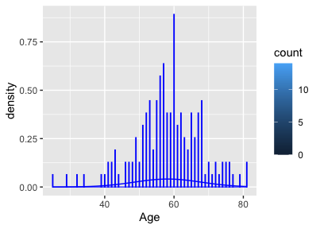<!-- -->

``` r
#QQplots
qq<-data.frame(c(Metadata,qqnorm(Metadata$Age)))
```

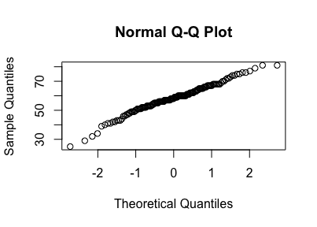<!-- -->

``` r
ggplot(qq,aes(x=x,y=y,legend.position="none"))+
  geom_point()+
  geom_smooth(method="lm")+
  labs(title="Q-Q Normal Plot",x="Theoretic",y="Observed")+
  theme_bw()
```

    `geom_smooth()` using formula 'y ~ x'

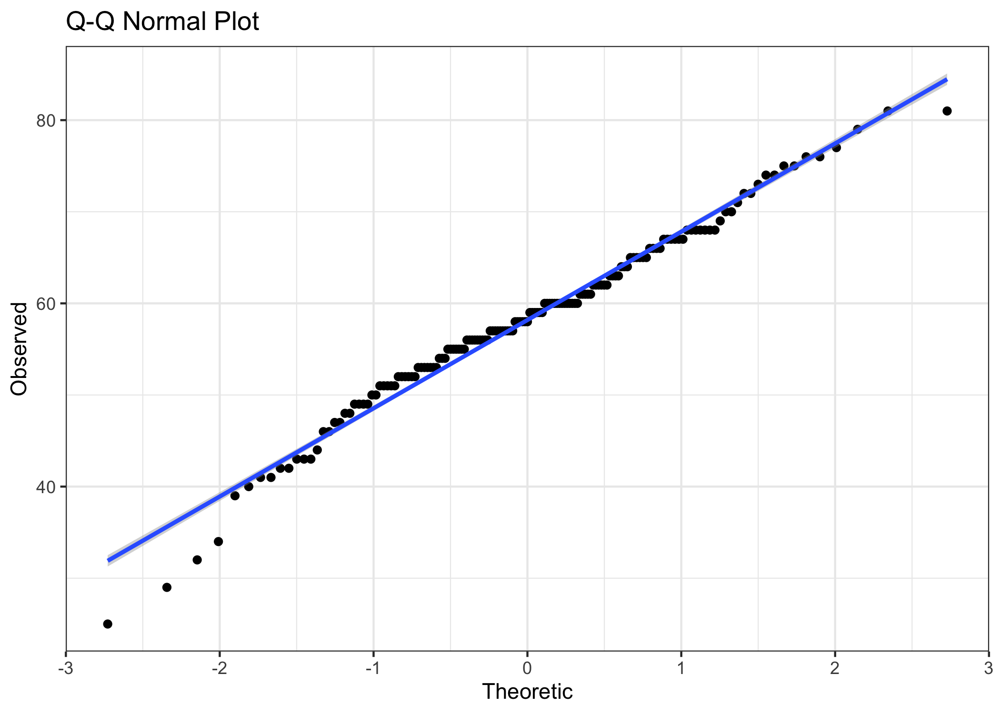<!-- -->

``` r
##boxplots
ggplot(Metadata)+
  geom_boxplot(aes(Metadata$Age))+
  theme_bw()+
  theme(legend.position="none")
```

    Warning: Use of `Metadata$Age` is discouraged. Use `Age` instead.

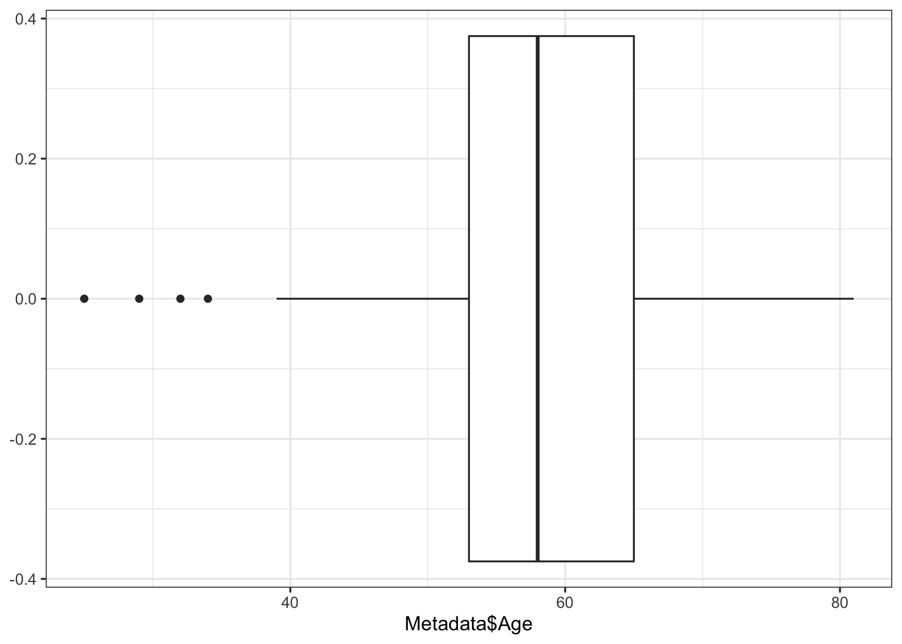<!-- -->

``` r
shapiro.test(Metadata$Age)
```


        Shapiro-Wilk normality test

    data:  Metadata$Age
    W = 0.98115, p-value = 0.0305

``` r
#Formal years of education normality is violated-----
stat.desc(Metadata$Formaleducationyears)
```

         nbr.val     nbr.null       nbr.na          min          max        range 
     157.0000000    0.0000000    0.0000000   10.0000000   22.0000000   12.0000000 
             sum       median         mean      SE.mean CI.mean.0.95          var 
    2261.0000000   14.0000000   14.4012739    0.2172272    0.4290861    7.4084599 
         std.dev     coef.var 
       2.7218486    0.1890005 

``` r
quantile(Metadata$Formaleducationyears, 0.75,na.rm = TRUE)-quantile(Metadata$Formaleducationyears, 0.25, na.rm = TRUE)
```

    75% 
      4 

``` r
ggplot(Metadata)+ 
  geom_histogram(binwidth=0.5, color="blue",aes(x=Formaleducationyears, y=..density.., fill=..count..))+ 
  stat_function(fun=dnorm,color="blue",
                args=list(mean=mean(Metadata$Formaleducationyears),sd=sd(Metadata$Formaleducationyears)))
```

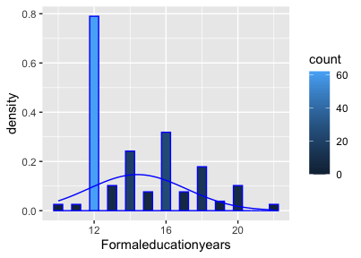<!-- -->

``` r
#QQplots
qq<-data.frame(c(Metadata,qqnorm(Metadata$Formaleducationyears)))
```

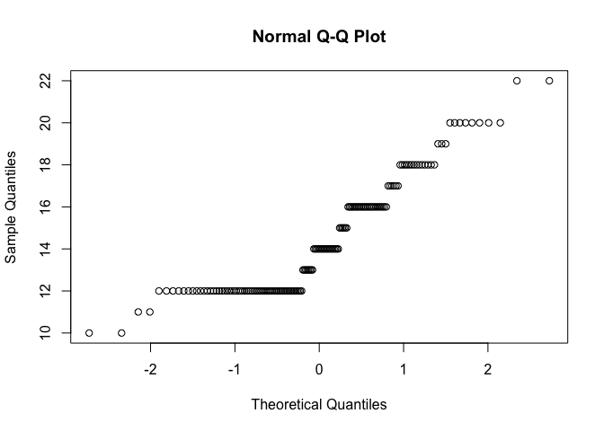<!-- -->

``` r
ggplot(qq,aes(x=x,y=y,legend.position="none"))+
  geom_point()+
  geom_smooth(method="lm")+
  labs(title="Q-Q Normal Plot",x="Theoretic",y="Observed")+
  theme_bw()
```

    `geom_smooth()` using formula 'y ~ x'

<!-- -->

``` r
##boxplots
ggplot(Metadata)+
  geom_boxplot(aes(Metadata$Formaleducationyears))+
  theme_bw()+
  theme(legend.position="none")
```

    Warning: Use of `Metadata$Formaleducationyears` is discouraged. Use
    `Formaleducationyears` instead.

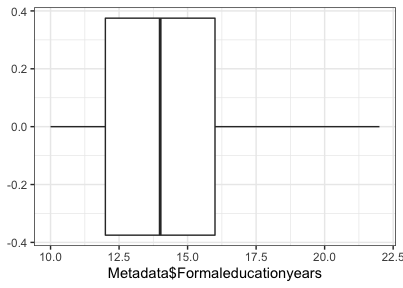<!-- -->

``` r
shapiro.test(Metadata$Formaleducationyears)
```


        Shapiro-Wilk normality test

    data:  Metadata$Formaleducationyears
    W = 0.87253, p-value = 2.529e-10

# 8 Preliminary bivariate correlation between the dependent variable and potential predictors - pearson correlation

``` r
names(Dftoy)
```

      [1] "ID"                   "Employment"           "Marriage"            
      [4] "race"                 "ethinicity (latio)"   "Age"                 
      [7] "Formaleducationyears" "SymptomNo"            "Symptom"             
     [10] "X8wkContr"            "BSContr"              "WC"                  
     [13] "symptom"              "effort"               "impact"              
     [16] "positive.adj"         "negative.adj"         "controlled"          
     [19] "uncontrolled"         "controlNN"            "controlVB"           
     [22] "Analytic"             "Clout"                "Authentic"           
     [25] "Tone"                 "WPS"                  "Sixltr"              
     [28] "Dic"                  "function."            "pronoun"             
     [31] "ppron"                "i"                    "we"                  
     [34] "you"                  "shehe"                "they"                
     [37] "ipron"                "article"              "prep"                
     [40] "auxverb"              "adverb"               "conj"                
     [43] "negate"               "verb"                 "adj"                 
     [46] "compare"              "interrog"             "number"              
     [49] "quant"                "affect"               "posemo"              
     [52] "negemo"               "anx"                  "anger"               
     [55] "sad"                  "social"               "family"              
     [58] "friend"               "female"               "male"                
     [61] "cogproc"              "insight"              "cause"               
     [64] "discrep"              "tentat"               "certain"             
     [67] "differ"               "percept"              "see"                 
     [70] "hear"                 "feel"                 "bio"                 
     [73] "body"                 "health"               "sexual"              
     [76] "ingest"               "drives"               "affiliation"         
     [79] "achieve"              "power"                "reward"              
     [82] "risk"                 "focuspast"            "focuspresent"        
     [85] "focusfuture"          "relativ"              "motion"              
     [88] "space"                "time"                 "work"                
     [91] "leisure"              "home"                 "money"               
     [94] "relig"                "death"                "informal"            
     [97] "swear"                "netspeak"             "assent"              
    [100] "nonflu"               "filler"               "AllPunc"             
    [103] "Period"               "Comma"                "Colon"               
    [106] "SemiC"                "QMark"                "Exclam"              
    [109] "Dash"                 "Quote"                "Apostro"             
    [112] "Parenth"              "OtherP"              

``` r
Df<-Dftoy[, -110]
library(Hmisc)
```

    Loading required package: lattice

    Loading required package: survival

    Loading required package: Formula


    Attaching package: 'Hmisc'

    The following objects are masked from 'package:dplyr':

        src, summarize

    The following objects are masked from 'package:base':

        format.pval, units

``` r
library(corrgram)
```


    Attaching package: 'corrgram'

    The following object is masked from 'package:lattice':

        panel.fill

``` r
# there is no variation in "Quote"
res <- cor(Df[10:112])
round(res, 2)[,1]
```

       X8wkContr      BSContr           WC      symptom       effort       impact 
            1.00         0.46         0.16         0.18         0.00         0.04 
    positive.adj negative.adj   controlled uncontrolled    controlNN    controlVB 
           -0.04        -0.03         0.16        -0.07         0.16         0.02 
        Analytic        Clout    Authentic         Tone          WPS       Sixltr 
            0.11         0.06        -0.02        -0.05         0.03         0.09 
             Dic    function.      pronoun        ppron            i           we 
           -0.02        -0.05        -0.08        -0.02        -0.02        -0.06 
             you        shehe         they        ipron      article         prep 
            0.02         0.00         0.02        -0.10         0.06         0.10 
         auxverb       adverb         conj       negate         verb          adj 
           -0.03        -0.08         0.04        -0.10        -0.01         0.09 
         compare     interrog       number        quant       affect       posemo 
            0.10         0.00         0.04        -0.02         0.05         0.02 
          negemo          anx        anger          sad       social       family 
            0.04         0.20        -0.08        -0.02         0.03         0.00 
          friend       female         male      cogproc      insight        cause 
           -0.01        -0.04         0.01        -0.06         0.03        -0.04 
         discrep       tentat      certain       differ      percept          see 
            0.08        -0.02        -0.10        -0.06        -0.05        -0.03 
            hear         feel          bio         body       health       sexual 
            0.07        -0.10        -0.01        -0.19         0.03         0.01 
          ingest       drives  affiliation      achieve        power       reward 
            0.13         0.09         0.00        -0.03         0.07         0.09 
            risk    focuspast focuspresent  focusfuture      relativ       motion 
            0.05         0.02        -0.13         0.06         0.03        -0.03 
           space         time         work      leisure         home        money 
            0.04         0.02        -0.02        -0.01        -0.06        -0.13 
           relig        death     informal        swear     netspeak       assent 
            0.08         0.01         0.12         0.02         0.00         0.02 
          nonflu       filler      AllPunc       Period        Comma        Colon 
            0.16         0.03         0.02        -0.01        -0.02        -0.03 
           SemiC        QMark       Exclam         Dash      Apostro      Parenth 
            0.04         0.08        -0.01         0.06         0.02        -0.01 
          OtherP 
           -0.07 

``` r
#significant and marginal significant
cor.test(Df$X8wkContr, Df$BSContr)
```


        Pearson's product-moment correlation

    data:  Df$X8wkContr and Df$BSContr
    t = 9.1835, df = 312, p-value < 2.2e-16
    alternative hypothesis: true correlation is not equal to 0
    95 percent confidence interval:
     0.3694745 0.5441926
    sample estimates:
          cor 
    0.4612939 

``` r
cor.test(Df$X8wkContr, Df$WC)
```


        Pearson's product-moment correlation

    data:  Df$X8wkContr and Df$WC
    t = 2.9049, df = 312, p-value = 0.003936
    alternative hypothesis: true correlation is not equal to 0
    95 percent confidence interval:
     0.05253597 0.26814414
    sample estimates:
          cor 
    0.1622764 

``` r
cor.test(Df$X8wkContr, Df$symptom)
```


        Pearson's product-moment correlation

    data:  Df$X8wkContr and Df$symptom
    t = 3.2346, df = 312, p-value = 0.001349
    alternative hypothesis: true correlation is not equal to 0
    95 percent confidence interval:
     0.07085505 0.28512584
    sample estimates:
          cor 
    0.1801264 

``` r
cor.test(Df$X8wkContr, Df$controlled)
```


        Pearson's product-moment correlation

    data:  Df$X8wkContr and Df$controlled
    t = 2.9362, df = 312, p-value = 0.003569
    alternative hypothesis: true correlation is not equal to 0
    95 percent confidence interval:
     0.05428192 0.26976842
    sample estimates:
          cor 
    0.1639807 

``` r
cor.test(Df$X8wkContr, Df$controlNN)
```


        Pearson's product-moment correlation

    data:  Df$X8wkContr and Df$controlNN
    t = 2.9087, df = 312, p-value = 0.00389
    alternative hypothesis: true correlation is not equal to 0
    95 percent confidence interval:
     0.0527485 0.2683419
    sample estimates:
          cor 
    0.1624839 

``` r
cor.test(Df$X8wkContr, Df$anx)
```


        Pearson's product-moment correlation

    data:  Df$X8wkContr and Df$anx
    t = 3.5492, df = 312, p-value = 0.0004459
    alternative hypothesis: true correlation is not equal to 0
    95 percent confidence interval:
     0.08823656 0.30111502
    sample estimates:
          cor 
    0.1969966 

``` r
cor.test(Df$X8wkContr, Df$feel)
```


        Pearson's product-moment correlation

    data:  Df$X8wkContr and Df$feel
    t = -1.7491, df = 312, p-value = 0.08125
    alternative hypothesis: true correlation is not equal to 0
    95 percent confidence interval:
     -0.20697057  0.01227386
    sample estimates:
            cor 
    -0.09854403 

``` r
cor.test(Df$X8wkContr, Df$body)
```


        Pearson's product-moment correlation

    data:  Df$X8wkContr and Df$body
    t = -3.4943, df = 312, p-value = 0.000544
    alternative hypothesis: true correlation is not equal to 0
    95 percent confidence interval:
     -0.29834226 -0.08521303
    sample estimates:
           cor 
    -0.1940667 

``` r
cor.test(Df$X8wkContr, Df$ingest)
```


        Pearson's product-moment correlation

    data:  Df$X8wkContr and Df$ingest
    t = 2.3347, df = 312, p-value = 0.02019
    alternative hypothesis: true correlation is not equal to 0
    95 percent confidence interval:
     0.02065436 0.23826702
    sample estimates:
          cor 
    0.1310388 

``` r
cor.test(Df$X8wkContr, Df$focuspresent)
```


        Pearson's product-moment correlation

    data:  Df$X8wkContr and Df$focuspresent
    t = -2.3641, df = 312, p-value = 0.01869
    alternative hypothesis: true correlation is not equal to 0
    95 percent confidence interval:
     -0.23982058 -0.02230132
    sample estimates:
           cor 
    -0.1326579 

``` r
cor.test(Df$X8wkContr, Df$money)
```


        Pearson's product-moment correlation

    data:  Df$X8wkContr and Df$money
    t = -2.3909, df = 312, p-value = 0.0174
    alternative hypothesis: true correlation is not equal to 0
    95 percent confidence interval:
     -0.24123888 -0.02380591
    sample estimates:
           cor 
    -0.1341365 

``` r
cor.test(Df$X8wkContr, Df$informal)
```


        Pearson's product-moment correlation

    data:  Df$X8wkContr and Df$informal
    t = 2.1241, df = 312, p-value = 0.03445
    alternative hypothesis: true correlation is not equal to 0
    95 percent confidence interval:
     0.008825569 0.227076182
    sample estimates:
         cor 
    0.119393 

``` r
cor.test(Df$X8wkContr, Df$nonflu)
```


        Pearson's product-moment correlation

    data:  Df$X8wkContr and Df$nonflu
    t = 2.9473, df = 312, p-value = 0.003447
    alternative hypothesis: true correlation is not equal to 0
    95 percent confidence interval:
     0.05490122 0.27034427
    sample estimates:
          cor 
    0.1645851 

``` r
cor.test(Df$X8wkContr, Df$negate)
```


        Pearson's product-moment correlation

    data:  Df$X8wkContr and Df$negate
    t = -1.8085, df = 312, p-value = 0.0715
    alternative hypothesis: true correlation is not equal to 0
    95 percent confidence interval:
     -0.21016689  0.00893254
    sample estimates:
           cor 
    -0.1018522 

``` r
cor.test(Df$X8wkContr, Df$discrep)
```


        Pearson's product-moment correlation

    data:  Df$X8wkContr and Df$discrep
    t = 1.4805, df = 312, p-value = 0.1398
    alternative hypothesis: true correlation is not equal to 0
    95 percent confidence interval:
     -0.02741416  0.19242837
    sample estimates:
           cor 
    0.08352329 

``` r
cor.test(Df$X8wkContr, Df$certain)
```


        Pearson's product-moment correlation

    data:  Df$X8wkContr and Df$certain
    t = -1.823, df = 312, p-value = 0.06925
    alternative hypothesis: true correlation is not equal to 0
    95 percent confidence interval:
     -0.210950612  0.008112522
    sample estimates:
           cor 
    -0.1026637 

``` r
cor.test(Df$X8wkContr, Df$Analytic)
```


        Pearson's product-moment correlation

    data:  Df$X8wkContr and Df$Analytic
    t = 1.8692, df = 312, p-value = 0.06253
    alternative hypothesis: true correlation is not equal to 0
    95 percent confidence interval:
     -0.005512423  0.213433755
    sample estimates:
          cor 
    0.1052358 

``` r
cor.test(Df$X8wkContr, Df$Sixltr)
```


        Pearson's product-moment correlation

    data:  Df$X8wkContr and Df$Sixltr
    t = 1.5205, df = 312, p-value = 0.1294
    alternative hypothesis: true correlation is not equal to 0
    95 percent confidence interval:
     -0.02515633  0.19460314
    sample estimates:
           cor 
    0.08576649 

``` r
cor.test(Df$X8wkContr, Df$prep)
```


        Pearson's product-moment correlation

    data:  Df$X8wkContr and Df$prep
    t = 1.6987, df = 312, p-value = 0.09038
    alternative hypothesis: true correlation is not equal to 0
    95 percent confidence interval:
     -0.01511768  0.20424646
    sample estimates:
           cor 
    0.09572651 

``` r
corrgram(Df %>% select (X8wkContr,BSContr, WC, symptom, controlled, controlNN,anx,feel, body, ingest, focuspresent, money, informal, nonflu, negate, discrep, certain, Analytic, Sixltr, prep), order=FALSE, lower.panel=panel.shade,
  upper.panel=panel.pie, text.panel=panel.txt,
  main="IVs and DV correlation")
```

<!-- -->

``` r
## As we can see posemo and tone are highly correlated, symptom and health category are highly correlated as well. 
```

# 9 Model buiding - Mixed-effect regression model

Based on theories and bivariate correlation test results , I have some
ideas of candidate predictors. Since this analysis is exploratory in
nature and we have a lot of potential predictors. I will explore a few
approaches of model building

Random effect: use participant ID Covariate:social demographic factors
and symptom selected, e.g., marriage status, age, education, employment,
race, ethnicity because patients were predominantly non-Hispanic white)
Full purpose-oriented predictor selection

## 9.1 Convenience functions for model comparison

``` r
##Get convergence code for a single model
##verbose: TRUE to return full convergence code, FALSE to return logical
##checkSingular: TRUE to count singular fit as nonconvergence, FALSE to ignore singular fit
getConvCode <- function (x, verbose=FALSE, checkSingular=TRUE) {
  library(lme4)
  library(purrr)
  
  ##Get convergence messages
  convMsg <-
    x %>% 
    attr("optinfo") %>% 
    pluck("conv", "lme4")
  
  ##Get singular-fit status
  if (checkSingular) sgFit <- x %>% isSingular()
  
  ##If not verbose, get convergence code as logical
  if (!verbose) {
    convCode <- length(convMsg)==0
    if (checkSingular) convCode <- convCode & !sgFit
    ##If verbose, get convergence code as character
  } else {
    convCode <- character(0L)
    if (length(convMsg) > 0) {
      convCode <- convMsg %>% 
        pluck("messages") %>% 
        paste(collapse="\n")
    }
    
    if (checkSingular) {
      if (sgFit) {
        convCode <- paste(c(convCode, "Singular fit"), collapse="\n")
      }
    }
    
    ##If nothing has been added to convCode, return the good news.
    if (length(convCode)==0) {
      convCode <- "Converged"
      if (checkSingular) convCode <- paste0(convCode, ", no singular fit")
    }
  }
  
  convCode
}

##Convenience function for checking if something is an error
is.error <- function(x) "error" %in% class(x)

##Get Fox & Monette's (1992) GVIF, which is the square of the "GVIF" reported
##  by car::vif() and thus is comparable to the 'VIF < 10' criterion.
##Whereas car::vif() returns either a vector or a matrix, this function always
##  returns a dataframe
vif <- function(mod, decreasing=TRUE) {
  library(car)
  library(dplyr)
  
  vifReturn <- tryCatch(car::vif(mod),
                        ##Catch and return "fewer than 2 terms" error"
                        error = function(e) e)
  
  if (is.error(vifReturn)) {
    return(NA)
  }
  ##Turn vector VIF into dataframe
  if (is.numeric(vifReturn) & !is.matrix(vifReturn)) {
    ret <- data.frame(Term = names(vifReturn),
                      GVIF = vifReturn,
                      Df = rep(1, length(vifReturn))) %>% 
      mutate(`GVIF^(1/(2*Df))` = sqrt(vifReturn),
             `GVIF^(1/Df)` = vifReturn)
  }
  ##Turn matrix VIF into dataframe
  if (is.numeric(vifReturn) & is.matrix(vifReturn)) {
    ret <- as.data.frame(vifReturn) %>% 
      rownames_to_column("Term") %>% 
      select(Term, everything()) %>% 
      mutate(`GVIF^(1/Df)` = GVIF ^ (1/Df))
  }
  
  ret
}

##Get maximum VIF from model
getMaxVIF <- function(mod, decreasing=TRUE) {
  library(dplyr)
  library(purrr)
  
  ##If just one term, return NA
  if (length(labels(terms(mod))) < 2) 
    return(NA)
  
  vif(mod) %>% 
    ##Get unique max GVIF (in case there are ties)
    arrange(desc(`GVIF^(1/Df)`)) %>% 
    slice(1) %>% 
    pull(`GVIF^(1/Df)`, name=Term)
}
```

## 9.2 Use participant ID as random effect

``` r
#install.packages("lmerTest")
library(lmerTest)
```


    Attaching package: 'lmerTest'

    The following object is masked from 'package:lme4':

        lmer

    The following object is masked from 'package:stats':

        step

``` r
# since there is very little variations in race and enthnicity, so I wont include them. 
toy1<-lmer(X8wkContr ~ BSContr+Marriage+Age+
             Formaleducationyears+Employment+(1|ID), Df)
summary(toy1)
```

    Linear mixed model fit by REML. t-tests use Satterthwaite's method [
    lmerModLmerTest]
    Formula: X8wkContr ~ BSContr + Marriage + Age + Formaleducationyears +  
        Employment + (1 | ID)
       Data: Df

    REML criterion at convergence: 523.3

    Scaled residuals: 
        Min      1Q  Median      3Q     Max 
    -2.8850 -0.4099  0.0026  0.5385  3.8917 

    Random effects:
     Groups   Name        Variance Std.Dev.
     ID       (Intercept) 0.2004   0.4476  
     Residual             0.1904   0.4364  
    Number of obs: 300, groups:  ID, 114

    Fixed effects:
                                                    Estimate Std. Error         df
    (Intercept)                                     1.073978   0.640891 100.611746
    BSContr                                         0.393284   0.046577 277.078093
    MarriageDivorced                                0.211995   0.188425 100.800822
    MarriageLiving with partner/significant other   0.305969   0.198777  95.949027
    MarriageNever married                          -0.037369   0.225237  94.318976
    MarriageSeparated                               0.020527   0.239254  93.686455
    MarriageWidowed                                 0.051874   0.211430 120.917110
    Age                                            -0.004874   0.005453 100.897446
    Formaleducationyears                            0.041446   0.018180 101.149037
    EmploymentNo                                    0.252269   0.523890  93.747169
    EmploymentYes                                   0.002143   0.524525  93.602658
                                                  t value Pr(>|t|)    
    (Intercept)                                     1.676   0.0969 .  
    BSContr                                         8.444 1.75e-15 ***
    MarriageDivorced                                1.125   0.2632    
    MarriageLiving with partner/significant other   1.539   0.1270    
    MarriageNever married                          -0.166   0.8686    
    MarriageSeparated                               0.086   0.9318    
    MarriageWidowed                                 0.245   0.8066    
    Age                                            -0.894   0.3736    
    Formaleducationyears                            2.280   0.0247 *  
    EmploymentNo                                    0.482   0.6313    
    EmploymentYes                                   0.004   0.9967    
    ---
    Signif. codes:  0 '***' 0.001 '**' 0.01 '*' 0.05 '.' 0.1 ' ' 1

    Correlation of Fixed Effects:
                (Intr) BSCntr MrrgDv MLwp/o MrrgNm MrrgSp MrrgWd Age    Frmldc
    BSContr     -0.188                                                        
    MarrigDvrcd  0.097 -0.106                                                 
    MrrgLwprt/o  0.052  0.003  0.109                                          
    MrrgNvrmrrd -0.114  0.050  0.057  0.030                                   
    MarrigSprtd -0.039  0.044  0.066  0.086  0.065                            
    MarriagWdwd  0.009  0.000  0.096  0.125  0.056  0.073                     
    Age         -0.453 -0.011 -0.112 -0.203  0.214  0.023 -0.127              
    Frmldctnyrs -0.333 -0.059 -0.070  0.114  0.018  0.057  0.141  0.011       
    EmploymentN -0.736  0.072 -0.027 -0.039 -0.034 -0.041 -0.034 -0.069 -0.099
    EmploymntYs -0.755  0.063 -0.037 -0.034 -0.046 -0.022 -0.050 -0.016 -0.107
                EmplyN
    BSContr           
    MarrigDvrcd       
    MrrgLwprt/o       
    MrrgNvrmrrd       
    MarrigSprtd       
    MarriagWdwd       
    Age               
    Frmldctnyrs       
    EmploymentN       
    EmploymntYs  0.979

``` r
anova(toy1)
```

    Type III Analysis of Variance Table with Satterthwaite's method
                          Sum Sq Mean Sq NumDF   DenDF F value    Pr(>F)    
    BSContr              13.5777 13.5777     1 277.078 71.2960 1.746e-15 ***
    Marriage              0.6429  0.1286     5 100.425  0.6752   0.64321    
    Age                   0.1521  0.1521     1 100.897  0.7987   0.37361    
    Formaleducationyears  0.9898  0.9898     1 101.149  5.1974   0.02472 *  
    Employment            1.0662  0.5331     2  97.492  2.7992   0.06576 .  
    ---
    Signif. codes:  0 '***' 0.001 '**' 0.01 '*' 0.05 '.' 0.1 ' ' 1

``` r
toy2<-lmer(X8wkContr ~ BSContr+Marriage+ Age+ Formaleducationyears+Employment+ symptom +(1|ID), Df)
summary(toy2)
```

    Linear mixed model fit by REML. t-tests use Satterthwaite's method [
    lmerModLmerTest]
    Formula: X8wkContr ~ BSContr + Marriage + Age + Formaleducationyears +  
        Employment + symptom + (1 | ID)
       Data: Df

    REML criterion at convergence: 523.3

    Scaled residuals: 
        Min      1Q  Median      3Q     Max 
    -2.8457 -0.4345  0.0071  0.5143  3.4963 

    Random effects:
     Groups   Name        Variance Std.Dev.
     ID       (Intercept) 0.1930   0.4393  
     Residual             0.1884   0.4340  
    Number of obs: 300, groups:  ID, 114

    Fixed effects:
                                                    Estimate Std. Error         df
    (Intercept)                                     1.076153   0.631216  99.773958
    BSContr                                         0.392466   0.046210 276.888271
    MarriageDivorced                                0.187484   0.185836 100.663207
    MarriageLiving with partner/significant other   0.279872   0.196011  95.606949
    MarriageNever married                          -0.053926   0.221867  93.575523
    MarriageSeparated                               0.035430   0.235634  92.929336
    MarriageWidowed                                 0.052814   0.208419 120.210697
    Age                                            -0.004633   0.005372 100.111659
    Formaleducationyears                            0.037972   0.017959 101.491969
    EmploymentNo                                    0.204271   0.516167  93.064289
    EmploymentYes                                  -0.030878   0.516599  92.806812
    symptom                                         0.046279   0.018551 240.538933
                                                  t value Pr(>|t|)    
    (Intercept)                                     1.705   0.0913 .  
    BSContr                                         8.493 1.25e-15 ***
    MarriageDivorced                                1.009   0.3155    
    MarriageLiving with partner/significant other   1.428   0.1566    
    MarriageNever married                          -0.243   0.8085    
    MarriageSeparated                               0.150   0.8808    
    MarriageWidowed                                 0.253   0.8004    
    Age                                            -0.862   0.3905    
    Formaleducationyears                            2.114   0.0369 *  
    EmploymentNo                                    0.396   0.6932    
    EmploymentYes                                  -0.060   0.9525    
    symptom                                         2.495   0.0133 *  
    ---
    Signif. codes:  0 '***' 0.001 '**' 0.01 '*' 0.05 '.' 0.1 ' ' 1

    Correlation of Fixed Effects:
                (Intr) BSCntr MrrgDv MLwp/o MrrgNm MrrgSp MrrgWd Age    Frmldc
    BSContr     -0.190                                                        
    MarrigDvrcd  0.097 -0.106                                                 
    MrrgLwprt/o  0.052  0.004  0.111                                          
    MrrgNvrmrrd -0.114  0.051  0.059  0.032                                   
    MarrigSprtd -0.039  0.044  0.065  0.085  0.064                            
    MarriagWdwd  0.010  0.000  0.096  0.125  0.056  0.073                     
    Age         -0.452 -0.011 -0.113 -0.204  0.214  0.024 -0.127              
    Frmldctnyrs -0.332 -0.058 -0.065  0.117  0.021  0.055  0.140  0.010       
    EmploymentN -0.736  0.073 -0.025 -0.037 -0.033 -0.042 -0.034 -0.069 -0.096
    EmploymntYs -0.754  0.064 -0.036 -0.032 -0.045 -0.023 -0.050 -0.016 -0.105
    symptom      0.002 -0.012 -0.052 -0.053 -0.030  0.025  0.002  0.018 -0.077
                EmplyN EmplyY
    BSContr                  
    MarrigDvrcd              
    MrrgLwprt/o              
    MrrgNvrmrrd              
    MarrigSprtd              
    MarriagWdwd              
    Age                      
    Frmldctnyrs              
    EmploymentN              
    EmploymntYs  0.979       
    symptom     -0.038 -0.026

``` r
# we will keep age, formal years of education as covariates. Age is never a significant predictor, but it is an important patient characteristic. 
toy3<-lmer(X8wkContr ~ BSContr+ Age+ Formaleducationyears+ WC+ symptom +(1|ID), Df)
toy3.1<-lmer(X8wkContr ~ BSContr+ Age+ Formaleducationyears+Employment+ WC+ symptom +(1|ID), Df)
summary(toy3)
```

    Linear mixed model fit by REML. t-tests use Satterthwaite's method [
    lmerModLmerTest]
    Formula: X8wkContr ~ BSContr + Age + Formaleducationyears + WC + symptom +  
        (1 | ID)
       Data: Df

    REML criterion at convergence: 532.4

    Scaled residuals: 
        Min      1Q  Median      3Q     Max 
    -2.8652 -0.4340 -0.0488  0.5633  3.4644 

    Random effects:
     Groups   Name        Variance Std.Dev.
     ID       (Intercept) 0.1857   0.4309  
     Residual             0.1878   0.4334  
    Number of obs: 300, groups:  ID, 114

    Fixed effects:
                          Estimate Std. Error        df t value Pr(>|t|)    
    (Intercept)          8.744e-01  3.935e-01 1.132e+02   2.222  0.02828 *  
    BSContr              3.839e-01  4.554e-02 2.835e+02   8.430 1.77e-15 ***
    Age                  8.524e-04  4.777e-03 1.043e+02   0.178  0.85873    
    Formaleducationyears 3.165e-02  1.730e-02 1.090e+02   1.829  0.07011 .  
    WC                   4.160e-04  1.733e-04 2.935e+02   2.400  0.01701 *  
    symptom              5.803e-02  1.862e-02 2.474e+02   3.116  0.00205 ** 
    ---
    Signif. codes:  0 '***' 0.001 '**' 0.01 '*' 0.05 '.' 0.1 ' ' 1

    Correlation of Fixed Effects:
                (Intr) BSCntr Age    Frmldc WC    
    BSContr     -0.196                            
    Age         -0.726 -0.017                     
    Frmldctnyrs -0.644 -0.064  0.049              
    WC          -0.057 -0.074 -0.019 -0.074       
    symptom     -0.031 -0.023 -0.011 -0.092  0.159

``` r
anova(toy3, toy3.1)
```

    refitting model(s) with ML (instead of REML)

    Data: Df
    Models:
    toy3: X8wkContr ~ BSContr + Age + Formaleducationyears + WC + symptom + (1 | ID)
    toy3.1: X8wkContr ~ BSContr + Age + Formaleducationyears + Employment + WC + symptom + (1 | ID)
           npar    AIC    BIC logLik deviance  Chisq Df Pr(>Chisq)  
    toy3      8 502.99 532.62 -243.5   486.99                       
    toy3.1   10 502.01 539.04 -241.0   482.01 4.9893  2    0.08253 .
    ---
    Signif. codes:  0 '***' 0.001 '**' 0.01 '*' 0.05 '.' 0.1 ' ' 1

``` r
summary(toy3)
```

    Linear mixed model fit by REML. t-tests use Satterthwaite's method [
    lmerModLmerTest]
    Formula: X8wkContr ~ BSContr + Age + Formaleducationyears + WC + symptom +  
        (1 | ID)
       Data: Df

    REML criterion at convergence: 532.4

    Scaled residuals: 
        Min      1Q  Median      3Q     Max 
    -2.8652 -0.4340 -0.0488  0.5633  3.4644 

    Random effects:
     Groups   Name        Variance Std.Dev.
     ID       (Intercept) 0.1857   0.4309  
     Residual             0.1878   0.4334  
    Number of obs: 300, groups:  ID, 114

    Fixed effects:
                          Estimate Std. Error        df t value Pr(>|t|)    
    (Intercept)          8.744e-01  3.935e-01 1.132e+02   2.222  0.02828 *  
    BSContr              3.839e-01  4.554e-02 2.835e+02   8.430 1.77e-15 ***
    Age                  8.524e-04  4.777e-03 1.043e+02   0.178  0.85873    
    Formaleducationyears 3.165e-02  1.730e-02 1.090e+02   1.829  0.07011 .  
    WC                   4.160e-04  1.733e-04 2.935e+02   2.400  0.01701 *  
    symptom              5.803e-02  1.862e-02 2.474e+02   3.116  0.00205 ** 
    ---
    Signif. codes:  0 '***' 0.001 '**' 0.01 '*' 0.05 '.' 0.1 ' ' 1

    Correlation of Fixed Effects:
                (Intr) BSCntr Age    Frmldc WC    
    BSContr     -0.196                            
    Age         -0.726 -0.017                     
    Frmldctnyrs -0.644 -0.064  0.049              
    WC          -0.057 -0.074 -0.019 -0.074       
    symptom     -0.031 -0.023 -0.011 -0.092  0.159

``` r
anova(toy2, toy3)
```

    refitting model(s) with ML (instead of REML)

    Data: Df
    Models:
    toy3: X8wkContr ~ BSContr + Age + Formaleducationyears + WC + symptom + (1 | ID)
    toy2: X8wkContr ~ BSContr + Marriage + Age + Formaleducationyears + Employment + symptom + (1 | ID)
         npar    AIC    BIC  logLik deviance  Chisq Df Pr(>Chisq)
    toy3    8 502.99 532.62 -243.50   486.99                     
    toy2   14 512.27 564.12 -242.13   484.27 2.7296  6     0.8419

``` r
#toy 4 is significant better than toy3.1 no collinearity issue
toy4<-lmer(X8wkContr ~ BSContr+ Age+ Formaleducationyears+ WC+ symptom+anx +(1|ID), Df)
summary(toy4)
```

    Linear mixed model fit by REML. t-tests use Satterthwaite's method [
    lmerModLmerTest]
    Formula: X8wkContr ~ BSContr + Age + Formaleducationyears + WC + symptom +  
        anx + (1 | ID)
       Data: Df

    REML criterion at convergence: 532.3

    Scaled residuals: 
        Min      1Q  Median      3Q     Max 
    -2.8023 -0.4545 -0.0160  0.5311  3.2970 

    Random effects:
     Groups   Name        Variance Std.Dev.
     ID       (Intercept) 0.1818   0.4264  
     Residual             0.1856   0.4308  
    Number of obs: 300, groups:  ID, 114

    Fixed effects:
                          Estimate Std. Error        df t value Pr(>|t|)    
    (Intercept)          8.575e-01  3.900e-01 1.134e+02   2.199  0.02994 *  
    BSContr              3.693e-01  4.569e-02 2.820e+02   8.084 1.86e-14 ***
    Age                  9.637e-04  4.733e-03 1.044e+02   0.204  0.83906    
    Formaleducationyears 3.116e-02  1.715e-02 1.091e+02   1.817  0.07191 .  
    WC                   4.428e-04  1.725e-04 2.927e+02   2.567  0.01075 *  
    symptom              5.877e-02  1.850e-02 2.471e+02   3.176  0.00168 ** 
    anx                  7.205e-02  3.141e-02 2.255e+02   2.294  0.02270 *  
    ---
    Signif. codes:  0 '***' 0.001 '**' 0.01 '*' 0.05 '.' 0.1 ' ' 1

    Correlation of Fixed Effects:
                (Intr) BSCntr Age    Frmldc WC     symptm
    BSContr     -0.192                                   
    Age         -0.726 -0.019                            
    Frmldctnyrs -0.643 -0.062  0.049                     
    WC          -0.058 -0.083 -0.018 -0.075              
    symptom     -0.031 -0.025 -0.011 -0.092  0.159       
    anx         -0.019 -0.141  0.010 -0.012  0.067  0.015

``` r
anova(toy3.1, toy4)
```

    refitting model(s) with ML (instead of REML)

    Data: Df
    Models:
    toy4: X8wkContr ~ BSContr + Age + Formaleducationyears + WC + symptom + anx + (1 | ID)
    toy3.1: X8wkContr ~ BSContr + Age + Formaleducationyears + Employment + WC + symptom + (1 | ID)
           npar    AIC    BIC  logLik deviance Chisq Df Pr(>Chisq)
    toy4      9 499.65 532.98 -240.82   481.65                    
    toy3.1   10 502.01 539.04 -241.00   482.01     0  1          1

``` r
vif(toy4)
```

    Loading required package: carData


    Attaching package: 'car'

    The following object is masked _by_ '.GlobalEnv':

        vif

    The following object is masked from 'package:dplyr':

        recode

                                         Term     GVIF Df GVIF^(1/(2*Df))
    BSContr                           BSContr 1.031570  1        1.015662
    Age                                   Age 1.002975  1        1.001486
    Formaleducationyears Formaleducationyears 1.019631  1        1.009768
    WC                                     WC 1.040503  1        1.020051
    symptom                           symptom 1.033237  1        1.016483
    anx                                   anx 1.023870  1        1.011865
                         GVIF^(1/Df)
    BSContr                 1.031570
    Age                     1.002975
    Formaleducationyears    1.019631
    WC                      1.040503
    symptom                 1.033237
    anx                     1.023870

``` r
#toy 5 is significant better than toy4
toy5<-lmer(X8wkContr ~ BSContr+ Age+ Formaleducationyears+ WC+ symptom+anx+feel+(1|ID), Df)
summary(toy5)
```

    Linear mixed model fit by REML. t-tests use Satterthwaite's method [
    lmerModLmerTest]
    Formula: X8wkContr ~ BSContr + Age + Formaleducationyears + WC + symptom +  
        anx + feel + (1 | ID)
       Data: Df

    REML criterion at convergence: 533.9

    Scaled residuals: 
         Min       1Q   Median       3Q      Max 
    -2.94612 -0.44090 -0.00612  0.55773  3.08014 

    Random effects:
     Groups   Name        Variance Std.Dev.
     ID       (Intercept) 0.1804   0.4247  
     Residual             0.1828   0.4276  
    Number of obs: 300, groups:  ID, 114

    Fixed effects:
                           Estimate Std. Error         df t value Pr(>|t|)    
    (Intercept)           9.798e-01  3.919e-01  1.168e+02   2.500 0.013809 *  
    BSContr               3.675e-01  4.538e-02  2.804e+02   8.097 1.73e-14 ***
    Age                   5.016e-04  4.714e-03  1.043e+02   0.106 0.915464    
    Formaleducationyears  2.942e-02  1.708e-02  1.091e+02   1.723 0.087790 .  
    WC                    4.218e-04  1.716e-04  2.915e+02   2.458 0.014547 *  
    symptom               6.662e-02  1.872e-02  2.421e+02   3.560 0.000447 ***
    anx                   6.784e-02  3.124e-02  2.251e+02   2.172 0.030905 *  
    feel                 -3.512e-02  1.584e-02  2.433e+02  -2.217 0.027572 *  
    ---
    Signif. codes:  0 '***' 0.001 '**' 0.01 '*' 0.05 '.' 0.1 ' ' 1

    Correlation of Fixed Effects:
                (Intr) BSCntr Age    Frmldc WC     symptm anx   
    BSContr     -0.192                                          
    Age         -0.724 -0.018                                   
    Frmldctnyrs -0.643 -0.061  0.050                            
    WC          -0.065 -0.082 -0.016 -0.072                     
    symptom     -0.004 -0.028 -0.019 -0.099  0.146              
    anx         -0.027 -0.140  0.013 -0.009  0.070  0.004       
    feel        -0.141  0.017  0.044  0.047  0.055 -0.191  0.060

``` r
anova(toy5, toy4)
```

    refitting model(s) with ML (instead of REML)

    Data: Df
    Models:
    toy4: X8wkContr ~ BSContr + Age + Formaleducationyears + WC + symptom + anx + (1 | ID)
    toy5: X8wkContr ~ BSContr + Age + Formaleducationyears + WC + symptom + anx + feel + (1 | ID)
         npar    AIC    BIC  logLik deviance  Chisq Df Pr(>Chisq)  
    toy4    9 499.65 532.98 -240.82   481.65                       
    toy5   10 496.66 533.69 -238.33   476.66 4.9946  1    0.02543 *
    ---
    Signif. codes:  0 '***' 0.001 '**' 0.01 '*' 0.05 '.' 0.1 ' ' 1

``` r
vif(toy5)
```

                                         Term     GVIF Df GVIF^(1/(2*Df))
    BSContr                           BSContr 1.031832  1        1.015791
    Age                                   Age 1.004937  1        1.002465
    Formaleducationyears Formaleducationyears 1.021783  1        1.010833
    WC                                     WC 1.043609  1        1.021572
    symptom                           symptom 1.072277  1        1.035508
    anx                                   anx 1.027573  1        1.013693
    feel                                 feel 1.052467  1        1.025898
                         GVIF^(1/Df)
    BSContr                 1.031832
    Age                     1.004937
    Formaleducationyears    1.021783
    WC                      1.043609
    symptom                 1.072277
    anx                     1.027573
    feel                    1.052467

``` r
#toy 6 is significant better than toy5, no collinearity issue
toy6<-lmer(X8wkContr ~ BSContr+ Age+ Formaleducationyears+ WC+ symptom+anx+feel+ focuspresent+(1|ID), Df)
summary(toy6)
```

    Linear mixed model fit by REML. t-tests use Satterthwaite's method [
    lmerModLmerTest]
    Formula: X8wkContr ~ BSContr + Age + Formaleducationyears + WC + symptom +  
        anx + feel + focuspresent + (1 | ID)
       Data: Df

    REML criterion at convergence: 536.8

    Scaled residuals: 
         Min       1Q   Median       3Q      Max 
    -2.82512 -0.43991 -0.00717  0.56171  2.97512 

    Random effects:
     Groups   Name        Variance Std.Dev.
     ID       (Intercept) 0.1853   0.4305  
     Residual             0.1780   0.4219  
    Number of obs: 300, groups:  ID, 114

    Fixed effects:
                           Estimate Std. Error         df t value Pr(>|t|)    
    (Intercept)           1.404e+00  4.399e-01  1.584e+02   3.191  0.00171 ** 
    BSContr               3.624e-01  4.506e-02  2.781e+02   8.043 2.54e-14 ***
    Age                  -3.957e-04  4.762e-03  1.052e+02  -0.083  0.93393    
    Formaleducationyears  2.723e-02  1.721e-02  1.091e+02   1.582  0.11659    
    WC                    3.648e-04  1.723e-04  2.888e+02   2.117  0.03515 *  
    symptom               6.083e-02  1.868e-02  2.373e+02   3.256  0.00130 ** 
    anx                   6.661e-02  3.089e-02  2.222e+02   2.156  0.03213 *  
    feel                 -3.490e-02  1.568e-02  2.399e+02  -2.226  0.02696 *  
    focuspresent         -2.042e-02  9.455e-03  2.581e+02  -2.159  0.03174 *  
    ---
    Signif. codes:  0 '***' 0.001 '**' 0.01 '*' 0.05 '.' 0.1 ' ' 1

    Correlation of Fixed Effects:
                (Intr) BSCntr Age    Frmldc WC     symptm anx    feel  
    BSContr     -0.188                                                 
    Age         -0.686 -0.014                                          
    Frmldctnyrs -0.604 -0.057  0.056                                   
    WC          -0.123 -0.074 -0.002 -0.061                            
    symptom     -0.061 -0.023 -0.007 -0.088  0.163                     
    anx         -0.029 -0.139  0.014 -0.008  0.072  0.007              
    feel        -0.122  0.016  0.043  0.046  0.053 -0.189  0.061       
    focuspresnt -0.445  0.042  0.087  0.064  0.148  0.131  0.012 -0.004

``` r
anova(toy6, toy5)
```

    refitting model(s) with ML (instead of REML)

    Data: Df
    Models:
    toy5: X8wkContr ~ BSContr + Age + Formaleducationyears + WC + symptom + anx + feel + (1 | ID)
    toy6: X8wkContr ~ BSContr + Age + Formaleducationyears + WC + symptom + anx + feel + focuspresent + (1 | ID)
         npar    AIC    BIC  logLik deviance  Chisq Df Pr(>Chisq)  
    toy5   10 496.66 533.69 -238.33   476.66                       
    toy6   11 493.98 534.72 -235.99   471.98 4.6731  1    0.03064 *
    ---
    Signif. codes:  0 '***' 0.001 '**' 0.01 '*' 0.05 '.' 0.1 ' ' 1

``` r
vif(toy6)
```

                                         Term     GVIF Df GVIF^(1/(2*Df))
    BSContr                           BSContr 1.033272  1        1.016500
    Age                                   Age 1.012557  1        1.006259
    Formaleducationyears Formaleducationyears 1.025384  1        1.012613
    WC                                     WC 1.066923  1        1.032920
    symptom                           symptom 1.090605  1        1.044320
    anx                                   anx 1.027801  1        1.013805
    feel                                 feel 1.052013  1        1.025677
    focuspresent                 focuspresent 1.053668  1        1.026483
                         GVIF^(1/Df)
    BSContr                 1.033272
    Age                     1.012557
    Formaleducationyears    1.025384
    WC                      1.066923
    symptom                 1.090605
    anx                     1.027801
    feel                    1.052013
    focuspresent            1.053668

``` r
#toy 7 is significant better than toy6, no collinearity issue
toy7<-lmer(X8wkContr ~ BSContr+ Age+ Formaleducationyears+ WC+ symptom+anx+feel+ focuspresent+money+(1|ID), Df)
summary(toy7)
```

    Linear mixed model fit by REML. t-tests use Satterthwaite's method [
    lmerModLmerTest]
    Formula: X8wkContr ~ BSContr + Age + Formaleducationyears + WC + symptom +  
        anx + feel + focuspresent + money + (1 | ID)
       Data: Df

    REML criterion at convergence: 535.8

    Scaled residuals: 
         Min       1Q   Median       3Q      Max 
    -2.69844 -0.43143 -0.02449  0.54561  2.95450 

    Random effects:
     Groups   Name        Variance Std.Dev.
     ID       (Intercept) 0.1801   0.4244  
     Residual             0.1775   0.4213  
    Number of obs: 300, groups:  ID, 114

    Fixed effects:
                           Estimate Std. Error         df t value Pr(>|t|)    
    (Intercept)           1.364e+00  4.364e-01  1.575e+02   3.126  0.00211 ** 
    BSContr               3.654e-01  4.489e-02  2.781e+02   8.138 1.35e-14 ***
    Age                  -2.110e-04  4.712e-03  1.044e+02  -0.045  0.96436    
    Formaleducationyears  2.947e-02  1.707e-02  1.091e+02   1.726  0.08718 .  
    WC                    4.140e-04  1.733e-04  2.889e+02   2.389  0.01754 *  
    symptom               5.711e-02  1.874e-02  2.351e+02   3.047  0.00257 ** 
    anx                   6.184e-02  3.092e-02  2.214e+02   2.000  0.04670 *  
    feel                 -3.588e-02  1.564e-02  2.394e+02  -2.294  0.02268 *  
    focuspresent         -1.906e-02  9.446e-03  2.594e+02  -2.018  0.04465 *  
    money                -1.879e-01  9.548e-02  2.520e+02  -1.968  0.05014 .  
    ---
    Signif. codes:  0 '***' 0.001 '**' 0.01 '*' 0.05 '.' 0.1 ' ' 1

    Correlation of Fixed Effects:
                (Intr) BSCntr Age    Frmldc WC     symptm anx    feel   fcsprs
    BSContr     -0.190                                                        
    Age         -0.685 -0.014                                                 
    Frmldctnyrs -0.604 -0.055  0.057                                          
    WC          -0.129 -0.070  0.001 -0.051                                   
    symptom     -0.057 -0.026 -0.009 -0.095  0.145                            
    anx         -0.025 -0.141  0.012 -0.014  0.059  0.015                     
    feel        -0.121  0.015  0.043  0.044  0.048 -0.185  0.063              
    focuspresnt -0.449  0.043  0.089  0.069  0.156  0.123  0.006 -0.007       
    money        0.043 -0.027 -0.020 -0.069 -0.142  0.108  0.082  0.031 -0.069

``` r
anova(toy7, toy6)
```

    refitting model(s) with ML (instead of REML)

    Data: Df
    Models:
    toy6: X8wkContr ~ BSContr + Age + Formaleducationyears + WC + symptom + anx + feel + focuspresent + (1 | ID)
    toy7: X8wkContr ~ BSContr + Age + Formaleducationyears + WC + symptom + anx + feel + focuspresent + money + (1 | ID)
         npar    AIC    BIC  logLik deviance  Chisq Df Pr(>Chisq)  
    toy6   11 493.98 534.72 -235.99   471.98                       
    toy7   12 492.00 536.44 -234.00   468.00 3.9841  1    0.04593 *
    ---
    Signif. codes:  0 '***' 0.001 '**' 0.01 '*' 0.05 '.' 0.1 ' ' 1

``` r
vif(toy7)
```

                                         Term     GVIF Df GVIF^(1/(2*Df))
    BSContr                           BSContr 1.034145  1        1.016929
    Age                                   Age 1.013113  1        1.006535
    Formaleducationyears Formaleducationyears 1.030624  1        1.015196
    WC                                     WC 1.089011  1        1.043557
    symptom                           symptom 1.103666  1        1.050555
    anx                                   anx 1.034728  1        1.017216
    feel                                 feel 1.053232  1        1.026271
    focuspresent                 focuspresent 1.059155  1        1.029153
    money                               money 1.059961  1        1.029544
                         GVIF^(1/Df)
    BSContr                 1.034145
    Age                     1.013113
    Formaleducationyears    1.030624
    WC                      1.089011
    symptom                 1.103666
    anx                     1.034728
    feel                    1.053232
    focuspresent            1.059155
    money                   1.059961

``` r
#toy 8 is marginally significant better than toy7 but with lower AIC, no collinearity issue
toy8<-lmer(X8wkContr ~ BSContr+ Age+ Formaleducationyears+ WC+ symptom+anx+feel+ focuspresent+money+
             informal+(1|ID), Df)
summary(toy8)
```

    Linear mixed model fit by REML. t-tests use Satterthwaite's method [
    lmerModLmerTest]
    Formula: X8wkContr ~ BSContr + Age + Formaleducationyears + WC + symptom +  
        anx + feel + focuspresent + money + informal + (1 | ID)
       Data: Df

    REML criterion at convergence: 536.1

    Scaled residuals: 
         Min       1Q   Median       3Q      Max 
    -2.71199 -0.48661 -0.00619  0.52685  2.93946 

    Random effects:
     Groups   Name        Variance Std.Dev.
     ID       (Intercept) 0.1747   0.4179  
     Residual             0.1774   0.4212  
    Number of obs: 300, groups:  ID, 114

    Fixed effects:
                           Estimate Std. Error         df t value Pr(>|t|)    
    (Intercept)           1.343e+00  4.326e-01  1.569e+02   3.104  0.00226 ** 
    BSContr               3.640e-01  4.476e-02  2.780e+02   8.131 1.42e-14 ***
    Age                  -4.639e-04  4.662e-03  1.036e+02  -0.100  0.92093    
    Formaleducationyears  2.928e-02  1.689e-02  1.081e+02   1.734  0.08579 .  
    WC                    4.195e-04  1.726e-04  2.882e+02   2.430  0.01572 *  
    symptom               6.094e-02  1.880e-02  2.378e+02   3.241  0.00136 ** 
    anx                   5.542e-02  3.108e-02  2.196e+02   1.783  0.07596 .  
    feel                 -3.766e-02  1.564e-02  2.388e+02  -2.408  0.01681 *  
    focuspresent         -1.861e-02  9.424e-03  2.594e+02  -1.975  0.04934 *  
    money                -1.812e-01  9.535e-02  2.516e+02  -1.901  0.05847 .  
    informal              1.138e-01  6.091e-02  2.280e+02   1.868  0.06302 .  
    ---
    Signif. codes:  0 '***' 0.001 '**' 0.01 '*' 0.05 '.' 0.1 ' ' 1

    Correlation of Fixed Effects:
                (Intr) BSCntr Age    Frmldc WC     symptm anx    feel   fcsprs
    BSContr     -0.190                                                        
    Age         -0.683 -0.013                                                 
    Frmldctnyrs -0.603 -0.056  0.057                                          
    WC          -0.130 -0.070  0.000 -0.051                                   
    symptom     -0.059 -0.027 -0.012 -0.096  0.145                            
    anx         -0.023 -0.137  0.015 -0.013  0.056  0.002                     
    feel        -0.120  0.018  0.045  0.044  0.047 -0.190  0.069              
    focuspresnt -0.452  0.042  0.089  0.069  0.157  0.124  0.003 -0.008       
    money        0.042 -0.027 -0.021 -0.070 -0.140  0.112  0.077  0.028 -0.067
    informal    -0.023 -0.024 -0.029 -0.003  0.014  0.102 -0.115 -0.059  0.020
                money 
    BSContr           
    Age               
    Frmldctnyrs       
    WC                
    symptom           
    anx               
    feel              
    focuspresnt       
    money             
    informal     0.043

``` r
anova(toy8, toy7)
```

    refitting model(s) with ML (instead of REML)

    Data: Df
    Models:
    toy7: X8wkContr ~ BSContr + Age + Formaleducationyears + WC + symptom + anx + feel + focuspresent + money + (1 | ID)
    toy8: X8wkContr ~ BSContr + Age + Formaleducationyears + WC + symptom + anx + feel + focuspresent + money + informal + (1 | ID)
         npar   AIC    BIC logLik deviance  Chisq Df Pr(>Chisq)  
    toy7   12 492.0 536.44 -234.0    468.0                       
    toy8   13 490.4 538.55 -232.2    464.4 3.5995  1     0.0578 .
    ---
    Signif. codes:  0 '***' 0.001 '**' 0.01 '*' 0.05 '.' 0.1 ' ' 1

``` r
vif(toy8)
```

                                         Term     GVIF Df GVIF^(1/(2*Df))
    BSContr                           BSContr 1.034838  1        1.017270
    Age                                   Age 1.014196  1        1.007073
    Formaleducationyears Formaleducationyears 1.031115  1        1.015438
    WC                                     WC 1.089312  1        1.043701
    symptom                           symptom 1.115568  1        1.056205
    anx                                   anx 1.048493  1        1.023959
    feel                                 feel 1.057234  1        1.028219
    focuspresent                 focuspresent 1.060075  1        1.029600
    money                               money 1.061772  1        1.030423
    informal                         informal 1.029564  1        1.014674
                         GVIF^(1/Df)
    BSContr                 1.034838
    Age                     1.014196
    Formaleducationyears    1.031115
    WC                      1.089312
    symptom                 1.115568
    anx                     1.048493
    feel                    1.057234
    focuspresent            1.060075
    money                   1.061772
    informal                1.029564

``` r
# nonflu (non-fluency) and informal (informality) are signficantlt positive correlated; toy 8.1 is worse than toy 8
cor.test(Df$nonflu, Df$informal)
```


        Pearson's product-moment correlation

    data:  Df$nonflu and Df$informal
    t = 15.226, df = 312, p-value < 2.2e-16
    alternative hypothesis: true correlation is not equal to 0
    95 percent confidence interval:
     0.5844543 0.7121240
    sample estimates:
          cor 
    0.6529022 

``` r
toy8.1<-lmer(X8wkContr ~ BSContr+ Age+ Formaleducationyears+ WC+ symptom+anx+feel+ focuspresent+money+
             nonflu+(1|ID), Df)
summary(toy8.1)
```

    Linear mixed model fit by REML. t-tests use Satterthwaite's method [
    lmerModLmerTest]
    Formula: X8wkContr ~ BSContr + Age + Formaleducationyears + WC + symptom +  
        anx + feel + focuspresent + money + nonflu + (1 | ID)
       Data: Df

    REML criterion at convergence: 537.3

    Scaled residuals: 
         Min       1Q   Median       3Q      Max 
    -2.69995 -0.44092 -0.02639  0.56696  2.95963 

    Random effects:
     Groups   Name        Variance Std.Dev.
     ID       (Intercept) 0.1764   0.4199  
     Residual             0.1785   0.4225  
    Number of obs: 300, groups:  ID, 114

    Fixed effects:
                           Estimate Std. Error         df t value Pr(>|t|)    
    (Intercept)           1.403e+00  4.357e-01  1.587e+02   3.221  0.00155 ** 
    BSContr               3.584e-01  4.535e-02  2.783e+02   7.904 6.35e-14 ***
    Age                  -5.369e-04  4.688e-03  1.040e+02  -0.115  0.90905    
    Formaleducationyears  2.853e-02  1.698e-02  1.084e+02   1.680  0.09579 .  
    WC                    4.233e-04  1.734e-04  2.883e+02   2.441  0.01524 *  
    symptom               5.370e-02  1.902e-02  2.337e+02   2.823  0.00517 ** 
    anx                   6.219e-02  3.098e-02  2.205e+02   2.008  0.04590 *  
    feel                 -3.657e-02  1.567e-02  2.391e+02  -2.333  0.02047 *  
    focuspresent         -1.922e-02  9.456e-03  2.586e+02  -2.032  0.04313 *  
    money                -1.903e-01  9.560e-02  2.515e+02  -1.991  0.04756 *  
    nonflu                1.081e-01  9.176e-02  2.380e+02   1.178  0.23987    
    ---
    Signif. codes:  0 '***' 0.001 '**' 0.01 '*' 0.05 '.' 0.1 ' ' 1

    Correlation of Fixed Effects:
                (Intr) BSCntr Age    Frmldc WC     symptm anx    feel   fcsprs
    BSContr     -0.199                                                        
    Age         -0.686 -0.005                                                 
    Frmldctnyrs -0.604 -0.049  0.060                                          
    WC          -0.126 -0.075 -0.002 -0.053                                   
    symptom     -0.069 -0.002  0.001 -0.088  0.136                            
    anx         -0.025 -0.140  0.012 -0.014  0.058  0.013                     
    feel        -0.124  0.021  0.045  0.045  0.047 -0.177  0.062              
    focuspresnt -0.451  0.045  0.091  0.070  0.156  0.125  0.006 -0.006       
    money        0.042 -0.024 -0.019 -0.069 -0.141  0.109  0.082  0.031 -0.068
    nonflu       0.080 -0.140 -0.060 -0.043  0.041 -0.162  0.004 -0.035 -0.021
                money 
    BSContr           
    Age               
    Frmldctnyrs       
    WC                
    symptom           
    anx               
    feel              
    focuspresnt       
    money             
    nonflu      -0.014

``` r
anova(toy8, toy8.1)
```

    refitting model(s) with ML (instead of REML)

    Data: Df
    Models:
    toy8: X8wkContr ~ BSContr + Age + Formaleducationyears + WC + symptom + anx + feel + focuspresent + money + informal + (1 | ID)
    toy8.1: X8wkContr ~ BSContr + Age + Formaleducationyears + WC + symptom + anx + feel + focuspresent + money + nonflu + (1 | ID)
           npar    AIC    BIC  logLik deviance Chisq Df Pr(>Chisq)
    toy8     13 490.40 538.55 -232.20   464.40                    
    toy8.1   13 492.56 540.71 -233.28   466.56     0  0           

``` r
#toy9 is not significantly better than toy 8, but has a bit lower AIC
toy9<-lmer(X8wkContr ~ BSContr+ Age+ Formaleducationyears+ WC+ symptom+anx+feel+ focuspresent+money+
             informal+  body+(1|ID), Df)
summary(toy9)
```

    Linear mixed model fit by REML. t-tests use Satterthwaite's method [
    lmerModLmerTest]
    Formula: X8wkContr ~ BSContr + Age + Formaleducationyears + WC + symptom +  
        anx + feel + focuspresent + money + informal + body + (1 |      ID)
       Data: Df

    REML criterion at convergence: 540.5

    Scaled residuals: 
         Min       1Q   Median       3Q      Max 
    -2.76220 -0.46443 -0.01638  0.50509  2.98145 

    Random effects:
     Groups   Name        Variance Std.Dev.
     ID       (Intercept) 0.1685   0.4105  
     Residual             0.1788   0.4228  
    Number of obs: 300, groups:  ID, 114

    Fixed effects:
                           Estimate Std. Error         df t value Pr(>|t|)    
    (Intercept)           1.429e+00  4.333e-01  1.606e+02   3.298  0.00120 ** 
    BSContr               3.519e-01  4.562e-02  2.782e+02   7.712 2.21e-13 ***
    Age                  -4.167e-04  4.608e-03  1.019e+02  -0.090  0.92812    
    Formaleducationyears  3.024e-02  1.672e-02  1.068e+02   1.809  0.07322 .  
    WC                    3.876e-04  1.739e-04  2.875e+02   2.229  0.02656 *  
    symptom               6.204e-02  1.884e-02  2.381e+02   3.293  0.00114 ** 
    anx                   5.745e-02  3.117e-02  2.192e+02   1.843  0.06667 .  
    feel                 -2.977e-02  1.659e-02  2.390e+02  -1.795  0.07394 .  
    focuspresent         -2.133e-02  9.628e-03  2.569e+02  -2.216  0.02758 *  
    money                -1.850e-01  9.545e-02  2.512e+02  -1.938  0.05372 .  
    informal              1.203e-01  6.114e-02  2.293e+02   1.968  0.05024 .  
    body                 -2.162e-02  1.483e-02  2.290e+02  -1.458  0.14619    
    ---
    Signif. codes:  0 '***' 0.001 '**' 0.01 '*' 0.05 '.' 0.1 ' ' 1

    Correlation of Fixed Effects:
                (Intr) BSCntr Age    Frmldc WC     symptm anx    feel   fcsprs
    BSContr     -0.213                                                        
    Age         -0.674 -0.014                                                 
    Frmldctnyrs -0.588 -0.064  0.058                                          
    WC          -0.147 -0.044  0.000 -0.057                                   
    symptom     -0.056 -0.031 -0.012 -0.096  0.140                            
    anx         -0.017 -0.142  0.016 -0.012  0.050  0.002                     
    feel        -0.067 -0.047  0.045  0.057  0.001 -0.171  0.077              
    focuspresnt -0.471  0.078  0.087  0.060  0.180  0.117 -0.005 -0.074       
    money        0.039 -0.022 -0.021 -0.071 -0.136  0.112  0.076  0.021 -0.061
    informal    -0.014 -0.035 -0.029 -0.001  0.005  0.102 -0.112 -0.036  0.007
    body        -0.141  0.196 -0.007 -0.044  0.131 -0.027 -0.039 -0.329  0.202
                money  infrml
    BSContr                  
    Age                      
    Frmldctnyrs              
    WC                       
    symptom                  
    anx                      
    feel                     
    focuspresnt              
    money                    
    informal     0.042       
    body         0.018 -0.062

``` r
anova(toy8, toy9)
```

    refitting model(s) with ML (instead of REML)

    Data: Df
    Models:
    toy8: X8wkContr ~ BSContr + Age + Formaleducationyears + WC + symptom + anx + feel + focuspresent + money + informal + (1 | ID)
    toy9: X8wkContr ~ BSContr + Age + Formaleducationyears + WC + symptom + anx + feel + focuspresent + money + informal + body + (1 | ID)
         npar    AIC    BIC logLik deviance  Chisq Df Pr(>Chisq)
    toy8   13 490.40 538.55 -232.2   464.40                     
    toy9   14 490.21 542.06 -231.1   462.21 2.1897  1     0.1389

``` r
#toy10 is not significantly better than toy 9. 
toy10<-lmer(X8wkContr ~ BSContr+ Age+ Formaleducationyears+ WC+ symptom+anx+feel+ focuspresent+money+
             informal+ body+ingest+(1|ID), Df)
summary(toy10)
```

    Linear mixed model fit by REML. t-tests use Satterthwaite's method [
    lmerModLmerTest]
    Formula: X8wkContr ~ BSContr + Age + Formaleducationyears + WC + symptom +  
        anx + feel + focuspresent + money + informal + body + ingest +  
        (1 | ID)
       Data: Df

    REML criterion at convergence: 546.9

    Scaled residuals: 
        Min      1Q  Median      3Q     Max 
    -2.7410 -0.4665 -0.0188  0.5016  2.9849 

    Random effects:
     Groups   Name        Variance Std.Dev.
     ID       (Intercept) 0.1694   0.4115  
     Residual             0.1790   0.4231  
    Number of obs: 300, groups:  ID, 114

    Fixed effects:
                           Estimate Std. Error         df t value Pr(>|t|)    
    (Intercept)           1.412e+00  4.348e-01  1.599e+02   3.247  0.00142 ** 
    BSContr               3.612e-01  4.802e-02  2.795e+02   7.522  7.4e-13 ***
    Age                  -2.634e-04  4.623e-03  1.020e+02  -0.057  0.95469    
    Formaleducationyears  3.094e-02  1.678e-02  1.070e+02   1.844  0.06798 .  
    WC                    3.858e-04  1.741e-04  2.863e+02   2.216  0.02748 *  
    symptom               6.146e-02  1.887e-02  2.364e+02   3.257  0.00129 ** 
    anx                   5.603e-02  3.127e-02  2.172e+02   1.792  0.07455 .  
    feel                 -2.904e-02  1.664e-02  2.383e+02  -1.745  0.08227 .  
    focuspresent         -2.151e-02  9.639e-03  2.555e+02  -2.231  0.02655 *  
    money                -1.861e-01  9.555e-02  2.501e+02  -1.947  0.05261 .  
    informal              1.194e-01  6.120e-02  2.280e+02   1.952  0.05220 .  
    body                 -2.321e-02  1.506e-02  2.293e+02  -1.541  0.12459    
    ingest               -8.456e-03  1.336e-02  2.681e+02  -0.633  0.52726    
    ---
    Signif. codes:  0 '***' 0.001 '**' 0.01 '*' 0.05 '.' 0.1 ' ' 1


    Correlation matrix not shown by default, as p = 13 > 12.
    Use print(x, correlation=TRUE)  or
        vcov(x)        if you need it

``` r
anova(toy10, toy9)
```

    refitting model(s) with ML (instead of REML)

    Data: Df
    Models:
    toy9: X8wkContr ~ BSContr + Age + Formaleducationyears + WC + symptom + anx + feel + focuspresent + money + informal + body + (1 | ID)
    toy10: X8wkContr ~ BSContr + Age + Formaleducationyears + WC + symptom + anx + feel + focuspresent + money + informal + body + ingest + (1 | ID)
          npar    AIC    BIC logLik deviance Chisq Df Pr(>Chisq)
    toy9    14 490.21 542.06 -231.1   462.21                    
    toy10   15 491.79 547.35 -230.9   461.79 0.417  1     0.5184

``` r
#toy11: although age is an important covariate, but it does not explain much variation; after dropping age, AIC is much lower 
toy11<-lmer(X8wkContr ~ BSContr+ Formaleducationyears+ WC+ symptom+anx+feel+ focuspresent+money+
             informal+(1|ID), Df)
summary(toy11)
```

    Linear mixed model fit by REML. t-tests use Satterthwaite's method [
    lmerModLmerTest]
    Formula: X8wkContr ~ BSContr + Formaleducationyears + WC + symptom + anx +  
        feel + focuspresent + money + informal + (1 | ID)
       Data: Df

    REML criterion at convergence: 527.2

    Scaled residuals: 
         Min       1Q   Median       3Q      Max 
    -2.72123 -0.48823 -0.00718  0.52831  2.92969 

    Random effects:
     Groups   Name        Variance Std.Dev.
     ID       (Intercept) 0.1723   0.4151  
     Residual             0.1774   0.4212  
    Number of obs: 300, groups:  ID, 114

    Fixed effects:
                           Estimate Std. Error         df t value Pr(>|t|)    
    (Intercept)           1.313e+00  3.149e-01  1.926e+02   4.169 4.62e-05 ***
    BSContr               3.642e-01  4.470e-02  2.789e+02   8.147 1.26e-14 ***
    Formaleducationyears  2.934e-02  1.678e-02  1.088e+02   1.748  0.08322 .  
    WC                    4.199e-04  1.724e-04  2.892e+02   2.436  0.01545 *  
    symptom               6.103e-02  1.879e-02  2.384e+02   3.248  0.00133 ** 
    anx                   5.555e-02  3.106e-02  2.201e+02   1.788  0.07511 .  
    feel                 -3.761e-02  1.561e-02  2.398e+02  -2.409  0.01675 *  
    focuspresent         -1.849e-02  9.377e-03  2.627e+02  -1.972  0.04968 *  
    money                -1.819e-01  9.525e-02  2.524e+02  -1.909  0.05737 .  
    informal              1.139e-01  6.085e-02  2.288e+02   1.872  0.06244 .  
    ---
    Signif. codes:  0 '***' 0.001 '**' 0.01 '*' 0.05 '.' 0.1 ' ' 1

    Correlation of Fixed Effects:
                (Intr) BSCntr Frmldc WC     symptm anx    feel   fcsprs money 
    BSContr     -0.273                                                        
    Frmldctnyrs -0.772 -0.055                                                 
    WC          -0.178 -0.071 -0.051                                          
    symptom     -0.093 -0.027 -0.096  0.145                                   
    anx         -0.016 -0.137 -0.014  0.056  0.002                            
    feel        -0.124  0.018  0.042  0.048 -0.190  0.068                     
    focuspresnt -0.539  0.043  0.065  0.158  0.126  0.002 -0.012              
    money        0.038 -0.027 -0.069 -0.140  0.112  0.077  0.029 -0.065       
    informal    -0.059 -0.024 -0.002  0.014  0.101 -0.114 -0.058  0.023  0.042

``` r
anova(toy9, toy11)
```

    refitting model(s) with ML (instead of REML)

    Data: Df
    Models:
    toy11: X8wkContr ~ BSContr + Formaleducationyears + WC + symptom + anx + feel + focuspresent + money + informal + (1 | ID)
    toy9: X8wkContr ~ BSContr + Age + Formaleducationyears + WC + symptom + anx + feel + focuspresent + money + informal + body + (1 | ID)
          npar    AIC    BIC  logLik deviance  Chisq Df Pr(>Chisq)
    toy11   12 488.41 532.85 -232.21   464.41                     
    toy9    14 490.21 542.06 -231.10   462.21 2.1999  2     0.3329

``` r
anova(toy8, toy11)
```

    refitting model(s) with ML (instead of REML)

    Data: Df
    Models:
    toy11: X8wkContr ~ BSContr + Formaleducationyears + WC + symptom + anx + feel + focuspresent + money + informal + (1 | ID)
    toy8: X8wkContr ~ BSContr + Age + Formaleducationyears + WC + symptom + anx + feel + focuspresent + money + informal + (1 | ID)
          npar    AIC    BIC  logLik deviance  Chisq Df Pr(>Chisq)
    toy11   12 488.41 532.85 -232.21   464.41                     
    toy8    13 490.40 538.55 -232.20   464.40 0.0103  1     0.9192

## 9.3 Diagnostic plots

This residual plot does not indicate any deviations from a linear form.
It also shows relatively constant variance across the fitted range. The
slight reduction in apparent variance on the right and left of the graph
are likely a result of there being fewer observation in these predicted
areas.

``` r
DfNA<-Df %>% na.omit()
# Linearity of the predictors are assumed
ggplot(data.frame(x1=DfNA$Formaleducationyears,pearson=residuals(toy11,type="pearson")),
      aes(x=x1,y=pearson)) +
    geom_point() +
    theme_bw()+xlab("Years of formal education")
```

<!-- -->

``` r
ggplot(data.frame(x2=DfNA$WC,pearson=residuals(toy11,type="pearson")),
      aes(x=x2,y=pearson)) +
    geom_point() +
    theme_bw()+xlab("Total word count")
```

<!-- -->

``` r
ggplot(data.frame(x2=DfNA$BSContr,pearson=residuals(toy11,type="pearson")),
      aes(x=x2,y=pearson)) +
    geom_point() +
    theme_bw()+xlab("Baseline controllability score")
```

<!-- -->

``` r
ggplot(data.frame(x2=DfNA$symptom,pearson=residuals(toy11,type="pearson")),
      aes(x=x2,y=pearson)) +
    geom_point() +
    theme_bw()+xlab("Word category Symptom")
```

<!-- -->

``` r
ggplot(data.frame(x2=DfNA$anx,pearson=residuals(toy11,type="pearson")),
      aes(x=x2,y=pearson)) +
    geom_point() +
    theme_bw()+xlab("Word category anxiety")
```

<!-- -->

``` r
ggplot(data.frame(x2=DfNA$feel,pearson=residuals(toy11,type="pearson")),
      aes(x=x2,y=pearson)) +
    geom_point() +
    theme_bw()+xlab("Word category feel")
```

<!-- -->

``` r
ggplot(data.frame(x2=DfNA$focuspresent,pearson=residuals(toy11,type="pearson")),
      aes(x=x2,y=pearson)) +
    geom_point() +
    theme_bw()+xlab("Word category focus present")
```

<!-- -->

``` r
ggplot(data.frame(x2=DfNA$money,pearson=residuals(toy11,type="pearson")),
      aes(x=x2,y=pearson)) +
    geom_point() +
    theme_bw()+xlab("Word category money")
```

<!-- -->

``` r
ggplot(data.frame(x2=DfNA$informal,pearson=residuals(toy11,type="pearson")),
      aes(x=x2,y=pearson)) +
    geom_point() +
    theme_bw()+xlab("Word category informal")
```

<!-- -->

``` r
# Homogenity is assumed
plot(toy11) 
```

<!-- -->

``` r
# normality of residuals is assumed
qqnorm(resid(toy11))
```

<!-- -->

``` r
fixef(toy11)
```

             (Intercept)              BSContr Formaleducationyears 
            1.3125376339         0.3641982228         0.0293420633 
                      WC              symptom                  anx 
            0.0004199339         0.0610343156         0.0555478219 
                    feel         focuspresent                money 
           -0.0376148315        -0.0184900944        -0.1818553261 
                informal 
            0.1139350304 

``` r
confint.merMod(toy11)
```

    Computing profile confidence intervals ...

                                 2.5 %        97.5 %
    .sig01                3.330604e-01  0.4943690796
    .sigma                3.747489e-01  0.4605494913
    (Intercept)           7.038722e-01  1.9257762630
    BSContr               2.772824e-01  0.4513289024
    Formaleducationyears -3.181742e-03  0.0621534581
    WC                    8.633059e-05  0.0007534760
    symptom               2.459139e-02  0.0977411199
    anx                  -4.504202e-03  0.1158319369
    feel                 -6.785587e-02 -0.0074302576
    focuspresent         -3.664360e-02 -0.0002840905
    money                -3.669866e-01  0.0025398478
    informal             -3.914554e-03  0.2326161226

### 9.3.1 use PCA analysis on the linguistic features

``` r
names(Df)
```

      [1] "ID"                   "Employment"           "Marriage"            
      [4] "race"                 "ethinicity (latio)"   "Age"                 
      [7] "Formaleducationyears" "SymptomNo"            "Symptom"             
     [10] "X8wkContr"            "BSContr"              "WC"                  
     [13] "symptom"              "effort"               "impact"              
     [16] "positive.adj"         "negative.adj"         "controlled"          
     [19] "uncontrolled"         "controlNN"            "controlVB"           
     [22] "Analytic"             "Clout"                "Authentic"           
     [25] "Tone"                 "WPS"                  "Sixltr"              
     [28] "Dic"                  "function."            "pronoun"             
     [31] "ppron"                "i"                    "we"                  
     [34] "you"                  "shehe"                "they"                
     [37] "ipron"                "article"              "prep"                
     [40] "auxverb"              "adverb"               "conj"                
     [43] "negate"               "verb"                 "adj"                 
     [46] "compare"              "interrog"             "number"              
     [49] "quant"                "affect"               "posemo"              
     [52] "negemo"               "anx"                  "anger"               
     [55] "sad"                  "social"               "family"              
     [58] "friend"               "female"               "male"                
     [61] "cogproc"              "insight"              "cause"               
     [64] "discrep"              "tentat"               "certain"             
     [67] "differ"               "percept"              "see"                 
     [70] "hear"                 "feel"                 "bio"                 
     [73] "body"                 "health"               "sexual"              
     [76] "ingest"               "drives"               "affiliation"         
     [79] "achieve"              "power"                "reward"              
     [82] "risk"                 "focuspast"            "focuspresent"        
     [85] "focusfuture"          "relativ"              "motion"              
     [88] "space"                "time"                 "work"                
     [91] "leisure"              "home"                 "money"               
     [94] "relig"                "death"                "informal"            
     [97] "swear"                "netspeak"             "assent"              
    [100] "nonflu"               "filler"               "AllPunc"             
    [103] "Period"               "Comma"                "Colon"               
    [106] "SemiC"                "QMark"                "Exclam"              
    [109] "Dash"                 "Apostro"              "Parenth"             
    [112] "OtherP"              

``` r
toyDf<-Df %>% select (13:112)
head(toyDf)
```

      symptom effort impact positive.adj negative.adj controlled uncontrolled
    1    3.27   0.00   0.00            0         1.31          0         0.00
    2    0.66   3.29   0.66            0         1.32          0         0.00
    3    1.42   0.71   0.71            0         0.71          0         0.35
    4    1.90   0.00   0.63            0         0.00          0         0.00
    5    1.30   0.78   0.13            0         0.00          0         0.00
    6    1.51   0.50   0.17            0         1.01          0         0.00
      controlNN controlVB Analytic Clout Authentic  Tone   WPS Sixltr   Dic
    1         0 0.0000000    14.20  3.39     90.19  2.56 17.00   7.84 98.04
    2         0 0.0000000    24.83  5.62     55.66 50.49  7.55  13.91 86.09
    3         0 0.0000000    79.95 18.85     83.55  2.97 15.72  24.38 85.87
    4         0 0.0000000    60.88 14.09     97.60  2.80 14.36  25.95 87.34
    5         0 0.0000000    75.90 27.39     95.38 34.87 15.30  18.17 89.02
    6         0 0.3305785    79.49 19.51     96.08 23.19 13.75  18.68 87.93
      function. pronoun ppron     i   we you shehe they ipron article  prep auxverb
    1     63.40   21.57 11.76 11.76 0.00   0     0 0.00  9.80    6.54 11.11   15.03
    2     51.66   17.88  7.28  7.28 0.00   0     0 0.00 10.60    4.64  7.95    8.61
    3     48.06   11.31  9.54  8.48 0.00   0     0 1.06  1.77    5.65 14.84    8.48
    4     51.90   14.56  6.33  6.33 0.00   0     0 0.00  8.23    5.70 13.92   10.76
    5     52.16   11.11  8.50  7.84 0.13   0     0 0.52  2.61    6.41 15.82    8.10
    6     51.74   13.06 10.25  9.75 0.00   0     0 0.50  2.81    6.94 15.70    6.45
      adverb conj negate  verb  adj compare interrog number quant affect posemo
    1   5.88 7.19   3.92 24.84 5.88    5.23     1.31   0.00  5.88   2.61   0.00
    2   6.62 5.96   3.97 18.54 6.62    3.97     1.32   1.99  0.66   3.97   2.65
    3   2.83 6.71   0.35 17.31 5.65    2.47     0.71   2.83  1.77   4.59   1.06
    4   3.80 5.70   1.90 21.52 7.59    3.80     0.00   1.90  0.00   3.80   0.63
    5   5.10 8.50   0.52 15.42 4.31    2.61     0.78   4.31  1.44   3.66   2.09
    6   3.31 8.93   0.33 14.71 9.09    3.80     1.16   2.64  2.48   5.45   2.48
      negemo  anx anger  sad social family friend female male cogproc insight cause
    1   2.61 1.31  0.00 1.31   1.31   0.00   0.00   0.00 0.00   19.61    3.92  2.61
    2   1.32 0.00  0.00 0.00   1.99   0.00   0.00   0.00 0.00   17.88    0.66  4.64
    3   3.53 0.00  0.00 0.71   2.12   0.00   0.00   0.00 0.00    8.83    1.77  1.77
    4   3.16 0.63  0.00 0.63   1.27   0.63   0.00   0.00 0.00   10.76    3.16  1.90
    5   1.57 0.26  0.00 0.78   5.23   2.09   0.52   0.39 0.65    9.28    1.44  1.18
    6   2.64 0.83  0.17 0.00   3.64   0.17   0.00   0.00 0.17    9.09    2.15  1.65
      discrep tentat certain differ percept  see hear feel  bio body health sexual
    1    3.27   7.19    1.31   3.92    4.58 0.00 0.00 4.58 4.58 0.65   1.96   0.65
    2    2.65   3.31    2.65   6.62    5.96 1.32 0.00 3.97 7.95 4.64   4.64   0.00
    3    1.77   4.24    0.35   2.12    2.47 0.71 0.00 2.12 9.19 3.53   5.30   0.00
    4    0.00   1.90    0.63   3.80    1.27 0.00 0.00 1.27 6.96 1.27   2.53   0.63
    5    1.05   3.92    0.78   3.01    2.09 0.65 0.26 1.44 6.01 1.31   2.88   0.00
    6    1.16   3.80    0.50   2.15    5.12 0.33 0.17 3.80 6.12 2.98   2.48   0.17
      ingest drives affiliation achieve power reward risk focuspast focuspresent
    1   2.61   3.92        0.65    2.61  0.65   1.31 0.65      2.61        24.18
    2   0.66   7.28        1.32    2.65  1.99   1.32 1.32      2.65        15.89
    3   0.71   8.48        0.71    2.47  2.47   1.77 1.41      3.53        12.01
    4   3.16  10.13        0.00    1.27  5.06   1.90 1.90      5.06        13.29
    5   1.96   7.58        2.35    1.70  1.44   1.44 0.78      2.09        11.63
    6   0.99   5.29        0.66    1.32  1.49   1.32 1.32      4.46         8.76
      focusfuture relativ motion space  time work leisure home money relig death
    1        0.00   12.42   1.96  4.58  5.88 0.65    0.65 0.00  0.65     0     0
    2        0.66    9.93   0.66  4.64  4.64 1.99    1.99 0.00  0.00     0     0
    3        0.35   16.25   5.30  4.59  6.71 3.18    0.35 0.71  0.00     0     0
    4        0.00   19.62   1.27 10.13  8.23 0.63    0.00 1.27  0.00     0     0
    5        1.70   19.87   2.09  6.01 12.29 1.83    2.09 2.09  0.13     0     0
    6        1.49   18.68   1.98  7.11  9.42 0.66    1.32 1.32  0.00     0     0
      informal swear netspeak assent nonflu filler AllPunc Period Comma Colon SemiC
    1     0.00     0     0.00   0.00   0.00      0   16.34   5.88  5.23  0.00     0
    2     0.66     0     0.66   0.00   0.00      0   23.84  15.23  3.31  0.00     0
    3     0.35     0     0.35   0.00   0.00      0   15.55   6.36  6.36  0.00     0
    4     0.00     0     0.00   0.00   0.00      0   12.66   6.96  3.16  0.00     0
    5     0.26     0     0.00   0.00   0.26      0   14.12   6.41  4.31  0.78     0
    6     0.83     0     0.00   0.66   0.17      0   10.58   6.94  2.48  0.17     0
      QMark Exclam Dash Apostro Parenth OtherP
    1  0.00   0.00 0.00    5.23    0.00   0.00
    2  0.66   0.00 3.31    1.32    0.00   0.00
    3  0.00   0.00 1.77    0.35    0.71   0.00
    4  0.00   0.00 0.63    1.27    0.00   0.63
    5  0.00   0.13 0.78    0.65    0.65   0.39
    6  0.00   0.33 0.50    0.00    0.00   0.17

``` r
#install.packages("factoextra")
library(factoextra)
```

    Welcome! Want to learn more? See two factoextra-related books at https://goo.gl/ve3WBa

``` r
pca<-prcomp(toyDf, scale=TRUE, center = TRUE)
fviz_eig(pca)
```

<!-- -->

``` r
summary(pca)
```

    Importance of components:
                               PC1     PC2     PC3    PC4     PC5     PC6     PC7
    Standard deviation     2.82340 2.42158 2.31142 1.9799 1.92183 1.81331 1.80990
    Proportion of Variance 0.07972 0.05864 0.05343 0.0392 0.03693 0.03288 0.03276
    Cumulative Proportion  0.07972 0.13836 0.19178 0.2310 0.26791 0.30080 0.33355
                               PC8     PC9    PC10    PC11    PC12    PC13   PC14
    Standard deviation     1.72148 1.64892 1.59650 1.54936 1.50142 1.47058 1.4211
    Proportion of Variance 0.02963 0.02719 0.02549 0.02401 0.02254 0.02163 0.0202
    Cumulative Proportion  0.36319 0.39038 0.41587 0.43987 0.46241 0.48404 0.5042
                              PC15   PC16    PC17    PC18   PC19    PC20    PC21
    Standard deviation     1.35722 1.3415 1.33253 1.30280 1.3002 1.24132 1.23542
    Proportion of Variance 0.01842 0.0180 0.01776 0.01697 0.0169 0.01541 0.01526
    Cumulative Proportion  0.52265 0.5406 0.55841 0.57538 0.5923 0.60769 0.62296
                              PC22    PC23    PC24    PC25    PC26    PC27    PC28
    Standard deviation     1.20135 1.17432 1.15958 1.15304 1.13666 1.09916 1.08353
    Proportion of Variance 0.01443 0.01379 0.01345 0.01329 0.01292 0.01208 0.01174
    Cumulative Proportion  0.63739 0.65118 0.66463 0.67792 0.69084 0.70292 0.71466
                              PC29    PC30    PC31    PC32    PC33    PC34    PC35
    Standard deviation     1.07089 1.04702 1.02803 1.01275 1.00450 0.97810 0.96859
    Proportion of Variance 0.01147 0.01096 0.01057 0.01026 0.01009 0.00957 0.00938
    Cumulative Proportion  0.72613 0.73709 0.74766 0.75792 0.76801 0.77757 0.78696
                              PC36    PC37    PC38    PC39    PC40    PC41    PC42
    Standard deviation     0.95571 0.93846 0.92882 0.90661 0.89963 0.87636 0.86220
    Proportion of Variance 0.00913 0.00881 0.00863 0.00822 0.00809 0.00768 0.00743
    Cumulative Proportion  0.79609 0.80490 0.81352 0.82174 0.82984 0.83752 0.84495
                              PC43    PC44    PC45    PC46    PC47    PC48    PC49
    Standard deviation     0.85684 0.84733 0.82561 0.81776 0.79830 0.79556 0.77293
    Proportion of Variance 0.00734 0.00718 0.00682 0.00669 0.00637 0.00633 0.00597
    Cumulative Proportion  0.85229 0.85947 0.86629 0.87298 0.87935 0.88568 0.89165
                              PC50    PC51    PC52   PC53    PC54    PC55    PC56
    Standard deviation     0.75883 0.73188 0.72574 0.7209 0.71168 0.69416 0.69090
    Proportion of Variance 0.00576 0.00536 0.00527 0.0052 0.00506 0.00482 0.00477
    Cumulative Proportion  0.89741 0.90277 0.90803 0.9132 0.91830 0.92311 0.92789
                              PC57    PC58    PC59    PC60    PC61   PC62    PC63
    Standard deviation     0.67758 0.66529 0.64865 0.64423 0.62831 0.6167 0.61057
    Proportion of Variance 0.00459 0.00443 0.00421 0.00415 0.00395 0.0038 0.00373
    Cumulative Proportion  0.93248 0.93690 0.94111 0.94526 0.94921 0.9530 0.95674
                              PC64    PC65    PC66    PC67    PC68    PC69   PC70
    Standard deviation     0.58785 0.57921 0.55418 0.55118 0.52655 0.51087 0.4997
    Proportion of Variance 0.00346 0.00335 0.00307 0.00304 0.00277 0.00261 0.0025
    Cumulative Proportion  0.96020 0.96355 0.96662 0.96966 0.97243 0.97504 0.9775
                              PC71   PC72    PC73    PC74    PC75    PC76    PC77
    Standard deviation     0.48082 0.4691 0.44613 0.43047 0.40902 0.40595 0.36625
    Proportion of Variance 0.00231 0.0022 0.00199 0.00185 0.00167 0.00165 0.00134
    Cumulative Proportion  0.97985 0.9820 0.98404 0.98590 0.98757 0.98922 0.99056
                              PC78    PC79   PC80    PC81    PC82    PC83    PC84
    Standard deviation     0.36544 0.35248 0.3323 0.30887 0.29521 0.27104 0.24705
    Proportion of Variance 0.00134 0.00124 0.0011 0.00095 0.00087 0.00073 0.00061
    Cumulative Proportion  0.99189 0.99314 0.9942 0.99519 0.99607 0.99680 0.99741
                              PC85   PC86    PC87    PC88    PC89    PC90    PC91
    Standard deviation     0.22945 0.1992 0.18269 0.16750 0.14890 0.12951 0.12877
    Proportion of Variance 0.00053 0.0004 0.00033 0.00028 0.00022 0.00017 0.00017
    Cumulative Proportion  0.99794 0.9983 0.99867 0.99895 0.99917 0.99934 0.99950
                              PC92    PC93    PC94    PC95    PC96    PC97   PC98
    Standard deviation     0.11251 0.10563 0.09814 0.08368 0.07046 0.06353 0.0123
    Proportion of Variance 0.00013 0.00011 0.00010 0.00007 0.00005 0.00004 0.0000
    Cumulative Proportion  0.99963 0.99974 0.99984 0.99991 0.99996 1.00000 1.0000
                              PC99     PC100
    Standard deviation     0.00108 0.0008434
    Proportion of Variance 0.00000 0.0000000
    Cumulative Proportion  1.00000 1.0000000

### 9.3.2 Eigenvalues

``` r
#Eigenvalues
eig.val<-get_eigenvalue(pca)
eig.val
```

              eigenvalue variance.percent cumulative.variance.percent
    Dim.1   7.971565e+00     7.971565e+00                    7.971565
    Dim.2   5.864029e+00     5.864029e+00                   13.835595
    Dim.3   5.342651e+00     5.342651e+00                   19.178246
    Dim.4   3.919836e+00     3.919836e+00                   23.098082
    Dim.5   3.693412e+00     3.693412e+00                   26.791494
    Dim.6   3.288080e+00     3.288080e+00                   30.079574
    Dim.7   3.275731e+00     3.275731e+00                   33.355304
    Dim.8   2.963484e+00     2.963484e+00                   36.318789
    Dim.9   2.718953e+00     2.718953e+00                   39.037742
    Dim.10  2.548802e+00     2.548802e+00                   41.586544
    Dim.11  2.400513e+00     2.400513e+00                   43.987057
    Dim.12  2.254262e+00     2.254262e+00                   46.241318
    Dim.13  2.162599e+00     2.162599e+00                   48.403917
    Dim.14  2.019535e+00     2.019535e+00                   50.423452
    Dim.15  1.842045e+00     1.842045e+00                   52.265497
    Dim.16  1.799591e+00     1.799591e+00                   54.065088
    Dim.17  1.775623e+00     1.775623e+00                   55.840711
    Dim.18  1.697295e+00     1.697295e+00                   57.538006
    Dim.19  1.690464e+00     1.690464e+00                   59.228471
    Dim.20  1.540876e+00     1.540876e+00                   60.769347
    Dim.21  1.526271e+00     1.526271e+00                   62.295618
    Dim.22  1.443250e+00     1.443250e+00                   63.738869
    Dim.23  1.379023e+00     1.379023e+00                   65.117891
    Dim.24  1.344632e+00     1.344632e+00                   66.462523
    Dim.25  1.329498e+00     1.329498e+00                   67.792022
    Dim.26  1.292000e+00     1.292000e+00                   69.084022
    Dim.27  1.208159e+00     1.208159e+00                   70.292181
    Dim.28  1.174028e+00     1.174028e+00                   71.466208
    Dim.29  1.146808e+00     1.146808e+00                   72.613016
    Dim.30  1.096251e+00     1.096251e+00                   73.709267
    Dim.31  1.056845e+00     1.056845e+00                   74.766113
    Dim.32  1.025659e+00     1.025659e+00                   75.791772
    Dim.33  1.009026e+00     1.009026e+00                   76.800798
    Dim.34  9.566879e-01     9.566879e-01                   77.757486
    Dim.35  9.381615e-01     9.381615e-01                   78.695648
    Dim.36  9.133785e-01     9.133785e-01                   79.609026
    Dim.37  8.807083e-01     8.807083e-01                   80.489734
    Dim.38  8.626977e-01     8.626977e-01                   81.352432
    Dim.39  8.219506e-01     8.219506e-01                   82.174383
    Dim.40  8.093382e-01     8.093382e-01                   82.983721
    Dim.41  7.680133e-01     7.680133e-01                   83.751734
    Dim.42  7.433952e-01     7.433952e-01                   84.495129
    Dim.43  7.341702e-01     7.341702e-01                   85.229300
    Dim.44  7.179600e-01     7.179600e-01                   85.947260
    Dim.45  6.816385e-01     6.816385e-01                   86.628898
    Dim.46  6.687269e-01     6.687269e-01                   87.297625
    Dim.47  6.372855e-01     6.372855e-01                   87.934911
    Dim.48  6.329082e-01     6.329082e-01                   88.567819
    Dim.49  5.974269e-01     5.974269e-01                   89.165246
    Dim.50  5.758280e-01     5.758280e-01                   89.741074
    Dim.51  5.356539e-01     5.356539e-01                   90.276728
    Dim.52  5.267027e-01     5.267027e-01                   90.803430
    Dim.53  5.196558e-01     5.196558e-01                   91.323086
    Dim.54  5.064886e-01     5.064886e-01                   91.829575
    Dim.55  4.818527e-01     4.818527e-01                   92.311427
    Dim.56  4.773383e-01     4.773383e-01                   92.788766
    Dim.57  4.591097e-01     4.591097e-01                   93.247875
    Dim.58  4.426042e-01     4.426042e-01                   93.690480
    Dim.59  4.207465e-01     4.207465e-01                   94.111226
    Dim.60  4.150336e-01     4.150336e-01                   94.526260
    Dim.61  3.947707e-01     3.947707e-01                   94.921030
    Dim.62  3.803107e-01     3.803107e-01                   95.301341
    Dim.63  3.727988e-01     3.727988e-01                   95.674140
    Dim.64  3.455640e-01     3.455640e-01                   96.019704
    Dim.65  3.354832e-01     3.354832e-01                   96.355187
    Dim.66  3.071109e-01     3.071109e-01                   96.662298
    Dim.67  3.038003e-01     3.038003e-01                   96.966098
    Dim.68  2.772508e-01     2.772508e-01                   97.243349
    Dim.69  2.609883e-01     2.609883e-01                   97.504337
    Dim.70  2.496897e-01     2.496897e-01                   97.754027
    Dim.71  2.311834e-01     2.311834e-01                   97.985210
    Dim.72  2.200630e-01     2.200630e-01                   98.205273
    Dim.73  1.990284e-01     1.990284e-01                   98.404302
    Dim.74  1.853023e-01     1.853023e-01                   98.589604
    Dim.75  1.672993e-01     1.672993e-01                   98.756903
    Dim.76  1.647943e-01     1.647943e-01                   98.921698
    Dim.77  1.341388e-01     1.341388e-01                   99.055837
    Dim.78  1.335457e-01     1.335457e-01                   99.189382
    Dim.79  1.242400e-01     1.242400e-01                   99.313622
    Dim.80  1.104549e-01     1.104549e-01                   99.424077
    Dim.81  9.540005e-02     9.540005e-02                   99.519477
    Dim.82  8.714766e-02     8.714766e-02                   99.606625
    Dim.83  7.346386e-02     7.346386e-02                   99.680089
    Dim.84  6.103322e-02     6.103322e-02                   99.741122
    Dim.85  5.264880e-02     5.264880e-02                   99.793771
    Dim.86  3.967079e-02     3.967079e-02                   99.833442
    Dim.87  3.337729e-02     3.337729e-02                   99.866819
    Dim.88  2.805491e-02     2.805491e-02                   99.894874
    Dim.89  2.216997e-02     2.216997e-02                   99.917044
    Dim.90  1.677222e-02     1.677222e-02                   99.933816
    Dim.91  1.658129e-02     1.658129e-02                   99.950397
    Dim.92  1.265781e-02     1.265781e-02                   99.963055
    Dim.93  1.115851e-02     1.115851e-02                   99.974214
    Dim.94  9.631803e-03     9.631803e-03                   99.983845
    Dim.95  7.001609e-03     7.001609e-03                   99.990847
    Dim.96  4.964277e-03     4.964277e-03                   99.995811
    Dim.97  4.035665e-03     4.035665e-03                   99.999847
    Dim.98  1.512369e-04     1.512369e-04                   99.999998
    Dim.99  1.167221e-06     1.167221e-06                   99.999999
    Dim.100 7.114000e-07     7.114000e-07                  100.000000

``` r
#results for variables
result.var<-get_pca_var(pca)
head(result.var$coord)
```

                       Dim.1      Dim.2        Dim.3       Dim.4       Dim.5
    symptom      -0.15006906 0.45357191 -0.005839691  0.32280418 -0.22603977
    effort        0.02967201 0.14867102 -0.004461888 -0.08820889 -0.06595448
    impact       -0.04180244 0.28067453  0.036160929  0.05181740  0.17162450
    positive.adj -0.04139276 0.02069494  0.171093920 -0.05291939 -0.30376667
    negative.adj  0.04051528 0.30029470  0.082814581 -0.28445983 -0.07720504
    controlled   -0.04927962 0.16256150 -0.044968047  0.18935354 -0.21945971
                       Dim.6       Dim.7       Dim.8       Dim.9       Dim.10
    symptom       0.15119904 -0.04083519  0.20618634 -0.25187454  0.001469486
    effort       -0.02797639 -0.07859082 -0.10953240  0.44804315  0.043756257
    impact        0.13903763  0.03566462  0.09681443  0.40218407  0.155671179
    positive.adj  0.01276775  0.06615737 -0.23331434 -0.01173285  0.046366860
    negative.adj  0.30453195  0.03634215 -0.18019598 -0.03696745 -0.243530658
    controlled   -0.03795510  0.26073263  0.47729391 -0.23950868  0.213246829
                      Dim.11       Dim.12      Dim.13      Dim.14      Dim.15
    symptom      -0.05349429  0.090709972 -0.01554618  0.12359388 -0.08658422
    effort        0.24688249 -0.016357867 -0.08799463  0.08781852  0.12796417
    impact        0.06343173  0.065776990 -0.07576899 -0.03343537 -0.16082075
    positive.adj -0.17235924  0.110891358  0.13693408 -0.05257370  0.03804841
    negative.adj -0.12739031  0.048948995 -0.03017091 -0.02229087  0.03527749
    controlled   -0.03017373  0.009259714 -0.14816638  0.24318296 -0.02834701
                      Dim.16      Dim.17      Dim.18       Dim.19       Dim.20
    symptom       0.17051877 -0.16360394 0.008875469 -0.045160106  0.106905663
    effort        0.05356207 -0.04147137 0.292565312 -0.002407799  0.142035539
    impact       -0.06070459  0.09865611 0.197664024  0.074738022  0.009055056
    positive.adj  0.06194144  0.06754268 0.042641172  0.238709263 -0.135972862
    negative.adj -0.40370265  0.10639380 0.099914567 -0.131875265  0.089210971
    controlled   -0.01968542 -0.01683723 0.055390272  0.139490894  0.240344483
                      Dim.21     Dim.22      Dim.23      Dim.24      Dim.25
    symptom      -0.05551345  0.2724879 -0.09148741  0.08587028 -0.12948663
    effort       -0.05741432  0.1254985 -0.11122196  0.30710831 -0.04902733
    impact        0.06895730  0.1095497 -0.05849515  0.10628632 -0.02163478
    positive.adj  0.14867508 -0.2345263 -0.18024909  0.04326070 -0.21677169
    negative.adj  0.15735152 -0.1265856  0.15441005 -0.07491472  0.02710858
    controlled   -0.02701010 -0.2356116  0.05727279  0.11947638  0.04112219
                      Dim.26       Dim.27       Dim.28      Dim.29       Dim.30
    symptom      -0.10432237  0.009695423  0.068968879 -0.07563156  0.057340794
    effort        0.16782195  0.323064826 -0.129621213  0.13207707 -0.037567825
    impact       -0.07838213 -0.085590880  0.097762555 -0.03148811 -0.060881063
    positive.adj -0.06895013 -0.376445310 -0.051254117 -0.07947377  0.010095820
    negative.adj  0.03346851  0.021044082  0.088074208  0.13772620  0.031742664
    controlled   -0.14589792  0.044244525  0.008637477  0.02123529 -0.001663236
                       Dim.31      Dim.32       Dim.33       Dim.34       Dim.35
    symptom       0.088197095 -0.06477663 -0.046744870  0.035155235  0.087983120
    effort       -0.094201160 -0.08474527 -0.008866516 -0.125046393  0.009056018
    impact       -0.037630574 -0.10334394 -0.138939974  0.364669242  0.119756603
    positive.adj -0.113882921 -0.04075667  0.208825342 -0.053102260 -0.133922025
    negative.adj  0.017501926 -0.15477346  0.109649674  0.003506023 -0.058137141
    controlled    0.009078176 -0.06371984  0.089683352 -0.061209532 -0.097114500
                      Dim.36       Dim.37       Dim.38       Dim.39     Dim.40
    symptom      -0.10794183 -0.034182427 -0.073950385  0.008698401 0.02543223
    effort       -0.05251280  0.008833194  0.039547828 -0.123475299 0.02858925
    impact       -0.15250801  0.013332257 -0.134485773  0.124245077 0.02203870
    positive.adj -0.10874268  0.073623406 -0.046451989  0.106645564 0.09844162
    negative.adj  0.08684876 -0.068247129  0.048608472 -0.014919302 0.16100749
    controlled    0.20514857 -0.103769638  0.009192439 -0.014901536 0.02329415
                      Dim.41       Dim.42      Dim.43       Dim.44       Dim.45
    symptom       0.01091711 -0.004001565 -0.05497024 -0.033582137  0.045153763
    effort       -0.09005823  0.061664892 -0.08217083  0.015391529  0.139486442
    impact        0.22901474 -0.077952835 -0.05963439  0.265294205 -0.110378811
    positive.adj -0.10956899 -0.095588589 -0.11200988  0.039106545  0.004484338
    negative.adj -0.06697619 -0.014317548  0.16341095 -0.009493154  0.107051491
    controlled   -0.01238166  0.055446842 -0.01133274  0.040639598  0.049913728
                       Dim.46      Dim.47      Dim.48      Dim.49        Dim.50
    symptom       0.006969656 -0.01902312 -0.02333354 -0.01532109 -0.0003572222
    effort        0.019578407 -0.04255886 -0.16059528 -0.08155656  0.1222812193
    impact       -0.136464134  0.10024800  0.08650248 -0.05739115  0.0486839275
    positive.adj -0.057263469 -0.02736933 -0.21770520  0.03240192 -0.0392305352
    negative.adj -0.061525047 -0.11800944  0.02615026 -0.09714277  0.0019077989
    controlled   -0.010978259  0.05891339 -0.03283221 -0.06824986 -0.1231076133
                      Dim.51       Dim.52      Dim.53      Dim.54      Dim.55
    symptom      -0.07147207  0.179112090  0.06876905  0.03203289 -0.02259866
    effort       -0.06109134  0.124515975 -0.05882143 -0.01650253 -0.01625784
    impact        0.07741556 -0.023656000 -0.01417747 -0.02915799  0.02452023
    positive.adj -0.11755584  0.161644835  0.09194351  0.10459818  0.01873456
    negative.adj  0.01896467  0.004232823  0.02988965 -0.05228291 -0.10877022
    controlled    0.06737516 -0.101602558  0.04339292  0.03998399  0.13977948
                      Dim.56      Dim.57        Dim.58       Dim.59       Dim.60
    symptom      -0.03132057 -0.07648518 -0.0755692231  0.150550284  0.027676867
    effort        0.02510641 -0.11834179  0.0189387578 -0.084093940  0.058866872
    impact        0.05677482  0.11478407  0.0117110525 -0.023407662 -0.111464143
    positive.adj -0.03132602  0.09414849  0.0150382120 -0.049331496  0.016608003
    negative.adj -0.10052440  0.11253198  0.1115302601  0.023312237 -0.010689356
    controlled    0.03205007  0.05510990  0.0006019581 -0.004004517  0.002037644
                      Dim.61      Dim.62      Dim.63      Dim.64       Dim.65
    symptom      -0.04500644 -0.04942980 -0.04247987 -0.11235241  0.091786236
    effort       -0.04562068 -0.04331692  0.01771433  0.04150901  0.005231124
    impact        0.07673066 -0.02978424 -0.04269006 -0.05361393 -0.027808443
    positive.adj  0.05870110 -0.04910514  0.12579247  0.03820046 -0.105783461
    negative.adj  0.01735582  0.07621992 -0.06764822  0.14721623 -0.022229883
    controlled   -0.02362182 -0.10798719  0.09577691  0.03719767 -0.033463041
                      Dim.66      Dim.67       Dim.68       Dim.69       Dim.70
    symptom       0.07577481  0.09393880 -0.009637830 -0.189593159  0.024483328
    effort       -0.05681098 -0.03348702  0.054094909 -0.002878758  0.026128058
    impact       -0.09329957  0.06839856  0.102791966 -0.064110510 -0.005583458
    positive.adj  0.02519025 -0.11646539  0.043059179 -0.103692767  0.029144232
    negative.adj  0.01563726  0.13617930 -0.013350075 -0.109931362 -0.058386692
    controlled   -0.05691295 -0.01634409  0.004853922  0.048538121 -0.022664928
                       Dim.71      Dim.72       Dim.73       Dim.74       Dim.75
    symptom       0.037907343  0.02883982 -0.143624447 -0.000752045 -0.112294975
    effort       -0.116330327 -0.04358420 -0.055210264  0.105454551  0.038441465
    impact       -0.038239969 -0.04053784  0.008788743  0.002447861  0.042169219
    positive.adj -0.029682982 -0.02988502  0.028065765 -0.018084753 -0.003011684
    negative.adj -0.008555313 -0.02917264 -0.091284156  0.034732849  0.016170349
    controlled   -0.001224768  0.01820773 -0.046611336  0.001696754  0.043718925
                      Dim.76        Dim.77       Dim.78       Dim.79       Dim.80
    symptom       0.03643199  0.0080425762  0.011278280  0.033429437 -0.031686083
    effort        0.02035375 -0.0397406571 -0.056852362 -0.053213896 -0.024286531
    impact       -0.06020405 -0.0292436123 -0.005624226 -0.001558525 -0.007281740
    positive.adj -0.01106365  0.0006102466 -0.011017498  0.027148586  0.006374897
    negative.adj -0.06053864  0.0825555724 -0.020694523  0.019943194 -0.037304308
    controlled   -0.07256713 -0.0302828761  0.043141126 -0.010418655 -0.125036936
                       Dim.81       Dim.82       Dim.83       Dim.84      Dim.85
    symptom       0.011028464  0.021752267  0.009562487 -0.015716088 0.008366435
    effort        0.002943488 -0.004892684  0.005883115  0.018771986 0.015652536
    impact        0.015053866 -0.001011287  0.008296702  0.017823961 0.016315116
    positive.adj  0.014561184  0.002233016 -0.002028628  0.015117689 0.002950444
    negative.adj -0.004352636 -0.046816171 -0.008206005  0.004865248 0.010046634
    controlled   -0.015127041  0.055681790  0.067452592 -0.044705195 0.019063879
                       Dim.86       Dim.87        Dim.88        Dim.89       Dim.90
    symptom      0.0005209647  0.004434445 -0.0067699002 -0.0011890725 -0.002992696
    effort       0.0072686880 -0.004303070 -0.0012042721  0.0005525816  0.001828320
    impact       0.0027578313 -0.001421599 -0.0043551229 -0.0005509361  0.002683848
    positive.adj 0.0044726307 -0.005998010  0.0008680002  0.0006431230 -0.002895717
    negative.adj 0.0007999350 -0.003290348 -0.0050261898  0.0024535099 -0.002218942
    controlled   0.0087463373  0.002634565 -0.0066626884 -0.0049872440  0.001159278
                        Dim.91        Dim.92        Dim.93        Dim.94
    symptom      -0.0024239499  6.045381e-04  0.0013835464  0.0026178417
    effort       -0.0007537617 -6.080341e-04 -0.0013711938 -0.0050996075
    impact       -0.0030951983 -2.877400e-03  0.0014048249 -0.0035080189
    positive.adj -0.0017724914  2.784810e-04 -0.0007219726 -0.0001249445
    negative.adj -0.0009255146  5.323516e-05  0.0009180388 -0.0022978837
    controlled    0.0001587212 -2.467065e-03  0.0012349327 -0.0003329511
                        Dim.95        Dim.96        Dim.97        Dim.98
    symptom       0.0003310313 -0.0012480428 -0.0002483704 -1.003494e-05
    effort        0.0004047550  0.0001799279  0.0001487770  3.953200e-05
    impact       -0.0001042192 -0.0010481643  0.0004964307  7.265957e-06
    positive.adj  0.0005753315 -0.0022196551 -0.0009307020  1.918453e-05
    negative.adj  0.0021868340 -0.0008901426  0.0004933362  6.454179e-06
    controlled    0.0006857743 -0.0007637883 -0.0001919997  1.683500e-05
                        Dim.99       Dim.100
    symptom      -5.585917e-08 -9.889080e-09
    effort        5.039901e-08  1.593870e-07
    impact       -2.421768e-08 -1.668795e-08
    positive.adj  3.569308e-08  4.040396e-08
    negative.adj -3.663423e-08  2.364260e-08
    controlled   -1.188663e-07 -6.322823e-08

``` r
head(result.var$contrib)   # Contributions to the PCs
```

                      Dim.1       Dim.2        Dim.3      Dim.4     Dim.5
    symptom      0.28251317 3.508295543 0.0006382971 2.65833925 1.3833814
    effort       0.01104460 0.376926355 0.0003726323 0.19849829 0.1177771
    impact       0.02192097 1.343414044 0.0244749790 0.06849886 0.7975002
    positive.adj 0.02149340 0.007303523 0.5479138990 0.07144334 2.4983454
    negative.adj 0.02059178 1.537797723 0.1283680011 2.06430559 0.1613851
    controlled   0.03046429 0.450649886 0.0378487219 0.91470055 1.3040128
                      Dim.6      Dim.7     Dim.8      Dim.9       Dim.10     Dim.11
    symptom      0.69527361 0.05090507 1.4345548 2.33328000 8.472168e-05 0.11920949
    effort       0.02380352 0.18855386 0.4048392 7.38308733 7.511803e-02 2.53908104
    impact       0.58792564 0.03882997 0.3162842 5.94905607 9.507805e-01 0.16761355
    positive.adj 0.00495777 0.13361285 1.8368776 0.00506297 8.434886e-02 1.23755683
    negative.adj 2.82048261 0.04031929 1.0956896 0.05026172 2.326865e+00 0.67603434
    controlled   0.04381249 2.07530806 7.6872168 2.10979791 1.784140e+00 0.03792748
                      Dim.12     Dim.13     Dim.14     Dim.15     Dim.16     Dim.17
    symptom      0.365010839 0.01117562 0.75638443 0.40698388 1.61573627 1.50742862
    effort       0.011869953 0.35804399 0.38187468 0.88894829 0.15941925 0.09686036
    impact       0.191930366 0.26546488 0.05535551 1.40405436 0.20477131 0.54814725
    positive.adj 0.545495409 0.86705609 0.13686290 0.07859098 0.21320074 0.25692471
    negative.adj 0.106287761 0.04209214 0.02460384 0.06756086 9.05626855 0.63750252
    controlled   0.003803565 1.01513412 2.92829580 0.04362288 0.02153355 0.01596580
                      Dim.18       Dim.19     Dim.20    Dim.21    Dim.22    Dim.23
    symptom      0.004641146 0.1206434818 0.74170908 0.2019133 5.1446146 0.6069477
    effort       5.042991933 0.0003429528 1.30926097 0.2159777 1.0912779 0.8970355
    impact       2.301960542 0.3304282432 0.00532126 0.3115508 0.8315352 0.2481237
    positive.adj 0.107127478 3.3707962866 1.19987680 1.4482540 3.8110216 2.3559969
    negative.adj 0.588166430 1.0287755992 0.51649808 1.6222220 1.1102657 1.7289390
    controlled   0.180763025 1.1510274383 3.74887095 0.0477992 3.8463741 0.2378621
                    Dim.24     Dim.25    Dim.26       Dim.27      Dim.28     Dim.29
    symptom      0.5483810 1.26113630 0.8423494  0.007780535 0.405161376 0.49878745
    effort       7.0142261 0.18079594 2.1798916  8.638837484 1.431112795 1.52112252
    impact       0.8401394 0.03520603 0.4755230  0.606360551 0.814079446 0.08645750
    positive.adj 0.1391822 3.53441329 0.3679659 11.729506279 0.223758334 0.55075315
    negative.adj 0.4173794 0.05527461 0.0866982  0.036655229 0.660722655 1.65402655
    controlled   1.0615995 0.12719344 1.6475385  0.162029851 0.006354707 0.03932112
                       Dim.30      Dim.31    Dim.32      Dim.33      Dim.34
    symptom      0.2999282018 0.736032688 0.4091039 0.216553603  0.12918430
    effort       0.1287425223 0.839655315 0.7002092 0.007791184  1.63445156
    impact       0.3381071527 0.133989332 1.0412787 1.913162780 13.90042213
    positive.adj 0.0092976486 1.227172859 0.1619550 4.321792367  0.29475130
    negative.adj 0.0919129351 0.028984128 2.3355540 1.191549762  0.00128487
    controlled   0.0002523466 0.007798044 0.3958642 0.797115333  0.39162269
                      Dim.35    Dim.36      Dim.37      Dim.38      Dim.39
    symptom      0.825127594 1.2756419 0.132670288 0.633902151 0.009205198
    effort       0.008741721 0.3019114 0.008859383 0.181295324 1.854874121
    impact       1.528696715 2.5464464 0.020182514 2.096495952 1.878073772
    positive.adj 1.911729360 1.2946408 0.615459819 0.250120898 1.383693360
    negative.adj 0.360271364 0.8258031 0.528855063 0.273883126 0.027080162
    controlled   1.005288130 4.6077212 1.222667846 0.009794964 0.027015707
                     Dim.40     Dim.41      Dim.42     Dim.43     Dim.44
    symptom      0.07991695 0.01551839 0.002153971 0.41158404 0.15707837
    effort       0.10098933 1.05603436 0.511512431 0.91968404 0.03299615
    impact       0.06001254 6.82901597 0.817417765 0.48439183 9.80291562
    positive.adj 1.19736760 1.56317131 1.229114503 1.70889706 0.21300934
    negative.adj 3.20303810 0.58407976 0.027575129 3.63718631 0.01255223
    controlled   0.06704461 0.01996132 0.413555574 0.01749335 0.23003745
                      Dim.45      Dim.46     Dim.47     Dim.48     Dim.49
    symptom      0.299111983 0.007263968 0.05678446 0.08602416 0.03929111
    effort       2.854367649 0.057319964 0.28421427 4.07497442 1.11335331
    impact       1.787381823 2.784763127 1.57694810 1.18226923 0.55132165
    positive.adj 0.002950139 0.490350386 0.11754231 7.48853609 0.17573435
    negative.adj 1.681246360 0.566050432 2.18524164 0.10804665 1.57956010
    controlled   0.365498782 0.018022631 0.54462052 0.17031765 0.77968421
                       Dim.50     Dim.51     Dim.52     Dim.53     Dim.54
    symptom      2.216073e-05 0.95364870 6.09093944 0.91006047 0.20259212
    effort       2.596730e+00 0.69674694 2.94363951 0.66581775 0.05376895
    impact       4.116029e-01 1.11885102 0.10624711 0.03867959 0.16785937
    positive.adj 2.672734e-01 2.57990765 4.96087339 1.62677075 2.16012338
    negative.adj 6.320805e-04 0.06714387 0.00340169 0.17191978 0.53969672
    controlled   2.631946e+00 0.84745249 1.95994445 0.36234468 0.31564766
                     Dim.55    Dim.56    Dim.57       Dim.58      Dim.59     Dim.60
    symptom      0.10598663 0.2055101 1.2742016 1.290252e+00 5.386946272 0.18456552
    effort       0.05485441 0.1320514 3.0504214 8.103777e-02 1.680772346 0.83494650
    impact       0.12477705 0.6752822 2.8697681 3.098677e-02 0.130225361 2.99355398
    positive.adj 0.07284047 0.2055816 1.9306797 5.109482e-02 0.578399693 0.06645866
    negative.adj 2.45530631 2.1169797 2.7582617 2.810411e+00 0.129165752 0.02753086
    controlled   4.05482902 0.2151947 0.6615197 8.186853e-05 0.003811359 0.00100040
                     Dim.61    Dim.62     Dim.63    Dim.64      Dim.65     Dim.66
    symptom      0.51310284 0.6424497 0.48405180 3.6528870 2.511217504 1.86962512
    effort       0.52720388 0.4933744 0.08417342 0.4986045 0.008156788 1.05091914
    impact       1.49139600 0.2332569 0.48885378 0.8318149 0.230506168 2.83441916
    positive.adj 0.87286617 0.6340381 4.24458025 0.4222880 3.335529239 0.20661880
    negative.adj 0.07630371 1.5275605 1.22754735 6.2716651 0.147300272 0.07962075
    controlled   0.14134543 3.0662385 2.46063467 0.4004083 0.333779771 1.05469527
                    Dim.67      Dim.68       Dim.69    Dim.70       Dim.71
    symptom      2.9047040 0.033503153 13.772864521 0.2400713 0.6215699548
    effort       0.3691177 1.055455665  0.003175333 0.2734095 5.8536833886
    impact       1.5399468 3.811057943  1.574843536 0.0124855 0.6325260223
    positive.adj 4.4648373 0.668742156  4.119797566 0.3401767 0.3811170618
    negative.adj 6.1042739 0.064282775  4.630438941 1.3652969 0.0316603087
    controlled   0.0879292 0.008497924  0.902702954 0.2057349 0.0006488596
                    Dim.72      Dim.73       Dim.74      Dim.75     Dim.76
    symptom      0.3779531 10.36433923 0.0003052157 7.537485892 0.80542252
    effort       0.8631992  1.53152656 6.0013616273 0.883294923 0.25138924
    impact       0.7467483  0.03880953 0.0032336485 1.062911183 2.19942588
    positive.adj 0.4058449  0.39576614 0.1764998331 0.005421563 0.07427707
    negative.adj 0.3867268  4.18673714 0.6510284382 0.156294849 2.22394099
    controlled   0.1506485  1.09161123 0.0015536626 1.142470024 3.19549268
                       Dim.77     Dim.78      Dim.79      Dim.80      Dim.81
    symptom      0.0482209574 0.09524797 0.899490962  0.90897528 0.127491577
    effort       1.1773769983 2.42028798 2.279233336  0.53400575 0.009081883
    impact       0.6375400828 0.02368621 0.001955089  0.04800487 0.237545864
    positive.adj 0.0002776235 0.09089416 0.593243669  0.03679267 0.222251529
    negative.adj 5.0808718987 0.32068662 0.320131288  1.25989084 0.019858939
    controlled   0.6836592556 1.39364763 0.087369932 14.15440413 0.239860862
                      Dim.82      Dim.83    Dim.84     Dim.85       Dim.86
    symptom      0.542941858 0.124470933 0.4046901 0.13295125 0.0006841412
    effort       0.027468734 0.047113011 0.5773699 0.46535128 0.1331806841
    impact       0.001173528 0.093699486 0.5205257 0.50558228 0.0191718744
    positive.adj 0.005721740 0.005601845 0.3744592 0.01653431 0.0504260873
    negative.adj 2.514988931 0.091662098 0.0387832 0.19171349 0.0016130158
    controlled   3.557710966 6.193319982 3.2745355 0.69029396 0.1928331193
                      Dim.87      Dim.88      Dim.89      Dim.90       Dim.91
    symptom      0.058915224 0.163363742 0.006377516 0.053399197 0.0354347070
    effort       0.055476091 0.005169403 0.001377297 0.019930310 0.0034264918
    impact       0.006054845 0.067607046 0.001369107 0.042946269 0.0577774685
    positive.adj 0.107786232 0.002685535 0.001865619 0.049994445 0.0189474091
    negative.adj 0.032436400 0.090046931 0.027152545 0.029356302 0.0051659251
    controlled   0.020795377 0.158230479 0.112190513 0.008012811 0.0001519327
                       Dim.92      Dim.93       Dim.94       Dim.95       Dim.96
    symptom      2.887279e-03 0.017154633 0.0711507005 0.0015650935 0.0313763896
    effort       2.920768e-03 0.016849679 0.2700013486 0.0023398428 0.0006521403
    impact       6.540965e-02 0.017686356 0.1277662873 0.0001551305 0.0221310880
    positive.adj 6.126781e-04 0.004671274 0.0001620789 0.0047275760 0.0992464563
    negative.adj 2.238919e-05 0.007552940 0.0548211983 0.0683020564 0.0159611121
    controlled   4.808422e-02 0.013667231 0.0011509417 0.0067168338 0.0117514121
                       Dim.97       Dim.98       Dim.99      Dim.100
    symptom      0.0015285675 6.658431e-05 2.673227e-07 1.374668e-08
    effort       0.0005484743 1.033332e-03 2.176161e-07 3.571019e-06
    impact       0.0061066372 3.490824e-05 5.024721e-08 3.914641e-08
    positive.adj 0.0214637795 2.433575e-04 1.091478e-07 2.294743e-07
    negative.adj 0.0060307446 2.754383e-05 1.149797e-07 7.857360e-08
    controlled   0.0009134524 1.873996e-04 1.210499e-06 5.619636e-07

``` r
head(result.var$cos2)    #Quality of representation 
```

                        Dim.1        Dim.2        Dim.3       Dim.4       Dim.5
    symptom      0.0225207225 0.2057274732 3.410199e-05 0.104202541 0.051093977
    effort       0.0008804279 0.0221030713 1.990845e-05 0.007780808 0.004349993
    impact       0.0017474443 0.0787781912 1.307613e-03 0.002685043 0.029454969
    positive.adj 0.0017133607 0.0004282807 2.927313e-02 0.002800462 0.092274191
    negative.adj 0.0016414875 0.0901769067 6.858255e-03 0.080917395 0.005960618
    controlled   0.0024284809 0.0264262407 2.022125e-03 0.035854762 0.048162566
                        Dim.6       Dim.7       Dim.8        Dim.9       Dim.10
    symptom      0.0228611491 0.001667513 0.042512808 0.0634407821 2.159388e-06
    effort       0.0007826787 0.006176517 0.011997346 0.2007426599 1.914610e-03
    impact       0.0193314625 0.001271965 0.009373033 0.1617520268 2.423352e-02
    positive.adj 0.0001630154 0.004376797 0.054435582 0.0001376598 2.149886e-03
    negative.adj 0.0927397106 0.001320752 0.032470590 0.0013665924 5.930718e-02
    controlled   0.0014405894 0.067981506 0.227809474 0.0573644094 4.547421e-02
                       Dim.11       Dim.12       Dim.13       Dim.14       Dim.15
    symptom      0.0028616388 0.0082282990 0.0002416838 0.0152754470 0.0074968266
    effort       0.0609509625 0.0002675798 0.0077430541 0.0077120922 0.0163748284
    impact       0.0040235846 0.0043266124 0.0057409397 0.0011179239 0.0258633147
    positive.adj 0.0297077087 0.0122968932 0.0187509423 0.0027639939 0.0014476813
    negative.adj 0.0162282901 0.0023960041 0.0009102839 0.0004968831 0.0012445015
    controlled   0.0009104539 0.0000857423 0.0219532755 0.0591379538 0.0008035532
                       Dim.16       Dim.17       Dim.18       Dim.19       Dim.20
    symptom      0.0290766515 0.0267662500 7.877395e-05 2.039435e-03 1.142882e-02
    effort       0.0028688952 0.0017198749 8.559446e-02 5.797495e-06 2.017409e-02
    impact       0.0036850469 0.0097330288 3.907107e-02 5.585772e-03 8.199404e-05
    positive.adj 0.0038367422 0.0045620143 1.818270e-03 5.698211e-02 1.848862e-02
    negative.adj 0.1629758335 0.0113196416 9.982921e-03 1.739109e-02 7.958597e-03
    controlled   0.0003875159 0.0002834924 3.068082e-03 1.945771e-02 5.776547e-02
                       Dim.21     Dim.22      Dim.23      Dim.24       Dim.25
    symptom      0.0030817435 0.07424967 0.008369947 0.007373706 0.0167667862
    effort       0.0032964040 0.01574987 0.012370324 0.094315514 0.0024036790
    impact       0.0047551091 0.01200113 0.003421682 0.011296782 0.0004680636
    positive.adj 0.0221042791 0.05500258 0.032489736 0.001871488 0.0469899660
    negative.adj 0.0247595014 0.01602391 0.023842463 0.005612216 0.0007348751
    controlled   0.0007295453 0.05551281 0.003280172 0.014274605 0.0016910347
                      Dim.26       Dim.27       Dim.28       Dim.29       Dim.30
    symptom      0.010883157 9.400122e-05 4.756706e-03 0.0057201334 3.287967e-03
    effort       0.028164206 1.043709e-01 1.680166e-02 0.0174443518 1.411342e-03
    impact       0.006143758 7.325799e-03 9.557517e-03 0.0009915014 3.706504e-03
    positive.adj 0.004754120 1.417111e-01 2.626985e-03 0.0063160801 1.019256e-04
    negative.adj 0.001120141 4.428534e-04 7.757066e-03 0.0189685056 1.007597e-03
    controlled   0.021286202 1.957578e-03 7.460601e-05 0.0004509377 2.766352e-06
                       Dim.31      Dim.32       Dim.33       Dim.34       Dim.35
    symptom      7.778728e-03 0.004196012 0.0021850829 0.0012358905 7.741029e-03
    effort       8.873858e-03 0.007181760 0.0000786151 0.0156366003 8.201146e-05
    impact       1.416060e-03 0.010679970 0.0193043164 0.1329836564 1.434164e-02
    positive.adj 1.296932e-02 0.001661106 0.0436080234 0.0028198500 1.793511e-02
    negative.adj 3.063174e-04 0.023954824 0.0120230510 0.0000122922 3.379927e-03
    controlled   8.241327e-05 0.004060218 0.0080431037 0.0037466068 9.431226e-03
                      Dim.36       Dim.37       Dim.38       Dim.39       Dim.40
    symptom      0.011651439 1.168438e-03 5.468660e-03 7.566219e-05 0.0006467984
    effort       0.002757594 7.802532e-05 1.564031e-03 1.524615e-02 0.0008173452
    impact       0.023258693 1.777491e-04 1.808642e-02 1.543684e-02 0.0004857044
    positive.adj 0.011824970 5.420406e-03 2.157787e-03 1.137328e-02 0.0096907531
    negative.adj 0.007542707 4.657671e-03 2.362784e-03 2.225856e-04 0.0259234104
    controlled   0.042085934 1.076814e-02 8.450093e-05 2.220558e-04 0.0005426176
                       Dim.41       Dim.42      Dim.43       Dim.44       Dim.45
    symptom      0.0001191833 1.601252e-05 0.003021727 1.127760e-03 2.038862e-03
    effort       0.0081104843 3.802559e-03 0.006752046 2.368992e-04 1.945647e-02
    impact       0.0524477506 6.076645e-03 0.003556260 7.038102e-02 1.218348e-02
    positive.adj 0.0120053635 9.137178e-03 0.012546213 1.529322e-03 2.010928e-05
    negative.adj 0.0044858102 2.049922e-04 0.026703137 9.011997e-05 1.146002e-02
    controlled   0.0001533056 3.074352e-03 0.000128431 1.651577e-03 2.491380e-03
                       Dim.46       Dim.47       Dim.48       Dim.49       Dim.50
    symptom      4.857611e-05 0.0003618791 0.0005444539 0.0002347357 1.276077e-07
    effort       3.833140e-04 0.0018112564 0.0257908453 0.0066514725 1.495270e-02
    impact       1.862246e-02 0.0100496621 0.0074826783 0.0032937440 2.370125e-03
    positive.adj 3.279105e-03 0.0007490801 0.0473955553 0.0010498843 1.539035e-03
    negative.adj 3.785331e-03 0.0139262288 0.0006838360 0.0094367174 3.639697e-06
    controlled   1.205222e-04 0.0034707878 0.0010779543 0.0046580434 1.515548e-02
                       Dim.51       Dim.52       Dim.53       Dim.54       Dim.55
    symptom      0.0051082566 3.208114e-02 0.0047291823 0.0010261060 0.0005106995
    effort       0.0037321522 1.550423e-02 0.0034599607 0.0002723336 0.0002643175
    impact       0.0059931693 5.596063e-04 0.0002010007 0.0008501886 0.0006012416
    positive.adj 0.0138193762 2.612905e-02 0.0084536090 0.0109407791 0.0003509838
    negative.adj 0.0003596588 1.791679e-05 0.0008933912 0.0027335025 0.0118309599
    controlled   0.0045394124 1.032308e-02 0.0018829452 0.0015987195 0.0195383034
                       Dim.56      Dim.57       Dim.58       Dim.59       Dim.60
    symptom      0.0009809783 0.005849983 5.710707e-03 2.266539e-02 7.660089e-04
    effort       0.0006303317 0.014004780 3.586765e-04 7.071791e-03 3.465309e-03
    impact       0.0032233805 0.013175383 1.371488e-04 5.479187e-04 1.242426e-02
    positive.adj 0.0009813196 0.008863938 2.261478e-04 2.433596e-03 2.758258e-04
    negative.adj 0.0101051547 0.012663447 1.243900e-02 5.434604e-04 1.142623e-04
    controlled   0.0010272067 0.003037101 3.623535e-07 1.603616e-05 4.151994e-06
                       Dim.61       Dim.62       Dim.63      Dim.64       Dim.65
    symptom      0.0020255794 0.0024433047 0.0018045393 0.012623063 8.424713e-03
    effort       0.0020812462 0.0018763555 0.0003137975 0.001722998 2.736466e-05
    impact       0.0058875937 0.0008871009 0.0018224411 0.002874453 7.733095e-04
    positive.adj 0.0034458195 0.0024113146 0.0158237444 0.001459275 1.119014e-02
    negative.adj 0.0003012246 0.0058094758 0.0045762818 0.021672618 4.941677e-04
    controlled   0.0005579903 0.0116612324 0.0091732166 0.001383667 1.119775e-03
                       Dim.66       Dim.67       Dim.68       Dim.69       Dim.70
    symptom      0.0057418220 0.0088244984 9.288776e-05 3.594557e-02 5.994334e-04
    effort       0.0032274869 0.0011213805 2.926259e-03 8.287247e-06 6.826754e-04
    impact       0.0087048094 0.0046783624 1.056619e-02 4.110158e-03 3.117501e-05
    positive.adj 0.0006345488 0.0135641876 1.854093e-03 1.075219e-02 8.493863e-04
    negative.adj 0.0002445240 0.0185448004 1.782245e-04 1.208490e-02 3.409006e-03
    controlled   0.0032390838 0.0002671291 2.356056e-05 2.355949e-03 5.136989e-04
                       Dim.71       Dim.72       Dim.73       Dim.74       Dim.75
    symptom      1.436967e-03 0.0008317351 0.0206279816 5.655717e-07 1.261016e-02
    effort       1.353275e-02 0.0018995823 0.0030481733 1.112066e-02 1.477746e-03
    impact       1.462295e-03 0.0016433169 0.0000772420 5.992026e-06 1.778243e-03
    positive.adj 8.810794e-04 0.0008931145 0.0007876871 3.270583e-04 9.070238e-06
    negative.adj 7.319338e-05 0.0008510426 0.0083327972 1.206371e-03 2.614802e-04
    controlled   1.500056e-06 0.0003315216 0.0021726167 2.878973e-06 1.911344e-03
                       Dim.76       Dim.77       Dim.78       Dim.79       Dim.80
    symptom      0.0013272902 6.468303e-05 1.271996e-04 1.117527e-03 1.004008e-03
    effort       0.0004142751 1.579320e-03 3.232191e-03 2.831719e-03 5.898356e-04
    impact       0.0036245279 8.551889e-04 3.163192e-05 2.429001e-06 5.302374e-05
    positive.adj 0.0001224044 3.724009e-07 1.213853e-04 7.370457e-04 4.063932e-05
    negative.adj 0.0036649274 6.815423e-03 4.282633e-04 3.977310e-04 1.391611e-03
    controlled   0.0052659890 9.170526e-04 1.861157e-03 1.085484e-04 1.563424e-02
                       Dim.81       Dim.82       Dim.83       Dim.84       Dim.85
    symptom      1.216270e-04 4.731611e-04 9.144116e-05 2.469954e-04 6.999724e-05
    effort       8.664121e-06 2.393836e-05 3.461104e-05 3.523875e-04 2.450019e-04
    impact       2.266189e-04 1.022702e-06 6.883526e-05 3.176936e-04 2.661830e-04
    positive.adj 2.120281e-04 4.986362e-06 4.115332e-06 2.285445e-04 8.705118e-06
    negative.adj 1.894544e-05 2.191754e-03 6.733852e-05 2.367064e-05 1.009349e-04
    controlled   2.288274e-04 3.100462e-03 4.549852e-03 1.998554e-03 3.634315e-04
                       Dim.86       Dim.87       Dim.88       Dim.89       Dim.90
    symptom      2.714042e-07 1.966430e-05 4.583155e-05 1.413893e-06 8.956230e-06
    effort       5.283383e-05 1.851641e-05 1.450271e-06 3.053464e-07 3.342755e-06
    impact       7.605633e-06 2.020943e-06 1.896710e-05 3.035306e-07 7.203042e-06
    positive.adj 2.000443e-05 3.597612e-05 7.534243e-07 4.136073e-07 8.385177e-06
    negative.adj 6.398960e-07 1.082639e-05 2.526258e-05 6.019711e-06 4.923703e-06
    controlled   7.649842e-05 6.940933e-06 4.439142e-05 2.487260e-05 1.343926e-06
                       Dim.91       Dim.92       Dim.93       Dim.94       Dim.95
    symptom      5.875533e-06 3.654663e-07 1.914201e-06 6.853095e-06 1.095817e-07
    effort       5.681567e-07 3.697054e-07 1.880172e-06 2.600600e-05 1.638266e-07
    impact       9.580252e-06 8.279432e-06 1.973533e-06 1.230620e-05 1.086163e-08
    positive.adj 3.141726e-06 7.755165e-08 5.212444e-07 1.561112e-08 3.310064e-07
    negative.adj 8.565773e-07 2.833982e-09 8.427952e-07 5.280270e-06 4.782243e-06
    controlled   2.519241e-08 6.086411e-06 1.525059e-06 1.108564e-07 4.702864e-07
                       Dim.96       Dim.97       Dim.98       Dim.99      Dim.100
    symptom      1.557611e-06 6.168786e-08 1.007000e-10 3.120246e-15 9.779390e-17
    effort       3.237405e-08 2.213459e-08 1.562779e-09 2.540060e-15 2.540423e-14
    impact       1.098648e-06 2.464434e-07 5.279412e-11 5.864958e-16 2.784876e-16
    positive.adj 4.926869e-06 8.662062e-07 3.680463e-10 1.273996e-15 1.632480e-15
    negative.adj 7.923538e-07 2.433806e-07 4.165642e-11 1.342067e-15 5.589726e-16
    controlled   5.833726e-07 3.686388e-08 2.834173e-10 1.412919e-14 3.997809e-15

### 9.3.3 PCA results for each entries

I will use 33 components bcz the eigen value &gt;1, explaining 76.8% of
the variance

``` r
ind.coord<-pca$x
ind.coord1<- as.data.frame(ind.coord[,1:33])
toyDf1<-cbind(Df, ind.coord1)
```

### 9.3.4 model with ID as random effects and PC1-PC33 as fixed effects (toy12)

using iterative backward elimination, I chose toy13 due to lower AIC

``` r
names(toyDf1)
```

      [1] "ID"                   "Employment"           "Marriage"            
      [4] "race"                 "ethinicity (latio)"   "Age"                 
      [7] "Formaleducationyears" "SymptomNo"            "Symptom"             
     [10] "X8wkContr"            "BSContr"              "WC"                  
     [13] "symptom"              "effort"               "impact"              
     [16] "positive.adj"         "negative.adj"         "controlled"          
     [19] "uncontrolled"         "controlNN"            "controlVB"           
     [22] "Analytic"             "Clout"                "Authentic"           
     [25] "Tone"                 "WPS"                  "Sixltr"              
     [28] "Dic"                  "function."            "pronoun"             
     [31] "ppron"                "i"                    "we"                  
     [34] "you"                  "shehe"                "they"                
     [37] "ipron"                "article"              "prep"                
     [40] "auxverb"              "adverb"               "conj"                
     [43] "negate"               "verb"                 "adj"                 
     [46] "compare"              "interrog"             "number"              
     [49] "quant"                "affect"               "posemo"              
     [52] "negemo"               "anx"                  "anger"               
     [55] "sad"                  "social"               "family"              
     [58] "friend"               "female"               "male"                
     [61] "cogproc"              "insight"              "cause"               
     [64] "discrep"              "tentat"               "certain"             
     [67] "differ"               "percept"              "see"                 
     [70] "hear"                 "feel"                 "bio"                 
     [73] "body"                 "health"               "sexual"              
     [76] "ingest"               "drives"               "affiliation"         
     [79] "achieve"              "power"                "reward"              
     [82] "risk"                 "focuspast"            "focuspresent"        
     [85] "focusfuture"          "relativ"              "motion"              
     [88] "space"                "time"                 "work"                
     [91] "leisure"              "home"                 "money"               
     [94] "relig"                "death"                "informal"            
     [97] "swear"                "netspeak"             "assent"              
    [100] "nonflu"               "filler"               "AllPunc"             
    [103] "Period"               "Comma"                "Colon"               
    [106] "SemiC"                "QMark"                "Exclam"              
    [109] "Dash"                 "Apostro"              "Parenth"             
    [112] "OtherP"               "PC1"                  "PC2"                 
    [115] "PC3"                  "PC4"                  "PC5"                 
    [118] "PC6"                  "PC7"                  "PC8"                 
    [121] "PC9"                  "PC10"                 "PC11"                
    [124] "PC12"                 "PC13"                 "PC14"                
    [127] "PC15"                 "PC16"                 "PC17"                
    [130] "PC18"                 "PC19"                 "PC20"                
    [133] "PC21"                 "PC22"                 "PC23"                
    [136] "PC24"                 "PC25"                 "PC26"                
    [139] "PC27"                 "PC28"                 "PC29"                
    [142] "PC30"                 "PC31"                 "PC32"                
    [145] "PC33"                

``` r
toy12<-lmer(X8wkContr ~ BSContr+Formaleducationyears+ PC1+PC2+PC3+PC4+PC5+PC6+PC7+PC8+PC9+PC10+PC11+PC12+PC13+PC14+PC15+PC16+PC17+PC18+PC19+
PC20+PC21+PC22+PC23+PC24+PC25+PC26+PC27+PC28+PC29+PC30+PC31+PC32+PC33+(1|ID), toyDf1)
summary(toy12)
```

    Linear mixed model fit by REML. t-tests use Satterthwaite's method [
    lmerModLmerTest]
    Formula: X8wkContr ~ BSContr + Formaleducationyears + PC1 + PC2 + PC3 +  
        PC4 + PC5 + PC6 + PC7 + PC8 + PC9 + PC10 + PC11 + PC12 +  
        PC13 + PC14 + PC15 + PC16 + PC17 + PC18 + PC19 + PC20 + PC21 +  
        PC22 + PC23 + PC24 + PC25 + PC26 + PC27 + PC28 + PC29 + PC30 +  
        PC31 + PC32 + PC33 + (1 | ID)
       Data: toyDf1

    REML criterion at convergence: 644.2

    Scaled residuals: 
         Min       1Q   Median       3Q      Max 
    -2.49086 -0.43316 -0.00818  0.53555  2.53755 

    Random effects:
     Groups   Name        Variance Std.Dev.
     ID       (Intercept) 0.2245   0.4738  
     Residual             0.1567   0.3959  
    Number of obs: 300, groups:  ID, 114

    Fixed effects:
                           Estimate Std. Error         df t value Pr(>|t|)    
    (Intercept)           1.129e+00  3.023e-01  1.302e+02   3.735 0.000280 ***
    BSContr               3.556e-01  4.898e-02  2.451e+02   7.259 5.13e-12 ***
    Formaleducationyears  3.757e-02  1.930e-02  1.108e+02   1.947 0.054112 .  
    PC1                   7.435e-04  1.162e-02  2.524e+02   0.064 0.949039    
    PC2                   5.565e-03  1.314e-02  2.537e+02   0.423 0.672376    
    PC3                  -2.452e-02  1.335e-02  2.372e+02  -1.837 0.067488 .  
    PC4                   2.143e-02  1.553e-02  2.425e+02   1.379 0.169015    
    PC5                   1.643e-02  1.562e-02  2.285e+02   1.052 0.293879    
    PC6                   6.595e-03  1.715e-02  2.474e+02   0.385 0.700821    
    PC7                   4.105e-02  1.868e-02  2.639e+02   2.198 0.028847 *  
    PC8                   1.112e-02  1.706e-02  2.168e+02   0.651 0.515493    
    PC9                  -7.390e-03  1.810e-02  2.343e+02  -0.408 0.683436    
    PC10                  2.336e-02  1.972e-02  2.384e+02   1.185 0.237331    
    PC11                 -2.990e-02  2.013e-02  2.442e+02  -1.485 0.138733    
    PC12                 -6.750e-03  1.986e-02  2.257e+02  -0.340 0.734273    
    PC13                 -4.149e-02  2.132e-02  2.414e+02  -1.947 0.052729 .  
    PC14                  1.117e-03  2.026e-02  2.153e+02   0.055 0.956079    
    PC15                 -1.023e-02  2.312e-02  2.391e+02  -0.443 0.658454    
    PC16                 -1.811e-02  2.228e-02  2.200e+02  -0.813 0.417345    
    PC17                 -1.715e-02  2.236e-02  2.246e+02  -0.767 0.443774    
    PC18                  2.411e-02  2.275e-02  2.202e+02   1.060 0.290270    
    PC19                  3.523e-02  2.143e-02  1.992e+02   1.644 0.101684    
    PC20                  1.600e-02  2.345e-02  2.153e+02   0.682 0.495667    
    PC21                 -1.085e-02  2.416e-02  2.142e+02  -0.449 0.653743    
    PC22                  8.964e-02  2.327e-02  2.032e+02   3.852 0.000157 ***
    PC23                 -6.046e-03  2.419e-02  2.086e+02  -0.250 0.802873    
    PC24                  6.612e-02  2.378e-02  1.937e+02   2.780 0.005974 ** 
    PC25                 -4.301e-02  2.659e-02  2.274e+02  -1.618 0.107152    
    PC26                 -4.443e-02  2.669e-02  2.260e+02  -1.664 0.097432 .  
    PC27                  8.786e-03  2.631e-02  2.008e+02   0.334 0.738763    
    PC28                  1.529e-02  2.742e-02  2.209e+02   0.557 0.577816    
    PC29                 -5.706e-03  2.628e-02  2.050e+02  -0.217 0.828328    
    PC30                  8.765e-02  2.752e-02  2.188e+02   3.185 0.001658 ** 
    PC31                 -9.237e-03  2.914e-02  2.285e+02  -0.317 0.751527    
    PC32                  2.269e-03  2.885e-02  2.154e+02   0.079 0.937402    
    PC33                 -6.001e-02  2.709e-02  1.957e+02  -2.215 0.027900 *  
    ---
    Signif. codes:  0 '***' 0.001 '**' 0.01 '*' 0.05 '.' 0.1 ' ' 1


    Correlation matrix not shown by default, as p = 36 > 12.
    Use print(x, correlation=TRUE)  or
        vcov(x)        if you need it

``` r
toy13<-lmer(X8wkContr ~ BSContr+Formaleducationyears+ PC3+PC7+PC13+PC22+PC24+PC26+PC30+PC33+(1|ID), toyDf1)
summary(toy13)
```

    Linear mixed model fit by REML. t-tests use Satterthwaite's method [
    lmerModLmerTest]
    Formula: X8wkContr ~ BSContr + Formaleducationyears + PC3 + PC7 + PC13 +  
        PC22 + PC24 + PC26 + PC30 + PC33 + (1 | ID)
       Data: toyDf1

    REML criterion at convergence: 514.2

    Scaled residuals: 
         Min       1Q   Median       3Q      Max 
    -2.55135 -0.48626 -0.00489  0.50587  2.69724 

    Random effects:
     Groups   Name        Variance Std.Dev.
     ID       (Intercept) 0.2148   0.4634  
     Residual             0.1546   0.3931  
    Number of obs: 300, groups:  ID, 114

    Fixed effects:
                          Estimate Std. Error        df t value Pr(>|t|)    
    (Intercept)            1.09827    0.27862 125.43539   3.942 0.000134 ***
    BSContr                0.35347    0.04466 274.05592   7.914  6.2e-14 ***
    Formaleducationyears   0.03984    0.01784 109.01921   2.234 0.027540 *  
    PC3                   -0.02095    0.01255 240.95340  -1.670 0.096285 .  
    PC7                    0.04615    0.01681 258.02543   2.745 0.006481 ** 
    PC13                  -0.04653    0.02053 258.79106  -2.266 0.024283 *  
    PC22                   0.08141    0.02232 218.71358   3.647 0.000332 ***
    PC24                   0.07200    0.02311 217.49177   3.115 0.002086 ** 
    PC26                  -0.04140    0.02575 247.57830  -1.608 0.109115    
    PC30                   0.07900    0.02662 236.15700   2.968 0.003302 ** 
    PC33                  -0.06117    0.02626 217.72126  -2.329 0.020761 *  
    ---
    Signif. codes:  0 '***' 0.001 '**' 0.01 '*' 0.05 '.' 0.1 ' ' 1

    Correlation of Fixed Effects:
                (Intr) BSCntr Frmldc PC3    PC7    PC13   PC22   PC24   PC26  
    BSContr     -0.307                                                        
    Frmldctnyrs -0.915 -0.059                                                 
    PC3         -0.020 -0.081  0.052                                          
    PC7         -0.113  0.071  0.094  0.050                                   
    PC13        -0.075  0.233 -0.013 -0.032 -0.018                            
    PC22         0.040  0.001 -0.042 -0.104 -0.036 -0.019                     
    PC24         0.003 -0.108  0.040  0.024  0.028 -0.020  0.000              
    PC26        -0.082  0.127  0.035 -0.007  0.020  0.069 -0.015 -0.100       
    PC30         0.064 -0.078 -0.036 -0.043  0.001 -0.029 -0.003  0.016 -0.073
    PC33         0.013 -0.038  0.003  0.020  0.005 -0.037  0.001 -0.008 -0.064
                PC30  
    BSContr           
    Frmldctnyrs       
    PC3               
    PC7               
    PC13              
    PC22              
    PC24              
    PC26              
    PC30              
    PC33         0.005

``` r
anova(toy12, toy13)
```

    refitting model(s) with ML (instead of REML)

    Data: toyDf1
    Models:
    toy13: X8wkContr ~ BSContr + Formaleducationyears + PC3 + PC7 + PC13 + PC22 + PC24 + PC26 + PC30 + PC33 + (1 | ID)
    toy12: X8wkContr ~ BSContr + Formaleducationyears + PC1 + PC2 + PC3 + PC4 + PC5 + PC6 + PC7 + PC8 + PC9 + PC10 + PC11 + PC12 + PC13 + PC14 + PC15 + PC16 + PC17 + PC18 + PC19 + PC20 + PC21 + PC22 + PC23 + PC24 + PC25 + PC26 + PC27 + PC28 + PC29 + PC30 + PC31 + PC32 + PC33 + (1 | ID)
          npar    AIC    BIC  logLik deviance  Chisq Df Pr(>Chisq)
    toy13   13 478.07 526.22 -226.04   452.07                     
    toy12   38 507.45 648.20 -215.73   431.45 20.621 25     0.7135

``` r
toy13.1<-lmer(X8wkContr ~ BSContr+Formaleducationyears+ PC3+PC7+PC13+PC22+PC24+PC30+PC33+(1|ID), toyDf1)
summary(toy13.1)
```

    Linear mixed model fit by REML. t-tests use Satterthwaite's method [
    lmerModLmerTest]
    Formula: X8wkContr ~ BSContr + Formaleducationyears + PC3 + PC7 + PC13 +  
        PC22 + PC24 + PC30 + PC33 + (1 | ID)
       Data: toyDf1

    REML criterion at convergence: 511.3

    Scaled residuals: 
         Min       1Q   Median       3Q      Max 
    -2.69153 -0.53188  0.00384  0.51652  2.70775 

    Random effects:
     Groups   Name        Variance Std.Dev.
     ID       (Intercept) 0.2188   0.4678  
     Residual             0.1545   0.3931  
    Number of obs: 300, groups:  ID, 114

    Fixed effects:
                          Estimate Std. Error        df t value Pr(>|t|)    
    (Intercept)            1.06209    0.27955 124.53658   3.799 0.000226 ***
    BSContr                0.36221    0.04438 272.96748   8.161 1.23e-14 ***
    Formaleducationyears   0.04088    0.01795 108.83799   2.277 0.024762 *  
    PC3                   -0.02116    0.01256 241.03080  -1.684 0.093437 .  
    PC7                    0.04661    0.01683 258.11721   2.769 0.006033 ** 
    PC13                  -0.04425    0.02052 257.26292  -2.157 0.031941 *  
    PC22                   0.08091    0.02234 218.92367   3.622 0.000363 ***
    PC24                   0.06831    0.02301 215.13230   2.968 0.003335 ** 
    PC30                   0.07623    0.02657 234.69473   2.869 0.004499 ** 
    PC33                  -0.06399    0.02623 216.43870  -2.440 0.015500 *  
    ---
    Signif. codes:  0 '***' 0.001 '**' 0.01 '*' 0.05 '.' 0.1 ' ' 1

    Correlation of Fixed Effects:
                (Intr) BSCntr Frmldc PC3    PC7    PC13   PC22   PC24   PC30  
    BSContr     -0.299                                                        
    Frmldctnyrs -0.917 -0.063                                                 
    PC3         -0.020 -0.081  0.053                                          
    PC7         -0.112  0.069  0.093  0.051                                   
    PC13        -0.069  0.228 -0.016 -0.032 -0.020                            
    PC22         0.039  0.003 -0.041 -0.105 -0.036 -0.018                     
    PC24        -0.005 -0.096  0.044  0.024  0.031 -0.013 -0.001              
    PC30         0.058 -0.070 -0.033 -0.044  0.002 -0.024 -0.005  0.009       
    PC33         0.007 -0.031  0.006  0.020  0.006 -0.033  0.000 -0.014  0.001

``` r
anova(toy13, toy13.1)
```

    refitting model(s) with ML (instead of REML)

    Data: toyDf1
    Models:
    toy13.1: X8wkContr ~ BSContr + Formaleducationyears + PC3 + PC7 + PC13 + PC22 + PC24 + PC30 + PC33 + (1 | ID)
    toy13: X8wkContr ~ BSContr + Formaleducationyears + PC3 + PC7 + PC13 + PC22 + PC24 + PC26 + PC30 + PC33 + (1 | ID)
            npar    AIC    BIC  logLik deviance  Chisq Df Pr(>Chisq)
    toy13.1   12 478.73 523.18 -227.37   454.73                     
    toy13     13 478.07 526.22 -226.04   452.07 2.6592  1      0.103

``` r
toy13.2<-lmer(X8wkContr ~ BSContr+Formaleducationyears+PC7+PC13+PC22+PC24+PC30+PC33+(1|ID), toyDf1)
summary(toy13.2)
```

    Linear mixed model fit by REML. t-tests use Satterthwaite's method [
    lmerModLmerTest]
    Formula: X8wkContr ~ BSContr + Formaleducationyears + PC7 + PC13 + PC22 +  
        PC24 + PC30 + PC33 + (1 | ID)
       Data: toyDf1

    REML criterion at convergence: 507.2

    Scaled residuals: 
         Min       1Q   Median       3Q      Max 
    -2.73529 -0.49929  0.01541  0.50294  2.72165 

    Random effects:
     Groups   Name        Variance Std.Dev.
     ID       (Intercept) 0.2158   0.4646  
     Residual             0.1568   0.3960  
    Number of obs: 300, groups:  ID, 114

    Fixed effects:
                          Estimate Std. Error        df t value Pr(>|t|)    
    (Intercept)            1.05161    0.27869 125.12647   3.773 0.000247 ***
    BSContr                0.35681    0.04443 274.17412   8.030 2.89e-14 ***
    Formaleducationyears   0.04242    0.01787 109.05356   2.374 0.019321 *  
    PC7                    0.04811    0.01690 259.67103   2.848 0.004756 ** 
    PC13                  -0.04533    0.02061 259.43236  -2.200 0.028698 *  
    PC22                   0.07696    0.02235 217.86794   3.444 0.000688 ***
    PC24                   0.06920    0.02315 217.13030   2.989 0.003120 ** 
    PC30                   0.07376    0.02670 236.67164   2.763 0.006178 ** 
    PC33                  -0.06299    0.02638 218.22441  -2.388 0.017810 *  
    ---
    Signif. codes:  0 '***' 0.001 '**' 0.01 '*' 0.05 '.' 0.1 ' ' 1

    Correlation of Fixed Effects:
                (Intr) BSCntr Frmldc PC7    PC13   PC22   PC24   PC30  
    BSContr     -0.304                                                 
    Frmldctnyrs -0.916 -0.060                                          
    PC7         -0.112  0.074  0.091                                   
    PC13        -0.070  0.225 -0.014 -0.018                            
    PC22         0.037 -0.005 -0.036 -0.030 -0.022                     
    PC24        -0.005 -0.095  0.043  0.029 -0.013  0.001              
    PC30         0.058 -0.074 -0.031  0.004 -0.025 -0.009  0.010       
    PC33         0.008 -0.028  0.005  0.005 -0.031  0.002 -0.015  0.001

``` r
anova(toy13, toy13.2)
```

    refitting model(s) with ML (instead of REML)

    Data: toyDf1
    Models:
    toy13.2: X8wkContr ~ BSContr + Formaleducationyears + PC7 + PC13 + PC22 + PC24 + PC30 + PC33 + (1 | ID)
    toy13: X8wkContr ~ BSContr + Formaleducationyears + PC3 + PC7 + PC13 + PC22 + PC24 + PC26 + PC30 + PC33 + (1 | ID)
            npar    AIC    BIC  logLik deviance  Chisq Df Pr(>Chisq)  
    toy13.2   11 479.64 520.39 -228.82   457.64                       
    toy13     13 478.07 526.22 -226.04   452.07 5.5709  2     0.0617 .
    ---
    Signif. codes:  0 '***' 0.001 '**' 0.01 '*' 0.05 '.' 0.1 ' ' 1

``` r
vif(toy13)
```

                                         Term     GVIF Df GVIF^(1/(2*Df))
    BSContr                           BSContr 1.105753  1        1.051548
    Formaleducationyears Formaleducationyears 1.020740  1        1.010317
    PC3                                   PC3 1.025309  1        1.012576
    PC7                                   PC7 1.021201  1        1.010545
    PC13                                 PC13 1.062346  1        1.030702
    PC22                                 PC22 1.014000  1        1.006976
    PC24                                 PC24 1.022894  1        1.011382
    PC26                                 PC26 1.036182  1        1.017930
    PC30                                 PC30 1.014454  1        1.007201
    PC33                                 PC33 1.006390  1        1.003190
                         GVIF^(1/Df)
    BSContr                 1.105753
    Formaleducationyears    1.020740
    PC3                     1.025309
    PC7                     1.021201
    PC13                    1.062346
    PC22                    1.014000
    PC24                    1.022894
    PC26                    1.036182
    PC30                    1.014454
    PC33                    1.006390

# 10 variable loadings on component 3, 7, 13, 22, 24, 26, 30, 33

``` r
# component 3 is immerse writing of symptom ----
p3<-sort(pca$rotation[,3], decreasing = TRUE) %>% as.data.frame()
p3<-cbind(wordCategory = rownames(p3), p3)
rownames(p3) <- 1:nrow(p3)
names(p3)[2]<-"loadings"
View(p3)
ggplot(p3 %>% filter(loadings>0.1))+geom_col(aes(x=wordCategory, y=loadings))+ labs(y="Percent Contribution to PC", x="Word Category") + ggtitle("PC3:Immersive Writing")
```

<!-- -->

``` r
# component 7 is confidence and motivation -----
p7<-sort(pca$rotation[,7], decreasing = TRUE) %>% as.data.frame()
p7<-cbind(wordCategory = rownames(p7), p7)
rownames(p7) <- 1:nrow(p7)
names(p7)[2]<-"loadings"
ggplot(p7 %>% filter(loadings>0.13))+geom_col(aes(x=wordCategory, y=loadings))+labs(y="Percent Contribution to PC", x="Word Category") + ggtitle("PC7:Confidence and motivation")
```

<!-- -->

``` r
# component 13 is punctuation. People use more periods usually wrote short sentences and emotionally distant from the topic ------
p13<-sort(pca$rotation[,13], decreasing = TRUE) %>% as.data.frame()
p13<-cbind(wordCategory = rownames(p13), p13)
rownames(p13) <- 1:nrow(p13)
names(p13)[2]<-"loadings"
ggplot(p13 %>% filter(loadings>0.13))+geom_col(aes(x=wordCategory, y=loadings))+labs(y="Percent Contribution to PC", x="Word Category") + ggtitle("PC13:Emotionally distant")
```

<!-- -->

``` r
# component 22 is venting (confusion and frustration) about symptom ------
p22<-sort(pca$rotation[,22], decreasing = TRUE) %>% as.data.frame()
p22<-cbind(wordCategory = rownames(p22), p22)
rownames(p22) <- 1:nrow(p22)
names(p22)[2]<-"loadings"
ggplot(p22 %>% filter(loadings>0.13))+geom_col(aes(x=wordCategory, y=loadings))+labs(y="Percent Contribution to PC", x="Word Category") + ggtitle("PC22:Venting(confusion and frustration)")
```

<!-- -->

``` r
# component 24 is about efforts they make to fight against cancer, treatment, symptoms. Participants used greater past tense in discussing a disclosed event and greater present tense in discussing an undis- closed event. Verb tense differences could indicate increased psychological distance and a higher degree of resolution for disclosed events compared with undisclosed events ----
p24<-sort(pca$rotation[,24], decreasing = TRUE) %>% as.data.frame()
p24<-cbind(wordCategory = rownames(p24), p24)
rownames(p24) <- 1:nrow(p24)
names(p24)[2]<-"loadings"
ggplot(p24 %>% filter(loadings>0.13))+geom_col(aes(x=wordCategory, y=loadings))+labs(y="Percent Contribution to PC", x="Word Category") + ggtitle("PC24:Effort to fight against cancer")
```

<!-- -->

``` r
# component 26 is about pressure from work----
p26<-sort(pca$rotation[,26], decreasing = TRUE) %>% as.data.frame()
p26<-cbind(wordCategory = rownames(p26), p26)
rownames(p26) <- 1:nrow(p26)
names(p26)[2]<-"loadings"
ggplot(p26 %>% filter(loadings>0.13))+geom_col(aes(x=wordCategory, y=loadings))+labs(y="Percent Contribution to PC", x="Word Category") + ggtitle("PC26:Pressure and effort to work")
```

<!-- -->

``` r
# component 30 is about perceptive process -----
p30<-sort(pca$rotation[,30], decreasing = TRUE) %>% as.data.frame()
p30<-cbind(wordCategory = rownames(p30), p30)
rownames(p30) <- 1:nrow(p30)
names(p30)[2]<-"loadings"
ggplot(p30 %>% filter(loadings>0.13))+geom_col(aes(x=wordCategory, y=loadings))+labs(y="Percent Contribution to PC", x="Word Category") + ggtitle("PC30:detailed.symptom.descriptionk")
```

<!-- -->

``` r
# component 33 is about financial stress -----

p33<-sort(pca$rotation[,33], decreasing = TRUE) %>% as.data.frame()
p33<-cbind(wordCategory = rownames(p33), p33)
rownames(p33) <- 1:nrow(p33)
names(p33)[2]<-"loadings"
ggplot(p33 %>% filter(loadings>0.13))+geom_col(aes(x=wordCategory, y=loadings))+labs(y="Percent Contribution to PC", x="Word Category") + ggtitle("PC33:financial.stress")
```

<!-- -->

# 11 compare toy 13 and 11 and select toy 13 based on low AIC value

``` r
summary(toy11)
```

    Linear mixed model fit by REML. t-tests use Satterthwaite's method [
    lmerModLmerTest]
    Formula: X8wkContr ~ BSContr + Formaleducationyears + WC + symptom + anx +  
        feel + focuspresent + money + informal + (1 | ID)
       Data: Df

    REML criterion at convergence: 527.2

    Scaled residuals: 
         Min       1Q   Median       3Q      Max 
    -2.72123 -0.48823 -0.00718  0.52831  2.92969 

    Random effects:
     Groups   Name        Variance Std.Dev.
     ID       (Intercept) 0.1723   0.4151  
     Residual             0.1774   0.4212  
    Number of obs: 300, groups:  ID, 114

    Fixed effects:
                           Estimate Std. Error         df t value Pr(>|t|)    
    (Intercept)           1.313e+00  3.149e-01  1.926e+02   4.169 4.62e-05 ***
    BSContr               3.642e-01  4.470e-02  2.789e+02   8.147 1.26e-14 ***
    Formaleducationyears  2.934e-02  1.678e-02  1.088e+02   1.748  0.08322 .  
    WC                    4.199e-04  1.724e-04  2.892e+02   2.436  0.01545 *  
    symptom               6.103e-02  1.879e-02  2.384e+02   3.248  0.00133 ** 
    anx                   5.555e-02  3.106e-02  2.201e+02   1.788  0.07511 .  
    feel                 -3.761e-02  1.561e-02  2.398e+02  -2.409  0.01675 *  
    focuspresent         -1.849e-02  9.377e-03  2.627e+02  -1.972  0.04968 *  
    money                -1.819e-01  9.525e-02  2.524e+02  -1.909  0.05737 .  
    informal              1.139e-01  6.085e-02  2.288e+02   1.872  0.06244 .  
    ---
    Signif. codes:  0 '***' 0.001 '**' 0.01 '*' 0.05 '.' 0.1 ' ' 1

    Correlation of Fixed Effects:
                (Intr) BSCntr Frmldc WC     symptm anx    feel   fcsprs money 
    BSContr     -0.273                                                        
    Frmldctnyrs -0.772 -0.055                                                 
    WC          -0.178 -0.071 -0.051                                          
    symptom     -0.093 -0.027 -0.096  0.145                                   
    anx         -0.016 -0.137 -0.014  0.056  0.002                            
    feel        -0.124  0.018  0.042  0.048 -0.190  0.068                     
    focuspresnt -0.539  0.043  0.065  0.158  0.126  0.002 -0.012              
    money        0.038 -0.027 -0.069 -0.140  0.112  0.077  0.029 -0.065       
    informal    -0.059 -0.024 -0.002  0.014  0.101 -0.114 -0.058  0.023  0.042

``` r
AIC(toy13, toy11)
```

          df      AIC
    toy13 13 540.2030
    toy11 12 551.1619

``` r
BIC(toy13, toy11)
```

          df      BIC
    toy13 13 588.3522
    toy11 12 595.6073

# 12 Final model

``` r
summary(toy13)
```

    Linear mixed model fit by REML. t-tests use Satterthwaite's method [
    lmerModLmerTest]
    Formula: X8wkContr ~ BSContr + Formaleducationyears + PC3 + PC7 + PC13 +  
        PC22 + PC24 + PC26 + PC30 + PC33 + (1 | ID)
       Data: toyDf1

    REML criterion at convergence: 514.2

    Scaled residuals: 
         Min       1Q   Median       3Q      Max 
    -2.55135 -0.48626 -0.00489  0.50587  2.69724 

    Random effects:
     Groups   Name        Variance Std.Dev.
     ID       (Intercept) 0.2148   0.4634  
     Residual             0.1546   0.3931  
    Number of obs: 300, groups:  ID, 114

    Fixed effects:
                          Estimate Std. Error        df t value Pr(>|t|)    
    (Intercept)            1.09827    0.27862 125.43539   3.942 0.000134 ***
    BSContr                0.35347    0.04466 274.05592   7.914  6.2e-14 ***
    Formaleducationyears   0.03984    0.01784 109.01921   2.234 0.027540 *  
    PC3                   -0.02095    0.01255 240.95340  -1.670 0.096285 .  
    PC7                    0.04615    0.01681 258.02543   2.745 0.006481 ** 
    PC13                  -0.04653    0.02053 258.79106  -2.266 0.024283 *  
    PC22                   0.08141    0.02232 218.71358   3.647 0.000332 ***
    PC24                   0.07200    0.02311 217.49177   3.115 0.002086 ** 
    PC26                  -0.04140    0.02575 247.57830  -1.608 0.109115    
    PC30                   0.07900    0.02662 236.15700   2.968 0.003302 ** 
    PC33                  -0.06117    0.02626 217.72126  -2.329 0.020761 *  
    ---
    Signif. codes:  0 '***' 0.001 '**' 0.01 '*' 0.05 '.' 0.1 ' ' 1

    Correlation of Fixed Effects:
                (Intr) BSCntr Frmldc PC3    PC7    PC13   PC22   PC24   PC26  
    BSContr     -0.307                                                        
    Frmldctnyrs -0.915 -0.059                                                 
    PC3         -0.020 -0.081  0.052                                          
    PC7         -0.113  0.071  0.094  0.050                                   
    PC13        -0.075  0.233 -0.013 -0.032 -0.018                            
    PC22         0.040  0.001 -0.042 -0.104 -0.036 -0.019                     
    PC24         0.003 -0.108  0.040  0.024  0.028 -0.020  0.000              
    PC26        -0.082  0.127  0.035 -0.007  0.020  0.069 -0.015 -0.100       
    PC30         0.064 -0.078 -0.036 -0.043  0.001 -0.029 -0.003  0.016 -0.073
    PC33         0.013 -0.038  0.003  0.020  0.005 -0.037  0.001 -0.008 -0.064
                PC30  
    BSContr           
    Frmldctnyrs       
    PC3               
    PC7               
    PC13              
    PC22              
    PC24              
    PC26              
    PC30              
    PC33         0.005

``` r
names(toyDf1)[c(115, 119, 125, 134, 136, 138,142, 145)]<-c("immerse.writing.experience", "confidence.and.motivation", "emotionanlly.distant", "venting", "effort.to.fight.cancer", "pressure.and.effort.to.work", "detailed.symptom.description", "financial.stress")
toy13<-lmer(X8wkContr ~ BSContr+Formaleducationyears+`immerse.writing.experience`+ `confidence.and.motivation`+`emotionanlly.distant`+ `venting` + `effort.to.fight.cancer` +`pressure.and.effort.to.work` +`detailed.symptom.description`+ `financial.stress`+ (1|ID), toyDf1)
summary(toy13)
```

    Linear mixed model fit by REML. t-tests use Satterthwaite's method [
    lmerModLmerTest]
    Formula: 
    X8wkContr ~ BSContr + Formaleducationyears + immerse.writing.experience +  
        confidence.and.motivation + emotionanlly.distant + venting +  
        effort.to.fight.cancer + pressure.and.effort.to.work + detailed.symptom.description +  
        financial.stress + (1 | ID)
       Data: toyDf1

    REML criterion at convergence: 514.2

    Scaled residuals: 
         Min       1Q   Median       3Q      Max 
    -2.55135 -0.48626 -0.00489  0.50587  2.69724 

    Random effects:
     Groups   Name        Variance Std.Dev.
     ID       (Intercept) 0.2148   0.4634  
     Residual             0.1546   0.3931  
    Number of obs: 300, groups:  ID, 114

    Fixed effects:
                                  Estimate Std. Error        df t value Pr(>|t|)
    (Intercept)                    1.09827    0.27862 125.43539   3.942 0.000134
    BSContr                        0.35347    0.04466 274.05592   7.914  6.2e-14
    Formaleducationyears           0.03984    0.01784 109.01921   2.234 0.027540
    immerse.writing.experience    -0.02095    0.01255 240.95340  -1.670 0.096285
    confidence.and.motivation      0.04615    0.01681 258.02543   2.745 0.006481
    emotionanlly.distant          -0.04653    0.02053 258.79106  -2.266 0.024283
    venting                        0.08141    0.02232 218.71358   3.647 0.000332
    effort.to.fight.cancer         0.07200    0.02311 217.49177   3.115 0.002086
    pressure.and.effort.to.work   -0.04140    0.02575 247.57830  -1.608 0.109115
    detailed.symptom.description   0.07900    0.02662 236.15700   2.968 0.003302
    financial.stress              -0.06117    0.02626 217.72126  -2.329 0.020761
                                    
    (Intercept)                  ***
    BSContr                      ***
    Formaleducationyears         *  
    immerse.writing.experience   .  
    confidence.and.motivation    ** 
    emotionanlly.distant         *  
    venting                      ***
    effort.to.fight.cancer       ** 
    pressure.and.effort.to.work     
    detailed.symptom.description ** 
    financial.stress             *  
    ---
    Signif. codes:  0 '***' 0.001 '**' 0.01 '*' 0.05 '.' 0.1 ' ' 1

    Correlation of Fixed Effects:
                (Intr) BSCntr Frmldc immr.. cnfd.. emtnn. ventng eff... pr....
    BSContr     -0.307                                                        
    Frmldctnyrs -0.915 -0.059                                                 
    immrs.wrtn. -0.020 -0.081  0.052                                          
    cnfdnc.nd.m -0.113  0.071  0.094  0.050                                   
    emtnnlly.ds -0.075  0.233 -0.013 -0.032 -0.018                            
    venting      0.040  0.001 -0.042 -0.104 -0.036 -0.019                     
    effrt.t.fg.  0.003 -0.108  0.040  0.024  0.028 -0.020  0.000              
    prssr.nd... -0.082  0.127  0.035 -0.007  0.020  0.069 -0.015 -0.100       
    dtld.sympt.  0.064 -0.078 -0.036 -0.043  0.001 -0.029 -0.003  0.016 -0.073
    fnncl.strss  0.013 -0.038  0.003  0.020  0.005 -0.037  0.001 -0.008 -0.064
                dtld..
    BSContr           
    Frmldctnyrs       
    immrs.wrtn.       
    cnfdnc.nd.m       
    emtnnlly.ds       
    venting           
    effrt.t.fg.       
    prssr.nd...       
    dtld.sympt.       
    fnncl.strss  0.005

``` r
vif(toy13)
```

                                                         Term     GVIF Df
    BSContr                                           BSContr 1.105753  1
    Formaleducationyears                 Formaleducationyears 1.020740  1
    immerse.writing.experience     immerse.writing.experience 1.025309  1
    confidence.and.motivation       confidence.and.motivation 1.021201  1
    emotionanlly.distant                 emotionanlly.distant 1.062346  1
    venting                                           venting 1.014000  1
    effort.to.fight.cancer             effort.to.fight.cancer 1.022894  1
    pressure.and.effort.to.work   pressure.and.effort.to.work 1.036182  1
    detailed.symptom.description detailed.symptom.description 1.014454  1
    financial.stress                         financial.stress 1.006390  1
                                 GVIF^(1/(2*Df)) GVIF^(1/Df)
    BSContr                             1.051548    1.105753
    Formaleducationyears                1.010317    1.020740
    immerse.writing.experience          1.012576    1.025309
    confidence.and.motivation           1.010545    1.021201
    emotionanlly.distant                1.030702    1.062346
    venting                             1.006976    1.014000
    effort.to.fight.cancer              1.011382    1.022894
    pressure.and.effort.to.work         1.017930    1.036182
    detailed.symptom.description        1.007201    1.014454
    financial.stress                    1.003190    1.006390

``` r
library(sjPlot)
```

    Install package "strengejacke" from GitHub (`devtools::install_github("strengejacke/strengejacke")`) to load all sj-packages at once!

``` r
sjPlot::plot_model(toy11, show.values=TRUE, show.p=TRUE,
                   title="Effect of linguistic features on controllability")
```

<!-- -->

``` r
sjPlot::tab_model(toy11)
```

<table style="border-collapse:collapse; border:none;">
<tr>
<th style="border-top: double; text-align:center; font-style:normal; font-weight:bold; padding:0.2cm;  text-align:left; ">
 
</th>
<th colspan="3" style="border-top: double; text-align:center; font-style:normal; font-weight:bold; padding:0.2cm; ">
X8wkContr
</th>
</tr>
<tr>
<td style=" text-align:center; border-bottom:1px solid; font-style:italic; font-weight:normal;  text-align:left; ">
Predictors
</td>
<td style=" text-align:center; border-bottom:1px solid; font-style:italic; font-weight:normal;  ">
Estimates
</td>
<td style=" text-align:center; border-bottom:1px solid; font-style:italic; font-weight:normal;  ">
CI
</td>
<td style=" text-align:center; border-bottom:1px solid; font-style:italic; font-weight:normal;  ">
p
</td>
</tr>
<tr>
<td style=" padding:0.2cm; text-align:left; vertical-align:top; text-align:left; ">
(Intercept)
</td>
<td style=" padding:0.2cm; text-align:left; vertical-align:top; text-align:center;  ">
1.31
</td>
<td style=" padding:0.2cm; text-align:left; vertical-align:top; text-align:center;  ">
0.69 – 1.93
</td>
<td style=" padding:0.2cm; text-align:left; vertical-align:top; text-align:center;  ">
<strong>&lt;0.001</strong>
</td>
</tr>
<tr>
<td style=" padding:0.2cm; text-align:left; vertical-align:top; text-align:left; ">
BSContr
</td>
<td style=" padding:0.2cm; text-align:left; vertical-align:top; text-align:center;  ">
0.36
</td>
<td style=" padding:0.2cm; text-align:left; vertical-align:top; text-align:center;  ">
0.28 – 0.45
</td>
<td style=" padding:0.2cm; text-align:left; vertical-align:top; text-align:center;  ">
<strong>&lt;0.001</strong>
</td>
</tr>
<tr>
<td style=" padding:0.2cm; text-align:left; vertical-align:top; text-align:left; ">
Formaleducationyears
</td>
<td style=" padding:0.2cm; text-align:left; vertical-align:top; text-align:center;  ">
0.03
</td>
<td style=" padding:0.2cm; text-align:left; vertical-align:top; text-align:center;  ">
-0.00 – 0.06
</td>
<td style=" padding:0.2cm; text-align:left; vertical-align:top; text-align:center;  ">
0.081
</td>
</tr>
<tr>
<td style=" padding:0.2cm; text-align:left; vertical-align:top; text-align:left; ">
WC
</td>
<td style=" padding:0.2cm; text-align:left; vertical-align:top; text-align:center;  ">
0.00
</td>
<td style=" padding:0.2cm; text-align:left; vertical-align:top; text-align:center;  ">
0.00 – 0.00
</td>
<td style=" padding:0.2cm; text-align:left; vertical-align:top; text-align:center;  ">
<strong>0.015</strong>
</td>
</tr>
<tr>
<td style=" padding:0.2cm; text-align:left; vertical-align:top; text-align:left; ">
symptom
</td>
<td style=" padding:0.2cm; text-align:left; vertical-align:top; text-align:center;  ">
0.06
</td>
<td style=" padding:0.2cm; text-align:left; vertical-align:top; text-align:center;  ">
0.02 – 0.10
</td>
<td style=" padding:0.2cm; text-align:left; vertical-align:top; text-align:center;  ">
<strong>0.001</strong>
</td>
</tr>
<tr>
<td style=" padding:0.2cm; text-align:left; vertical-align:top; text-align:left; ">
anx
</td>
<td style=" padding:0.2cm; text-align:left; vertical-align:top; text-align:center;  ">
0.06
</td>
<td style=" padding:0.2cm; text-align:left; vertical-align:top; text-align:center;  ">
-0.01 – 0.12
</td>
<td style=" padding:0.2cm; text-align:left; vertical-align:top; text-align:center;  ">
0.075
</td>
</tr>
<tr>
<td style=" padding:0.2cm; text-align:left; vertical-align:top; text-align:left; ">
feel
</td>
<td style=" padding:0.2cm; text-align:left; vertical-align:top; text-align:center;  ">
-0.04
</td>
<td style=" padding:0.2cm; text-align:left; vertical-align:top; text-align:center;  ">
-0.07 – -0.01
</td>
<td style=" padding:0.2cm; text-align:left; vertical-align:top; text-align:center;  ">
<strong>0.017</strong>
</td>
</tr>
<tr>
<td style=" padding:0.2cm; text-align:left; vertical-align:top; text-align:left; ">
focuspresent
</td>
<td style=" padding:0.2cm; text-align:left; vertical-align:top; text-align:center;  ">
-0.02
</td>
<td style=" padding:0.2cm; text-align:left; vertical-align:top; text-align:center;  ">
-0.04 – -0.00
</td>
<td style=" padding:0.2cm; text-align:left; vertical-align:top; text-align:center;  ">
<strong>0.050</strong>
</td>
</tr>
<tr>
<td style=" padding:0.2cm; text-align:left; vertical-align:top; text-align:left; ">
money
</td>
<td style=" padding:0.2cm; text-align:left; vertical-align:top; text-align:center;  ">
-0.18
</td>
<td style=" padding:0.2cm; text-align:left; vertical-align:top; text-align:center;  ">
-0.37 – 0.01
</td>
<td style=" padding:0.2cm; text-align:left; vertical-align:top; text-align:center;  ">
0.057
</td>
</tr>
<tr>
<td style=" padding:0.2cm; text-align:left; vertical-align:top; text-align:left; ">
informal
</td>
<td style=" padding:0.2cm; text-align:left; vertical-align:top; text-align:center;  ">
0.11
</td>
<td style=" padding:0.2cm; text-align:left; vertical-align:top; text-align:center;  ">
-0.01 – 0.23
</td>
<td style=" padding:0.2cm; text-align:left; vertical-align:top; text-align:center;  ">
0.062
</td>
</tr>
<tr>
<td colspan="4" style="font-weight:bold; text-align:left; padding-top:.8em;">
Random Effects
</td>
</tr>
<tr>
<td style=" padding:0.2cm; text-align:left; vertical-align:top; text-align:left; padding-top:0.1cm; padding-bottom:0.1cm;">
σ<sup>2</sup>
</td>
<td style=" padding:0.2cm; text-align:left; vertical-align:top; padding-top:0.1cm; padding-bottom:0.1cm; text-align:left;" colspan="3">
0.18
</td>
</tr>
<tr>
<td style=" padding:0.2cm; text-align:left; vertical-align:top; text-align:left; padding-top:0.1cm; padding-bottom:0.1cm;">
τ<sub>00</sub> <sub>ID</sub>
</td>
<td style=" padding:0.2cm; text-align:left; vertical-align:top; padding-top:0.1cm; padding-bottom:0.1cm; text-align:left;" colspan="3">
0.17
</td>
<tr>
<td style=" padding:0.2cm; text-align:left; vertical-align:top; text-align:left; padding-top:0.1cm; padding-bottom:0.1cm;">
ICC
</td>
<td style=" padding:0.2cm; text-align:left; vertical-align:top; padding-top:0.1cm; padding-bottom:0.1cm; text-align:left;" colspan="3">
0.49
</td>
<tr>
<td style=" padding:0.2cm; text-align:left; vertical-align:top; text-align:left; padding-top:0.1cm; padding-bottom:0.1cm;">
N <sub>ID</sub>
</td>
<td style=" padding:0.2cm; text-align:left; vertical-align:top; padding-top:0.1cm; padding-bottom:0.1cm; text-align:left;" colspan="3">
114
</td>
<tr>
<td style=" padding:0.2cm; text-align:left; vertical-align:top; text-align:left; padding-top:0.1cm; padding-bottom:0.1cm; border-top:1px solid;">
Observations
</td>
<td style=" padding:0.2cm; text-align:left; vertical-align:top; padding-top:0.1cm; padding-bottom:0.1cm; text-align:left; border-top:1px solid;" colspan="3">
300
</td>
</tr>
<tr>
<td style=" padding:0.2cm; text-align:left; vertical-align:top; text-align:left; padding-top:0.1cm; padding-bottom:0.1cm;">
Marginal R<sup>2</sup> / Conditional R<sup>2</sup>
</td>
<td style=" padding:0.2cm; text-align:left; vertical-align:top; padding-top:0.1cm; padding-bottom:0.1cm; text-align:left;" colspan="3">
0.280 / 0.635
</td>
</tr>
</table>

``` r
sjPlot::plot_model(toy13, show.values=TRUE, show.p=TRUE,
                   title="Effect of linguistic features on controllability")
```

<!-- -->

``` r
sjPlot::tab_model(toy13)
```

<table style="border-collapse:collapse; border:none;">
<tr>
<th style="border-top: double; text-align:center; font-style:normal; font-weight:bold; padding:0.2cm;  text-align:left; ">
 
</th>
<th colspan="3" style="border-top: double; text-align:center; font-style:normal; font-weight:bold; padding:0.2cm; ">
X8wkContr
</th>
</tr>
<tr>
<td style=" text-align:center; border-bottom:1px solid; font-style:italic; font-weight:normal;  text-align:left; ">
Predictors
</td>
<td style=" text-align:center; border-bottom:1px solid; font-style:italic; font-weight:normal;  ">
Estimates
</td>
<td style=" text-align:center; border-bottom:1px solid; font-style:italic; font-weight:normal;  ">
CI
</td>
<td style=" text-align:center; border-bottom:1px solid; font-style:italic; font-weight:normal;  ">
p
</td>
</tr>
<tr>
<td style=" padding:0.2cm; text-align:left; vertical-align:top; text-align:left; ">
(Intercept)
</td>
<td style=" padding:0.2cm; text-align:left; vertical-align:top; text-align:center;  ">
1.10
</td>
<td style=" padding:0.2cm; text-align:left; vertical-align:top; text-align:center;  ">
0.55 – 1.65
</td>
<td style=" padding:0.2cm; text-align:left; vertical-align:top; text-align:center;  ">
<strong>&lt;0.001</strong>
</td>
</tr>
<tr>
<td style=" padding:0.2cm; text-align:left; vertical-align:top; text-align:left; ">
BSContr
</td>
<td style=" padding:0.2cm; text-align:left; vertical-align:top; text-align:center;  ">
0.35
</td>
<td style=" padding:0.2cm; text-align:left; vertical-align:top; text-align:center;  ">
0.27 – 0.44
</td>
<td style=" padding:0.2cm; text-align:left; vertical-align:top; text-align:center;  ">
<strong>&lt;0.001</strong>
</td>
</tr>
<tr>
<td style=" padding:0.2cm; text-align:left; vertical-align:top; text-align:left; ">
Formaleducationyears
</td>
<td style=" padding:0.2cm; text-align:left; vertical-align:top; text-align:center;  ">
0.04
</td>
<td style=" padding:0.2cm; text-align:left; vertical-align:top; text-align:center;  ">
0.00 – 0.07
</td>
<td style=" padding:0.2cm; text-align:left; vertical-align:top; text-align:center;  ">
<strong>0.026</strong>
</td>
</tr>
<tr>
<td style=" padding:0.2cm; text-align:left; vertical-align:top; text-align:left; ">
immerse writing<br>experience
</td>
<td style=" padding:0.2cm; text-align:left; vertical-align:top; text-align:center;  ">
-0.02
</td>
<td style=" padding:0.2cm; text-align:left; vertical-align:top; text-align:center;  ">
-0.05 – 0.00
</td>
<td style=" padding:0.2cm; text-align:left; vertical-align:top; text-align:center;  ">
0.096
</td>
</tr>
<tr>
<td style=" padding:0.2cm; text-align:left; vertical-align:top; text-align:left; ">
confidence and motivation
</td>
<td style=" padding:0.2cm; text-align:left; vertical-align:top; text-align:center;  ">
0.05
</td>
<td style=" padding:0.2cm; text-align:left; vertical-align:top; text-align:center;  ">
0.01 – 0.08
</td>
<td style=" padding:0.2cm; text-align:left; vertical-align:top; text-align:center;  ">
<strong>0.006</strong>
</td>
</tr>
<tr>
<td style=" padding:0.2cm; text-align:left; vertical-align:top; text-align:left; ">
emotionanlly distant
</td>
<td style=" padding:0.2cm; text-align:left; vertical-align:top; text-align:center;  ">
-0.05
</td>
<td style=" padding:0.2cm; text-align:left; vertical-align:top; text-align:center;  ">
-0.09 – -0.01
</td>
<td style=" padding:0.2cm; text-align:left; vertical-align:top; text-align:center;  ">
<strong>0.024</strong>
</td>
</tr>
<tr>
<td style=" padding:0.2cm; text-align:left; vertical-align:top; text-align:left; ">
venting
</td>
<td style=" padding:0.2cm; text-align:left; vertical-align:top; text-align:center;  ">
0.08
</td>
<td style=" padding:0.2cm; text-align:left; vertical-align:top; text-align:center;  ">
0.04 – 0.13
</td>
<td style=" padding:0.2cm; text-align:left; vertical-align:top; text-align:center;  ">
<strong>&lt;0.001</strong>
</td>
</tr>
<tr>
<td style=" padding:0.2cm; text-align:left; vertical-align:top; text-align:left; ">
effort to fight cancer
</td>
<td style=" padding:0.2cm; text-align:left; vertical-align:top; text-align:center;  ">
0.07
</td>
<td style=" padding:0.2cm; text-align:left; vertical-align:top; text-align:center;  ">
0.03 – 0.12
</td>
<td style=" padding:0.2cm; text-align:left; vertical-align:top; text-align:center;  ">
<strong>0.002</strong>
</td>
</tr>
<tr>
<td style=" padding:0.2cm; text-align:left; vertical-align:top; text-align:left; ">
pressure and effort to<br>work
</td>
<td style=" padding:0.2cm; text-align:left; vertical-align:top; text-align:center;  ">
-0.04
</td>
<td style=" padding:0.2cm; text-align:left; vertical-align:top; text-align:center;  ">
-0.09 – 0.01
</td>
<td style=" padding:0.2cm; text-align:left; vertical-align:top; text-align:center;  ">
0.109
</td>
</tr>
<tr>
<td style=" padding:0.2cm; text-align:left; vertical-align:top; text-align:left; ">
detailed symptom<br>description
</td>
<td style=" padding:0.2cm; text-align:left; vertical-align:top; text-align:center;  ">
0.08
</td>
<td style=" padding:0.2cm; text-align:left; vertical-align:top; text-align:center;  ">
0.03 – 0.13
</td>
<td style=" padding:0.2cm; text-align:left; vertical-align:top; text-align:center;  ">
<strong>0.003</strong>
</td>
</tr>
<tr>
<td style=" padding:0.2cm; text-align:left; vertical-align:top; text-align:left; ">
financial stress
</td>
<td style=" padding:0.2cm; text-align:left; vertical-align:top; text-align:center;  ">
-0.06
</td>
<td style=" padding:0.2cm; text-align:left; vertical-align:top; text-align:center;  ">
-0.11 – -0.01
</td>
<td style=" padding:0.2cm; text-align:left; vertical-align:top; text-align:center;  ">
<strong>0.021</strong>
</td>
</tr>
<tr>
<td colspan="4" style="font-weight:bold; text-align:left; padding-top:.8em;">
Random Effects
</td>
</tr>
<tr>
<td style=" padding:0.2cm; text-align:left; vertical-align:top; text-align:left; padding-top:0.1cm; padding-bottom:0.1cm;">
σ<sup>2</sup>
</td>
<td style=" padding:0.2cm; text-align:left; vertical-align:top; padding-top:0.1cm; padding-bottom:0.1cm; text-align:left;" colspan="3">
0.15
</td>
</tr>
<tr>
<td style=" padding:0.2cm; text-align:left; vertical-align:top; text-align:left; padding-top:0.1cm; padding-bottom:0.1cm;">
τ<sub>00</sub> <sub>ID</sub>
</td>
<td style=" padding:0.2cm; text-align:left; vertical-align:top; padding-top:0.1cm; padding-bottom:0.1cm; text-align:left;" colspan="3">
0.21
</td>
<tr>
<td style=" padding:0.2cm; text-align:left; vertical-align:top; text-align:left; padding-top:0.1cm; padding-bottom:0.1cm;">
ICC
</td>
<td style=" padding:0.2cm; text-align:left; vertical-align:top; padding-top:0.1cm; padding-bottom:0.1cm; text-align:left;" colspan="3">
0.58
</td>
<tr>
<td style=" padding:0.2cm; text-align:left; vertical-align:top; text-align:left; padding-top:0.1cm; padding-bottom:0.1cm;">
N <sub>ID</sub>
</td>
<td style=" padding:0.2cm; text-align:left; vertical-align:top; padding-top:0.1cm; padding-bottom:0.1cm; text-align:left;" colspan="3">
114
</td>
<tr>
<td style=" padding:0.2cm; text-align:left; vertical-align:top; text-align:left; padding-top:0.1cm; padding-bottom:0.1cm; border-top:1px solid;">
Observations
</td>
<td style=" padding:0.2cm; text-align:left; vertical-align:top; padding-top:0.1cm; padding-bottom:0.1cm; text-align:left; border-top:1px solid;" colspan="3">
300
</td>
</tr>
<tr>
<td style=" padding:0.2cm; text-align:left; vertical-align:top; text-align:left; padding-top:0.1cm; padding-bottom:0.1cm;">
Marginal R<sup>2</sup> / Conditional R<sup>2</sup>
</td>
<td style=" padding:0.2cm; text-align:left; vertical-align:top; padding-top:0.1cm; padding-bottom:0.1cm; text-align:left;" colspan="3">
0.278 / 0.698
</td>
</tr>
</table>

``` r
#homogeniety
plot(toy13)
```

<!-- -->

``` r
#normality assumed
qqnorm(resid(toy13))
```

<!-- -->

``` r
toyDf2 <- na.omit(toyDf1)
# Linearity of the predictors are assumed
ggplot(data.frame(x1=toyDf2$immerse.writing.experience,pearson=residuals(toy13,type="pearson")),
      aes(x=x1,y=pearson)) +
    geom_point() +
    theme_bw()+xlab("Symptom experience description")
```

<!-- -->

``` r
ggplot(data.frame(x2=toyDf2$confidence.and.motivation,pearson=residuals(toy13,type="pearson")),
      aes(x=x2,y=pearson)) +
    geom_point() +
    theme_bw()+xlab("Confidence and motivation")
```

<!-- -->

``` r
ggplot(data.frame(x2=toyDf2$emotionanlly.distant,pearson=residuals(toy13,type="pearson")),
      aes(x=x2,y=pearson)) +
    geom_point() +
    theme_bw()+xlab("Confidence and motivation")
```

<!-- -->

``` r
ggplot(data.frame(x2=toyDf2$venting,pearson=residuals(toy13,type="pearson")),
      aes(x=x2,y=pearson)) +
    geom_point() +
    theme_bw()+xlab("Venting")
```

<!-- -->

``` r
ggplot(data.frame(x2=toyDf2$emotionanlly.distant,pearson=residuals(toy13,type="pearson")),
      aes(x=x2,y=pearson)) +
    geom_point() +
    theme_bw()+xlab("Emotionally distance")
```

<!-- -->

``` r
ggplot(data.frame(x2=toyDf2$effort.to.fight.cancer,pearson=residuals(toy13,type="pearson")),
      aes(x=x2,y=pearson)) +
    geom_point() +
    theme_bw()+xlab("Effort to fight against cancer")
```

<!-- -->

``` r
ggplot(data.frame(x2=toyDf2$pressure.and.effort.to.work,pearson=residuals(toy13,type="pearson")),
      aes(x=x2,y=pearson)) +
    geom_point() +
    theme_bw()+xlab("Pressure and effort to work")
```

<!-- -->

``` r
ggplot(data.frame(x2=toyDf2$detailed.symptom.description,pearson=residuals(toy13,type="pearson")),
      aes(x=x2,y=pearson)) +
    geom_point() +
    theme_bw()+xlab("Detailed symptom description")
```

<!-- -->

``` r
ggplot(data.frame(x2=toyDf2$financial.stress,pearson=residuals(toy13,type="pearson")),
      aes(x=x2,y=pearson)) +
    geom_point() +
    theme_bw()+xlab("Financial stress")
```

<!-- -->

## 12.1 95% Confidence interval of coefficients

``` r
fixef(toy13)
```

                     (Intercept)                      BSContr 
                      1.09827360                   0.35346600 
            Formaleducationyears   immerse.writing.experience 
                      0.03984447                  -0.02095401 
       confidence.and.motivation         emotionanlly.distant 
                      0.04614526                  -0.04653064 
                         venting       effort.to.fight.cancer 
                      0.08140745                   0.07200259 
     pressure.and.effort.to.work detailed.symptom.description 
                     -0.04140271                   0.07900483 
                financial.stress 
                     -0.06117362 

``` r
confint.merMod(toy13)
```

    Computing profile confidence intervals ...

                                        2.5 %       97.5 %
    .sig01                        0.382674015  0.544214806
    .sigma                        0.348648143  0.428320838
    (Intercept)                   0.558099631  1.641588490
    BSContr                       0.266721672  0.439996605
    Formaleducationyears          0.005190181  0.074647444
    immerse.writing.experience   -0.045186556  0.003289813
    confidence.and.motivation     0.013679839  0.078601007
    emotionanlly.distant         -0.086143707 -0.006919917
    venting                       0.038333678  0.124464712
    effort.to.fight.cancer        0.027401705  0.116588026
    pressure.and.effort.to.work  -0.091193602  0.008376619
    detailed.symptom.description  0.026933030  0.130934191
    financial.stress             -0.111851210 -0.010433448

``` r
# Coeffiencient with 95% CI band
effects_p3 <- effects::effect(term= "immerse.writing.experience", mod= toy13)
summary(effects_p3) 
```


     immerse.writing.experience effect
    immerse.writing.experience
         -22      -15     -8.6     -2.1      4.4 
    2.934704 2.788026 2.653921 2.517720 2.381519 

     Lower 95 Percent Confidence Limits
    immerse.writing.experience
         -22      -15     -8.6     -2.1      4.4 
    2.382642 2.404942 2.420247 2.407393 2.235587 

     Upper 95 Percent Confidence Limits
    immerse.writing.experience
         -22      -15     -8.6     -2.1      4.4 
    3.486767 3.171111 2.887594 2.628046 2.527451 

``` r
x_p3<-as.data.frame(effects_p3)
p3_plot <- ggplot() + 
  geom_point(data=toyDf1, aes(x=immerse.writing.experience, y=X8wkContr))+
  geom_point(data=x_p3, aes(x=immerse.writing.experience, y=fit ), color="blue") +
  geom_line(data=x_p3, aes(x= immerse.writing.experience, y=fit), color="blue") +
  geom_ribbon(data=x_p3, aes(x=immerse.writing.experience, ymin=lower, ymax=upper), alpha= 0.3, fill="blue") + labs(x="Immerse writing of traumatic experience", y="controllability")
p3_plot
```

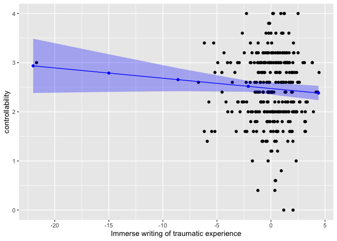<!-- -->

``` r
effects_p7 <- effects::effect(term= "confidence.and.motivation", mod= toy13)
summary(effects_p7) 
```


     confidence.and.motivation effect
    confidence.and.motivation
          -6       -2        1        5        9 
    2.197737 2.382318 2.520754 2.705335 2.889916 

     Lower 95 Percent Confidence Limits
    confidence.and.motivation
          -6       -2        1        5        9 
    1.976826 2.264721 2.417829 2.513143 2.576355 

     Upper 95 Percent Confidence Limits
    confidence.and.motivation
          -6       -2        1        5        9 
    2.418648 2.499915 2.623678 2.897527 3.203477 

``` r
x_p7<-as.data.frame(effects_p7)
p7_plot <- ggplot() + 
  geom_point(data=toyDf1, aes(x=confidence.and.motivation, y=X8wkContr))+
  geom_point(data=x_p7, aes(x=confidence.and.motivation, y=fit ), color="blue") +
  geom_line(data=x_p7, aes(x= confidence.and.motivation, y=fit), color="blue") +
  geom_ribbon(data=x_p7, aes(x=confidence.and.motivation, ymin=lower, ymax=upper), alpha= 0.3, fill="blue") + labs(x="Confidence and motivation", y="controllability")
p7_plot
```

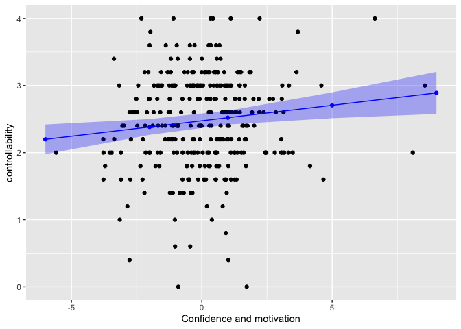<!-- -->

``` r
effects_p13 <- effects::effect(term= "emotionanlly.distant", mod= toy13)
summary(effects_p13) 
```


     emotionanlly.distant effect
    emotionanlly.distant
          -6       -3     -0.4        2        5 
    2.752509 2.612917 2.491938 2.380264 2.240672 

     Lower 95 Percent Confidence Limits
    emotionanlly.distant
          -6       -3     -0.4        2        5 
    2.489553 2.456035 2.392941 2.254842 2.017947 

     Upper 95 Percent Confidence Limits
    emotionanlly.distant
          -6       -3     -0.4        2        5 
    3.015465 2.769800 2.590935 2.505686 2.463398 

``` r
x_p13<-as.data.frame(effects_p13)
p13_plot <- ggplot() + 
  geom_point(data=toyDf1, aes(x=emotionanlly.distant, y=X8wkContr))+
  geom_point(data=x_p13, aes(x=emotionanlly.distant, y=fit ), color="blue") +
  geom_line(data=x_p13, aes(x= emotionanlly.distant, y=fit), color="blue") +
  geom_ribbon(data=x_p13, aes(x=emotionanlly.distant, ymin=lower, ymax=upper), alpha= 0.3, fill="blue") + labs(x="Emotionanlly distant", y="controllability")
p13_plot
```

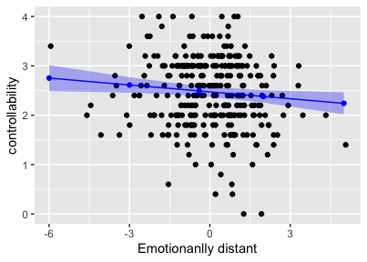<!-- -->

``` r
effects_p22 <- effects::effect(term= "venting", mod= toy13)
summary(effects_p22) 
```


     venting effect
    venting
          -5       -2      0.5        3        6 
    2.066383 2.310606 2.514124 2.717643 2.961865 

     Lower 95 Percent Confidence Limits
    venting
          -5       -2      0.5        3        6 
    1.826752 2.179925 2.414143 2.553197 2.680180 

     Upper 95 Percent Confidence Limits
    venting
          -5       -2      0.5        3        6 
    2.306015 2.441287 2.614106 2.882089 3.243550 

``` r
x_p22<-as.data.frame(effects_p22)
p22_plot <- ggplot() + 
  geom_point(data=toyDf1, aes(x=venting, y=X8wkContr))+
  geom_point(data=x_p22, aes(x=venting, y=fit ), color="blue") +
  geom_line(data=x_p22, aes(x= venting, y=fit), color="blue") +
  geom_ribbon(data=x_p22, aes(x=venting, ymin=lower, ymax=upper), alpha= 0.3, fill="blue") + labs(x="Venting", y="controllability")
p22_plot
```

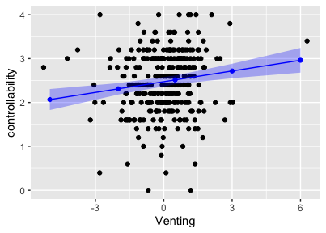<!-- -->

``` r
effects_p24 <- effects::effect(term= "effort.to.fight.cancer", mod= toy13)
summary(effects_p24) 
```


     effort.to.fight.cancer effect
    effort.to.fight.cancer
          -8       -5       -2      0.3        3 
    1.898148 2.114156 2.330164 2.495770 2.690177 

     Lower 95 Percent Confidence Limits
    effort.to.fight.cancer
          -8       -5       -2      0.3        3 
    1.522192 1.867476 2.197452 2.397324 2.521852 

     Upper 95 Percent Confidence Limits
    effort.to.fight.cancer
          -8       -5       -2      0.3        3 
    2.274104 2.360836 2.462875 2.594215 2.858501 

``` r
x_p24<-as.data.frame(effects_p24)
p24_plot <- ggplot() + 
  geom_point(data=toyDf1, aes(x=effort.to.fight.cancer, y=X8wkContr))+
  geom_point(data=x_p24, aes(x=effort.to.fight.cancer, y=fit ), color="blue") +
  geom_line(data=x_p24, aes(x= effort.to.fight.cancer, y=fit), color="blue") +
  geom_ribbon(data=x_p24, aes(x=effort.to.fight.cancer, ymin=lower, ymax=upper), alpha= 0.3, fill="blue") + labs(x="Effort to fight cancer", y="controllability")
p24_plot
```

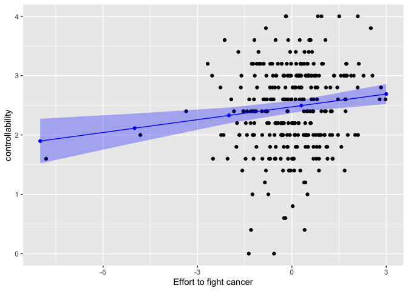<!-- -->

``` r
effects_p26 <- effects::effect(term= "pressure.and.effort.to.work", mod= toy13)
summary(effects_p26) 
```


     pressure.and.effort.to.work effect
    pressure.and.effort.to.work
          -4       -2     -0.1        2        4 
    2.639786 2.556980 2.478315 2.391369 2.308564 

     Lower 95 Percent Confidence Limits
    pressure.and.effort.to.work
          -4       -2     -0.1        2        4 
    2.413377 2.415207 2.380707 2.252030 2.085197 

     Upper 95 Percent Confidence Limits
    pressure.and.effort.to.work
          -4       -2     -0.1        2        4 
    2.866195 2.698754 2.575923 2.530709 2.531930 

``` r
x_p26<-as.data.frame(effects_p26)
p26_plot <- ggplot() + 
  geom_point(data=toyDf1, aes(x=pressure.and.effort.to.work, y=X8wkContr))+
  geom_point(data=x_p26, aes(x=pressure.and.effort.to.work, y=fit ), color="blue") +
  geom_line(data=x_p26, aes(x= pressure.and.effort.to.work, y=fit), color="blue") +
  geom_ribbon(data=x_p26, aes(x=pressure.and.effort.to.work, ymin=lower, ymax=upper), alpha= 0.3, fill="blue") + labs(x="Pressure and effort to work", y="controllability")
p26_plot
```

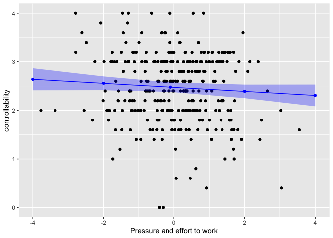<!-- -->

``` r
effects_p30 <- effects::effect(term= "detailed.symptom.description", mod= toy13)
summary(effects_p30) 
```


     detailed.symptom.description effect
    detailed.symptom.description
          -3       -1      0.3        2        3 
    2.236929 2.394938 2.497645 2.631953 2.710958 

     Lower 95 Percent Confidence Limits
    detailed.symptom.description
          -3       -1      0.3        2        3 
    2.052995 2.284890 2.398827 2.488103 2.525135 

     Upper 95 Percent Confidence Limits
    detailed.symptom.description
          -3       -1      0.3        2        3 
    2.420862 2.504987 2.596462 2.775802 2.896781 

``` r
x_p30<-as.data.frame(effects_p30)
p30_plot <- ggplot() + 
  geom_point(data=toyDf1, aes(x=detailed.symptom.description, y=X8wkContr))+
  geom_point(data=x_p30, aes(x=detailed.symptom.description, y=fit ), color="blue") +
  geom_line(data=x_p30, aes(x= detailed.symptom.description, y=fit), color="blue") +
  geom_ribbon(data=x_p30, aes(x=detailed.symptom.description, ymin=lower, ymax=upper), alpha= 0.3, fill="blue") + labs(x="detailed.symptom.description", y="controllability")
p30_plot
```

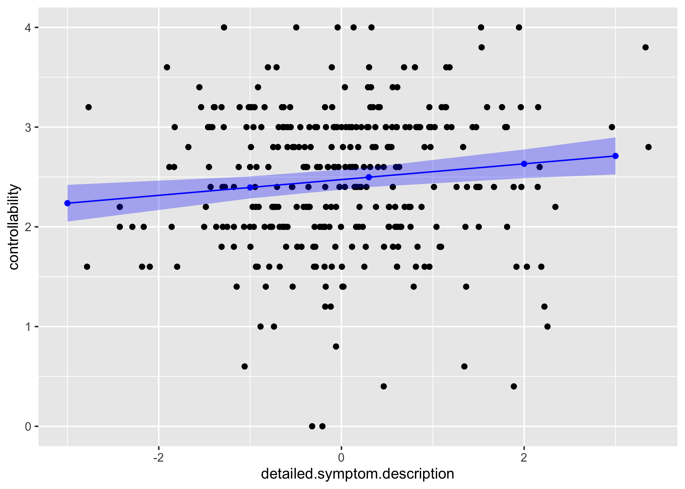<!-- -->

``` r
effects_p33 <- effects::effect(term= "financial.stress", mod= toy13)
summary(effects_p33) 
```


     financial.stress effect
    financial.stress
          -4       -2     -0.4        1        3 
    2.717619 2.595271 2.497394 2.411751 2.289403 

     Lower 95 Percent Confidence Limits
    financial.stress
          -4       -2     -0.4        1        3 
    2.490018 2.454010 2.398059 2.301012 2.105408 

     Upper 95 Percent Confidence Limits
    financial.stress
          -4       -2     -0.4        1        3 
    2.945220 2.736533 2.596728 2.522489 2.473399 

``` r
x_p33<-as.data.frame(effects_p33)
p33_plot <- ggplot() + 
  geom_point(data=toyDf1, aes(x=financial.stress, y=X8wkContr))+
  geom_point(data=x_p33, aes(x=financial.stress, y=fit ), color="blue") +
  geom_line(data=x_p33, aes(x= financial.stress, y=fit), color="blue") +
  geom_ribbon(data=x_p33, aes(x=financial.stress, ymin=lower, ymax=upper), alpha= 0.3, fill="blue") + labs(x="Financial stress", y="controllability")
p33_plot
```

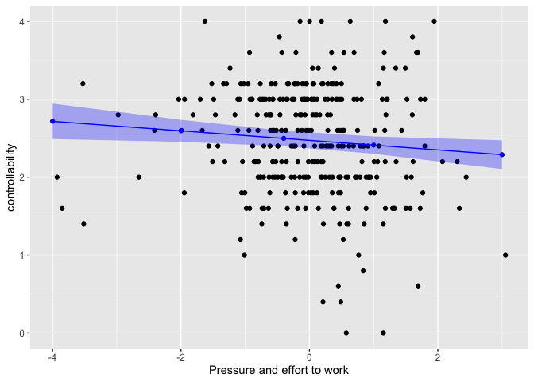<!-- -->

# 13 Explanation of the results

After controlled for participant ID, baseline controllability, and
participant education, “symptom experience description” is a marginal
negative predictor for controllability at 8 weeks. In the immersive
writing of a traumatic event, the more authentic and relevant
participants write their symptom experience (cancer), the more likely
they relive the event and thus might feel worse and loss of control over
the related traumatic event (dealing with multiple ans severe symptoms)
they are experiencing now.

After controlled for participant ID, baseline controllability, and
participant education, “confidence and motivation” is a significant
positive predictor for controllability at 8 weeks. When cancer survivors
are confident and motivated fight against cancer, they are more likely
to manage the symptoms better.

After controlled for participant ID, baseline controllability, and
participant education, “emotionanlly distant” is a significant negative
predictor for controllability at 8 weeks. In expressive writing, some
participants wrote rich narratives of their experience and emotionally
invested while others were simply informative and emotionally distant
from the topic. When participants were emotionally distant from the
event they are dealing with, they are less likely to deal with the
issues.

After controlled for participant ID, baseline controllability, and
participant education, “venting” is a significant positive predictor for
controllability at 8 weeks. Studies on expressive writing have shown
that venting help patients release negative emotions and maintain
healthy mental state to manage their symptoms better

After controlled for participant ID, baseline controllability, and
participant education, “effort to fight cancer” is a significant
positive predictor for controllability at 8 weeks. When participants try
hard to fight cancer and survive, they are more motivated to manage
their symptoms to have a life with better quality.

After controlled for participant ID, baseline controllability, and
participant education, “pressure and effort to work” is a marginally
negative predictor for controllability at 8 weeks. When patients talked
about their work and job, most of them describe how cancer symptoms
affect their employment or work routine and how their job make their
symptom worse. On the other hand, some types of works aggravates
patients’ symptoms, such as pain, fatigue, abdominal bloating. Here is
an example “I have to push myself all day to keep up with my job duties.
Shortly after I eat lunch, I usually have that ‘sugar’ drop and want to
crawl in a hole and nap.” “I have to lay in bed for a few days before
going back to work.”

After controlled for participant ID, baseline controllability, and
participant education, “detailed symptom description” is a significant
positive predictor for controllability at 8 weeks. Reflecting and
describing how symptom affects daily life helps patients think about
their symptoms in a different way to create condition for behavior
change. Patients might be more aware of the limitations of current
belief and behavior.The more participants reflect on their symptoms and
how they manage it, the more likely they are willing to try new
strategies to better manage their symptoms.

After controlled for participant ID, baseline controllability, and
participant education, “financial stress” is a significant negative
predictor for controllability at 8 weeks. Many participants talked about
how financial struggling affects their emotional and social
participationIt is not surprising that general loss of control influence
their perceived sense of control over symptoms, such as depression,
anxiety.

``` r
sessionInfo()
```

    R version 4.1.1 (2021-08-10)
    Platform: x86_64-apple-darwin17.0 (64-bit)
    Running under: macOS Big Sur 10.16

    Matrix products: default
    BLAS:   /Library/Frameworks/R.framework/Versions/4.1/Resources/lib/libRblas.0.dylib
    LAPACK: /Library/Frameworks/R.framework/Versions/4.1/Resources/lib/libRlapack.dylib

    locale:
    [1] en_US.UTF-8/en_US.UTF-8/en_US.UTF-8/C/en_US.UTF-8/en_US.UTF-8

    attached base packages:
    [1] stats     graphics  grDevices utils     datasets  methods   base     

    other attached packages:
     [1] sjPlot_2.8.10    factoextra_1.0.7 car_3.0-11       carData_3.0-4   
     [5] lmerTest_3.1-3   corrgram_1.14    Hmisc_4.6-0      Formula_1.2-4   
     [9] survival_3.2-11  lattice_0.20-44  pastecs_1.3.21   lme4_1.1-27.1   
    [13] Matrix_1.3-4     reshape2_1.4.4   ggplot2_3.3.5    dplyr_1.0.7     
    [17] readxl_1.3.1    

    loaded via a namespace (and not attached):
      [1] minqa_1.2.4         colorspace_2.0-2    ggsignif_0.6.3     
      [4] ellipsis_0.3.2      rio_0.5.27          sjlabelled_1.1.8   
      [7] estimability_1.3    htmlTable_2.3.0     parameters_0.15.0  
     [10] base64enc_0.1-3     rstudioapi_0.13     ggpubr_0.4.0       
     [13] farver_2.1.0        ggrepel_0.9.1       fansi_0.5.0        
     [16] mvtnorm_1.1-3       codetools_0.2-18    splines_4.1.1      
     [19] knitr_1.33          effects_4.2-0       sjmisc_2.8.7       
     [22] nloptr_1.2.2.2      ggeffects_1.1.1     broom_0.7.9        
     [25] cluster_2.1.2       png_0.1-7           effectsize_0.5     
     [28] compiler_4.1.1      sjstats_0.18.1      emmeans_1.7.0      
     [31] backports_1.2.1     assertthat_0.2.1    fastmap_1.1.0      
     [34] survey_4.1-1        htmltools_0.5.2     tools_4.1.1        
     [37] coda_0.19-4         gtable_0.3.0        glue_1.4.2         
     [40] Rcpp_1.0.7          cellranger_1.1.0    vctrs_0.3.8        
     [43] nlme_3.1-152        insight_0.14.5      xfun_0.25          
     [46] stringr_1.4.0       openxlsx_4.2.4      lifecycle_1.0.0    
     [49] rstatix_0.7.0       MASS_7.3-54         scales_1.1.1       
     [52] hms_1.1.0           RColorBrewer_1.1-2  yaml_2.2.1         
     [55] curl_4.3.2          gridExtra_2.3       rpart_4.1-15       
     [58] latticeExtra_0.6-29 stringi_1.7.4       highr_0.9          
     [61] bayestestR_0.11.0   checkmate_2.0.0     boot_1.3-28        
     [64] zip_2.2.0           rlang_0.4.11        pkgconfig_2.0.3    
     [67] evaluate_0.14       purrr_0.3.4         htmlwidgets_1.5.4  
     [70] labeling_0.4.2      tidyselect_1.1.1    plyr_1.8.6         
     [73] magrittr_2.0.1      R6_2.5.1            generics_0.1.0     
     [76] DBI_1.1.1           pillar_1.6.2        haven_2.4.3        
     [79] foreign_0.8-81      withr_2.4.2         mgcv_1.8-36        
     [82] datawizard_0.2.1    abind_1.4-5         nnet_7.3-16        
     [85] tibble_3.1.4        performance_0.8.0   modelr_0.1.8       
     [88] crayon_1.4.1        utf8_1.2.2          rmarkdown_2.10     
     [91] jpeg_0.1-9          grid_4.1.1          data.table_1.14.0  
     [94] forcats_0.5.1       digest_0.6.27       xtable_1.8-4       
     [97] tidyr_1.1.3         numDeriv_2016.8-1.1 munsell_0.5.0      
    [100] mitools_2.4        
