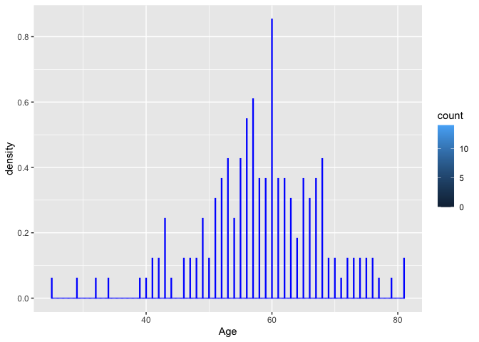
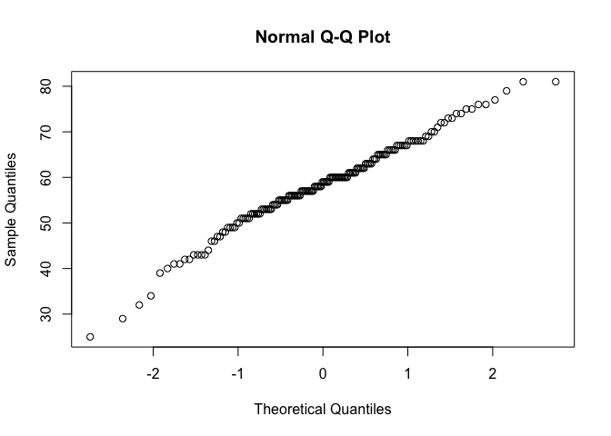
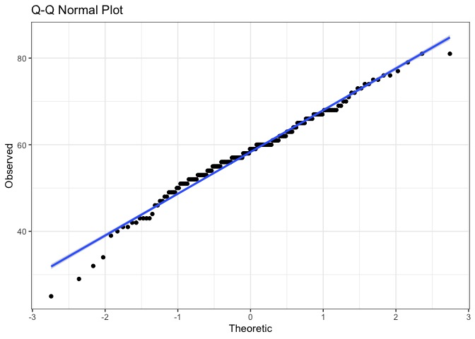
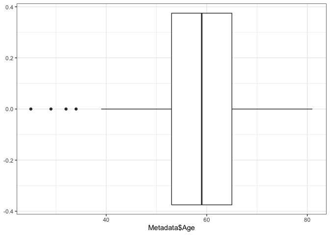
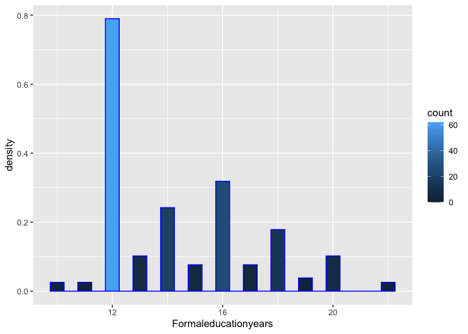
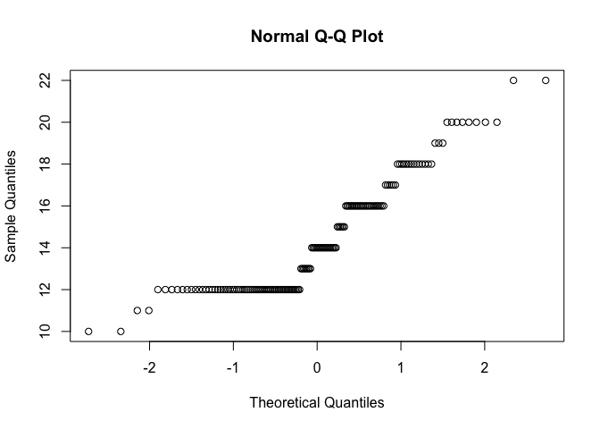
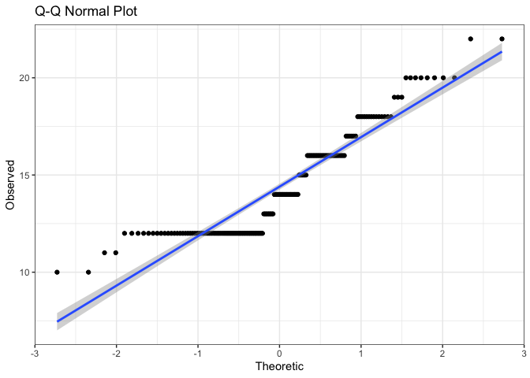
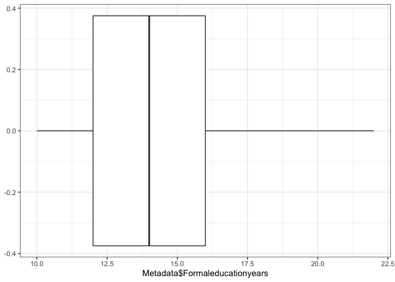

SD controllability Analysis
================
Yan Wang
11/02/2021

-   [1 Load original data sets](#load-original-data-sets)
-   [2 Original dataset description](#original-dataset-description)
-   [3 Data preparation](#data-preparation)
    -   [3.1 Calculate the dependent variable = the difference of
        symptom controllability scores at baseline and 8 weeks (at the
        end of the
        intervention)](#calculate-the-dependent-variable--the-difference-of-symptom-controllability-scores-at-baseline-and-8-weeks-at-the-end-of-the-intervention)
    -   [3.2 Reshape Df1 because we want one patient has multiple
        entries for symptoms, baseline contrallability scores before the
        intervention, and controllability
        scores](#reshape-df1-because-we-want-one-patient-has-multiple-entries-for-symptoms-baseline-contrallability-scores-before-the-intervention-and-controllability-scores)
    -   [3.3 Merge with OEQ (text data) by Participant ID and
        Symptom](#merge-with-oeq-text-data-by-participant-id-and-symptom)
-   [4 Descriptive stats of the controllability score changes from
    baseline to 8
    wks](#descriptive-stats-of-the-controllability-score-changes-from-baseline-to-8-wks)
    -   [4.1 Distribution - normality
        assumed](#distribution---normality-assumed)
-   [5 Descriptive stats of sample sociodemographic
    factors](#descriptive-stats-of-sample-sociodemographic-factors)
-   [6 Extract linguistics features (predictors) for
    analysis](#extract-linguistics-features-predictors-for-analysis)
-   [7 Load the full dataset (Df) for
    analysis](#load-the-full-dataset-df-for-analysis)
-   [8 Preliminary bivariate correlation between the dependent variable
    and potential
    predictors](#preliminary-bivariate-correlation-between-the-dependent-variable-and-potential-predictors)
-   [9 Model buiding - Mixed-effect regression
    model](#model-buiding---mixed-effect-regression-model)
    -   [9.1 Convenience functions for model
        comparison](#convenience-functions-for-model-comparison)
    -   [9.2 Use participant ID as random effect and select predictors
        with purpose. Since baseline controllability score is highly
        correlated with the changes, I will also block this variable as
        a random
        effect.](#use-participant-id-as-random-effect-and-select-predictors-with-purpose-since-baseline-controllability-score-is-highly-correlated-with-the-changes-i-will-also-block-this-variable-as-a-random-effect)

**This script is a new replacement**

# 1 Load original data sets

# 2 Original dataset description

SQR is a data set that contains participants ID, time of controllability
assessmen \[Administration Number\], 3 symptoms \[S1, S2, S3\] and 3
controllability scores \[S1Cont, S2Cont, S3Cont\]; OEQ contains ID,
symptom names and answers for the three questions: 1. “How does the
symptom make you feel and what’s the cause?”, 2. “How does the symptom
affect you?” 3.“Have you tried anything? Is it helpful?”; Metadata
contains ID and sociodemographics, including age, marrige status,
employment, education, race, ethnicity.

# 3 Data preparation

## 3.1 Calculate the dependent variable = the difference of symptom controllability scores at baseline and 8 weeks (at the end of the intervention)

``` r
SQR_8<- SQR %>% filter(`Administration Number`== "8 week f/u")
SQR_BL<- SQR %>% filter(`Administration Number`=="Baseline (week 0)")
names(SQR_8)[3:9]<-c("Time", "S1Cont", "S2Cont", "S3Cont" , "S1", "S2", "S3")
names(SQR_BL)[3:9]<-c("Time", "S1Cont", "S2Cont", "S3Cont" , "S1", "S2", "S3")
sum(is.na(SQR_BL$S1Cont))
```

    [1] 0

``` r
sum(is.na(SQR_8$S1Cont))
```

    [1] 41

``` r
SQR_8BL<-inner_join(SQR_8, SQR_BL, by=c("Participant ID", "GOGID", "S1", "S2", "S3"))
SQR_8BL$S1change<-SQR_8BL$S1Cont.x-SQR_8BL$S1Cont.y
SQR_8BL$S2change<-SQR_8BL$S2Cont.x-SQR_8BL$S2Cont.y
SQR_8BL$S3change<-SQR_8BL$S3Cont.x-SQR_8BL$S3Cont.y
Df1<-SQR_8BL %>% dplyr::select(1,2, 7:9, 11:16)
names(Df1)[1:11]<-c("ID", "GOGID", "S1", "S2", "S3", "BLS1", "BLS2", "BLS3", "8BLS1change","8BLS2change", "8BLS3change" )
```

## 3.2 Reshape Df1 because we want one patient has multiple entries for symptoms, baseline contrallability scores before the intervention, and controllability scores

``` r
Df1_1<-Df1 %>% melt(id.vars = c("ID", "GOGID"), measure.vars =c("S1", "S2", "S3"), variable.name = "SymptomNo", value.name = "Symptom") 
Df1_2<-Df1 %>% melt(id.vars = c("ID", "GOGID"), measure.vars =c( "8BLS1change", "8BLS2change", "8BLS3change"), variable.name = "toy", value.name = "8BLChange")
Df1_3<-Df1 %>% melt(id.vars = c("ID", "GOGID"), measure.vars =c("BLS1", "BLS2", "BLS3"), variable.name = "toy", value.name = "BSContr")
colnames(Df1_1)
```

    [1] "ID"        "GOGID"     "SymptomNo" "Symptom"  

``` r
colnames(Df1_2)
```

    [1] "ID"        "GOGID"     "toy"       "8BLChange"

``` r
colnames(Df1_3)
```

    [1] "ID"      "GOGID"   "toy"     "BSContr"

``` r
levels(Df1_2$toy)[1]<-"S1"
levels(Df1_2$toy)[2]<-"S2"
levels(Df1_2$toy)[3]<-"S3"
names(Df1_2)[3]<-"SymptomNo"
levels(Df1_3$toy)[1]<-"S1"
levels(Df1_3$toy)[2]<-"S2"
levels(Df1_3$toy)[3]<-"S3"
names(Df1_3)[3]<-"SymptomNo"
Df1_4<- inner_join(Df1_1, Df1_2, by= c("ID", "GOGID", "SymptomNo")) %>% inner_join(., Df1_3, by= c("ID", "GOGID", "SymptomNo")) %>% na.omit()
```

## 3.3 Merge with OEQ (text data) by Participant ID and Symptom

``` r
names(OEQ)[1:2]<-c("ID", "Symptom")
Df8BL<-left_join(Df1_4,OEQ, by=c("ID", "Symptom")) %>% na.omit()
names(Df8BL)[7:9]<-c("FeelingCause", "Effect", "Strategy")
```

# 4 Descriptive stats of the controllability score changes from baseline to 8 wks

## 4.1 Distribution - normality assumed

``` r
ggplot(Df8BL)+ 
  geom_histogram(binwidth=0.05, color="blue",aes(x=`8BLChange`, y=..density.., fill=..count..))+ 
  stat_function(fun=dnorm,color="blue",
                args=list(mean=mean(Df8BL$`8BLChange`),sd=sd(Df8BL$`8BLChange`)))
```

<!-- -->

``` r
#QQplots
qq<-data.frame(c(Df8BL,qqnorm(Df8BL$`8BLChange`)))
```

<!-- -->

``` r
ggplot(qq,aes(x=x,y=y,legend.position="none"))+
  geom_point()+
  geom_smooth(method="lm")+
  labs(title="Q-Q Normal Plot",x="Theoretic",y="Observed")+
  theme_bw()
```

    `geom_smooth()` using formula 'y ~ x'

<!-- -->

``` r
##boxplots
ggplot(Df8BL)+
  geom_boxplot(aes(Df8BL$`8BLChange`))+
  theme_bw()+
  theme(legend.position="none")
```

<!-- -->

``` r
shapiro.test(Df8BL$`8BLChange`)
```


        Shapiro-Wilk normality test

    data:  Df8BL$`8BLChange`
    W = 0.96995, p-value = 4.042e-06

``` r
#install.packages("pastecs")
library(pastecs)
stat.desc(Df8BL$`8BLChange`)
```

         nbr.val     nbr.null       nbr.na          min          max        range 
    314.00000000  48.00000000   0.00000000  -1.60000000   2.60000000   4.20000000 
             sum       median         mean      SE.mean CI.mean.0.95          var 
     68.40000000   0.20000000   0.21783439   0.04180461   0.08225358   0.54875440 
         std.dev     coef.var 
      0.74077959   3.40065484 

``` r
quantile(Df8BL$`8BLChange`, 0.75)-quantile(Df8BL$`8BLChange`, 0.25)
```

    75% 
    0.8 

``` r
table(Df8BL$`8BLChange`)
```


    -1.6 -1.4 -1.2   -1 -0.8 -0.6 -0.5 -0.4 -0.3 -0.2    0  0.2  0.4  0.6  0.8    1 
       2    2    8    2   13   17    1   23    1   31   48   40   39   21   16   12 
     1.2  1.4  1.6  1.8    2  2.2  2.4  2.6 
      11    8    5    2    7    2    2    1 

# 5 Descriptive stats of sample sociodemographic factors

``` r
table(Metadata$Marriage) %>% addmargins()
```


                        Currently married                              Divorced 
                                      108                                    14 
    Living with partner/significant other                         Never married 
                                       14                                     8 
                                Separated                               Widowed 
                                        6                                    14 
                                      Sum 
                                      164 

``` r
table(Metadata$race)%>% addmargins()
```


              American Indian           Bi/Multi-racial Black or African American 
                            1                         2                         4 
                        Other                   unknown                     White 
                            1                         4                       153 
                          Sum 
                          165 

``` r
table(Metadata$`ethinicity (latio)`)%>% addmargins()
```


    Do not know          MV          No         Yes         Sum 
              2           1         158           3         164 

``` r
table(Metadata$Employment)%>% addmargins() # 1 is unemployed, 2 is employed, 3 is Unknown
```


    Never employed             No            Yes            Sum 
                 1             96             67            164 

``` r
#Age----
stat.desc(Metadata$Age)
```

         nbr.val     nbr.null       nbr.na          min          max        range 
     164.0000000    0.0000000    2.0000000   25.0000000   81.0000000   56.0000000 
             sum       median         mean      SE.mean CI.mean.0.95          var 
    9564.0000000   59.0000000   58.3170732    0.7592886    1.4993100   94.5491546 
         std.dev     coef.var 
       9.7236390    0.1667374 

``` r
quantile(Metadata$Age, 0.75,na.rm = TRUE)-quantile(Metadata$Age, 0.25, na.rm = TRUE)
```

    75% 
     12 

``` r
ggplot(Metadata)+ 
  geom_histogram(binwidth=0.1, color="blue",aes(x=Age, y=..density.., fill=..count..))+ 
  stat_function(fun=dnorm,color="blue",
                args=list(mean=mean(Metadata$Age),sd=sd(Metadata$Age)))
```

    Warning: Removed 2 rows containing non-finite values (stat_bin).

    Warning: Removed 101 row(s) containing missing values (geom_path).

<!-- -->

``` r
#QQplots
qq<-data.frame(c(Metadata,qqnorm(Metadata$Age)))
```

<!-- -->

``` r
ggplot(qq,aes(x=x,y=y,legend.position="none"))+
  geom_point()+
  geom_smooth(method="lm")+
  labs(title="Q-Q Normal Plot",x="Theoretic",y="Observed")+
  theme_bw()
```

    `geom_smooth()` using formula 'y ~ x'

    Warning: Removed 2 rows containing non-finite values (stat_smooth).

    Warning: Removed 2 rows containing missing values (geom_point).

<!-- -->

``` r
##boxplots
ggplot(Metadata)+
  geom_boxplot(aes(Metadata$Age))+
  theme_bw()+
  theme(legend.position="none")
```

    Warning: Use of `Metadata$Age` is discouraged. Use `Age` instead.

    Warning: Removed 2 rows containing non-finite values (stat_boxplot).

<!-- -->

``` r
shapiro.test(Metadata$Age)
```


        Shapiro-Wilk normality test

    data:  Metadata$Age
    W = 0.98243, p-value = 0.03566

``` r
#Formal years of education normality is violated-----
stat.desc(Metadata$Formaleducationyears)
```

         nbr.val     nbr.null       nbr.na          min          max        range 
     157.0000000    0.0000000    9.0000000   10.0000000   22.0000000   12.0000000 
             sum       median         mean      SE.mean CI.mean.0.95          var 
    2261.0000000   14.0000000   14.4012739    0.2172272    0.4290861    7.4084599 
         std.dev     coef.var 
       2.7218486    0.1890005 

``` r
quantile(Metadata$Formaleducationyears, 0.75,na.rm = TRUE)-quantile(Metadata$Formaleducationyears, 0.25, na.rm = TRUE)
```

    75% 
      4 

``` r
ggplot(Metadata)+ 
  geom_histogram(binwidth=0.5, color="blue",aes(x=Formaleducationyears, y=..density.., fill=..count..))+ 
  stat_function(fun=dnorm,color="blue",
                args=list(mean=mean(Metadata$Formaleducationyears),sd=sd(Metadata$Formaleducationyears)))
```

    Warning: Removed 9 rows containing non-finite values (stat_bin).

    Warning: Removed 101 row(s) containing missing values (geom_path).

<!-- -->

``` r
#QQplots
qq<-data.frame(c(Metadata,qqnorm(Metadata$Formaleducationyears)))
```

<!-- -->

``` r
ggplot(qq,aes(x=x,y=y,legend.position="none"))+
  geom_point()+
  geom_smooth(method="lm")+
  labs(title="Q-Q Normal Plot",x="Theoretic",y="Observed")+
  theme_bw()
```

    `geom_smooth()` using formula 'y ~ x'

    Warning: Removed 9 rows containing non-finite values (stat_smooth).

    Warning: Removed 9 rows containing missing values (geom_point).

<!-- -->

``` r
##boxplots
ggplot(Metadata)+
  geom_boxplot(aes(Metadata$Formaleducationyears))+
  theme_bw()+
  theme(legend.position="none")
```

    Warning: Use of `Metadata$Formaleducationyears` is discouraged. Use
    `Formaleducationyears` instead.

    Warning: Removed 9 rows containing non-finite values (stat_boxplot).

<!-- -->

``` r
shapiro.test(Metadata$Formaleducationyears)
```


        Shapiro-Wilk normality test

    data:  Metadata$Formaleducationyears
    W = 0.87253, p-value = 2.529e-10

# 6 Extract linguistics features (predictors) for analysis

I used the software LIWC 2015 (<http://liwc.wpengine.com/>) to extract
multiple existing and 10 self-designed word categories; LightSide
(<http://ankara.lti.cs.cmu.edu/side/>) to tag and calculate frequency of
the word “control” as verb and noun, respectively. Existing word
categories in LIWC include 4 summary language variables (analytical
thinking, clout \[confidence\], authenticity, and emotional tone), 3
general descriptor categories (words per sentence, percent of target
words captured by the dictionary, and percent of words in the text that
are longer than six letters), 21 standard linguistic dimensions (e.g.,
percentage of words in the text that are pronouns, articles, auxiliary
verbs, etc.), 41 word categories tapping psychological constructs (e.g.,
affect, cognition, biological processes, drives), 6 personal concern
categories (e.g., work, home, leisure activities), 5 informal language
markers (assents, fillers, swear words, netspeak), and 12 punctuation
categories (periods, commas, etc). I saved all the results in the file
“ResultSDWrite8BL.xlsx”

# 7 Load the full dataset (Df) for analysis

``` r
Df<-read.csv("~/Desktop/DS4Ling-2021/old repository/private/DS4Lingdataset/Results8BLSDWrite.csv")
Df$controlNN[is.na(Df$controlNN)]=0
Df$controlVB[is.na(Df$controlVB)]=0
Df[is.na(Df)]
```

    character(0)

``` r
Df$controlNN<-Df$controlNN/Df$WC*100
Df$controlVB<-Df$controlVB/Df$WC*100
Df<- Df %>% dplyr::select(2, 4:7, 11,106:112, 12:105)
names(Df)
```

      [1] "ID"           "SymptomNo"    "Symptom"      "X8wkContr"    "BSContr"     
      [6] "WC"           "symptom"      "effort"       "impact"       "positive.adj"
     [11] "negative.adj" "controlled"   "uncontrolled" "controlNN"    "controlVB"   
     [16] "Analytic"     "Clout"        "Authentic"    "Tone"         "WPS"         
     [21] "Sixltr"       "Dic"          "function."    "pronoun"      "ppron"       
     [26] "i"            "we"           "you"          "shehe"        "they"        
     [31] "ipron"        "article"      "prep"         "auxverb"      "adverb"      
     [36] "conj"         "negate"       "verb"         "adj"          "compare"     
     [41] "interrog"     "number"       "quant"        "affect"       "posemo"      
     [46] "negemo"       "anx"          "anger"        "sad"          "social"      
     [51] "family"       "friend"       "female"       "male"         "cogproc"     
     [56] "insight"      "cause"        "discrep"      "tentat"       "certain"     
     [61] "differ"       "percept"      "see"          "hear"         "feel"        
     [66] "bio"          "body"         "health"       "sexual"       "ingest"      
     [71] "drives"       "affiliation"  "achieve"      "power"        "reward"      
     [76] "risk"         "focuspast"    "focuspresent" "focusfuture"  "relativ"     
     [81] "motion"       "space"        "time"         "work"         "leisure"     
     [86] "home"         "money"        "relig"        "death"        "informal"    
     [91] "swear"        "netspeak"     "assent"       "nonflu"       "filler"      
     [96] "AllPunc"      "Period"       "Comma"        "Colon"        "SemiC"       
    [101] "QMark"        "Exclam"       "Dash"         "Quote"        "Apostro"     
    [106] "Parenth"      "OtherP"      

# 8 Preliminary bivariate correlation between the dependent variable and potential predictors

Since ContrChange is dichotimized into 0 and 1, so I use pearson
correlation, which yield the same results as biserial correlation test.

``` r
library(Hmisc)
```

    Loading required package: lattice

    Loading required package: survival

    Loading required package: Formula


    Attaching package: 'Hmisc'

    The following objects are masked from 'package:dplyr':

        src, summarize

    The following objects are masked from 'package:base':

        format.pval, units

``` r
library(corrgram)
```


    Attaching package: 'corrgram'

    The following object is masked from 'package:lattice':

        panel.fill

``` r
#there is no variation in column #106
Df <- Df[,-106]
res <- cor(Df[4:105])
```

    Warning in cor(Df[4:105]): the standard deviation is zero

``` r
round(res, 2)[, 1] 
```

       X8wkContr      BSContr           WC      symptom       effort       impact 
            1.00         0.46         0.16         0.18         0.00         0.04 
    positive.adj negative.adj   controlled uncontrolled    controlNN    controlVB 
           -0.04        -0.03         0.16        -0.07         0.16         0.02 
        Analytic        Clout    Authentic         Tone          WPS       Sixltr 
            0.11         0.06        -0.02        -0.05         0.03         0.09 
             Dic    function.      pronoun        ppron            i           we 
           -0.02        -0.05        -0.08        -0.02        -0.02        -0.06 
             you        shehe         they        ipron      article         prep 
            0.02         0.00         0.02        -0.10         0.06         0.10 
         auxverb       adverb         conj       negate         verb          adj 
           -0.03        -0.08         0.04        -0.10        -0.01         0.09 
         compare     interrog       number        quant       affect       posemo 
            0.10         0.00         0.04        -0.02         0.05         0.02 
          negemo          anx        anger          sad       social       family 
            0.04         0.20        -0.08        -0.02         0.03         0.00 
          friend       female         male      cogproc      insight        cause 
           -0.01        -0.04         0.01        -0.06         0.03        -0.04 
         discrep       tentat      certain       differ      percept          see 
            0.08        -0.02        -0.10        -0.06        -0.05        -0.03 
            hear         feel          bio         body       health       sexual 
            0.07        -0.10        -0.01        -0.19         0.03         0.01 
          ingest       drives  affiliation      achieve        power       reward 
            0.13         0.09         0.00        -0.03         0.07         0.09 
            risk    focuspast focuspresent  focusfuture      relativ       motion 
            0.05         0.02        -0.13         0.06         0.03        -0.03 
           space         time         work      leisure         home        money 
            0.04         0.02        -0.02        -0.01        -0.06        -0.13 
           relig        death     informal        swear     netspeak       assent 
            0.08         0.01         0.12         0.02         0.00         0.02 
          nonflu       filler      AllPunc       Period        Comma        Colon 
            0.16         0.03         0.02        -0.01        -0.02        -0.03 
           SemiC        QMark       Exclam         Dash        Quote      Apostro 
            0.04         0.08        -0.01         0.06           NA         0.02 

``` r
#significant
cor.test(Df$ X8wkContr, Df$symptom)
```


        Pearson's product-moment correlation

    data:  Df$X8wkContr and Df$symptom
    t = 3.2346, df = 312, p-value = 0.001349
    alternative hypothesis: true correlation is not equal to 0
    95 percent confidence interval:
     0.07085505 0.28512584
    sample estimates:
          cor 
    0.1801264 

``` r
cor.test(Df$ X8wkContr, Df$WC)
```


        Pearson's product-moment correlation

    data:  Df$X8wkContr and Df$WC
    t = 2.9049, df = 312, p-value = 0.003936
    alternative hypothesis: true correlation is not equal to 0
    95 percent confidence interval:
     0.05253597 0.26814414
    sample estimates:
          cor 
    0.1622764 

``` r
cor.test(Df$ X8wkContr, Df$controlled)
```


        Pearson's product-moment correlation

    data:  Df$X8wkContr and Df$controlled
    t = 2.9362, df = 312, p-value = 0.003569
    alternative hypothesis: true correlation is not equal to 0
    95 percent confidence interval:
     0.05428192 0.26976842
    sample estimates:
          cor 
    0.1639807 

``` r
cor.test(Df$ X8wkContr, Df$controlNN)
```


        Pearson's product-moment correlation

    data:  Df$X8wkContr and Df$controlNN
    t = 2.9087, df = 312, p-value = 0.00389
    alternative hypothesis: true correlation is not equal to 0
    95 percent confidence interval:
     0.0527485 0.2683419
    sample estimates:
          cor 
    0.1624839 

``` r
cor.test(Df$ X8wkContr, Df$anx)
```


        Pearson's product-moment correlation

    data:  Df$X8wkContr and Df$anx
    t = 3.5492, df = 312, p-value = 0.0004459
    alternative hypothesis: true correlation is not equal to 0
    95 percent confidence interval:
     0.08823656 0.30111502
    sample estimates:
          cor 
    0.1969966 

``` r
cor.test(Df$ X8wkContr, Df$body)
```


        Pearson's product-moment correlation

    data:  Df$X8wkContr and Df$body
    t = -3.4943, df = 312, p-value = 0.000544
    alternative hypothesis: true correlation is not equal to 0
    95 percent confidence interval:
     -0.29834226 -0.08521303
    sample estimates:
           cor 
    -0.1940667 

# 9 Model buiding - Mixed-effect regression model

Based on bivariate correlation tests, I have some ideas of candidate
predictors. Since this analysis is exploratory in nature and we have a
lot of potential predictors. I will explore a few approaches of model
building

1.  Identifying random effect: 1.participant ID; 2. baseline symptom
    controllability score

2.  predictors in the model: 1. purpose-oriented; 2. stepwise selection

## 9.1 Convenience functions for model comparison

``` r
##Get convergence code for a single model. verbose: TRUE to return full convergence code, FALSE to return logical. checkSingular: TRUE to count singular fit as nonconvergence, FALSE to ignore singular fit-----
getConvCode <- function (x, verbose=FALSE, checkSingular=TRUE) {
  library(lme4)
  library(purrr)
  
  ##Get convergence messages
  convMsg <-
    x %>% 
    attr("optinfo") %>% 
    pluck("conv", "lme4")
  
  ##Get singular-fit status
  if (checkSingular) sgFit <- x %>% isSingular()
  
  ##If not verbose, get convergence code as logical
  if (!verbose) {
    convCode <- length(convMsg)==0
    if (checkSingular) convCode <- convCode & !sgFit
    ##If verbose, get convergence code as character
  } else {
    convCode <- character(0L)
    if (length(convMsg) > 0) {
      convCode <- convMsg %>% 
        pluck("messages") %>% 
        paste(collapse="\n")
    }
    
    if (checkSingular) {
      if (sgFit) {
        convCode <- paste(c(convCode, "Singular fit"), collapse="\n")
      }
    }
    
    ##If nothing has been added to convCode, return the good news.
    if (length(convCode)==0) {
      convCode <- "Converged"
      if (checkSingular) convCode <- paste0(convCode, ", no singular fit")
    }
  }
  
  convCode
}

##Convenience function for checking if something is an error
is.error <- function(x) "error" %in% class(x)

##Get Fox & Monette's (1992) GVIF, which is the square of the "GVIF" reported
##  by car::vif() and thus is comparable to the 'VIF < 10' criterion.
##Whereas car::vif() returns either a vector or a matrix, this function always
##  returns a dataframe
vif <- function(mod, decreasing=TRUE) {
  library(car)
  library(dplyr)
  
  vifReturn <- tryCatch(car::vif(mod),
                        ##Catch and return "fewer than 2 terms" error"
                        error = function(e) e)
  
  if (is.error(vifReturn)) {
    return(NA)
  }
  ##Turn vector VIF into dataframe
  if (is.numeric(vifReturn) & !is.matrix(vifReturn)) {
    ret <- data.frame(Term = names(vifReturn),
                      GVIF = vifReturn,
                      Df = rep(1, length(vifReturn))) %>% 
      mutate(`GVIF^(1/(2*Df))` = sqrt(vifReturn),
             `GVIF^(1/Df)` = vifReturn)
  }
  ##Turn matrix VIF into dataframe
  if (is.numeric(vifReturn) & is.matrix(vifReturn)) {
    ret <- as.data.frame(vifReturn) %>% 
      rownames_to_column("Term") %>% 
      select(Term, everything()) %>% 
      mutate(`GVIF^(1/Df)` = GVIF ^ (1/Df))
  }
  
  ret
}

##Get maximum VIF from model
getMaxVIF <- function(mod, decreasing=TRUE) {
  library(dplyr)
  library(purrr)
  
  ##If just one term, return NA
  if (length(labels(terms(mod))) < 2) 
    return(NA)
  
  vif(mod) %>% 
    ##Get unique max GVIF (in case there are ties)
    arrange(desc(`GVIF^(1/Df)`)) %>% 
    slice(1) %>% 
    pull(`GVIF^(1/Df)`, name=Term)
}
```

## 9.2 Use participant ID as random effect and select predictors with purpose. Since baseline controllability score is highly correlated with the changes, I will also block this variable as a random effect.

``` r
#allfit function-----
library(optimx)
library(dfoptim)
allFit <- system.file("utils", "allFit.R", package="lme4")
file.show(allFit)
## WC, symptom, controlled, controlNN, anx, body 
toy1<-lmer( X8wkContr ~ symptom+(1|ID)+(1|BSContr),Df)
summary(toy1)
```

    Linear mixed model fit by REML ['lmerMod']
    Formula: X8wkContr ~ symptom + (1 | ID) + (1 | BSContr)
       Data: Df

    REML criterion at convergence: 544.3

    Scaled residuals: 
         Min       1Q   Median       3Q      Max 
    -2.46556 -0.44638  0.00634  0.44057  2.68407 

    Random effects:
     Groups   Name        Variance Std.Dev.
     ID       (Intercept) 0.2144   0.4630  
     BSContr  (Intercept) 0.1356   0.3682  
     Residual             0.1635   0.4044  
    Number of obs: 314, groups:  ID, 120; BSContr, 22

    Fixed effects:
                Estimate Std. Error t value
    (Intercept)  2.35649    0.10361  22.743
    symptom      0.05269    0.01772   2.973

    Correlation of Fixed Effects:
            (Intr)
    symptom -0.318

``` r
toy2<-lmer( X8wkContr ~ symptom+WC+(1|ID)+(1|BSContr),Df)
summary(toy2)
```

    Linear mixed model fit by REML ['lmerMod']
    Formula: X8wkContr ~ symptom + WC + (1 | ID) + (1 | BSContr)
       Data: Df

    REML criterion at convergence: 554.8

    Scaled residuals: 
         Min       1Q   Median       3Q      Max 
    -2.49602 -0.42885 -0.00067  0.47851  2.71818 

    Random effects:
     Groups   Name        Variance Std.Dev.
     ID       (Intercept) 0.2081   0.4562  
     BSContr  (Intercept) 0.1268   0.3561  
     Residual             0.1632   0.4040  
    Number of obs: 314, groups:  ID, 120; BSContr, 22

    Fixed effects:
                 Estimate Std. Error t value
    (Intercept) 2.2452561  0.1126235  19.936
    symptom     0.0580074  0.0178112   3.257
    WC          0.0003703  0.0001635   2.265

    Correlation of Fixed Effects:
            (Intr) symptm
    symptom -0.344       
    WC      -0.439  0.126

``` r
anova(toy2, toy1)
```

    refitting model(s) with ML (instead of REML)

    Data: Df
    Models:
    toy1: X8wkContr ~ symptom + (1 | ID) + (1 | BSContr)
    toy2: X8wkContr ~ symptom + WC + (1 | ID) + (1 | BSContr)
         npar    AIC    BIC  logLik deviance  Chisq Df Pr(>Chisq)  
    toy1    5 545.20 563.94 -267.60   535.20                       
    toy2    6 542.06 564.56 -265.03   530.06 5.1367  1    0.02343 *
    ---
    Signif. codes:  0 '***' 0.001 '**' 0.01 '*' 0.05 '.' 0.1 ' ' 1

``` r
toy3<-lmer( X8wkContr ~ symptom+WC+ anx+(1|ID)+(1|BSContr),Df)
summary(toy3)
```

    Linear mixed model fit by REML ['lmerMod']
    Formula: X8wkContr ~ symptom + WC + anx + (1 | ID) + (1 | BSContr)
       Data: Df

    REML criterion at convergence: 549.7

    Scaled residuals: 
         Min       1Q   Median       3Q      Max 
    -2.42912 -0.44426  0.00109  0.50693  2.54878 

    Random effects:
     Groups   Name        Variance Std.Dev.
     ID       (Intercept) 0.2056   0.4534  
     BSContr  (Intercept) 0.1188   0.3447  
     Residual             0.1577   0.3971  
    Number of obs: 314, groups:  ID, 120; BSContr, 22

    Fixed effects:
                 Estimate Std. Error t value
    (Intercept) 2.1809823  0.1119561  19.481
    symptom     0.0564815  0.0175294   3.222
    WC          0.0004129  0.0001616   2.555
    anx         0.0967840  0.0299496   3.232

    Correlation of Fixed Effects:
            (Intr) symptm WC    
    symptom -0.337              
    WC      -0.449  0.124       
    anx     -0.180 -0.023  0.082

``` r
anova(toy3, toy2)
```

    refitting model(s) with ML (instead of REML)

    Data: Df
    Models:
    toy2: X8wkContr ~ symptom + WC + (1 | ID) + (1 | BSContr)
    toy3: X8wkContr ~ symptom + WC + anx + (1 | ID) + (1 | BSContr)
         npar    AIC    BIC  logLik deviance  Chisq Df Pr(>Chisq)   
    toy2    6 542.06 564.56 -265.03   530.06                        
    toy3    7 533.65 559.90 -259.82   519.65 10.409  1   0.001254 **
    ---
    Signif. codes:  0 '***' 0.001 '**' 0.01 '*' 0.05 '.' 0.1 ' ' 1

``` r
toy4<-lmer( X8wkContr ~ symptom+WC+ anx+ body+(1|ID)+(1|BSContr),Df)
summary(toy4)
```

    Linear mixed model fit by REML ['lmerMod']
    Formula: X8wkContr ~ symptom + WC + anx + body + (1 | ID) + (1 | BSContr)
       Data: Df

    REML criterion at convergence: 555.1

    Scaled residuals: 
         Min       1Q   Median       3Q      Max 
    -2.50888 -0.45674  0.01291  0.50856  2.54883 

    Random effects:
     Groups   Name        Variance Std.Dev.
     ID       (Intercept) 0.2006   0.4479  
     BSContr  (Intercept) 0.1115   0.3339  
     Residual             0.1598   0.3998  
    Number of obs: 314, groups:  ID, 120; BSContr, 22

    Fixed effects:
                  Estimate Std. Error t value
    (Intercept)  2.2184981  0.1148851  19.311
    symptom      0.0593663  0.0177284   3.349
    WC           0.0003964  0.0001628   2.435
    anx          0.0982245  0.0300950   3.264
    body        -0.0157529  0.0133325  -1.182

    Correlation of Fixed Effects:
            (Intr) symptm WC     anx   
    symptom -0.292                     
    WC      -0.465  0.110              
    anx     -0.168 -0.020  0.077       
    body    -0.280 -0.121  0.103 -0.029

``` r
anova(toy4, toy3)
```

    refitting model(s) with ML (instead of REML)

    Data: Df
    Models:
    toy3: X8wkContr ~ symptom + WC + anx + (1 | ID) + (1 | BSContr)
    toy4: X8wkContr ~ symptom + WC + anx + body + (1 | ID) + (1 | BSContr)
         npar    AIC    BIC  logLik deviance  Chisq Df Pr(>Chisq)
    toy3    7 533.65 559.90 -259.82   519.65                     
    toy4    8 534.26 564.26 -259.13   518.26 1.3876  1     0.2388

``` r
vif(toy4)
```

    Loading required package: carData


    Attaching package: 'car'

    The following object is masked _by_ '.GlobalEnv':

        vif

    The following object is masked from 'package:dplyr':

        recode

               Term     GVIF Df GVIF^(1/(2*Df)) GVIF^(1/Df)
    symptom symptom 1.032084  1        1.015915    1.032084
    WC           WC 1.033948  1        1.016832    1.033948
    anx         anx 1.008532  1        1.004257    1.008532
    body       body 1.031020  1        1.015391    1.031020

``` r
sessionInfo()
```

    R version 4.1.1 (2021-08-10)
    Platform: x86_64-apple-darwin17.0 (64-bit)
    Running under: macOS Big Sur 10.16

    Matrix products: default
    BLAS:   /Library/Frameworks/R.framework/Versions/4.1/Resources/lib/libRblas.0.dylib
    LAPACK: /Library/Frameworks/R.framework/Versions/4.1/Resources/lib/libRlapack.dylib

    locale:
    [1] en_US.UTF-8/en_US.UTF-8/en_US.UTF-8/C/en_US.UTF-8/en_US.UTF-8

    attached base packages:
    [1] stats     graphics  grDevices utils     datasets  methods   base     

    other attached packages:
     [1] car_3.0-11        carData_3.0-4     dfoptim_2020.10-1 optimx_2021-10.12
     [5] corrgram_1.14     Hmisc_4.6-0       Formula_1.2-4     survival_3.2-11  
     [9] lattice_0.20-44   pastecs_1.3.21    lme4_1.1-27.1     Matrix_1.3-4     
    [13] reshape2_1.4.4    ggplot2_3.3.5     dplyr_1.0.7       readxl_1.3.1     

    loaded via a namespace (and not attached):
     [1] splines_4.1.1       assertthat_0.2.1    highr_0.9          
     [4] latticeExtra_0.6-29 cellranger_1.1.0    yaml_2.2.1         
     [7] numDeriv_2016.8-1.1 pillar_1.6.2        backports_1.2.1    
    [10] glue_1.4.2          digest_0.6.27       RColorBrewer_1.1-2 
    [13] checkmate_2.0.0     minqa_1.2.4         colorspace_2.0-2   
    [16] htmltools_0.5.2     plyr_1.8.6          pkgconfig_2.0.3    
    [19] haven_2.4.3         purrr_0.3.4         scales_1.1.1       
    [22] openxlsx_4.2.4      jpeg_0.1-9          rio_0.5.27         
    [25] htmlTable_2.3.0     tibble_3.1.4        mgcv_1.8-36        
    [28] generics_0.1.0      farver_2.1.0        ellipsis_0.3.2     
    [31] withr_2.4.2         nnet_7.3-16         magrittr_2.0.1     
    [34] crayon_1.4.1        evaluate_0.14       fansi_0.5.0        
    [37] nlme_3.1-152        MASS_7.3-54         forcats_0.5.1      
    [40] foreign_0.8-81      tools_4.1.1         data.table_1.14.0  
    [43] hms_1.1.0           lifecycle_1.0.0     stringr_1.4.0      
    [46] munsell_0.5.0       zip_2.2.0           cluster_2.1.2      
    [49] compiler_4.1.1      rlang_0.4.11        grid_4.1.1         
    [52] nloptr_1.2.2.2      rstudioapi_0.13     htmlwidgets_1.5.4  
    [55] base64enc_0.1-3     labeling_0.4.2      rmarkdown_2.10     
    [58] boot_1.3-28         gtable_0.3.0        abind_1.4-5        
    [61] curl_4.3.2          DBI_1.1.1           R6_2.5.1           
    [64] gridExtra_2.3       knitr_1.33          fastmap_1.1.0      
    [67] utf8_1.2.2          stringi_1.7.4       Rcpp_1.0.7         
    [70] vctrs_0.3.8         rpart_4.1-15        png_0.1-7          
    [73] tidyselect_1.1.1    xfun_0.25          
