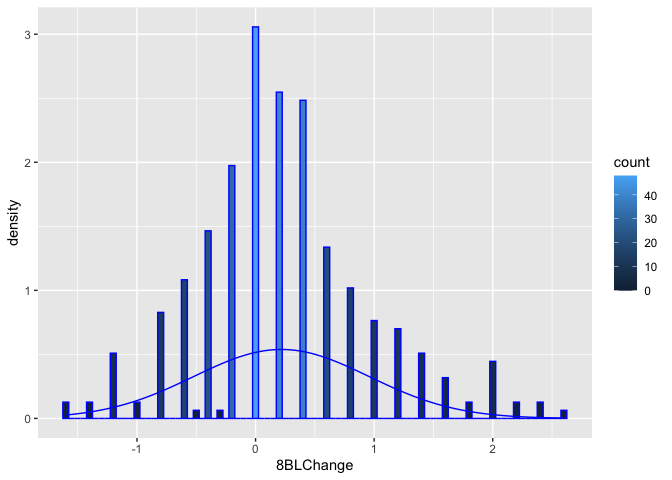
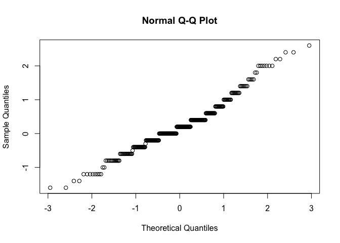
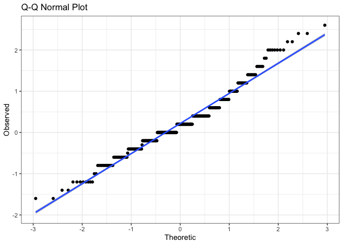
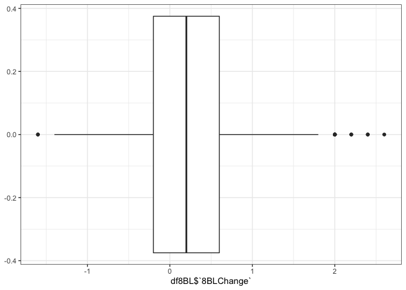

SD controllability Analysis
================
Yan Wang
10/24/2021

-   [Load all datasets](#load-all-datasets)
-   [Data preparation](#data-preparation)
    -   [Calculate the dependent variable = the difference of symptom
        controllability scores at baseline and 8 weeks (at the end of
        the
        intervention)](#calculate-the-dependent-variable--the-difference-of-symptom-controllability-scores-at-baseline-and-8-weeks-at-the-end-of-the-intervention)
    -   [Reshape df1 because we want one patient has multiple entries
        for symptoms and controllability
        scores](#reshape-df1-because-we-want-one-patient-has-multiple-entries-for-symptoms-and-controllability-scores)
    -   [Merge with text data by Participant ID and
        Symptom](#merge-with-text-data-by-participant-id-and-symptom)
-   [Descriptive stats of the controllability score changes from
    baseline to 8
    wks](#descriptive-stats-of-the-controllability-score-changes-from-baseline-to-8-wks)
    -   [Distribution - normality
        assumed](#distribution---normality-assumed)
    -   [Dichotomized controllability score changes into improved vs not
        improved](#dichotomized-controllability-score-changes-into-improved-vs-not-improved)

# Load all datasets

# Data preparation

## Calculate the dependent variable = the difference of symptom controllability scores at baseline and 8 weeks (at the end of the intervention)

``` r
SQR_8<- SQR %>% filter(`Administration Number`== "8 week f/u")
SQR_BL<- SQR %>% filter(`Administration Number`=="Baseline (week 0)")
names(SQR_8)[3:9]<-c("Time", "S1Cont", "S2Cont", "S3Cont" , "S1", "S2", "S3")
names(SQR_BL)[3:9]<-c("Time", "S1Cont", "S2Cont", "S3Cont" , "S1", "S2", "S3")
names(SQR_BL)
```

    [1] "Participant ID" "GOGID"          "Time"           "S1Cont"        
    [5] "S2Cont"         "S3Cont"         "S1"             "S2"            
    [9] "S3"            

``` r
names(SQR_8)
```

    [1] "Participant ID" "GOGID"          "Time"           "S1Cont"        
    [5] "S2Cont"         "S3Cont"         "S1"             "S2"            
    [9] "S3"            

``` r
sum(is.na(SQR_BL$S1Cont))
```

    [1] 0

``` r
sum(is.na(SQR_8$S1Cont))
```

    [1] 41

``` r
SQR_8BL<-inner_join(SQR_8, SQR_BL, by=c("Participant ID", "GOGID", "S1", "S2", "S3"))
names(SQR_8BL)
```

     [1] "Participant ID" "GOGID"          "Time.x"         "S1Cont.x"      
     [5] "S2Cont.x"       "S3Cont.x"       "S1"             "S2"            
     [9] "S3"             "Time.y"         "S1Cont.y"       "S2Cont.y"      
    [13] "S3Cont.y"      

``` r
SQR_8BL$S1change<-SQR_8BL$S1Cont.x-SQR_8BL$S1Cont.y
SQR_8BL$S2change<-SQR_8BL$S2Cont.x-SQR_8BL$S2Cont.y
SQR_8BL$S3change<-SQR_8BL$S3Cont.x-SQR_8BL$S3Cont.y
names(SQR_8BL)
```

     [1] "Participant ID" "GOGID"          "Time.x"         "S1Cont.x"      
     [5] "S2Cont.x"       "S3Cont.x"       "S1"             "S2"            
     [9] "S3"             "Time.y"         "S1Cont.y"       "S2Cont.y"      
    [13] "S3Cont.y"       "S1change"       "S2change"       "S3change"      

``` r
df1<-SQR_8BL %>% dplyr::select(1,2, 7:9, 14:16)
names(df1)
```

    [1] "Participant ID" "GOGID"          "S1"             "S2"            
    [5] "S3"             "S1change"       "S2change"       "S3change"      

``` r
names(df1)[1:8]<-c("ID", "GOGID", "S1", "S2", "S3", "8BLS1change","8BLS2change", "8BLS3change" )
names(df1)
```

    [1] "ID"          "GOGID"       "S1"          "S2"          "S3"         
    [6] "8BLS1change" "8BLS2change" "8BLS3change"

## Reshape df1 because we want one patient has multiple entries for symptoms and controllability scores

``` r
df1_1<-df1 %>% melt(id.vars = c("ID", "GOGID"), measure.vars =c("S1", "S2", "S3"), variable.name = "SymptomNo", value.name = "Symptom") 
names(df1_1)
```

    [1] "ID"        "GOGID"     "SymptomNo" "Symptom"  

``` r
df1_2<-df1 %>% melt(id.vars = c("ID", "GOGID"), measure.vars =c( "8BLS1change", "8BLS2change", "8BLS3change"), variable.name = "toy", value.name = "8BLChange")
colnames(df1_1)
```

    [1] "ID"        "GOGID"     "SymptomNo" "Symptom"  

``` r
colnames(df1_2)
```

    [1] "ID"        "GOGID"     "toy"       "8BLChange"

``` r
levels(df1_2$toy)[1]<-"S1"
levels(df1_2$toy)[2]<-"S2"
levels(df1_2$toy)[3]<-"S3"
names(df1_2)[3]<-"SymptomNo"
names(df1_2)
```

    [1] "ID"        "GOGID"     "SymptomNo" "8BLChange"

``` r
df1_3<- inner_join(df1_1, df1_2, by= c("ID", "GOGID", "SymptomNo"))
df1_4<-df1_3 %>% na.omit()
names(df1_4)
```

    [1] "ID"        "GOGID"     "SymptomNo" "Symptom"   "8BLChange"

## Merge with text data by Participant ID and Symptom

``` r
#install.packages("splus2R")
library(splus2R)
names(OEQ)[1:2]<-c("ID", "Symptom")
df8BL<-left_join(df1_4,OEQ, by=c("ID", "Symptom")) %>% na.omit()
names(df8BL)
```

    [1] "ID"                                                      
    [2] "GOGID"                                                   
    [3] "SymptomNo"                                               
    [4] "Symptom"                                                 
    [5] "8BLChange"                                               
    [6] "How does the symptom make you feel and what's the cause?"
    [7] "How does the symptom affect you?"                        
    [8] "Have you tried anything? Is it helpful?"                 

``` r
names(df8BL)[6:8]<-c("feelingCause", "impact", "strategies")
```

# Descriptive stats of the controllability score changes from baseline to 8 wks

## Distribution - normality assumed

``` r
ggplot(df8BL)+ 
  geom_histogram(binwidth=0.05, color="blue",aes(x=`8BLChange`, y=..density.., fill=..count..))+ 
  stat_function(fun=dnorm,color="blue",
                args=list(mean=mean(df8BL$`8BLChange`),sd=sd(df8BL$`8BLChange`)))
```

<!-- -->

``` r
#QQplots
qq<-data.frame(c(df8BL,qqnorm(df8BL$`8BLChange`)))
```

<!-- -->

``` r
ggplot(qq,aes(x=x,y=y,legend.position="none"))+
  geom_point()+
  geom_smooth(method="lm")+
  labs(title="Q-Q Normal Plot",x="Theoretic",y="Observed")+
  theme_bw()
```

    `geom_smooth()` using formula 'y ~ x'

<!-- -->

``` r
##boxplots
ggplot(df8BL)+
  geom_boxplot(aes(df8BL$`8BLChange`))+
  theme_bw()+
  theme(legend.position="none")
```

<!-- -->

``` r
shapiro.test(df8BL$`8BLChange`)
```


        Shapiro-Wilk normality test

    data:  df8BL$`8BLChange`
    W = 0.96995, p-value = 4.042e-06

``` r
#install.packages("pastecs")
library(pastecs)
```


    Attaching package: 'pastecs'

    The following objects are masked from 'package:dplyr':

        first, last

``` r
stat.desc(df8BL$`8BLChange`)
```

         nbr.val     nbr.null       nbr.na          min          max        range 
    314.00000000  48.00000000   0.00000000  -1.60000000   2.60000000   4.20000000 
             sum       median         mean      SE.mean CI.mean.0.95          var 
     68.40000000   0.20000000   0.21783439   0.04180461   0.08225358   0.54875440 
         std.dev     coef.var 
      0.74077959   3.40065484 

``` r
quantile(df8BL$`8BLChange`, 0.75)-quantile(df8BL$`8BLChange`, 0.25)
```

    75% 
    0.8 

``` r
table(df8BL$`8BLChange`)
```


    -1.6 -1.4 -1.2   -1 -0.8 -0.6 -0.5 -0.4 -0.3 -0.2    0  0.2  0.4  0.6  0.8    1 
       2    2    8    2   13   17    1   23    1   31   48   40   39   21   16   12 
     1.2  1.4  1.6  1.8    2  2.2  2.4  2.6 
      11    8    5    2    7    2    2    1 

## Dichotomized controllability score changes into improved vs not improved

``` r
df8BL$`8BLRecode`[df8BL$`8BLChange`<=0]<-"Not improved"
df8BL$`8BLRecode`[df8BL$`8BLChange`>0]<-"Improved"
```
