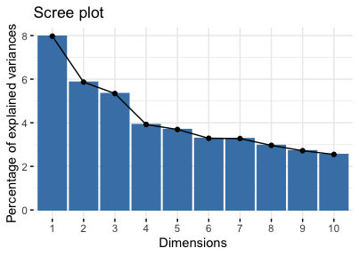
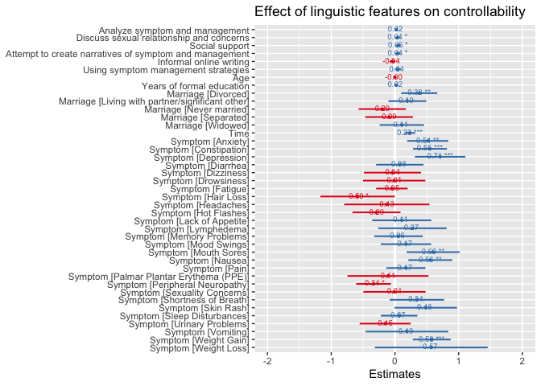
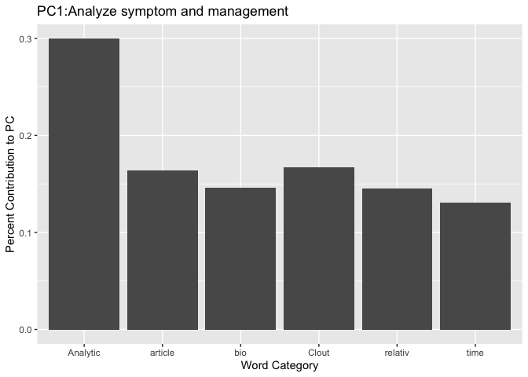
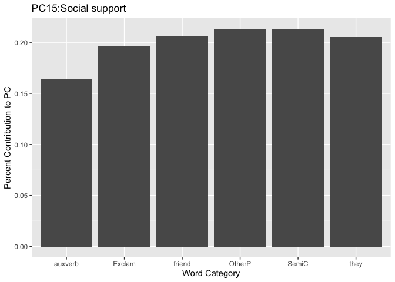
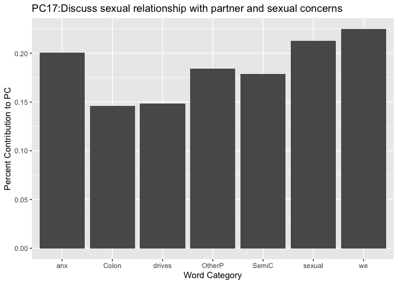
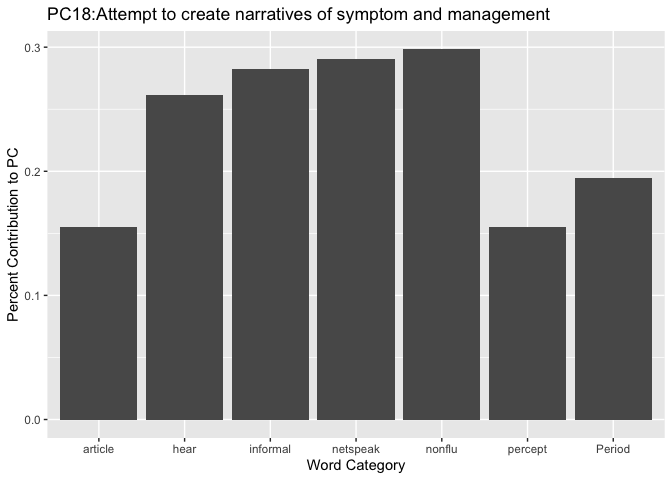
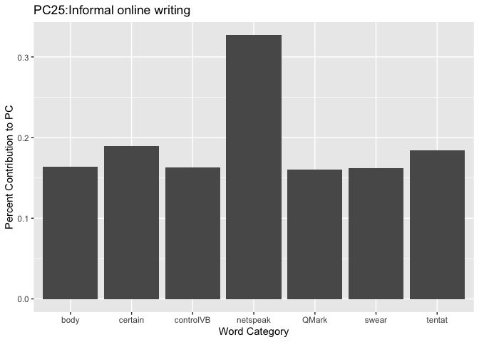
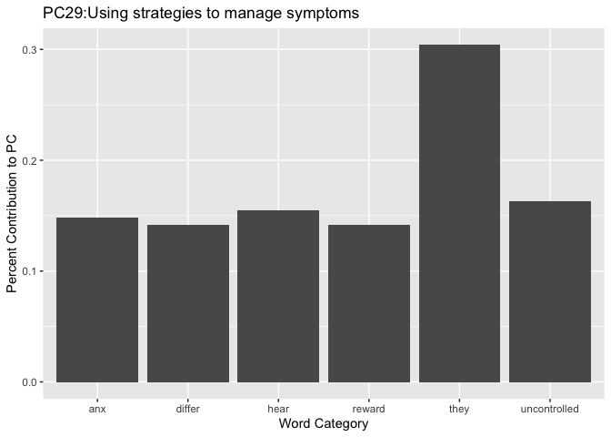

[Images folder](https://github.com/Data-Sci-2021/Linguistic-reflection-of-perceived-symptom-controllability/tree/main/images)

# Overview

The purpose of this secondary analysis is to investigate the linguistic reflections of perceived symptom controllability among women with recurrent ovarian cancer. The study applied principal component analysis to derive underlying constructs from multiple linguistic features and mixed-effects model to select important underlying components associated with participant sense of control. 

# Parent study
WRITE Symptoms (Written Representational Intervention To Ease Symptoms) was a 3-arm randomized clinical trial (RCT) mainly funded by the National Institutes of Health/National Institute of Nursing Research  R01NR010735/NRG GOG-259. Two versions of the WRITE Symptoms intervention are based on the Representational Approach to patient education to improve symptom management, were compared to enhanced care-as-usual.  In the self-directed arm of WRITE Symptoms intervention (SD WRITE), participants engaged in an interactive web-based module through intervention components. 

# Sample and data

Data were from the 166 participants randomized to the self-directed arm, including sociodemographic factors, perceived symptom controllability score at baseline and 8 weeks, target symptoms, and their posts recorded verbatim in the message board. For each participant who worked on each of the selected symptoms, the posts are the responses to the following questions: 

1. What does the symptom make you feel like? 

2. What do you think is causing your symptom? 

3. When did you first notice it, and does it follow any sort of pattern? 

4. How does the symptom affect you?

5. Have you tried anything? Is it helpful?

Participant posts were manually screened after the trial was completed. Perceived symptom controllability was measured by 3 items for each symptom addressing the extent to which the person believes that they can control the symptom on a 5- point Likert-type scale of 0 (strongly disagree) to 4 (strongly agree).

Eligible participants of parent study were 18+ years; and had recurrent or persistent ovarian, fallopian or primary peritoneal cancer, experiencing 3 or more bothersome symptoms with a gynecologic oncology group (GOG) performance status of less than 3; at least 3+ symptoms (e.g., pain, fatigue, neuropathy) associated with cancer or treatment; and able to read and write in English. The RCT was a national study, and the sample was very likely representative of women with recurrent ovarian cancer nationwide.
 
 
# Analysis 

I designed 9 word categories (i.e., percentage of words in the text that are cancer and treatment-related symptoms, effort, impact on life, positive adj describing symptom, negative adj describing symptom, symptom controlled, symptom uncontrolled, percentage of word control used as noun and verb, respectively). I used [LIWC2015](http://liwc.wpengine.com/) and [LightSide platform](http://ankara.lti.cs.cmu.edu/side/) to extract these 9 word categories from the [self-designed dictionary](https://github.com/Data-Sci-2021/Linguistic-reflection-of-perceived-symptom-controllability/blob/main/Dictionary/SDWRITE.dic) and other 93 word categories from the [LIWC2015 internal dictionary](https://github.com/Data-Sci-2021/Linguistic-reflection-of-perceived-symptom-controllability/blob/main/Dictionary/LIWC2015Dictionary.pdf). All the linguistic features, other than the total word count, were measured by the percentage of words in the specific word category out of the total word count of the posts; the scale of these linguistic variables is from 0 to 100.  

I first used individual linguistic features as potential predictors of controllability at 8 weeks in building mixed-effects models. However, after adjusting for baseline controllability and controlling for individuals, target symptoms, and participant sociodemographic factors, not a single individual linguistic variable was statistically significant associated with participant controllability. Therefore, I decided to apply principal components analysis (PCA) on individual linguistic variables to extract the potential underlying constructs and use linear mixed effect model to structure the relationship between the components and controllability at 8 weeks. Principal components were chosen as candidate predictors if their eigenvalues are more than 1. I used the iterative backward elimination technique to select principle components, controlling for the aforementioned set of covariates(i.e., baseline controllability, individuals, target symptoms, and participant sociodemographic factors). The criteria I used in selecting models are AIC (Akaike's Information Criteria) and BIC (Bayesian Information Criteria). 

The data processing and analysis steps are as the following: 

1. Multiple data sets are reshaped and merged in R: [Data processing.md](https://github.com/Data-Sci-2021/Linguistic-reflection-of-perceived-symptom-controllability/blob/main/Data-processing.md) and [Data processing.Rmd](https://github.com/Data-Sci-2021/Linguistic-reflection-of-perceived-symptom-controllability/blob/main/Data-analysis.Rmd)

2. Extract linguistic features in LIWC2015 and LightSide

3. Export and combined extracted features to a single csv file: [ResultsDf8BL(noIDtexts).csv](https://github.com/Data-Sci-2021/Linguistic-reflection-of-perceived-symptom-controllability/blob/main/ResultsDf8BL(noIDtexts).csv)

4. Apply PCA and build mixed-effect models: [Data-analysis.md](https://github.com/Data-Sci-2021/Linguistic-reflection-of-perceived-symptom-controllability/blob/main/Data-analysis.md) and [Data-analysis.Rmd](https://github.com/Data-Sci-2021/Linguistic-reflection-of-perceived-symptom-controllability/blob/main/Data-analysis.Rmd)

# Results

## Sample characteristics
Participants were predominantly married or Living with partner/significant other(75.16%), white (93%), non-hispanic (96.18%). Over half of the participants were unemployed (59.24%). The mean of age is 58.18 (SD = 9.72) and the average of formal years of education is 14.4 (SD=2.72). 

## Principal component analysis (PCA) 

PCA yielded 101 components. I included 33 principal components based on the eigenvalues (>1), which explains 75.85% of the variance. Here is the scree plot of the 33 components. 

## Model of patient perceived symptom controllability 

After adjusting for baseline controllability and controlling for individuals, their target symptoms, age, education, marital status, the detail of the model is listed here: [Mixed-effects model of predicting symptom controllability](https://github.com/Data-Sci-2021/Linguistic-reflection-of-perceived-symptom-controllability/blob/main/modeldetail.pdf)

6 underlying constructs were included in the final model and their loadings:

1.Analyze symptom and management

2.Social support

3. Discuss sexual relationship and concerns

4.Attempt to create narratives of symptom and its management

5.Informal online writing

6. Using symptom management

After adjusting for baseline controllability and controlling for target symptoms, participant age, education, marital status, and their ID, participant analyzing symptom and management has a positive influence on their perceived controllability at 8 weeks (b= 0.02,95%CI (-0.00, 0.005)). Reflecting and analyzing how the symptom affects daily life and how they have dealt with it, promotes patients to think about their symptoms differently. This helps create the condition for behavior change. Participants might be more aware of the limitations of current beliefs and behavior. The more participants reflect on their symptoms, management, and effectiveness, the more they are willing to try new strategies to manage their symptoms. Moreover, encouraging participants to analyze the situation enables them to feel more in control, instead of feeling overwhelmed by the emotions and traumatic experience. 

Discussing sexual relationships and concerns with the nurse has a significant effect on the participant's sense of controllability (b= 0.04,95%CI (0, 0.008)). It shows that participants feel safe and comfortable talking about their very personal/private information with the nurse behind the screen. Discussing such topics engenders participants more trust in the nurse and hence facilitates a good therapeutic relationship to work on controlling the symptoms as a team.  

We also find social support has a significant positive influence on participants' perceived control over their symptoms (b= 0.05,95%CI (0.01, 0.09)). Evidence shows strong social support systems — including personal connections, links with their communities, and living status (single, married, separated) — can improve cancer outcomes, for example, lower mortality. Social support helps patients feel more hopeful about their diagnosis and dealing with symptoms and other practical issues.  

Participants' attempt to create narratives of symptoms and their management gives them more control over the symptoms they are dealing with (b=0.04,95%CI (0.00, 0.09)). Giving participants a chance to talk and work through their feelings helps them have a full understanding of their experience with the symptom. The nurse and participant will obtain the whole picture of the issue, which is the foundation for participants to analyze the event and feelings, such as the benefits and barriers of different symptom management strategies. 
 
Using symptom management strategies is a marginal significant positive predictor of symptom controllability at 8 weeks (b= 0.04,95%CI (-0.00, 0.09)). The use of symptom management strategies measures participant behavior engagement with the intervention.  When participants practice more, they are more likely to understand and master the skills and strategies, which engenders a sense of control.  

In the end, informal online writing is a marginally significant negative predictor of controllability at 8 weeks (b=-0.04,95%CI (-0.09, 0.01)). When the participants tend to use informal writing (e.g., standard and non-standard abbreviations and acronyms) to hurry typing, they try to save time, energy, and effort by writing what they say. Participants are less likely to reflect on the questions, analyze their situation, or think about the completeness of the answer when they use informal online writing, such as netspeak. When the participant doesn't realize the limitations of their symptom management, they are less likely to make any changes.  

# Conclusions and implications

Based on the linguistic markers of controllability, the patients need to reflect and analyze their symptoms in a meaningful way. The first step is to try to create complete narratives of symptom representations. When controlled for participants' age, marital status, education, and adjusted for baseline controllability scores, participants who have a strong social support system, discuss sexual relationships and concerns and use symptom management strategies, are more likely to have better control of their symptoms. Those who use more online informal writing are more likely to do poorly in symptom control. 

In contrast to f2f intervention where patients engage with materials in a structured and monitored way, and clinicians directly observe patients' behavior and provide feedback, in digital interventions, it is important to target the limited clinician’s attention to patients who need it most. 
The linguistic features identified in the message board can help clinicians monitor patients' sense of control. By identifying patients who are likely to end up not improving their ability to control symptoms before it is too late, the clinicians can provide emotional support and tailor the content in time to help those patients control their symptoms better.  

# Limitations 
There are a few limitations of the study. Some models can’t be compared directly because of different data sets. The validity of the study can be further enhanced by (1) confirmation of self-designed word categories from another content expert; (2) confirmation of a few potential outliers in the data set from the primary investigator of the clinical trial. 

# Data sharing

I used [NLM-Scrubber](https://scrubber.nlm.nih.gov/) to screen participants' posts to create HIPAA-compliant deidentified information. For our dataset, it is still possible to reidentify individuals from de-identified data with the use of additional information linked to the same individuals. Data set can be shared upon request with data use agreement. 

# Project history 
There are several places I struggled a lot. First, I devoted quite a lot of time to learning how to de-identify qualitative data sets. But in the end, we decided not to make the data set open access yet. I also made a mistake in picking up the dependent variable. I used the score changes. But then I realized that using the controllability score at 8 weeks is better for the interpretation of the results. Last, I learned how to build a linear mixed model in r. I didn't quite understand the difference between covariates and random effects. I tried participant sociodemographic factors as random effects but most of the models are singular fit. That's why in the final analysis, I treated sociodemographic factors as covariates. 
